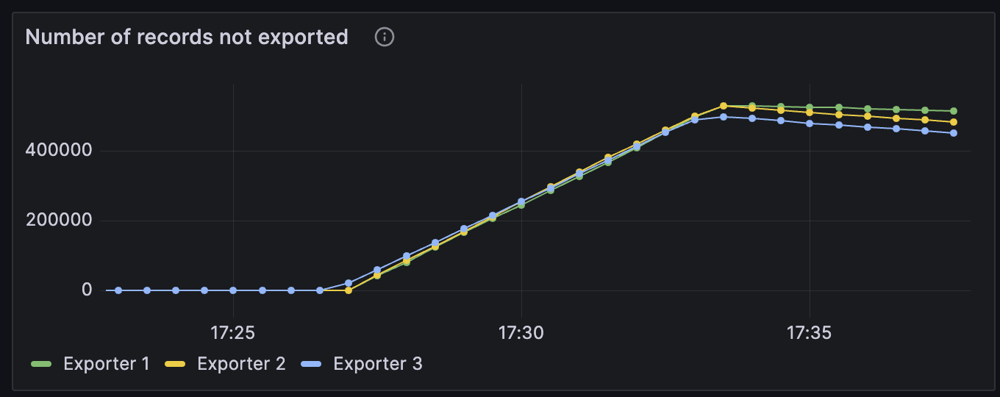

# Using flow control to handle bottleneck on exporting 

With the Zeebe now having a unified flow control that protects from user commands that cannot be processed fast enough and from excessive writes, we wanted to test situations when exporting is degraded and how to configure the rate limits for writes to bring the cluster back to a balanced/safe state.

**TL;DR;**

Enabling the write rate limiting and throttling makes the processing and exporting speed match and from a user's perspective, the reduced speed is seen as backpressure.

## Degraded exporting performance should result in backpressure

The new unified flow control introduces a mechanism that rate limits all writes based on the exporting rate. If exporting slows down, writing of new records becomes slower too. For user commands, this will show up as increased backpressure. Internal processing will slow down because the stream processor needs to wait longer for the writing of processing results to complete.

To test this, we will construct a cluster under normal utilization and then artificially degrade the exporting process. After this we will configure the the flow control to rate limit all writes to be on par with the exported records.

For this, we have two possibilities we can enable a static write rate limit or enable throttling that keeps the writes bounded by the exporter backlog. For this we will use the unified control endpoint and configure write rate limit.

To fetch the current configuration we can port forward to one of the zeebe pods and use the command:
```Shell
GET /actuator/flowControl
```


To configure the write rate limit we use the same endpoint, for example:

```
POST /actuator/flowControl
{
   "write": {
        "rampUp": 0,
        "enabled": true,
        "limit": 400,
        "throttling":{
          "enabled": true,
          "acceptableBacklog": 100000,
          "minimumLimit": 100,
          "resolution": 15
        }
  }
}
```

## Expected

After we artificially degrade the exporting velocity of records we expect to see that the number of queued records increases steadily.

For the static limit, we would choose a value slightly lower than the exporting rate (so that the backlog would slowly decrease).

For the throttling of the writes, we would pick a backlog size that would be smaller than the current one to reduce the processing speed. In this case, we would observe both processing speed and exporting speed mach after the acceptable backlog size is reached.

Following the configuration of the write rate limit we should see that the processing of records to gradually start matching the speed of the exporting ones. This means that this will decrease the processing speed and from a user perspective this will be seen as backpressure. We should also observe that the number of records not yet exported decreases, thus bringing both to a balance.

## Actual

After we artificially degrade the exporter performance, we see a constant increase in records not exported since the processing is still happening at the same rate.


After applying a static rate limit of 400 to be slightly lower than the observed 500-600 of the exporting rate, we see that the processing speed changes accordingly.


As expected we also see this reflected in backpressure that sees the user commands being rejected in a much higher portion.


We also observe that the backlog of records not exported starts to decrease at the rate of the difference between exported and processed records.




Re-running the same setup, but using the throttling of writes with an acceptable backlog at 100,000  of not exported records, and a limit higher than our processing speed (so has to not impact the this experience), we get the following results: 


The orange underline metric displays when the throttled write rate is applied.


From the panels of the “Exporting per Partition” and “Number of records not exported”, we can observe that during the re-run of the experience our artificially degrading of the exporters only affected Exporters 2 and 3. After we enable throttling, the backlog on these affected exporters starts to decrease as expected, later stabilizing on around 100,000 records. This will drop back to 0 once we remove the artificial degrading of the exporters.


In the backpressure, we observe that this increases mostly on the affected partitions 2 and 3, and once the number of records not exported reaches the acceptable level this lowers slightly and stabilizes.


Finally, on the panel that shows the processing per partition, we also confirm the expectation that since one of the exporters was not affected by the artificial degrading of the exporter, some additional traffic gets re-routed to this partition, after the throttling gets applied. On the affected partitions we see the processing decreasing slightly in line with the exporting on the same partitions.


Overall the observations match our expectations and show that the write rate limiter and write rate throttling both succeed in matching the processing and exporting speed through different mechanisms and translating this into backpressure to the user.

