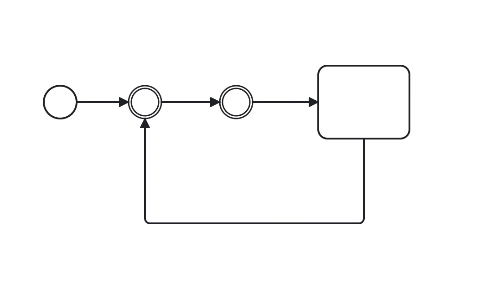
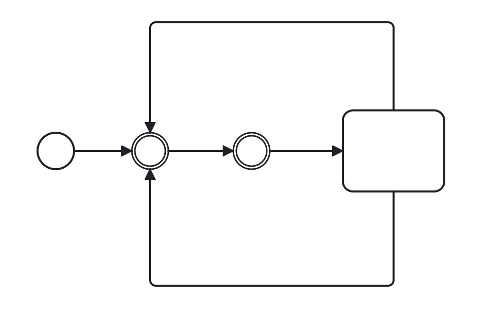
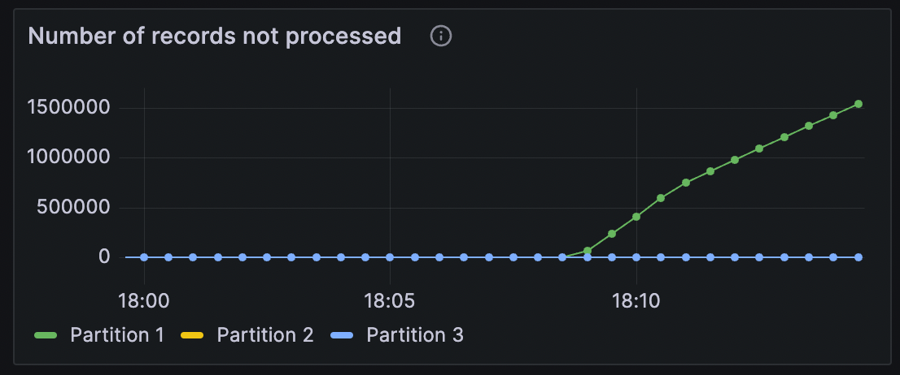

# Using flow control to handle uncontrolled process loops

Zeebe 8.6 introduces a new unified flow control mechanism that is able to limit user commands (by default it tries to achieve 200ms response times) and rate limit writes of new records in general (disabled by default).

Limiting the write rate is a new feature that can be used to prevent building up an excessive exporting backlog.

In these experiments we will test what happens with the deployment of endless 
loops that result in high processing load, and how we can use the new 
flow control to keep the cluster stable. 


**TL;DR;**

Enabling the write rate limiting can help mitigate the effects caused by 
process instances that contain uncontrolled loops by preventing building up an 
excessive exporting backlog. 

<!--truncate-->
## Mitigating the performance impacts of deployed loops:

When an uncontrolled loop is accidentally deployed this tends to use of 
most of the 
processing resources of the partitions where instances are running.

Such instances completely occupies its partition, starves other instances and results in slow response times.

Usually, these problems should be addressed before other issues arise, such as full disk due to a large backlog of not exported records (max exporting speed tends to be slower than max processing speed).

Using the write rate limiter, we can slow down the processing speed and 
give us more time to address the issue, while at the same time enabling us to reduce or maintain the backlog size and reduce risks of side effects.

To reduce the rate write limit we will use the unified control endpoint and configure write limit to be significantly lower than the processing speed.

To fetch the current configuration we can port forward to one of the zeebe pods and use the command:
```Shell
GET /actuator/flowControl
```


To configure the write rate limit we use the same endpoint:

```
POST /actuator/flowControl
{
   "write": {
        "enabled": true,
        "limit": 3000,
  }
}
```

For this experiment we will test the impact of write rate limits both in 
single loops and dual loops.

## Single loop processing:



This single-loop process will hoard the processing resources and never complete but will append to the processing queue only the next step in the process.

This means that the number of records not processed will only grow if many other processes or requests are arriving at the same time, at a faster rate than the cluster can process.

### Expected results:

When deploying a process instance with a single loop we should see the 
processing rate in the partition increases significantly. 

This can lead to processing speed to surpass the exporting speed, which 
results in increase in the backlog of exported records.

Using the rate write limits to restrict the processing speed enables us to 
reduce the backlog size and give more time for the user to fix the 
underlying issues with the cluster.

### Actual 

By deploying a single loop model we can see that the processing and writing 
increases in the same partition and stabilizes around 5 000, later at 
around 17:55 we apply the write rate limit of 3 000, and the processing 
gets limited accordingly.

This leads to some of the requests being 
redirected to 
the other partitions which cause the processing in these to increase.


When observing the backpressure, we can draw the same conclusions as from 
the processing per partition graph, after the model gets deployed, we see an 
increase in the backpressure to around 7% in the partition where the loop 
instance was deployed.

Once the limit gets set at around 17:55 the backpressure in this partition 
increases even more, to around 22% with the backpressure in the other partitions also increasing significantly.

This follows the expected results since with the limiting processing, the after partition will reject even more commands, which get redirected to the remaining partitions which also cause their load to increase and therefore their backpressure as well.


Observing the exporting per partition panel we can see that the exporting also increases in the affected partition, and this gets reduced after the limit gets imposed.


## Dual loop processing:



On the other hand, this dual loop process during its run will always create more records than can be processed since it doubles in the last step.

This will create a steady increase in records not processed even if no other processes or requests are competing for processing time.

## Expected 

When deploying a process instance with a dual loop we should expect to see 
a rapid increase in the processing speed and also in the number of records 
not processed.

In this case, restricting the processing speed should not decrease the 
backlog of processed records since on each run of the loop more records are 
created than 
processed.

However, it should help us at least in reducing the pace of the increase in 
the backlog and therefore give us more time to address the 
underlying problem.

## Actual 

After deploying the dual loop we can see that the processing quickly jumps to its peak, at around 18:11 we configure the write rate limit at 3000.

Unlike the previous experience here we can observe that the processing speed in the other partitions was already increasing before the configuration gets applied.


Observing the backpressure we get the answer as to why the processing in the other partitions was already increasing before the configuration gets applied. 

The backpressure had already reached at 100% which means that the dual loop process by itself hoarded completely the processing resources of the partition. 


Observing the number of records not processed we conclude as expected that 
limiting the write rate cannot stop the records backlog from continuing to increase, but we can see that the slope of the curve is smaller after configuring the limit.




Overall the results match our expectations that the flow control configuration can be leveraged to give us more control of the cluster, which in the case of acting on deployed loop instances can give us more tools to address these issues. 

_Footnote:
(As of the latest release, it is no longer possible to deploy processes that 
contain a straight-through processing loops such as the ones used in this 
experience)._


