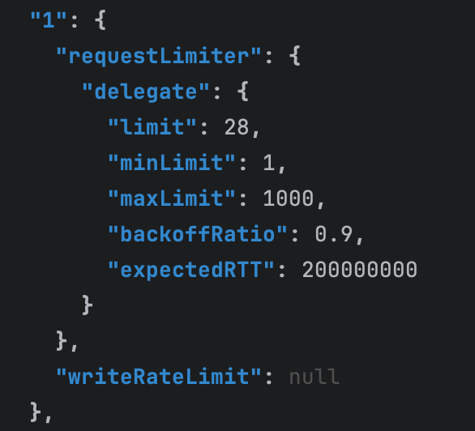

# Using flow control to handle uncontrolled process loops

With the Zeebe now having a unified flow control that protects from user commands that cannot be processed fast enough and from excessive writes, we wanted to test situations where endless loops models are deployed in the cluster, which hordes processing, and how to configure the rate limits for writes to bring the cluster back to a balanced/safe state.

**TL;DR;**

Enabling the write rate limiting can help mitigate the effects caused by process instances that contain uncontrolled loops since it limits the processing speed in all partitions, thus giving more time to act and address the underlying issue while bringing the cluster to a balanced state by matching processing and exporting if the correct limits are picked.

## Mitigating the performance impacts of deployed loops:

When a loop is accidentally deployed this tends to use of most of the processing resources of the partitions where the instance is running. This leads not only the partition to start processing at max speed but also slows its response to any other incoming requests. Usually, these problems should be addressed before other issues arise, such as full disk due to a large backlog of not exported records (max exporting speed tends to be slower than max processing speed).

Using the write rate limiter we can slow down the processing speed and give us more time to address the issue, while at the same time enabling us to reduce or maintain the backlog size and reduce risks of side effects.

For these experiments, we will use two loops:


This single-loop process will hoard the processing resources and never complete but will append to the processing queue only the next step in the process. This means that the number of records not processed will only grow if many other processes or requests are arriving at the same time, at a faster rate than the cluster can process.


On the other hand, this dual loop process during its run will always create more records than can be processed since it doubles in the last step. This will create a steady increase in records not processed even if no other processes or requests are competing for processing time.

To reduce the rate write limit we will use the unified control endpoint and configure write limit to be significantly lower than the processing speed.

To fetch the current configuration we can port forward to one of the zeebe pods and use the command:
```Shell
GET /actuator/flowControl
```



To configure the write rate limit we use the same endpoint:

```
POST /actuator/flowControl
{
   "write": {
        "rampUp": 0,
        "enabled": true,
        "limit": 3000,
        "throttling":{
          "enabled": true,
          "acceptableBacklog": 100000,
          "minimumLimit": 100,
          "resolution": 15
        }
  }
}
```

# Expected results:

When deploying processes that contain straight-through loops, the lowering of the write rate limits does not fix the underlying problem, but should give us more time to act, and to bring the cluster closer to a balance.

### Single loop processing:

By deploying a single loop model we can see that the processing and writing increases in the same partition and stabilizes around 5 000, later at around 17:55 we apply the write rate limit of 3 000, and the processing gets limited accordingly with some of the requests being redirected to the other partitions which cause the processing in these to increase.


When observing the backpressure, we can draw the same conclusions as from 
the processing per partition graph, after the model gets deployed, we see an 
increase in the backpressure to around 7% in the partition where the loop instance was deployed, and once the limit gets set at around 17:55 the backpressure in this partition increases even more, to around 22% with the backpressure in the other partitions also increasing significantly.

This follows the expected results since with the limiting processing, the after partition will reject even more commands, which get redirected to the remaining partitions which also cause their load to increase and therefore their backpressure as well.


Observing the exporting per partition panel we can see that the exporting also increases in the affected partition, and this gets reduced after the limit gets imposed.


### Dual loop processing:

After deploying the dual loop we can see that the processing quickly jumps to its peak, at around 18:11 we configure the write rate limit at 3000. Unlike the previous experience here we can observe that the processing speed in the other partitions was already increasing before the configuration gets applied.


Observing the backpressure we get the answer as to why the processing in the other partitions was already increasing before the configuration gets applied. The backpressure had already reached at 100% which means that the dual loop process by itself hoarded completely the processing resources of the partition. 


Observing the number of records not processed we observe as expected that limiting the write rate cannot stop the records backlog from continuing to increase but we can see that the slope of the curve is smaller after configuring the limit.


Overall the results match our expectations that the flow control configuration can be leveraged to give us more control of the cluster, which in the case of acting on deployed loop instances can give us more tools to address these issues. 

Footnote:
(As of the latest release, it is not longer possible to deploy processes that 
contain a straight-through processing loops such as the ones used in this 
experience).


