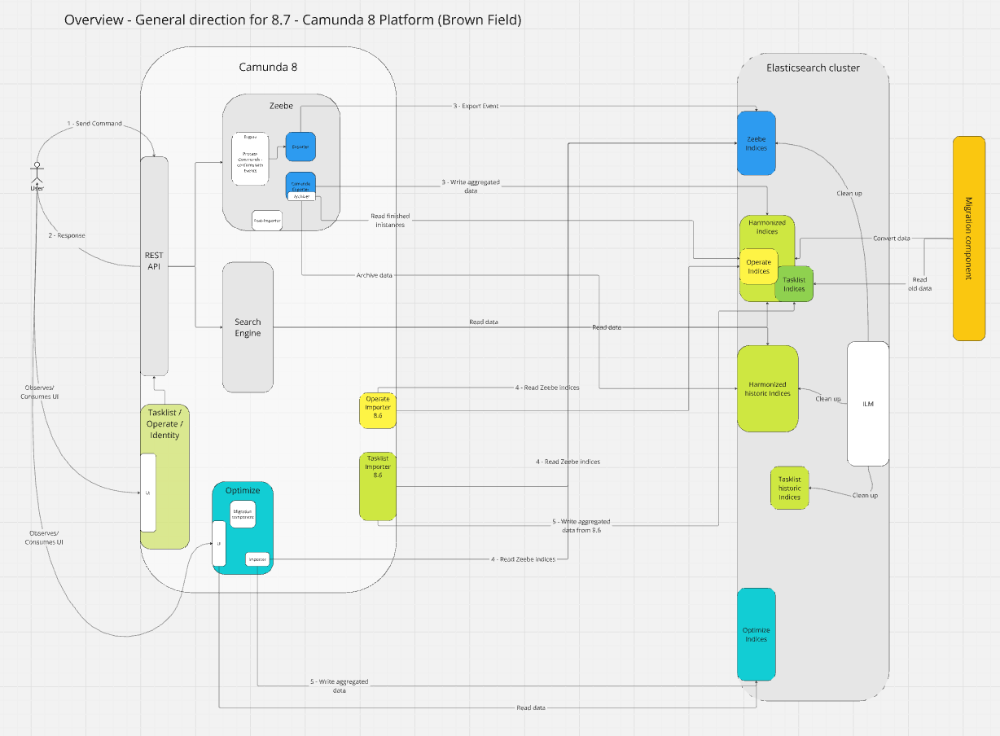
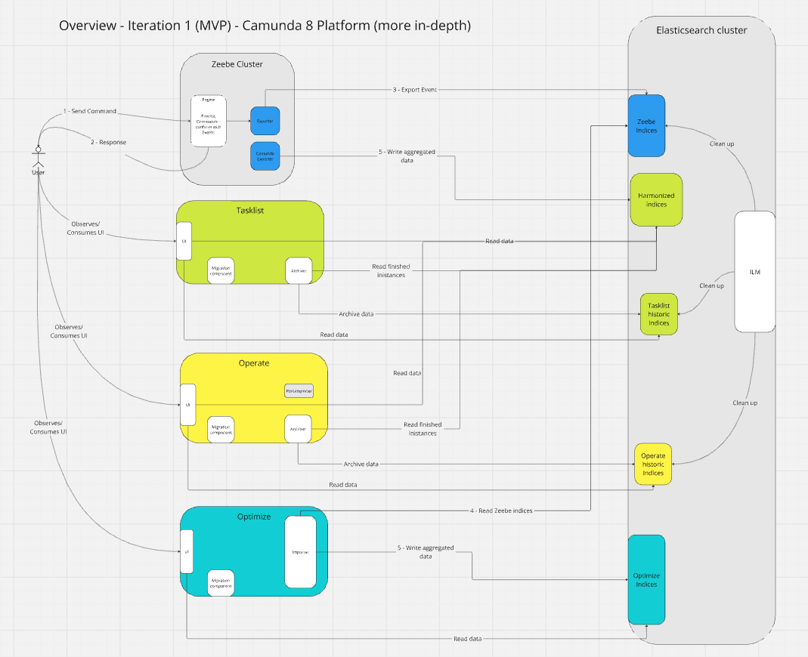
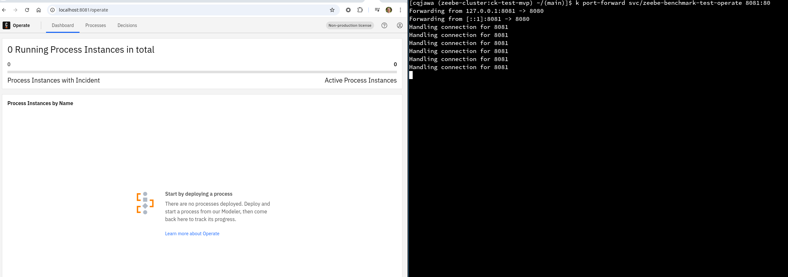
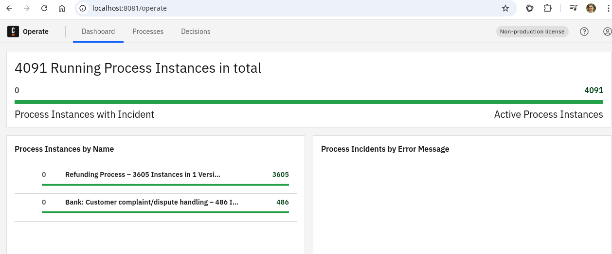
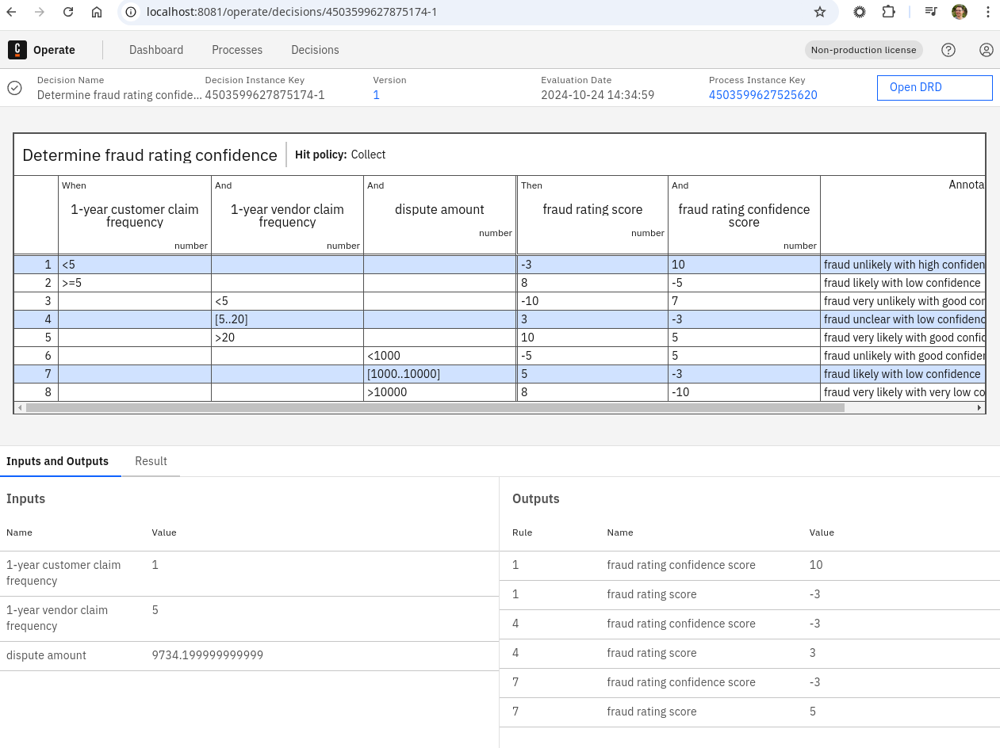

# Chaos Day Summary

After a long pause, I come back with an interesting topic to share and experiment with. Right now we are re-architecture
Camunda 8. One important part (which I'm contributing to) is to get rid of Webapps Importer/Archivers and move 
data aggregation closer to the engine (inside a Zeebe Exporter).

Today, I want to experiment with the first increment/iteration of our so-called MVP. The MVP targets green field installations where you simply deploy Camunda (with a new Camunda Exporter enabled) without Importers.

**TL;DR;** All our experiments were successful. The MVP is a success, and we are looking forward to further improvements and additions. Next stop Iteration 2: Adding Archiving historic data and preparing for data migration (and polishing MVP).

## Camunda Exporter

The [Camunda Exporter project](https://github.com/camunda/product-hub/issues/2128) deserves a complete own blog post, here is just a short summary.

Our current Camunda architecture looks something like this (simplified).


It has certain challenges, like:

* Space: duplication of data in ES
* Maintenance: duplication of importer and archiver logic
* Performance: Round trip (delay) of data visible to the user
* Complexity: installation and operational complexity (we need separate pods to deploy)
* Scalability: The Importer is not scalable in the same way as Zeebe or brokers (and workload) are.

These challenges we obviously wanted to overcome and the plan (as mentioned earlier) is to get rid of the need of separate importers and archivers (and in general to have separate application; but this is a different topic).

The plan for this project looks something like this:



We plan to:

1. Harmonize the existing indices stored in Elasticsearch/Opensearch
2. Space: Reduce the unnecessary data duplication  
3. Move importer and archiver logic into a new Camunda exporter
4. Performance: This should allow us to reduce one additional hop (as we don't need to use ES/OS as a queue)
5. Maintenance: Indices and business logic is maintained in one place
6. Scalability: With this approach, we can scale with partitions, as Camunda Exporters are executed for each partition separately (soon partition scaling will be introduced)
7. Complexity: The Camunda Exporter will be built-in and shipped with Zeebe/Camunda 8. No additional pod/application is needed.

Note: Optimize is right now out of scope (due to time), but will later be part of this as well.


### MVP

After we know what we want to achieve what is the Minimum viable product (MVP)?

We have divided the Camunda Exporter in 3-4 iterations. You can see and read more about this [here](https://github.com/camunda/issues/issues/803).

The first iteration contains the MVP (the first breakthrough). Providing the Camunda Exporter with the basic functionality ported from the Operate and Tasklist importers, writing into harmonized indices. 

The MVP is targeting green field installations (clean installations) of Camunda 8 with Camunda Exporter without running the old Importer (no data migration yet),



<!--truncate-->

## Chaos Experiment

What I want to verify today, when I deploy the Camunda 8 stack with Camunda Exporter (and Importer disabled):

  * Are webapps schemas created in ES, by the new Camunda Exporter
  * Is data exported into the indices
  * Can Operate show data? (right now just checking for basic functionality) 

Additionally, I would like to understand what the performance looks like, how the system behaves with two ES exporters (the old ES exporter and the new Camunda Exporter), and more.

For our experiment, I use a [newly defined realistic benchmark](https://github.com/camunda/camunda/issues/21472) (with a more complex process model). More about this in a separate blog post. 

### Expected

I can deploy the newest helm charts (alpha stage), by disabling Importer manually, and will be able to use Zeebe and Operate together. See the verifications above.

### Actual

As always we use our [benchmark-helm charts](https://github.com/zeebe-io/benchmark-helm) (that building on top of our [Camunda Platform Helm](https://github.com/camunda/camunda-platform-helm) charts).


### Installation

I had to adjust our benchmarks to [use the alpha snapshots ](https://github.com/zeebe-io/benchmark-helm/commit/db682a89788d6c511083ec743c6cf7d358155e3c) 

```yaml
dependencies:
  - name: camunda-platform
    repository: "oci://ghcr.io/camunda/helm"
    version: "0.0.0-snapshot-alpha"
    condition: "camunda.enabled"
```


and [disable the Importer via ENV](https://github.com/zeebe-io/benchmark-helm/commit/aafac6e9ec78e9cfd2e59a5b6f30bf887a4fcbd0)

```yaml
env:
- name: CAMUNDA_OPERATE_IMPORTERENABLED
value: "false"
```

With that, we can install our chart:

```shell
$ helm install zeebe-benchmark-test charts/zeebe-benchmark/ --render-subchart-notes -f charts/zeebe-benchmark/values-realistic-benchmark.yaml --set global.elasticsearch.prefix=null
```

### Basic First Verification

After our benchmark chart is deployed we can already see the first time our Camunda Exporter running :tada:


Worth mentioning that the Camunda Export already comes with some metrics, visible on our Zeebe Dashboard


The general overview also looks good. No obvious problem.


Looking into logs we can see that at the start it fails temporarily because ES is not yet ready to accept the schema creation.

```
ERROR - Failed to open exporter 'CamundaExporter'. Retrying...
```


At some point, the exporter can be opened and the loop stops. 

I think generally it shouldn't be an ERROR but more a WARN (but these are details we can fix). Follow-up.


### Verify Operate Data

To make sure that Operate is not importing, I checked the Operate dashboard. We can see that there is no Importer metrics. Furthermore, in the configuration and logs we see no indication of importing.


We can now start to port-forward to operate:

```shell
k port-forward svc/zeebe-benchmark-test-operate 8081:80
```

When opening Operate we see unfortunately no data.



#### Investigating missing data

We need to understand why there is no data available for Operate.

What we saw is that the Camunda Exporter is open (logs), that it is also makes progress and data is written to elastic (metrics). What we haven't checked Elasticsearch in detail. 

Looking into ES dashboard we can see that indices are created, but the Operate indices seem to be empty.


When checking the Zeebe indices:


we can see that they are filled. An attentive reader will also chekc that there actuall some prefix problem in the indices. 

Thanks to Deepthi which spotted this as well (and told me), we were exporting to the wrong index names. There was a [bug](https://github.com/camunda/camunda-platform-helm/blob/46f6ee9d828439b0b1cf37bae4d135ba5281a832/charts/camunda-platform-alpha/templates/zeebe/configmap.yaml#L66) existing in the current alpha Helm chart version.


This has been fixed with [PR-2506](https://github.com/camunda/camunda-platform-helm/pull/2506). Until this gets merged I changed this manually via:

```shell
# Get the templates 
helm template zeebe-benchmark-test charts/zeebe-benchmark/ --render-subchart-notes -f charts/zeebe-benchmark/values-realistic-benchmark.yaml --output-dir templates

# Adjust the config map - remove the prefix
vim templates/zeebe-benchmark/charts/camunda-platform/templates/zeebe/configmap.yaml 

# Apply all manifests
k apply -f . --recursive
```

> **Note:**
> 
> I also tried 
> ```shell
> helm template charts/zeebe-benchmark/ --version 0.0.0-snapshot-alpha     --show-only charts/camunda-platform/templates/zeebe/configmap.yaml --set global.elasticsearch.prefix=null
> ```
> But this breaks the ES exporter.

With this change we were can see that indices are correctly created and filled!


Finally, we are able to see data in Operate! :rocket: **WITHOUT ANY IMPORTER.** 







## Conclusion

The MVP is a success. We were able to provide a Camunda Exporter that creates the necessary harmonized schema and migrate the basic business logic from Operate and Tasklist into the exporter. This allows us to use only the Camunda Exporter without running any Importer pod/application. 

Great work Team :rocket: :tada: 

**Next stop:** 

_Iteration 2:_

 * Implementing migration logic for old data
 * Moving Archiver logic (for historical data) into the Exporter
 * Polish MVP state (add some missing features like TreePath, etc.)

### Additional notes

This time I was not able to deep dive into performance or stability for this change. I plan to do this next.

### Found Bugs

* ERROR log level for logs that are transitive
* Auth/User indices are still prefixed with identity

