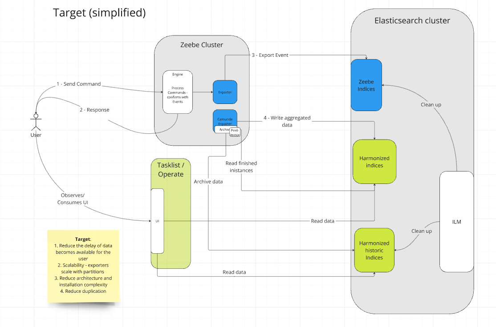
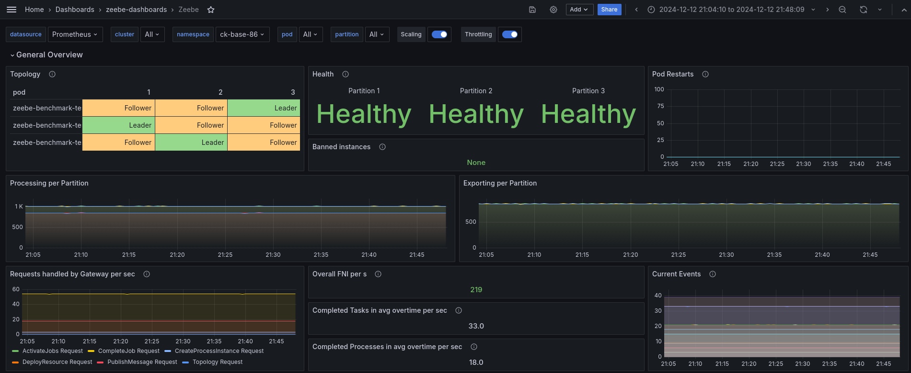
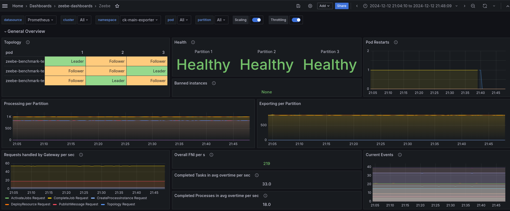
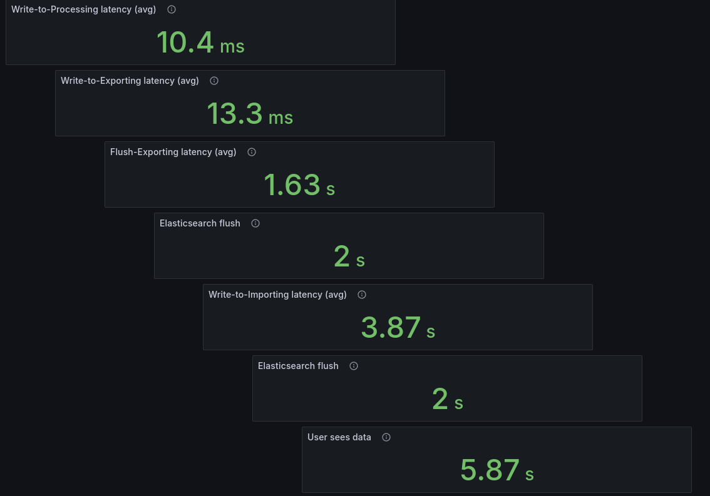
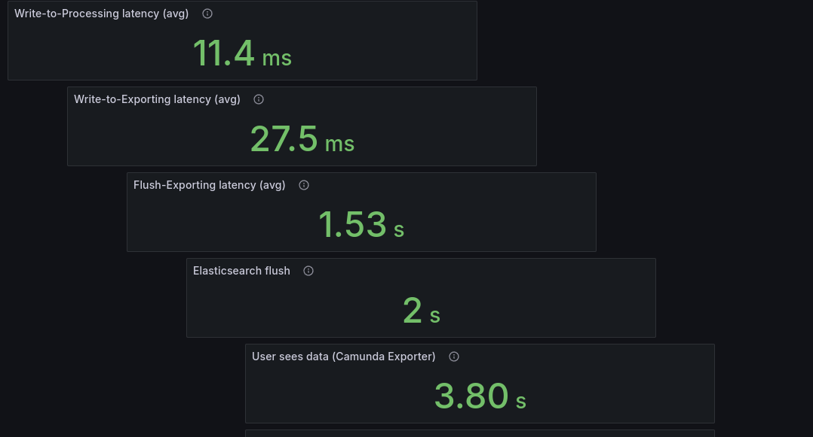
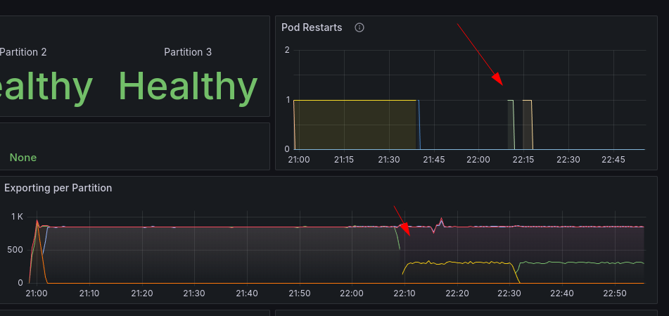

# Chaos Day Summary

In this Chaos day we want to verify the current state of the exporter project, and run benchmarks with it. Comparing
with a previous version (v8.6.6) should give us a good hint on the current state and potential improvements.

**TL;DR;** The performance that the user sees data has been improved due to the architecture change, but there are still some bugs that we have to fix until the release.

<!--truncate-->

## Chaos Experiment

### Benchmarks

We have seen in previous experiments and benchmarks that the realistic benchmarks are not yet totally reliable, as they seem to overload at some-point the system. This can happen if there is a hiccup and jobs take longer to process. Jobs in the queue are getting delayed, and time out, they are sent out to different workers, but we will reach at some point again the jobs, and we will publish also for this job a message. This in general increases the load of the system as we have to timeout jobs, we have to handle additional message publish, etc.

Additionally, message publish can be rejected, when this happens we wait for another timeout adding again load on the system, more and more retries happen etc. this breaks the benchmark performance.

To avoid this, we reduce the benchmark payload for now, which is in charge of creating multi instances and call activities etc. To be specific, the reduced the items from 50 to 5,
but scaled the starter to start more instances. With this payload we can scale more fine granular. Each instance can create 5 sub-instances, when creating three process instances  we create effectively 15 instances/token.

As this the benchmark runs quite stable, it allows us to better compare the latency between based and main.

### Details Experiment

We will run two benchmarks one against 8.6.6, call based, and one against the current main branch (commit a1609130).

### Expected

When running the base and the main and comparing each other we expect that the general throughput, should be similar.
Furthermore, we expect that the latency until the user sees data (or data is written into ES and searchable) should be lowered on main than base.

Note: Right now we don't have a good metric to measure that data is available for the user, we plan to implement this in the starter benchmark application at some-point via querying the REST API. For now, we calculate different average latencies together, whereas we take as elasticsearch flush a constant of 2 seconds.

We expect a reduction of latency as we reduce one additional hop/usage of ES as intermediate storage, before aggregation.

#### Base

#### Main

### Actual

We have set up both benchmarks, running as described above with changed payloads.

#### General Performance

The general throughput performance looks similar. The resource consumption looks similar as well, but we didn't investigate this more deeply. Will be done separate.

##### Base general

##### Main general

#### Latency

This experiment targets to show difference in the data availability for the user.

In order to better visualize the dashboard has been adjusted for this experiment.

##### Base latency

##### Main latency

As we expected we were able to reduce the latency data is available for the user by the additional ES flush, reducing it by ~2 seconds.

### Result

We were able to show that the latency has been reduced under normal load.

**Note:** Be aware this experiment only runs benchmarks with less-to-normal load, on higher load this might change, and need to be tested separately.

#### Found Bugs

Within the experiment we run into several other issues. Especially after running for a while, when pods got restarted, the Camunda Exporter broke.

This caused to increase the latency.

The exporter was not able to detect correctly anymore that the importing was done.

See related github issue(s)

