# Chaos Day Summary

I'm back to finally do some load testing again. 

In the past months, we have changed our architecture. This was to deploy instead all of our components as a separate deployment, 
we now have one single statefulset. This statefulset is running our single Camunda standalone application, 
combining all components together. 


More details on this change we will share on a separate blog post. For simplicity, in our load tests (benchmark helm charts), we
 combined all the resources we had split over multiple deployments together, see related PR [#213](https://github.com/camunda/zeebe-benchmark-helm/pull/213).

We are currently running our test with the following resources by default:

```yaml
    Limits:
      cpu:     2
      memory:  12Gi
    Requests:
      cpu:      2
      memory:   6Gi
```

In today's Chaos day, I want to look into our resource consumption and whether we can reduce our used requests and limits.

**TL;DR;** We have focused on experimenting with different memory resources, and were able to show that we can reduce the used memory by 75%, and our previous provisioned resources by more than 80% for our load tests.

<!--truncate-->

## Checking weekly benchmarks

Before I started to experiment and reduce it. I validated whether we actually have room for improvement. For that, I check our
weekly load tests. These are tests we start every week, that are running for four weeks straight. These can be used as a good reference point (base).

I picked the mixed load test, which is running our realistic benchmark using a  more complex process model, covering more elements, etc.


When we look at the general metrics, we can see it reaches, on average, ~100 task completions per second. As we use pre-emptive nodes, it might happen that workers, starters, or even the Camunda application are restarted in between.

### Memory consumption

Looking at the memory consumption, we can see that we still have quite some headroom.


Our deployments use between three and four gigabytes of memory, which is divided by the JVM heap, JVM metaspace, native memory usage like RocksDB, off-heap usage etc.

For example, we can see that the JVM uses less than one gigabyte for the heap, but can use up to ~3.5 gigabytes for its heap. This is related to the default JVM settings, which are ~25% of the available memory on the machine.


[RocksDB](https://rocksdb.org/), the embedded key-value store that Zeebe uses to store its state, is per default configured to use 512 MB per partition. We can observe via exposed metrics this as well.


We can set this memory limit for RocksDB via an [experimental configuration](https://github.com/camunda/camunda/blob/main/zeebe/broker/src/main/java/io/camunda/zeebe/broker/system/configuration/RocksdbCfg.java#L23). For example, via environment variable: `ZEEBE_BROKER_EXPERIMENTAL_ROCKSDB_MEMORYLIMIT` or property: `zeebe.broker.experimental.rocksdb.memoryLimit`.

### CPU Consumption

After having checked the memory consumption, we can look at the CPU consumption. As mentioned earlier, we are running a rather more complex orchestration use case that involves more work on processing, exporting, etc. 

Here we can already see that we scratch on our limits, we can observe some throttling for some of our pods.


For today, I will focus on the memory consumption to improve it. We might want to look into the CPU consumption on another day. 

## 1. Experiment: Reduce memory limits generally

As a first experiment, I tried to reduce the general memory to something which I thought made sense based on the observation I made earlier. This means setting requests and limits to four gigabytes. 

```yaml
    Limits:
      cpu:     2
      memory:  4Gi
    Requests:
      cpu:      2
      memory:   4Gi
```

**This is a 66% decrease from the previous limit and a 33% decrease from the previous used requests!** 

Be aware that I set both to the same value on purpose. This is to make sizing, scheduling, and memory management more predictable. Furthermore, to reduce the chance of getting OOMs/killed/evicted.

The memory request is used for Kubernetes pod scheduling. This means the limit is not a guaranteed size, but more like a guard to prevent the container to use more. If a container uses more than its requests [there is a chance to be evicted](https://kubernetes.io/docs/concepts/configuration/manage-resources-containers/#how-pods-with-resource-limits-are-run), if the node becomes memory pressure. If it exceeds its limits, it will be killed eventually by the kernel.

### Expected

As we observed in our weekly load test, we are able to use less than 1 gigabyte of Java Heap, which is ~25% of four gigabytes, and we normally use three partitions, a 512 MB (~1,5 Gi). I expect that four gigabytes of memory should perform well.

### Actual

The general performance is comparable to our base, we do not spot any frequent restarts.


Looking at the memory, we see that we are able to run with the reduced memory as well.


The JVM memory usage even shows us that we are able to use less memory; previously, we used ~1 gig as heap, now it is around 256 MB.


**This gives us room for further improvement. Let's continue with Experiment 2**

## 2. Experiment: Reduce memory limits and RocksDB memory

With the results from Experiment 1, I was confident that we could run with less memory. I was wondering what if we reduced the memory limit of RocksDB.

As mentioned earlier can be done via a property or an environment variable. For our next experiment, I set our limit
 to 128 MB. This is a 75% reduction of previous used memory for RocksDB per partition.

```shell
zeebe.broker.experimental.rocksdb.memoryLimit: 128MB
```

We are running similar configurations in our SaaS environment, so I knew this is working, but I don't know how this behaves on a more complex use case and benchmark.

### Expected

My expectation would be that the general memory consumption is reduced, not affecting the JVM. Our load test should run stable still.

### Actual

Indeed, the general performance looks similar, with some smaller outliers but still performing good.


We reduced the memory consumption for the process by half! It is now around 1.5 gigabytes, while it was in the previous experiment around three gigabytes, and at the start, close to four.


In our RocksDB related metrics, we are able to observe the actual size of our RocksDB instance as well, which is indeed 128 MB.


## 3. Experiment: Half it

As we were still running fine, and wanted to reach a point where it doesn't run well anymore. I simply thought about reducing our resources by half again.

Changing our deployment resources to two gigabytes:
```yaml
    Limits:
      cpu:     2
      memory:  2Gi
    Requests:
      cpu:      2
      memory:   2Gi

```

Configuring RocksDB memory limit to 64MB
```
zeebe.broker.experimental.rocksdb.memoryLimit: 64MB
```

### Expected

Similar to above, I was still expecting that it works, as we saw that the JVM usage was rather low and still performing good.

### Actual

The performance of the test still looks acceptable. We see some restarts, but they seem not to be related to memory pressure.

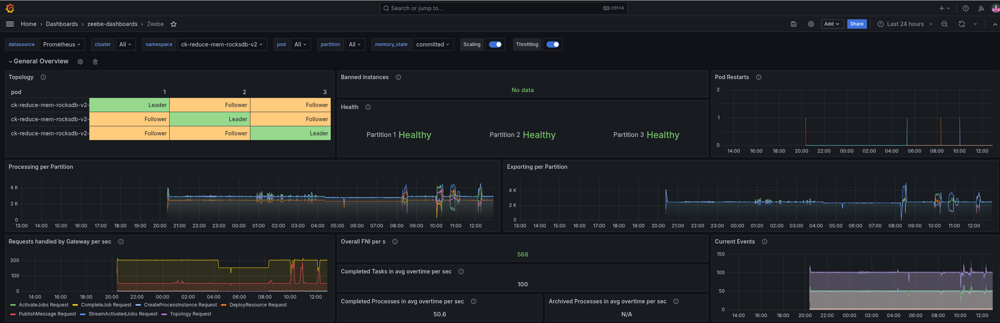

Again, we were able to reduce the memory, but not with such big steps as before. For this load test, we have on average a ~1.2 G memory usage per pod.

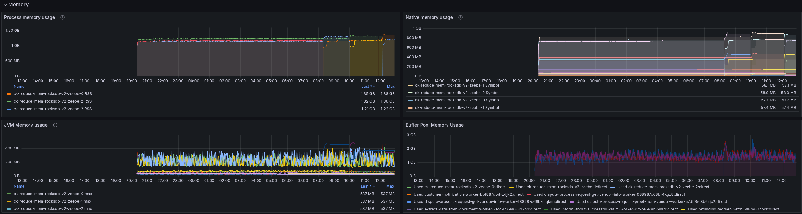

When we look at the JVM metrics, we can see that we are getting closer to our maximum, commited, and used heap values. Still, the used heap was reduced and is now around ~128 MB in many cases.

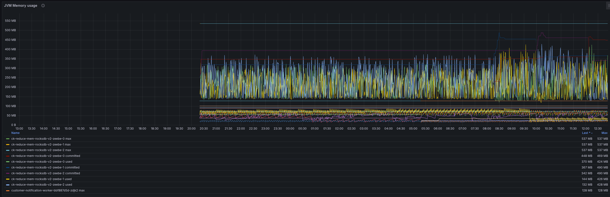

The RocksDB instance now uses 64MB as expected.

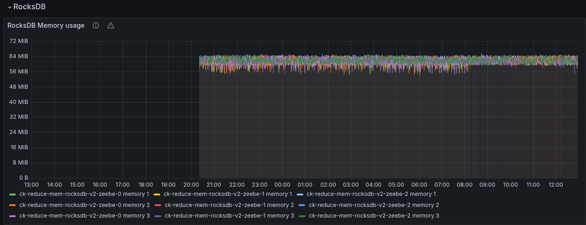

## 4. Experiment: Half it (again)

As I want to bring it to its limits, I reduced the memory resources once more by half.
```yaml
    Limits:
      cpu:     2
      memory:  1Gi
    Requests:
      cpu:      2
      memory:   1Gi

```

But to not change too many things at once (sorry for doing it earlier :D), I kept the previous RocksDB configuration:

```
zeebe.broker.experimental.rocksdb.memoryLimit: 64MB
```

### Expected

I felt that this might be quite low on its limits, but still expected it to work, looking at the JVM heap usage metrics.

### Actual

As we can see, this was a tremendous fail. The pods were in an OOM loop and never became stable.  

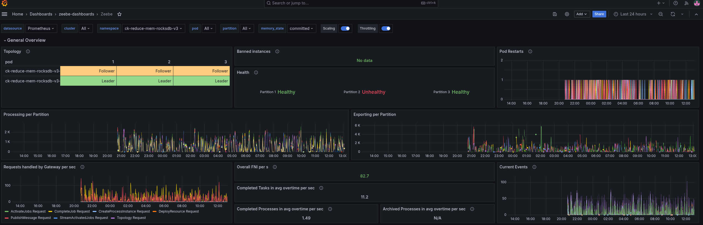

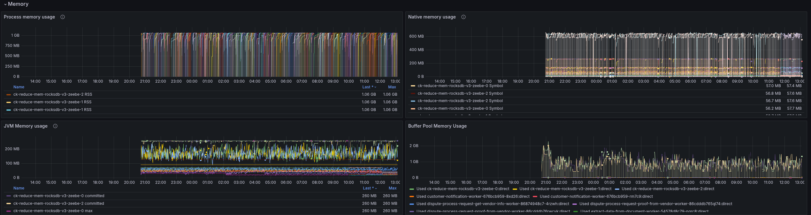

With this, we were able to find our limits.

## 5. Experiment: Half RocksDb once more

Not accepting the previous failure, I simply wanted to try out what happens when I reduce once more the RocksDB memory limit.

This means setting the limit to 32 MB.
```
zeebe.broker.experimental.rocksdb.memoryLimit: 32MB
```

### Expected

At this point, this was really exploration, I had the feeling that it might help if we reduce a little the RocksDB memory.

### Actual

Reducing the RocksDB memory limit allowed the Camunda application to perform as before! Without any performance impact :rocket: At the end we experienced a restart of all applications.

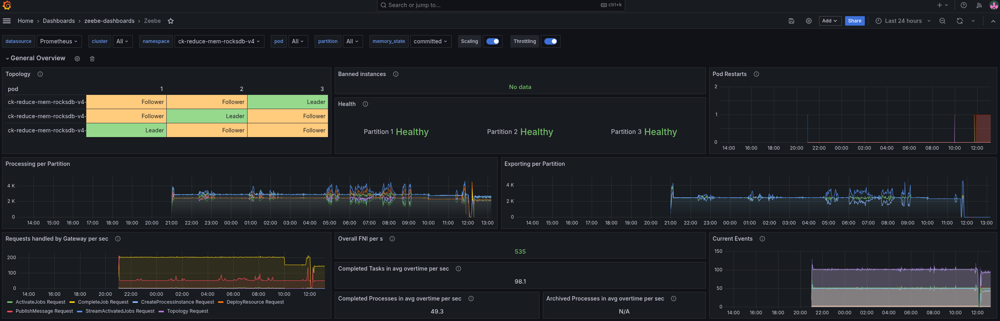

Looking at the process memory metrics, we can see that it is slowly increasing until it was OOM killed. This smells like a memory leak here.

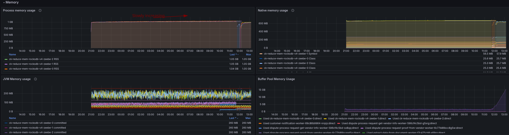

```shell
   Last State:     Terminated
      Reason:       OOMKilled
      Exit Code:    137
      Started:      Wed, 04 Jun 2025 20:55:59 +0200
      Finished:     Thu, 05 Jun 2025 12:07:51 +0200
```

The JVM seem to perform correctly, and here we can observe any increasing usage. That indicates that there might be an issue with off heap (native) memory usage.

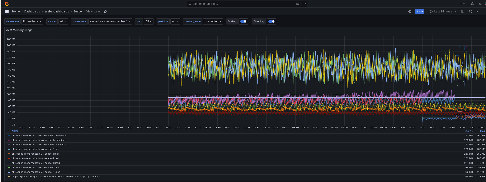

Our current native memory metrics don't highlight any specific ones either. While we can see that the metaspace uses a lot of space already, which also indicates that we likely can't reduce our memory usage more (except tuning this as well).

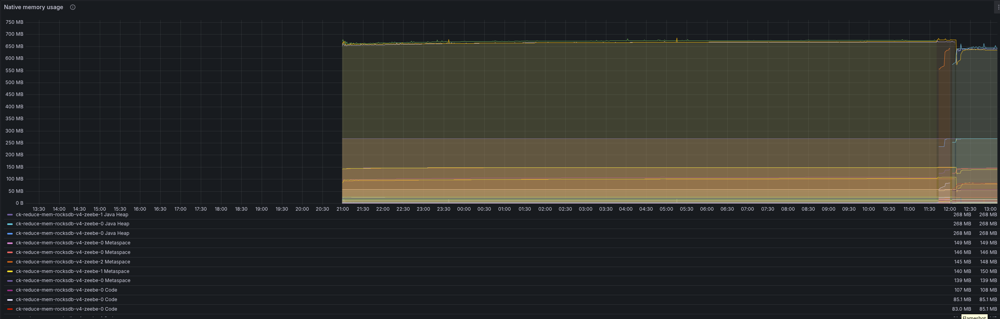

The RocksDB memory usage looks stable as well.

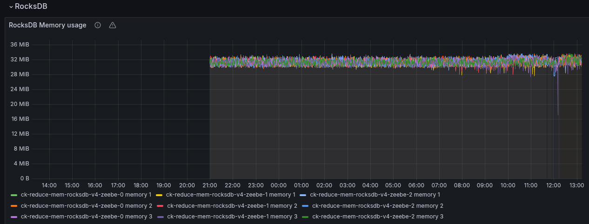


## Conclusion

With today's experiments and investigations, we were able to show that we are able to reduce our memory consumption.

From previously used 12 Gi limit and 6 Gi request, we were able to show that it is running with 1 Gi limit and request, when we reduce the RocksDB memory limit as well. **This is an over 80-90% reduction for the assigned memory.** Looking at our usage, we showed that the actual process memory usage has been reduced from ~4 Gi to 1 Gi, that is a **75% reduction**!

To reduce the chance of getting OOM more frequently (until we investigated the potential resource leak), I propose to use 2 Gi as limits and requests and 64 MB RocksDb memory limit, which was running stable as well (see [Experiment 3](index.md#3-experiment--half-it)). This showed a memory usage of around ~1.2 Gi, which is still a **70% reduction** to previously, and ~70-80% reduction of assigned resources.

We can say this Chaos Day was a success, and I'm looking forward to the next one :rocket: 

## Found Bugs

 * Several panels were broken related to memory, and their tooltip and legends. I fixed this during the investigation.
 * Potential native memory leak

