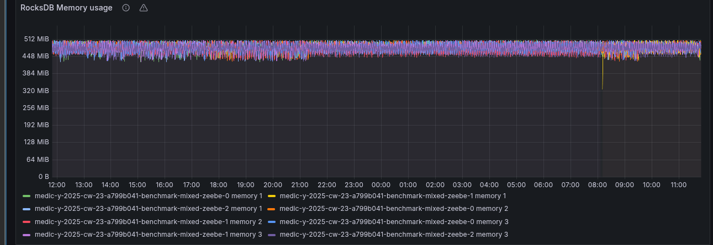

# Chaos Day Summary

I'm back to finally do some load testing again. 

In the past months we have changed our architecture, to deploy instead all of our components as a separate deployment 
we have one single statefulset. This statefulset is running our single Camunda standalone application, 
combining all components together. 


More details on this change we will share on a separate blog post. For simplicity, in our load tests (benchmark helm charts), we
 combined all the resources we had split over multiple deployment together, see related PR [#213](https://github.com/camunda/zeebe-benchmark-helm/pull/213).

We are currently running our test with the following resources per default:

```yaml
    Limits:
      cpu:     2
      memory:  12Gi
    Requests:
      cpu:      2
      memory:   6Gi
```

In today's Chaos day, I want to look into our resource consumption and whether we can reduce our used requests and limits.

**TL;DR;** We were able to reduce the used memory significantly. 

<!--truncate-->

## Checking weekly benchmarks

Before I started to experiment, and reduce it. I validated whether we actually have room for improvement. For that I check our
weekly load tests. These are tests we start every week, that are running for four weeks straight. These can be used as a good reference point (base).

I picked the mixed load test, which is running our realistic benchmark using more complex process model, covering more elements, etc.


When we look at the general metrics, we can see it reaches on average ~100 task completions per second. As we use pre-emptive nodes it might happen that workers, starters or even the Camunda application is restarted in between.

### Memory consumption

Looking at the memory consumption we can see that we actually have still quite some headroom.


Our deployments use between three and four gig of memory, which is divided by the JVM heap, JVM metaspace, native memory usage like RocksDB, off-heap usage etc.

For example, we can see that the JVM uses less than one gigabyte for the heap, but can use up to ~3.5 Gig for its heap. This is related to the default JVM settings which are ~25% of the available memory on the machine.


[RocksDB](https://rocksdb.org/), the embedded key-value store, that Zeebe uses to store its state, is per default configured to use 512 MB per partition. This we can observe via exposed metrics as well.



We can set this memory limit for RocksDB via an [experimental configuration](https://github.com/camunda/camunda/blob/main/zeebe/broker/src/main/java/io/camunda/zeebe/broker/system/configuration/RocksdbCfg.java#L23). For example via environment variable: `ZEEBE_BROKER_EXPERIMENTAL_ROCKSDB_MEMORYLIMIT` or property: `zeebe.broker.experimental.rocksdb.memoryLimit`.

### CPU Consumption

After having checked the memory consumption we can look at the CPU consumption. As mentioned earlier we running a rather more complex orchestration use case that involves more work on processing, exporting, etc. 

Here we can already see that we scratch on our limits, we can observe some throttling for some of our pods.


For today, I will focus on the memory consumption, to improve it. We might want to look into the CPU consumption on another day. 

## 1. Experiment: Reduce memory limits generally

As a first experiment I tried to reduce the general memory to something, which I thought makes sense based on the observation I made earlier. This means setting requests and limits to four gigabytes. 

```yaml
    Limits:
      cpu:     2
      memory:  4Gi
    Requests:
      cpu:      2
      memory:   4Gi
```

**This is 66% decrease of the previous limit and 33% decrease of the previous used requests!** 

Be aware that I set both to the same value on purpose. This is to make sizing, scheduling and memory managing more predictable. Furthermore, to reduce the chance of getting OOMs/killed/evicted.

The memory request is used for Kubernetes pod scheduling. This means the limit is not a guaranteed size, but more like a guard to prevent the container to use more. If a container uses more than its requests [there is a chance to be evicted](https://kubernetes.io/docs/concepts/configuration/manage-resources-containers/#how-pods-with-resource-limits-are-run), if the node becomes memory pressure. If it exceeds its limits, it will be killed eventually by the kernel.

### Expected

As we observed in our weekly load test, we are able to use less than 1 gigabyte of Java Heap, which is ~25% of four gigabyte, and we use normally three partitions a 512 MB (~1,5 Gi). I expect that four gigabyte of memory should perform well.

### Actual

The general performance is comparable to our base, we do not spot any frequent restarts.


Looking at the memory we see we are able to run with the reduced memory as well.


The JVM memory usage even shows us that we are able to use less memory, previously we used ~1 gig as heap, now it is around 256 MB.


**This gives us room for further improvement. Let's continue with Experiment 2**

## 2. Experiment: Reduce memory limits and RocksDB memory

With the results from Experiment 1, I was confident that we can run with less memory. I was wondering what if we would reduce the memory limit of RocksDB.

As mentioned earlier can be done via property or environment variable. For our next experiment I was setting our limit
 to 128 MB. This is a 75% reduction of previous used memory for RocksDB per partition.

```shell
zeebe.broker.experimental.rocksdb.memoryLimit: 128MB
```

We are running similar configurations in our SaaS environment, so I knew this is working, but I don't know how this behaves on a more complex use case and benchmark.

### Expected

My expectation would be that the general memory consumption is reduced, not affecting the JVM. Our load test should run stable still.

### Actual

Indeed, the general performance looks similar, some smaller outliers but still performing good.


We reduced the memory consumption for the process by half! It is now around 1.5 gigabytes, while it was in the previous experiment around three gigabytes, and at the start close to four.


In our RocksDB related metrics, we are able to observe the actual size of our RocksDB instance as well, which is indeed 128 MB.


## Found Bugs


