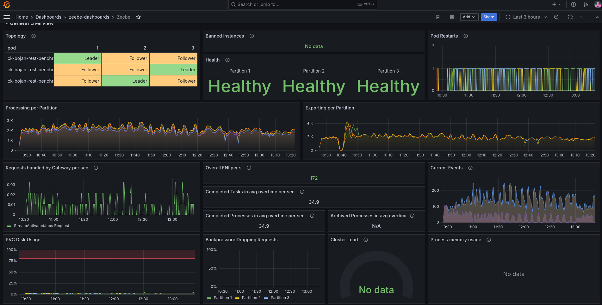

# Chaos Day Summary

In today's Chaos day we wanted to experiment with the new REST API (v2) as a replacement for our previous used gRPC API.

Per default, our load tests make use of the gRPC, but as we want to make REST API the default and release this fully with 8.8, we want to make sure to test this accordingly in regard to reliability.

**TL;DR;** We observed severe performance regression when using the REST API, even when job streaming is in use by the job workers (over gRPC). Our client seems to have a higher memory consumption, which caused some instabilities in our tests as well. With the new API, we lack certain observability, which makes it harder to dive into certain details. We should investigate this further and find potential bottlenecks and improvements. 


<!--truncate-->

## Chaos Experiment (Pt. 1)

To experiment with the REST API, we have to adjust our client applications to make use of the REST API. This is done by the following PR [#34527](https://github.com/camunda/camunda/pull/34527). We can take our normal benchmark/load tests where we run 150 PI/s, and enable the REST API usage. To make this possible, the charts have been adjusted by this PR [#269](https://github.com/camunda/zeebe-benchmark-helm/pull/269).

As a base to compare we can use our weekly benchmarks. We use gRPC here as the default in the client applications (starter + worker).
In our weekly benchmarks, we can see that we are able to create and complete 150 process instances per second.


The performance is stable, and we have low backpressure. As the process instances are quite simple (with one service task), the execution time is rather low with 0.2 seconds on average.


### Expected

When using the REST API, we expect some more overhead (maybe ~10%), like serializing and sending data over the wire (as gRPC is optimized for it). In general, we expect a stable performing system.

### Actual

Observing the first experiment, we saw a degradation of performance **by more than 70%**. Additionally, we seem to have no metrics for the REST API requests. Backpressure seems to be zero, while we're not performing as expected.



The process instance completion latency has been increased to above than one minute.


We can observe with our metrics that job push is still in use, and the job workers get to work on the available jobs.


The issue we are seeing is related to crash looping workers (which we can also see in the panels above about Pod restarts).

```shell
$ kgpo
NAME                                                              READY   STATUS             RESTARTS         AGE
benchmark-worker-5765dbfb55-2gckc                                 1/1     Running            34 (5m40s ago)   4h1m
benchmark-worker-5765dbfb55-6mckn                                 1/1     Running            26 (69m ago)     3h46m
benchmark-worker-5765dbfb55-qtrmm                                 0/1     CrashLoopBackOff   33 (4m20s ago)   4h1m
ck-bojan-rest-benchmark-prometheus-elasticsearch-exporter-v7nqk   1/1     Running            0                3h46m
ck-bojan-rest-benchmark-zeebe-0                                   1/1     Running            0                4h1m
ck-bojan-rest-benchmark-zeebe-1                                   1/1     Running            0                107m
ck-bojan-rest-benchmark-zeebe-2                                   1/1     Running            0                4h1m
elastic-0                                                         1/1     Running            0                3h45m
elastic-1                                                         1/1     Running            0                4h1m
elastic-2                                                         1/1     Running            0                4h1m
leader-balancer-29188095-9gdhd                                    0/1     Completed          0                8m39s
starter-677bc5cb4-pr7xq                                           1/1     Running            0                3h46m

```

Investigating the respective pods, we can see that they are failing because of OOM errors.

```shell
    Last State:     Terminated
      Reason:       OOMKilled
      Exit Code:    137
      Started:      Mon, 30 Jun 2025 14:15:14 +0200
      Finished:     Mon, 30 Jun 2025 14:18:00 +0200
    Ready:          True
    Restart Count:  34
    Limits:
      cpu:     500m
      memory:  256Mi
    Requests:
      cpu:     500m
      memory:  256Mi
```

### Result

Our first experiment failed to validate our expectation of:

> When using the REST API we expect some more overhead (maybe ~10%), like serializing and sending data over the wire (as gRPC is optimized for it). In general, we expect a stable performing system.

  * :x: We were not able to prove that our load tests run with simply enabling the REST API with minimal impact
  * :x: The performance of the system was not stable.
  * :x: The workers, can't work with the same amount of memory they used before for gRPC.

## Chaos Experiment (Pt. 2)

To validate whether our experiment would work with the REST API and the workers having more memory, we increase the resource usage of the workers.

```shell
    State:          Running
      Started:      Mon, 30 Jun 2025 14:25:40 +0200
    Ready:          True
    Restart Count:  0
    Limits:
      cpu:     500m
      memory:  1Gi
    Requests:
      cpu:     500m
      memory:  1Gi
```

## Expected

When the client applications have enough resources the expected performance of the REST API usage should be minimally lower than with the gRPC API. The system should perform stable.


## Actual

As soon as we configured the workers, and gave them more memory, they stopped to crash loop. Still we are not able to reache the same performance (not even close) as with our normal base (weekly benchmark).


The performance (after 1430) looks more stale (less fluctuating), but still not well.


We seem to push more jobs out, on a constant rate. Looking at the logstream metrics, we can see that we rejecting a lot of commands, especially COMPLETEs and FAILs.


We see interesting warning logs by the workers:

```shell
12:40:07.532 [pool-4-thread-2] WARN  io.camunda.client.job.worker - Worker benchmark failed to handle job with key 4503599643648545 of type benchmark-task, sending fail command to broker
java.lang.IllegalStateException: Queue full
	at java.base/java.util.AbstractQueue.add(AbstractQueue.java:98) ~[?:?]
	at java.base/java.util.concurrent.ArrayBlockingQueue.add(ArrayBlockingQueue.java:329) ~[?:?]
	at io.camunda.zeebe.Worker.lambda$handleJob$1(Worker.java:122) ~[classes/:?]
	at io.camunda.client.impl.worker.JobRunnableFactoryImpl.executeJob(JobRunnableFactoryImpl.java:45) ~[camunda-client-java-8.8.0-SNAPSHOT.jar:8.8.0-SNAPSHOT]
	at io.camunda.client.impl.worker.JobRunnableFactoryImpl.lambda$create$0(JobRunnableFactoryImpl.java:40) ~[camunda-client-java-8.8.0-SNAPSHOT.jar:8.8.0-SNAPSHOT]
	at io.camunda.client.impl.worker.BlockingExecutor.lambda$execute$0(BlockingExecutor.java:50) ~[camunda-client-java-8.8.0-SNAPSHOT.jar:8.8.0-SNAPSHOT]
	at java.base/java.util.concurrent.Executors$RunnableAdapter.call(Executors.java:572) ~[?:?]
	at java.base/java.util.concurrent.FutureTask.run(FutureTask.java:317) ~[?:?]
	at java.base/java.util.concurrent.ScheduledThreadPoolExecutor$ScheduledFutureTask.run(ScheduledThreadPoolExecutor.java:304) ~[?:?]
	at java.base/java.util.concurrent.ThreadPoolExecutor.runWorker(ThreadPoolExecutor.java:1144) ~[?:?]
	at java.base/java.util.concurrent.ThreadPoolExecutor$Worker.run(ThreadPoolExecutor.java:642) ~[?:?]
	at java.base/java.lang.Thread.run(Thread.java:1583) [?:?]
```

I think it is not fully clear what the user should do with this. AFAIK, based on the implementation, it is also not how we expected it to behave, as we wanted to block in this case.


We can see that even when we recover the workers, with more memory, we are not able to come back to a performing system. This is likely because we aggregated already quite some data, and are running in some weird timeout and completion/fail loops. This needs further investigation (follow-up).

## Chaos Experiment (Pt. 3)

With our third experiment, we want to validate how our load tests perform with some clean state, and workers set up correctly.

### Expected

See above.

### Actual

With no previous data and stable workers, we seem to be able to reach higher throughput again.


The latency looks fairly similar to our base (weekly) benchmarks. Here again, 99% of PIs need less than 0.25 seconds to complete.


After a while, the load tests seem to behave similarly to the previous ones, reporting several timeouts and completion rejections.


This is degrading the performance completely. 


Our workers seem to report similar issues as before, regarding having a full queue:

```shell
13:25:14.684 [pool-4-thread-3] WARN  io.camunda.client.job.worker - Worker benchmark failed to handle job with key 4503599628992806 of type benchmark-task, sending fail command to broker
java.lang.IllegalStateException: Queue full
	at java.base/java.util.AbstractQueue.add(AbstractQueue.java:98) ~[?:?]
	at java.base/java.util.concurrent.ArrayBlockingQueue.add(ArrayBlockingQueue.java:329) ~[?:?]
	at io.camunda.zeebe.Worker.lambda$handleJob$1(Worker.java:122) ~[classes/:?]
	at io.camunda.client.impl.worker.JobRunnableFactoryImpl.executeJob(JobRunnableFactoryImpl.java:45) ~[camunda-client-java-8.8.0-SNAPSHOT.jar:8.8.0-SNAPSHOT]
	at io.camunda.client.impl.worker.JobRunnableFactoryImpl.lambda$create$0(JobRunnableFactoryImpl.java:40) ~[camunda-client-java-8.8.0-SNAPSHOT.jar:8.8.0-SNAPSHOT]
	at io.camunda.client.impl.worker.BlockingExecutor.lambda$execute$0(BlockingExecutor.java:50) ~[camunda-client-java-8.8.0-SNAPSHOT.jar:8.8.0-SNAPSHOT]
	at java.base/java.util.concurrent.Executors$RunnableAdapter.call(Executors.java:572) ~[?:?]
	at java.base/java.util.concurrent.FutureTask.run(FutureTask.java:317) ~[?:?]
	at java.base/java.util.concurrent.ScheduledThreadPoolExecutor$ScheduledFutureTask.run(ScheduledThreadPoolExecutor.java:304) ~[?:?]
	at java.base/java.util.concurrent.ThreadPoolExecutor.runWorker(ThreadPoolExecutor.java:1144) ~[?:?
```

:x: Right now it seems that the usage of the REST API can impact the general performance of the system (even with the usage of the Job streaming in the workers). As of now it is not clear why, which we have to further investigate and clarify.

## Found Bugs

Following issues and follow ups have been noted down

  * REST API usage affects highly general performance of the system
  * REST API observability is missing
  * Clients using the REST API have higher memory usage
  * Worker seem to fail with unexpected error/warning messages when receiving jobs.

