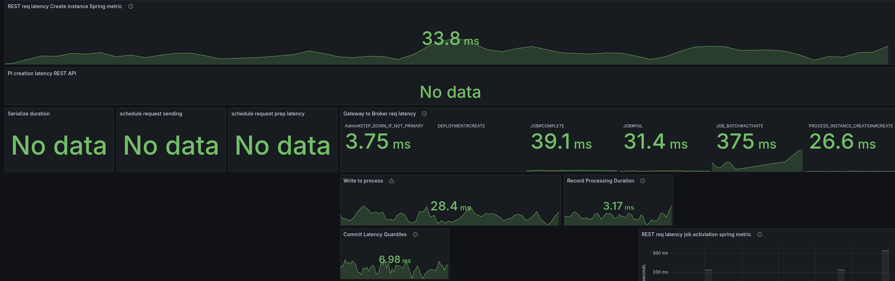

# Day 1: Investigation REST API Performance

This blog post aims to summarize the investigation of the REST API performance, and give some hints and collections of what to improve.

## REST API Metrics

One remark from the last experiments was that we do not have good insights for the REST API. Actually, we have the necessary metrics already exposed, but not yet available in our Dashboard.

This is currently prepared with [#33907](https://github.com/camunda/camunda/pull/33907). Based on this, I was able to further investigate the REST API performance.


What we can see is that our requests take on average more than 50ms to complete. This is causing our throughput to go down, we are not able to create 150 PI/s even.

Looking at a different Benchmark using gRPC, we can see that requests take 5-10ms to complete, and have a stable throughput 


Due to the slower workers (on completion), we can see error reports of the workers not being able to accept further job pushes. This has been mentioned in the previous blog post as well.  This, in consequence, means the worker sends FAIL commands for such jobs, to give them back. It has a cascading effect, as jobs are sent back and forth and impacting the general process instance execution latency (which grows up to 60s compared to 0.2 s).


## Investigating Worker errors

In our previous experiments, we have seen the following exceptions

```
13:25:14.684 [pool-4-thread-3] WARN  io.camunda.client.job.worker - Worker benchmark failed to handle job with key 4503599628992806 of type benchmark-task, sending fail command to broker
java.lang.IllegalStateException: Queue full
	at java.base/java.util.AbstractQueue.add(AbstractQueue.java:98) ~[?:?]
	at java.base/java.util.concurrent.ArrayBlockingQueue.add(ArrayBlockingQueue.java:329) ~[?:?]
	at io.camunda.zeebe.Worker.lambda$handleJob$1(Worker.java:122) ~[classes/:?]
	at io.camunda.client.impl.worker.JobRunnableFactoryImpl.executeJob(JobRunnableFactoryImpl.java:45) ~[camunda-client-java-8.8.0-SNAPSHOT.jar:8.8.0-SNAPSHOT]
	at io.camunda.client.impl.worker.JobRunnableFactoryImpl.lambda$create$0(JobRunnableFactoryImpl.java:40) ~[camunda-client-java-8.8.0-SNAPSHOT.jar:8.8.0-SNAPSHOT]
	at io.camunda.client.impl.worker.BlockingExecutor.lambda$execute$0(BlockingExecutor.java:50) ~[camunda-client-java-8.8.0-SNAPSHOT.jar:8.8.0-SNAPSHOT]
	at java.base/java.util.concurrent.Executors$RunnableAdapter.call(Executors.java:572) ~[?:?]
	at java.base/java.util.concurrent.FutureTask.run(FutureTask.java:317) ~[?:?]
	at java.base/java.util.concurrent.ScheduledThreadPoolExecutor$ScheduledFutureTask.run(ScheduledThreadPoolExecutor.java:304) ~[?:?]
	at java.base/java.util.concurrent.ThreadPoolExecutor.runWorker(ThreadPoolExecutor.java:1144) ~[?:?
```

This is actually coming from the Worker (benchmark) application, as it is collecting all [the request futures in a blocking queue](https://github.com/camunda/camunda/blob/main/zeebe/benchmarks/project/src/main/java/io/camunda/zeebe/Worker.java#L54).

As the performance is lower of handling requests, we collect more futures in the worker, causing to fill the queue. This in the end causes also to fail more jobs - causing even more work.

This allows explains why our workers have a higher memory consumption - we had to increase the worker memory to have a stable worker.

## Profiling the System

With the previous results, we were encouraged to do some profiling. For the start we used [JFR](https://docs.oracle.com/javacomponents/jmc-5-4/jfr-runtime-guide/about.htm#JFRUH170) for some basic profiling.

You can do this by:

```shell
  kubectl exec -it "$1" -- jcmd 1 JFR.start duration=100s filename=/usr/local/camunda/data/flight-$(date +%d%m%y-%H%M).jfr
```

If the flight recording is done, you can copy the recording (via `kubectl cp`) and open it with Intellij (JMC didn't work for me) 


We see that the Spring filter chaining is dominating the profile, which is not unexpected as every request has gone through this chain. As this is a CPU based sampling profile, it is likely to be part of the profile. Still, it was something interesting to note and investigate.

### Path pattern matching

Some research showed that it might be interesting to look into other path pattern matchers, as we use the (legacy) [ant path matcher](https://github.com/camunda/camunda/blob/main/dist/src/main/resources/application.properties#L17) with [regex](https://github.com/camunda/camunda/blob/main/authentication/src/main/java/io/camunda/authentication/config/WebSecurityConfig.java#L86).  

**Resources:**

 * PathPattern - https://spring.io/blog/2020/06/30/url-matching-with-pathpattern-in-spring-mvc#pathpattern
 * [Results of using PathPattern and related discussion on GH](https://github.com/spring-projects/spring-framework/issues/31098#issuecomment-1891737375)

### Gateway - Broker request latency

As we have such a high request-response latency, we have to find out where the time is spent. Ideally, we would have some sort of tracing (which we didn't have yet), or we would look at metrics that cover sub-parts of the system and the request-response cycle.

The REST API request-response latency metric, we can take it as the complete round trip, accepting the request on the gateway edge, converting it to a Broker request, sending it to the Broker, the Broker processes, sends the response back, etc.

Luckily, we have a metric that is covering the part of sending the Broker request (from the other side of the Gateway) to the Broker and wait for the response. See related [code here](https://github.com/camunda/camunda/blob/main/zeebe/broker-client/src/main/java/io/camunda/zeebe/broker/client/impl/BrokerRequestManager.java#L153).

The difference shows us that there is not a small overhead, meaning that actually the Gateway to Broker request-response is slower with REST as well, which is unexpected.

This can either be because different data is sent, or a different API is used, or some other execution mechanics, etc.

Using the same cluster and enabling the REST API later, we can see the immediate effect on performance.


#### Request handling execution logic

A difference we have spotted with REST API and gRPC is the usage of the BrokerClient.

While we use on the gRPC side the [BrokerClient with retries](https://github.com/camunda/camunda/blob/main/zeebe/gateway-grpc/src/main/java/io/camunda/zeebe/gateway/EndpointManager.java#L457) and direct response handling, on the REST API we use no retries and [handle the response async with the ForkJoinPool](https://github.com/camunda/camunda/blob/main/service/src/main/java/io/camunda/service/ApiServices.java#L55).

As our benchmark clusters have two CPUs, [meaning 1 Thread for the common ForkJoin thread pool](https://docs.oracle.com/javase/8/docs/api/java/util/concurrent/ForkJoinPool.html) we expected some contention on the thread.

For testing purposes, we increased the thread count by: `-Djava.util.concurrent.ForkJoinPool.common.parallelism=8`

In a profile we can see that more threads are used, but it doesn't change anything in the performance.


The assumption was that we might not be able to handle the response in time with one thread, and this causes some contention also on the Gateway-Broker request-response cycle, but this is not the case.

We seem to spend time somewhere else or have a general resource contention issue. What we can see is that we have to work with more CPU throttling, then without REST API usage.


Increasing the CPU resolves the general performance problem, hinting even more that we might have some issues with threads competing with resources, etc.

In the following screenshot, you see the test with 6 CPUs per Camunda application.


Compared to the previous run with 2 CPUs per Camunda application, where it had to fight with a lot of CPU throttling. The request-response latency was five times higher on average.


We have to further investigate this based on this knowledge.

# Day 2: Profiling and Experimenting

Yesterday I was taking profiles with 100s, to reduce the noise. Still, we can see that the filter chain is taking ~40% of the complete profile.


When opening the JFR recording with JMC, we get some hints, related to context switches, CPU throttling (which we already know) and the inverted parallelism of GC (also mentioning high IO).


We have already seen in our metrics, for example, that we fight with high CPU throttling


To better analyze (and circumvent that we have no tracing), I added some more metrics to understand where time is spent. Furthermore, I created a temporary dashboard to break down where time is spent.

When we look at the base with gRPC (taking our weekly benchmarks), we can see all latencies are low, and mostly under 5 ms.


As soon as we enable the REST API, we can see the latencies go up. The most significant increase we see is in the job activations.



Fascinating is that the write to process latency, the time from acceptance by the CommandAPI until the processor processes this command, also increases.

## Virtual threads

To remove some thoughts about potential IO and CPU contention, I experimented with virtual threads, which we can [easily enable for Spring](https://www.baeldung.com/spring-6-virtual-threads).

I set the following system property on the statefulset.

```shell
-Dspring.threads.virtual.enabled=true
```

Taking a new profile, we can see that all the http threads are gone, but still the filtering is prominent.


Checking our metrics break-down again we see there is no benefit here.


## Direct handling

Investigating the code basis, we saw several times `#handleAsync` without using an extra executor, causing to use of the ForkJoinPool (as mentioned the other day). One idea was to [directly handle the future completions](https://github.com/camunda/camunda/commit/265d7164f5384be8c443c30b20e432582df09c24), meaning the response handling, etc.

We didn't observe any benefits with this.


In the JFR recording, we can see that less Threads are used, but the Spring filter chain is also super prominent.


## Spring PathPattern parser for MVC

At the end of the day I finally came to try the `PathPattern` parser. As mentioned the other day, it is recommended to use it over the legacy `AntPathMatcher`. 

The migration was [rather simple](https://github.com/camunda/camunda/commit/357522d8355a624a1c07e1fb889561254b0305ba), we can replace the `spring.mvc.pathmatch.matching-strategy=ant_path_matcher` with
`spring.mvc.pathmatch.matching-strategy=path_pattern_parser`, we only had to fix some occurrences of regex combinations with `**`, as it is only allowed to have `**` at the end (no regex after).

See related branch [ck-pattern-path-parse](https://github.com/camunda/camunda/commits/ck-pattern-path-parse/).


We were able to reduce the latencies by half, which also allowed us to bring back our throughput.


I did a cross-check with the current SNAPSHOT, and weirdly the SNAPSHOT now behaved the same. I will run this for a while to see the results, as it might fail after certain period of time. As this might be also related to where the pods are scheduled (noisy neighbours etc.)


## Combination of direct handle and PathPattern

On top of the above, I [combined the direct handling and PathPattern usage](https://github.com/camunda/camunda/commits/ck-direct-handle/), and this gave us the best results.

The latencies are only two times higher than gRPC vs before 5 times (and more).


The throttling of the CPU was reduced by half as well.


This gives a great stable throughput again.


