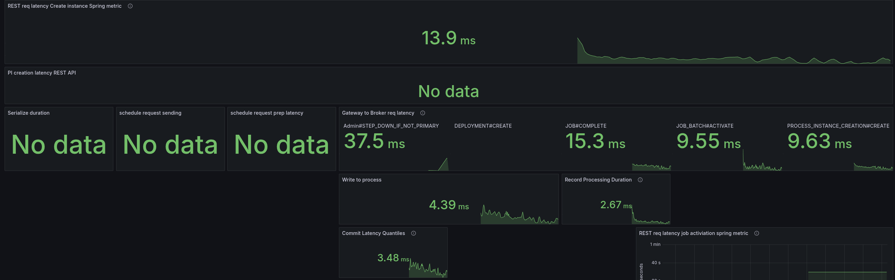
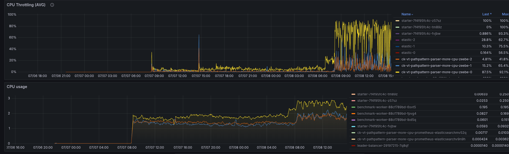
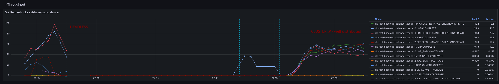
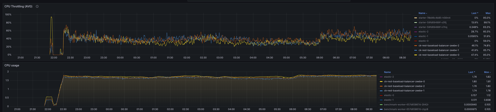

## Investigating REST API performance

This post collates the experiments, findings, and lessons learned during the REST API performance investigation.

There wasn't one explicit root cause identified. As it is often the case with such performance issues, it is the combination of several things.

**Quint essence:** REST API is more CPU intense/heavy than gRPC. You can read more about this in the [conclusion part](#conclusion). We have discovered ~10 issues we have to follow up with, where at least 2-3 might have a significant impact in the performance. Details can be found in the [Discovered issues](#discovered-issues) section

<!--truncate-->
 
_Short summary of what we have done and validated_
  
 * Investigations
    * Investigated existing REST api metrics
        * Breakdown metrics to have a better overview of where time is spent (created a tmp dashboard)
    * Investigated worker failing with OOM
    * Investigated deployments and anti-affinities
    * Investigated command distribution
    * Investigated JFR recordings and profiles
      * Take JFR recordings and profile the system
      * Make use of the async profiler
 * Experiments
    * Increase CPU resources to understand whether it is resource contention - it is.
    * Improve Spring request filtering and execution
      * Use virtual threads for Spring
      * Use PathPattern instead of legacy AntPathPattern
      * Use direct response handling instead of asynchronous
      * Combine some of them
    * Experiment with different setups to better distribute the load


<!--truncate-->

## Day 1: Investigation REST API Performance

This blog post aims to summarize the investigation of the REST API performance and give some hints and suggestions on what to improve.

### REST API Metrics

One remark from the last experiments was that we do not have good insights for the REST API. Actually, we have the necessary metrics already exposed, but not yet available in our Dashboard.

This is currently prepared with [#33907](https://github.com/camunda/camunda/pull/33907). Based on this, I was able to further investigate the REST API performance.


What we can see is that our requests take on average more than 50ms to complete. This is causing our throughput to go down, we are not able to create 150 PI/s even.

Looking at a different Benchmark using gRPC, we can see that requests take 5-10ms to complete, and have a stable throughput 


Due to the slower workers (on completion), we can see error reports of the workers not being able to accept further job pushes. This has been mentioned in the previous blog post as well.  This, in consequence, means the worker sends FAIL commands for such jobs, to give them back. It has a cascading effect, as jobs are sent back and forth, impacting the general process instance execution latency (which grows up to 60s compared to 0.2s).


### Investigating Worker Errors

In our previous experiments, we have seen the following exceptions

```
13:25:14.684 [pool-4-thread-3] WARN  io.camunda.client.job.worker - Worker benchmark failed to handle job with key 4503599628992806 of type benchmark-task, sending fail command to broker
java.lang.IllegalStateException: Queue full
	at java.base/java.util.AbstractQueue.add(AbstractQueue.java:98) ~[?:?]
	at java.base/java.util.concurrent.ArrayBlockingQueue.add(ArrayBlockingQueue.java:329) ~[?:?]
	at io.camunda.zeebe.Worker.lambda$handleJob$1(Worker.java:122) ~[classes/:?]
	at io.camunda.client.impl.worker.JobRunnableFactoryImpl.executeJob(JobRunnableFactoryImpl.java:45) ~[camunda-client-java-8.8.0-SNAPSHOT.jar:8.8.0-SNAPSHOT]
	at io.camunda.client.impl.worker.JobRunnableFactoryImpl.lambda$create$0(JobRunnableFactoryImpl.java:40) ~[camunda-client-java-8.8.0-SNAPSHOT.jar:8.8.0-SNAPSHOT]
	at io.camunda.client.impl.worker.BlockingExecutor.lambda$execute$0(BlockingExecutor.java:50) ~[camunda-client-java-8.8.0-SNAPSHOT.jar:8.8.0-SNAPSHOT]
	at java.base/java.util.concurrent.Executors$RunnableAdapter.call(Executors.java:572) ~[?:?]
	at java.base/java.util.concurrent.FutureTask.run(FutureTask.java:317) ~[?:?]
	at java.base/java.util.concurrent.ScheduledThreadPoolExecutor$ScheduledFutureTask.run(ScheduledThreadPoolExecutor.java:304) ~[?:?]
	at java.base/java.util.concurrent.ThreadPoolExecutor.runWorker(ThreadPoolExecutor.java:1144) ~[?:?
```

This is actually coming from the Worker (benchmark) application, as it is collecting all [the request futures in a blocking queue](https://github.com/camunda/camunda/blob/main/zeebe/benchmarks/project/src/main/java/io/camunda/zeebe/Worker.java#L54).

As the performance is lower of handling requests, we collect more futures in the worker, causing to fill the queue. This in the end causes also to fail more jobs - causing even more work.

This allows explains why our workers have a higher memory consumption - we had to increase the worker memory to have a stable worker.

### Profiling the System

With the previous results, we were encouraged to do some profiling. For the start we used [JFR](https://docs.oracle.com/javacomponents/jmc-5-4/jfr-runtime-guide/about.htm#JFRUH170) for some basic profiling.

You can do this by:

```shell
  kubectl exec -it "$1" -- jcmd 1 JFR.start duration=100s filename=/usr/local/camunda/data/flight-$(date +%d%m%y-%H%M).jfr
```

If the flight recording is done, you can copy the recording (via `kubectl cp`) and open it with Intellij (JMC didn't work for me) 


We see that the Spring filter chaining is dominating the profile, which is not unexpected as every request has gone through this chain. As this is a CPU based sampling profile, it is likely to be part of the profile. Still, it was something interesting to note and investigate.

#### Path pattern matching

Some research showed that it might be interesting to look into other path pattern matchers, as we use the (legacy) [ant path matcher](https://github.com/camunda/camunda/blob/main/dist/src/main/resources/application.properties#L17) with [regex](https://github.com/camunda/camunda/blob/main/authentication/src/main/java/io/camunda/authentication/config/WebSecurityConfig.java#L86).  

**Resources:**

 * PathPattern - https://spring.io/blog/2020/06/30/url-matching-with-pathpattern-in-spring-mvc#pathpattern
 * [Results of using PathPattern and related discussion on GH](https://github.com/spring-projects/spring-framework/issues/31098#issuecomment-1891737375)

#### Gateway - Broker request latency

As we have such a high request-response latency, we have to find out where the time is spent. Ideally, we would have some sort of tracing (which we didn't have yet), or we would look at metrics that cover sub-parts of the system and the request-response cycle.

The REST API request-response latency metric, we can take it as the complete round trip, accepting the request on the gateway edge, converting it to a Broker request, sending it to the Broker, the Broker processes, sends the response back, etc.

Luckily, we have a metric that is covering the part of sending the Broker request (from the other side of the Gateway) to the Broker and wait for the response. See related [code here](https://github.com/camunda/camunda/blob/main/zeebe/broker-client/src/main/java/io/camunda/zeebe/broker/client/impl/BrokerRequestManager.java#L153).

The difference shows us that there is not a small overhead, meaning that actually the Gateway to Broker request-response is slower with REST as well, which is unexpected.

This can either be because different data is sent, or a different API is used, or some other execution mechanics, etc.

Using the same cluster and enabling the REST API later, we can see the immediate effect on performance.


##### Request handling execution logic

A difference we have spotted with REST API and gRPC is the usage of the BrokerClient.

While we use on the gRPC side the [BrokerClient with retries](https://github.com/camunda/camunda/blob/main/zeebe/gateway-grpc/src/main/java/io/camunda/zeebe/gateway/EndpointManager.java#L457) and direct response handling, on the REST API we use no retries and [handle the response async with the ForkJoinPool](https://github.com/camunda/camunda/blob/main/service/src/main/java/io/camunda/service/ApiServices.java#L55).

As our benchmark clusters have two CPUs, [meaning 1 Thread for the common ForkJoin thread pool](https://docs.oracle.com/javase/8/docs/api/java/util/concurrent/ForkJoinPool.html) we expected some contention on the thread.

For testing purposes, we increased the thread count by: `-Djava.util.concurrent.ForkJoinPool.common.parallelism=8`

In a profile we can see that more threads are used, but it doesn't change anything in the performance.


The assumption was that we might not be able to handle the response in time with one thread, and this causes some contention also on the Gateway-Broker request-response cycle, but this is not the case.

We seem to spend time somewhere else or have a general resource contention issue. What we can see is that we have to work with more CPU throttling, then without REST API usage.


Increasing the CPU resolves the general performance problem, hinting even more that we might have some issues with threads competing with resources, etc.

In the following screenshot, you see the test with 6 CPUs per Camunda application.


Compared to the previous run with 2 CPUs per Camunda application, where it had to fight with a lot of CPU throttling. The request-response latency was five times higher on average.


We have to further investigate this based on this knowledge.

## Day 2: Profiling and Experimenting

Yesterday I was taking profiles with 100s, to reduce the noise. Still, we can see that the filter chain is taking ~40% of the complete profile.


When opening the JFR recording with JMC, we get some hints, related to context switches, CPU throttling (which we already know) and the inverted parallelism of GC (also mentioning high IO).


We have already seen in our metrics, for example, that we fight with high CPU throttling


To better analyze (and circumvent that we have no tracing), I added some more metrics to understand where time is spent. Furthermore, I created a temporary dashboard to break down where time is spent.

When we look at the base with gRPC (taking our weekly benchmarks), we can see all latencies are low, and mostly under 5 ms.


As soon as we enable the REST API, we can see the latencies go up. The most significant increase we see is in the job activations.


Fascinating is that the write to process latency, the time from acceptance by the CommandAPI until the processor processes this command, also increases.

### Virtual threads

To remove some thoughts about potential IO and CPU contention, I experimented with virtual threads, which we can [easily enable for Spring](https://www.baeldung.com/spring-6-virtual-threads).

I set the following system property on the statefulset.

```shell
-Dspring.threads.virtual.enabled=true
```

Taking a new profile, we can see that all the http threads are gone, but still the filtering is prominent.


Checking our metrics break-down again we see there is no benefit here.


### Direct handling

Investigating the code basis, we saw several times `#handleAsync` without using an extra executor, causing to use of the ForkJoinPool (as mentioned the other day). One idea was to [directly handle the future completions](https://github.com/camunda/camunda/commit/265d7164f5384be8c443c30b20e432582df09c24), meaning the response handling, etc.

We didn't observe any benefits with this.


In the JFR recording, we can see that less Threads are used, but the Spring filter chain is also super prominent.


### Spring PathPattern parser for MVC

At the end of the day I finally came to try the `PathPattern` parser. As mentioned the other day, it is recommended to use it over the legacy `AntPathMatcher`. 

The migration was [rather simple](https://github.com/camunda/camunda/commit/357522d8355a624a1c07e1fb889561254b0305ba), we can replace the `spring.mvc.pathmatch.matching-strategy=ant_path_matcher` with
`spring.mvc.pathmatch.matching-strategy=path_pattern_parser`, we only had to fix some occurrences of regex combinations with `**`, as it is only allowed to have `**` at the end (no regex after).

See related branch [ck-pattern-path-parse](https://github.com/camunda/camunda/commits/ck-pattern-path-parse/).


We were able to reduce the latencies by half, which also allowed us to bring back our throughput.


I did a cross-check with the current SNAPSHOT, and weirdly the SNAPSHOT now behaved the same. I will run this for a while to see the results, as it might fail after a certain period of time. As this might also be related to where the pods are scheduled (noisy neighbours etc.)




### Combination of direct handle and PathPattern

On top of the above, I [combined the direct handling and PathPattern usage](https://github.com/camunda/camunda/commits/ck-direct-handle/), and this gave us the best results.

The latencies are only two times higher than gRPC vs before 5 times (and more).


The throttling of the CPU was reduced by half as well.


This gives a great stable throughput again.


## Day 3: Observing load tests and further experimenting

Yesterday, I have started several load tests for things I have tried out in code (like PathPattern or direct response handling), but also from different commits of the main branch (the current SNASPHOT, some commits that touch the rest gateway, and from begin of the week).

From what we observed is that some load tests can run stable for quite a while, until they break down. It is often related to restarts/rescheduling, or is already in general suboptimal resource distribution. At some point, the CPU throttling increases, and then the performance breaks down.


Interesting was that on all JFR recordings (with and without PathPattern), I still saw the Spring filter chain take a big chunk of the profile. This is because the filter chain itself doesn't change with using a different pattern parser.


Based on the profile, we do not see much of a difference.

Today, I will validate the following:

 * Is anti-affinity still enabled with our platform charts
 * Combination of virtual threads (to reduce the thread count and blocking behavior), with PathPattern (as this was the most stable test)
 * Maybe increasing the CPU limits again, to remove the K8 CPU throttling to better understand the system performance (until which the CPU consumption grows) and profile again
 * Investigate further - likely try a different profiler like asyncProfiler

### Anti-affinity

Simply as a sanity check, I wanted to validate whether we still use our [anti-affinity configuration](https://kubernetes.io/docs/concepts/scheduling-eviction/assign-pod-node/#affinity-and-anti-affinity) in our charts. This is to make sure that brokers are not scheduled on the same node. Unfortunately, this only works on the namespace level.  


Indeed, we still have the configuration set:

```yaml
    spec:
      affinity:
        podAntiAffinity:
          requiredDuringSchedulingIgnoredDuringExecution:
          - labelSelector:
              matchExpressions:
              - key: app.kubernetes.io/component
                operator: In
                values:
                - core
            topologyKey: kubernetes.io/hostname
```

While this helps in the same namespace, this doesn't prevent to have brokers from different namespaces from being scheduled on the same node (AFAIK). Potential for a noisy neighbor. But this is also the reason why we use smaller nodes, and try to assign most of the resources to the corresponding broker pods (which makes them effectively alone on the node).

### REST Base more CPU

To validate once more how the base (simply with REST API enabled) performs with more CPU, we have set up a test with 6 CPUs (request + limit). This is an increase of factor three (from 2 CPU to 6 CPU).

In general, the test was stable.


As soon as we increased the CPU the throttling went down.


The consumption went up to 3 CPU, comparing to our gRPC benchmarks, this is an increase of factor two!


While observing the test, we noticed some weird behavior of the workers. There are multiple regular job activation requests sent (while we still have Job Push enabled and in use). 


This is also causing to have much higher job COMPLETE command rate, where most of them are actually rejected. We see ~500 job completion rejections per second!


Why we have this behavior is not yet fully clear. The load test is stabilizing at a later point and running straight for several days.


At some-point it went into struggle again, as it run out of disk space. The exporter had a too big backlog, and was not able to catch up.


This might be related to the huge number of commands and rejections that need to be skipped.

### Combination of VT and PathPattern

As another experiment, we run a load test with enabling virtual threads and PathPattern parser on Spring.

To summarize, it doesn't help to reduce the CPU consumption to a level that the system can run stable.
At the beginning, the worker was able to complete at least ~30 jobs per second, but later it fully stopped. 


In our JFR recording, we see a similar pattern, where the Spring filtering is still taking most of the samples.


Enabling the virtual threads on spring, at least seem to remove the HTTP threads we normally had in our profiles.

The CPU throttling is rather high, causing the performance problems we see here.


Zeebe-2 is often between 50-80% CPU throttling, as it is consuming 1.8 CPU (limit is 2).


The workers stopped working at some point completely. Investigating this, we can see that it fails with some OOM as well.

```shell
Jul 05, 2025 07:16:48.330 [pool-4-thread-8] WARN  io.camunda.client.job.worker - Worker benchmark failed to handle job with key 2251799882041322 of type benchmark-task, sending fail command to broker
java.lang.IllegalStateException: Queue full
Exception in thread "prometheus-http-1-6" java.lang.OutOfMemoryError: Java heap space


Jul 05, 2025 7:18:48 AM io.prometheus.metrics.exporter.httpserver.HttpExchangeAdapter sendErrorResponseWithStackTrace
SEVERE: The Prometheus metrics HTTPServer caught an Exception while trying to send the metrics response.
java.io.IOException: Broken pipe
	at java.base/sun.nio.ch.SocketDispatcher.write0(Native Method)
	at java.base/sun.nio.ch.SocketDispatcher.write(SocketDispatcher.java:62)
	at java.base/sun.nio.ch.IOUtil.writeFromNativeBuffer(IOUtil.java:137)
	at java.base/sun.nio.ch.IOUtil.write(IOUtil.java:102)
	at java.base/sun.nio.ch.IOUtil.write(IOUtil.java:58)
	at java.base/sun.nio.ch.SocketChannelImpl.write(SocketChannelImpl.java:542)
	at jdk.httpserver/sun.net.httpserver.Request$WriteStream.write(Request.java:421)
	at jdk.httpserver/sun.net.httpserver.ChunkedOutputStream.writeChunk(ChunkedOutputStream.java:131)
	at jdk.httpserver/sun.net.httpserver.ChunkedOutputStream.flush(ChunkedOutputStream.java:165)
	at jdk.httpserver/sun.net.httpserver.ChunkedOutputStream.close(ChunkedOutputStream.java:140)
	at jdk.httpserver/sun.net.httpserver.PlaceholderOutputStream.close(ExchangeImpl.java:477)
	at java.base/java.util.zip.DeflaterOutputStream.close(DeflaterOutputStream.java:272)
	at io.prometheus.metrics.exporter.common.PrometheusScrapeHandler.handleRequest(PrometheusScrapeHandler.java:74)
	at io.prometheus.metrics.exporter.httpserver.MetricsHandler.handle(MetricsHandler.java:33)
	at jdk.httpserver/com.sun.net.httpserver.Filter$Chain.doFilter(Filter.java:98)
	at jdk.httpserver/sun.net.httpserver.AuthFilter.doFilter(AuthFilter.java:82)
	at jdk.httpserver/com.sun.net.httpserver.Filter$Chain.doFilter(Filter.java:101)
	at jdk.httpserver/sun.net.httpserver.ServerImpl$Exchange$LinkHandler.handle(ServerImpl.java:871)
	at jdk.httpserver/com.sun.net.httpserver.Filter$Chain.doFilter(Filter.java:98)
	at jdk.httpserver/sun.net.httpserver.ServerImpl$Exchange.run(ServerImpl.java:847)
	at java.base/java.util.concurrent.ThreadPoolExecutor.runWorker(ThreadPoolExecutor.java:1144)
	at java.base/java.util.concurrent.ThreadPoolExecutor$Worker.run(ThreadPoolExecutor.java:642)
	at java.base/java.lang.Thread.run(Thread.java:1583)

```

### Async profiler

To enrich our insights and inputs (have more data to investigate), we tried to set up [async profiler](https://github.com/async-profiler/async-profiler) with our load tests.

We had some [out dated documentation](https://github.com/camunda/camunda/tree/main/zeebe/benchmarks/docs/debug#async-profiler) in our mono repository. Due to several refactorings, restructurings, etc. this guide was no longer working.

I was able to create a script to set it up for now:

```shell
#!/bin/bash -xeu
# Usage:
#   ./executeProfiling.sh <POD-NAME>
set -oxe pipefail

node=$1

# Download and extract latest async profiler
curl -L https://github.com/jvm-profiling-tools/async-profiler/releases/download/v4.0/async-profiler-4.0-linux-x64.tar.gz -o profiler.tar.gz
cat profiler.tar.gz | tar xzv 

# Copy async profiler to pod
kubectl cp async-profiler-4.0-linux-x64/bin/asprof "$node":/usr/local/camunda/data/asprof
kubectl exec "$node" -- mkdir -p /usr/local/camunda/data/lib
kubectl cp async-profiler-4.0-linux-x64/lib/libasyncProfiler.so "$node":/usr/local/camunda/data/libasyncProfiler.so
kubectl exec "$node" -- chmod +x /usr/local/camunda/data/asprof

# Run profiling
filename=flamegraph-$(date +%Y-%m-%d_%H-%M-%S).html
PID=$(kubectl exec "$node" -- jps | grep Standalone | cut -d " " -f 1)
kubectl exec "$node" -- ./data/asprof -e itimer -d 100 -t -f "/usr/local/camunda/data/$filename" --libpath /usr/local/camunda/data/libasyncProfiler.so "$PID"

# Copy result
kubectl cp "$node:/usr/local/camunda/data/$filename" "$node-$filename"
```

The results need to be investigated next.

### Follow-up questions

1. Why are benchmark applications targeted at the same gateway? How does the IP resolution work with the headless service (which returns an array of IPs)? It looks like it is picking always the same gateway.
2. Why are the workers sending so often job activations, while the job push is active?
3. Why do we have 500+ job completions per second? Overloading the cluster?


## Day 4: Investigate profiles and experiments

We will continue with investigating certain areas of our REST API, checking profiles, and experimenting with ideas.

### Combination with more CPU

The virtual threads and PathPattern parser setting test was combined with more CPUs (from 2 to 3 CPUs).


The test is running stable, but needs to be further observed (as we have seen, they might fail at a later point in time).


The CPU consumption and throttling looks rather stable.

#### Running for a day


The test was running stably for a good amount of time, but suddenly broke down.
The CPU usage increases heavily, causing throttling and breaking the system again, but this is just a symptom.




When we investigate further the metrics, we can see that the latency, especially the commit latency, is increasing at the same time. 


This is likely because we might exhaust our available I/O. Indeed, we write or commit more at this point in time.


Further investigation highlights that the rejections of JOB completions are spiking high


It looks like that a new job stream has been started, at which time the cluster starts to go into a failure mode.


Additionally, more jobs are pushed out to the clients, causing more to complete (duplicate), increasing the rejections.


We can also see that the workers start to crash the loop, because they receive too many jobs.


### Investigating command distribution

Running all of these tests, I investigate several things, and realized that for all of these tests, there is always one Camunda pod doing more than the others. To me, it looks like our load is not even distributed.


Due to the imbalanc,e one pod is doing more than the others, this pod is sacrificing of CPU throttling.


I think the challenge we face here is related to our setup using [a headless service](https://kubernetes.io/docs/concepts/services-networking/service/#headless-services) in our [Camunda Platform Helm Chart](https://github.com/camunda/camunda-platform-helm/blob/main/charts/camunda-platform-8.8/templates/core/service.yaml).

This means we have a service deployed in K8 that is returning all IPs for all PODs when resolving. Likely, our client applications simply use the first IP they retrieve (instead of doing some more clever).
I think this would be something we should further investigate. Potential options are to have client load balancing (with the multiple IPs), use a different service, or 
Deploy the standalone gateway (again) to better separate the concerns.


### Profiling with Async Profiler

As mentioned the other day, I have run the async profiler to get some more information/details from a different angle of the application execution.

Again, what we can see is that the web filter chaining is taking a big chunk of the samples.


Furthermore, logging is also a big part of the profile.


At the time of profiling, we were retrieving a lot of errors from the Brokers, due to rejections, etc. (see above).

We can see that we repeatedly log exceptions with no message at all.


#### Usage metrics

When I investigated this further and checked our logging, I saw that we wrote a LOT of usage metrics logs


Based on the metrics, the exporting of usage metrics seem to be correlating to the state size growing.


This needs to be further clarified, whether this is expected.

## Last day (experimenting)

### Load balance

As discovered on the previous day, we are sending requests mainly to one node. This is because of the usage of a [headless service](https://kubernetes.io/docs/concepts/services-networking/service/#headless-services) in our [Camunda Platform Helm Chart](https://github.com/camunda/camunda-platform-helm/blob/main/charts/camunda-platform-8.8/templates/core/service.yaml).

Today, I experimented with using a different service to access the Gateway API with the clients.

<details>
<summary>Manifest</summary>
```yaml
apiVersion: v1
kind: Service
metadata:
  annotations:
    meta.helm.sh/release-name: ck-rest-baseload-balancer
    meta.helm.sh/release-namespace: ck-rest-baseload-balancer
  labels:
    app: camunda-platform
    app.kubernetes.io/component: gateway
    app.kubernetes.io/instance: ck-rest-baseload-balancer
    app.kubernetes.io/managed-by: Helm
    app.kubernetes.io/name: camunda-platform
    app.kubernetes.io/part-of: camunda-platform
    app.kubernetes.io/version: ck-rest-base-more-cpu-cd459997
    helm.sh/chart: camunda-platform-13.0.0-alpha4.2
  name: ck-rest-baseload-balancer-core-gw
  namespace: ck-rest-baseload-balancer
spec:
  type: ClusterIP # <---- That is the important part
  ports:
  - name: http
    port: 8080
    protocol: TCP
    targetPort: 8080
  - name: internal
    port: 26502
    protocol: TCP
    targetPort: 26502
  - name: command
    port: 26501
    protocol: TCP
    targetPort: 26501
  - name: server
    port: 9600
    protocol: TCP
    targetPort: 9600
  - name: gateway
    port: 26500
    protocol: TCP
    targetPort: 26500
  selector:
    app: camunda-platform
    app.kubernetes.io/component: core
    app.kubernetes.io/instance: ck-rest-baseload-balancer
    app.kubernetes.io/managed-by: Helm
    app.kubernetes.io/name: camunda-platform
    app.kubernetes.io/part-of: camunda-platform
```
</details>

By deploying this service and changing the client application deployments, we can see the effect directly.



The load is well distributed, and the CPU is as well.


In general the performance looks pretty stable and good.


#### After the night

After running it for a while, the cluster was still looking quite stable.




#### After lunch


The general throughput looks still stable, even if the latency is much higher than for gRPC (was mostly ~3-5 ms).


#### Exporter runs into an issue

Observing the cluster, we have detected that the disk usage is increasing over time.


The reason seem to be that the exporter is not able to catch up. Something that needs to be investigated separately.


## Conclusion 

When correctly and evenly distributing the load we are able to handle the expected load on the cluster. Of course, this goes just until a certain load (even higher load) until it dips (as the CPU is exhausted again).

With gRPC, the bad request distribution was not an issue, as the overhead is low and has less of an impact.

The same behavior we had when assigning more resources to the cluster. Indicating CPU as the bottleneck (the issue is parallelizable)

**Quint essence:** REST API is more CPU intense/heavy than gRPC.

In general, this is not surprising. The REST API (and incl. Spring) works completely differently and is not as optimized for performance as gRPC is.
We can see this also in our latencies, which are twice+ higher even when we have enough resources available.

The CPU consumption can't be pinpointed to one single thing, but multiple inefficiencies coming together.

### Discovered issues:

During the investigation, the following issues have been discovered, which we should look at (and ideally fix).

* [Helm Chart 8.8 is using a headless service for the single Application](https://github.com/camunda/camunda-platform-helm/issues/3784)
* **REST API**
    * [Investigate and improve web filter chain - as this was the dominator in all our profiles](https://github.com/camunda/camunda/issues/35067)
    * [Sub-optimal logging in REST API v2](https://github.com/camunda/camunda/issues/35069)
    * [REST API response handling is running into contention](https://github.com/camunda/camunda/issues/35076)
* **Zeebe**
    * [Usage metrics heavily looping](https://github.com/camunda/camunda/issues/35071)
    * [Usage metrics records are divided unnecessary](https://github.com/camunda/camunda/issues/35072)
    * [Job push vicious circle](https://github.com/camunda/camunda/issues/35074)
    * [Camunda Exporter is not able to catch up on all partitions](https://github.com/camunda/camunda/issues/35080)
* Clients
    * [Client failure handling ends in Stackoverflow (causing the client to completelty stop working)](https://github.com/camunda/camunda/issues/34597)
    * [Workers and Starters are holding futures in a queue](https://github.com/camunda/camunda/issues/35077)
