# Probing linear scalability by adding partitions dynamically

## Hypothesis

The objective of this chaos day is to estimate the scalability of Zeebe when brokers and partitions are
scaled together: we expect to be able to see the system scaling linearly with the number of brokers/partition
in terms of throughput and back pressure, while maintaining predictable latency.

### General Experiment setup

To test this, we ran a benchmark using the latest alpha version of Camunda 8.8.0-alpha6, with the old
`ElasticsearchExporter` disabled, and the new `CamundaExporter` enabled. We also made sure Raft
leadership was balanced before starting the test, meaning each broker is leader for exactly one partition,
and we turned on partition scaling by adding the following environment variable:

- `ZEEBE_BROKER_EXPERIMENTAL_FEATURES_ENABLEPARTITIONSCALING=true`

Each broker also has a SSD-class volume with 32GB of disk space, limiting them to a few thousand IOPS.
The processing load was 150 processes per second, with a large payload of 32KiB each. Each process instance has
a single service task:

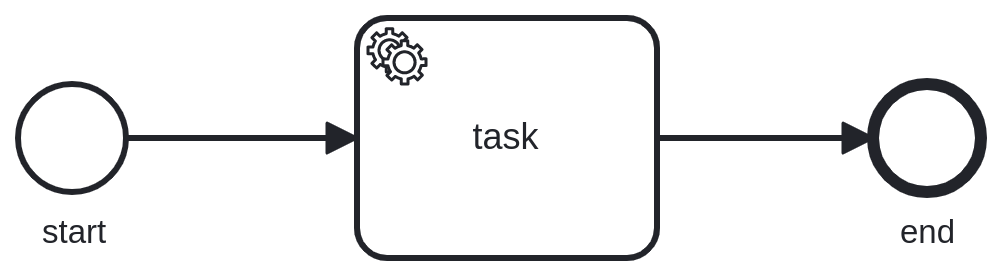

The processing load is generated by our own [benchmarking application](https://github.com/camunda/camunda/tree/9e723b21b0e408fc2b97fd7d3f6b092af8e62dbe/benchmarks).

#### Initial cluster configuration

To test this hypothesis, we will start with a *standard* configuration of the *Camunda orchestration cluster*:

- 3 nodes
- 3 partitions
- CPU limit: 2
- Memory limit: 2 GB

We will increase the load through a load generator in fixed increments until we start to see the nodes showing constant non zero backpressure,
which is a sign that the system has hit its throughput limits.

#### Target cluster configuration

Once that level of throughput is increased, we will scale broker & partitions **while the cluster is under load** to the new target value:

- 6 nodes
- 6 partitions
- CPU limit: 2
- Memory limit: 2 GB

#### Experiment

We expect that during the scaling operation the backpressure/latencies might worsen,
but only temporarily, as once the scaling operation has completed,
the additional load it generate is not present anymore.

Then, we will execute the same procedure as above,
until we hit 2x the critical throughput hit before.

#### Expectation

If the system scales linearly, we expect to see similar level of performance metrics
for similar values of the ratios `PI (created/complete) per second / nr. of partition`.

## Steady state

The system is started with a throughput of 150 Process instances created per second.
As this is a **standard benchmark configuration**, nothing unexpected happens:

- The same number of process instances are completed as the ones created
- The expected number of jobs is completed per unit of time

At this point, we have the following topology:

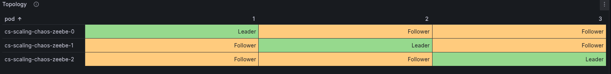

### First benchmark: 3 broker and 3 partitions

Let's start increasing the load incrementally, by adding 30 Process instances/s for every step.

| Time   | Brokers | Partitions | Throughput       | CPU Usage               | Throttling (CPU)        | Backpressure     | Notes               |
|--------|---------|------------|------------------|-------------------------|-------------------------|------------------|---------------------|
| 09:30  | 3       | 3          | 150 PI/s, 150 jobs/s | 1.28 / 1.44 / 1.02  | 12% / 7% / 1%          | 0                 |                     |
| 09:49  | 3       | 3          | 180 PI/s, 180 jobs/s | 1.34 / 1.54 / 1.12  | 20% / 17% / 2%         | 0                 | Increased input to 6 starters |
| 10:00  | 3       | 3          | 210 PI/s, 210 jobs/s | 1.79 / 1.62 / 1.33  | 28% / 42% / 4%         | 0                 | 7 starters          |
| 10:12  | 3       | 3          | 240 PI/s, 240 jobs/s | 1.77 / 1.95 / 1.62  | 45% / 90% / 26%        | 0/0.5%            | 8 starters          |

At 240 Process Instances spawned per second, the system starts to hit the limits:
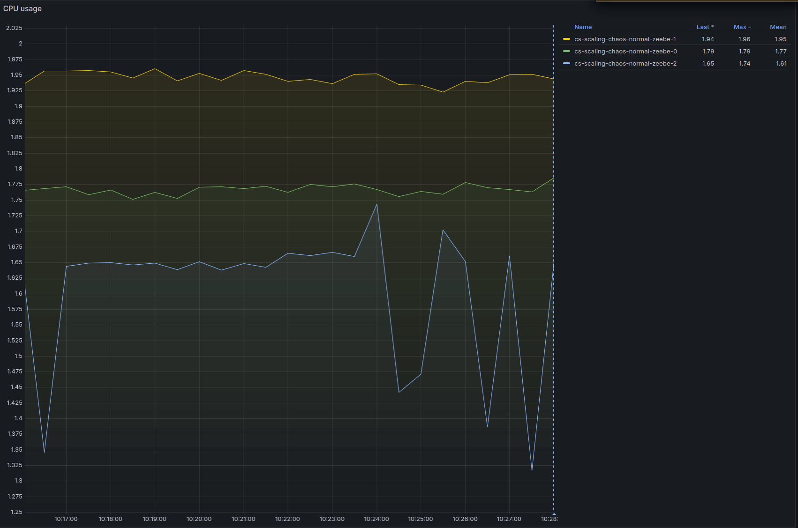
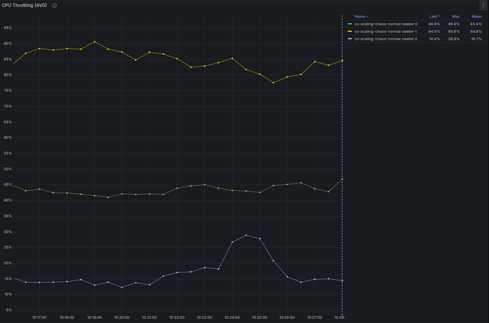

And the backpressure is not zero anymore:
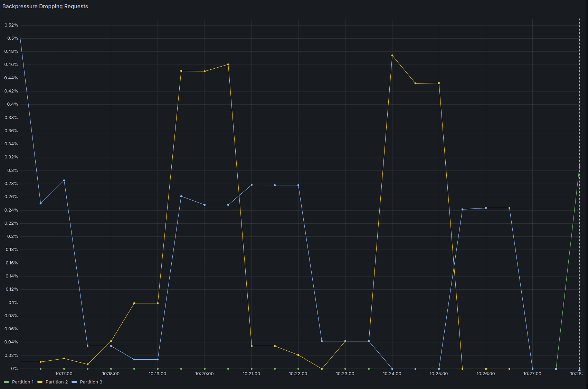

- The CPU throttling reaches almost 90% on one node (this is probably caused by only one node being selected as **gateway** as previously noted)
- Backpressure is now constantly above zero, even if it's just 0.5%, it's a sign that we are reaching the throughput limits.

### Second part of the benchmark: scaling to 6 brokers and 6 partitions

With 240 process instances per second being spawned, we send the commands to scale the cluster.

We first scale the `zeebe` *statefulset* to 6 brokers. As soon as the new brokers are running, even before they are healthy,
we can send the command to include them in the cluster and to increase the number of partition to 6.

This can be done following the [guide in the official docs](https://docs.camunda.io/docs/next/self-managed/zeebe-deployment/operations/cluster-scaling/#2b-scaling-brokers-and-partitions).

Once the scaling has been completed, as can be seen from the **Cluster operation** section in the dashboard, we see the newly created
partitions participate in the workload.

We now have the following topology:

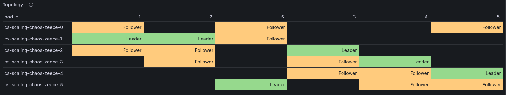

As we did before, let's start increasing the load incrementally as we did with the other cluster configuration.

| Time   | Brokers | Partitions | Throughput       | CPU Usage                                    | Throttling (CPU)                  | Backpressure         | Notes            |
|--------|---------|------------|------------------|----------------------------------------------|------------------------------------|----------------------|------------------|
| 10:27  | 6       | 6          | 240 PI/s         | 0.92/1.26/0.74/0.94/0.93/0.93                | 2.8/6.0/0.3/2.8/3.4/3.18     | 0                    | After scale up   |
| 11:05  | 6       | 6          | 300 PI/s         | 1.17/1.56/1.06/1.23/1.19/1.18                | 9%/29%/0.6%/9%/11%/10%     | 0                    | Stable           |
| 11:10  | 6       | 6          | 360 PI/s         | 1.39/1.76/1.26/1.43/1.37/1.42                | 19%/42%/2%/16%/21%/22%    | 0                    | Stable           |
| 11:10  | 6       | 6          | 420 PI/s         | 1.76/1.89/1.50/1.72/1.50/1.70                | 76%/84%/52%/71%/60%/65%     | 0 (spurts on 1 partition) | Pushing hard    |

However, at 11:32 one of the workers restarted, causing some spyke in the processing.
While the pod was restarting, not all jobs were able to be completed so there was a queue build up.
When the pod started again, it started going through the job queue, creating a spyke of `CompleteJobRequest` which resulted in a load that was simply too high (around 820 job req/s, which is twice as much as the 420 req/s of the steady state).

Because of this extra load, the cluster started to consume even more CPU, reaching almost the CPU limits almost constantly.
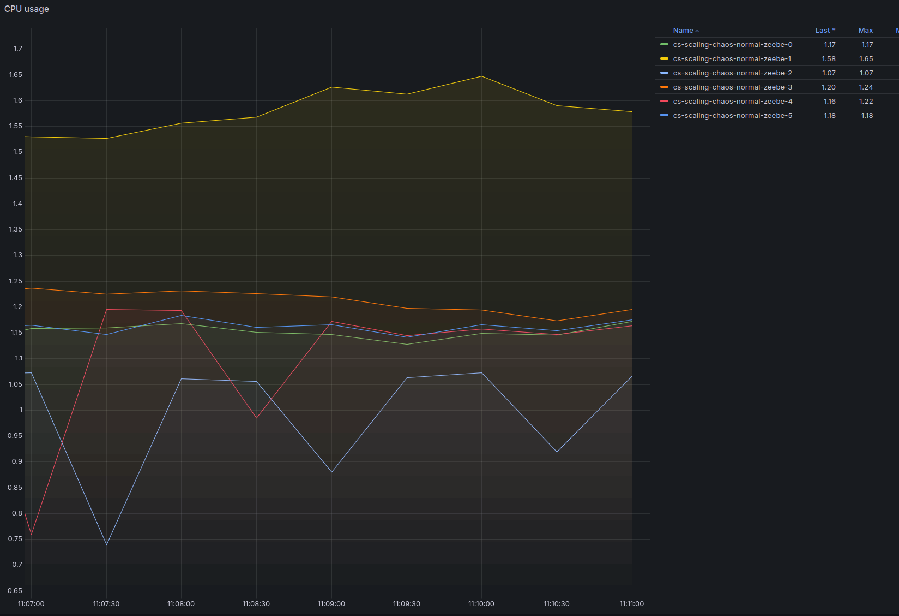
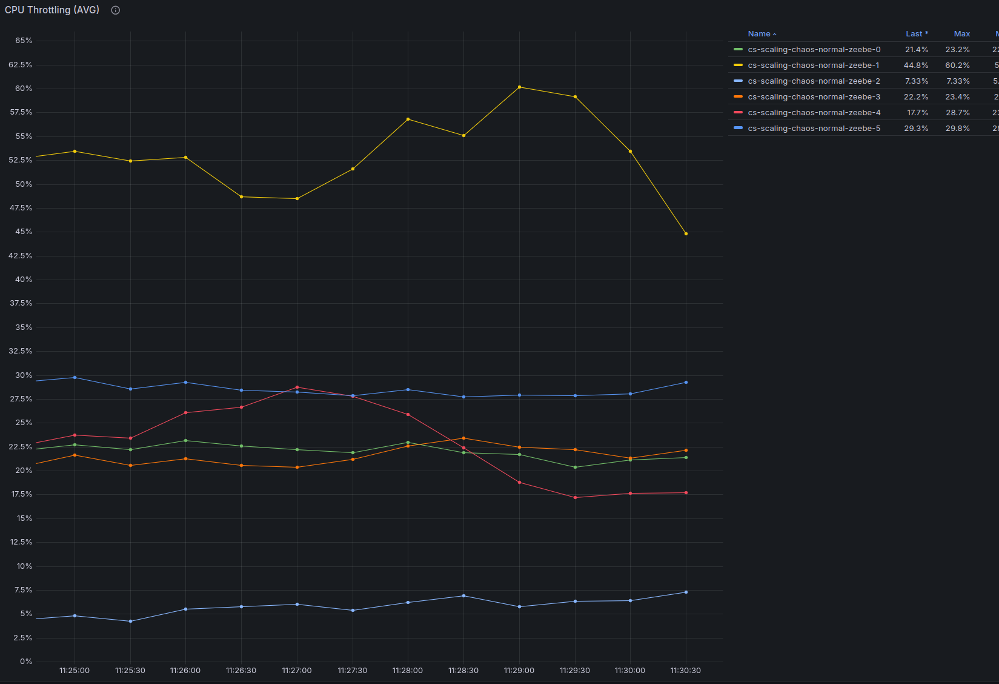

Unfortunately, at 12:05 some broker restarted. We scaled the load down to 60 PI/s to give the cluster the time to heal.
After the cluster was healthy again, we increased the throughput to 480 PI/s to verify the scalability with twice as much throughput as the initial configuration.

The cluster was able to sustain 480 process instances per second with similar levels of backpressure of the initial configuration:
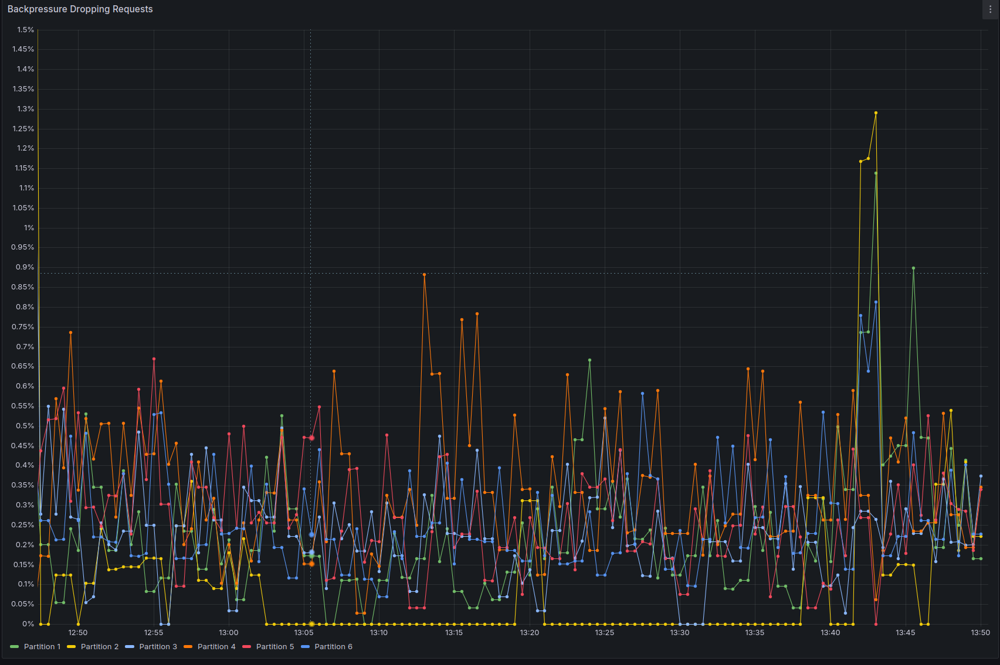

The cpu usage and CPU throttling are :
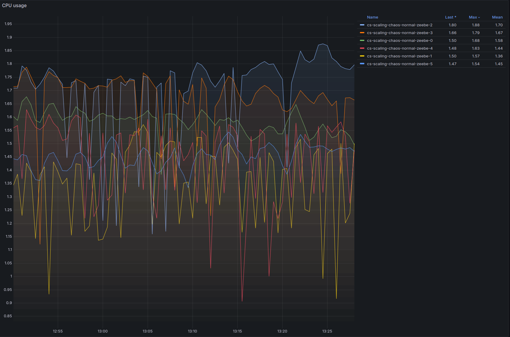
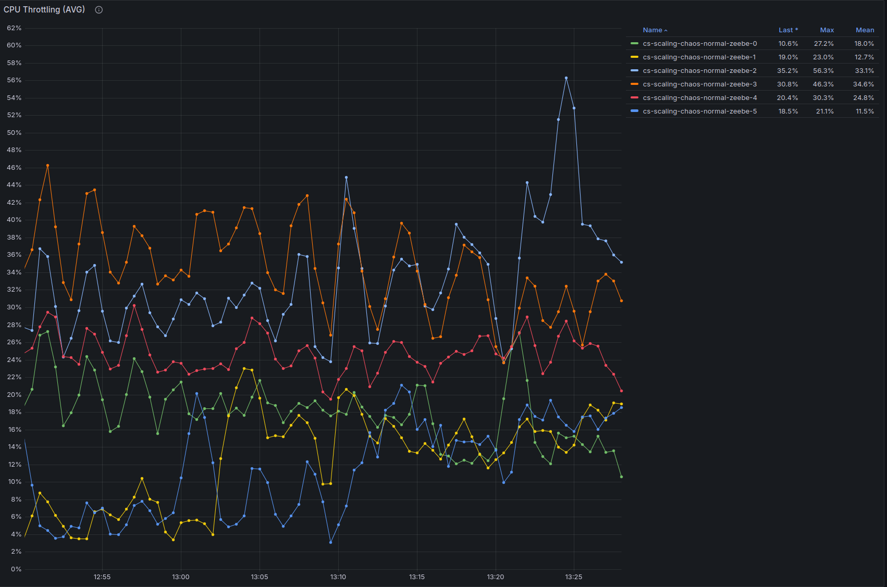

## Conclusion

We are able to verify that the cluster can scale almost linearly when new brokers and new partitions are added, granted that the other components/services are able to bear the extra load, such as workers and Elasticsearch by adding new replicas.

Making sure that the secondary storage is able to keep up with the throughput is important to keep the cluster stable as it's crucial to avoid filling up the Zeebe disks, which would bring to a halt the cluster.

In this specific test case, we could have achieved vertical scalability by increasing the CPU limits first, this remains an interesting direction to explore for another experiment.

We encountered a similar issue when one worker restarts, increasing the amount of job pushed to the cluster, which in turn generates a load that is not able to be sustained.
