# Chaos Day Summary


Due to recent initiatives and architecture changes, we coupled us even more against the secondary storage (often Elasticsearch, but can also be OpenSearch or in the future RDBMS).

We now have one single application to run Webapps, Gateway, Broker, Exporters, etc., together. Including the new Camunda Exporter exporting all necessary data to the secondary storage. On bootstrap we need to create an expected schema, so our components work as expected, allowing Operate and Tasklist Web apps to consume the data and the exporter to export correctly. Furthermore, we have a new query API (REST API) allowing the search for available data in the secondary storage.

We have seen in previous experiments and load tests that unavailable ELS and not properly configured replicas can cause issues like the exporter not catching up or queries not succeeding. See related [GitHub issue](https://github.com/camunda/camunda/issues/35080).

In todays chaos day, we want to play around with the replicas setting of the indices, which can be set in the Camunda Exporter (which is in charge of writing the data to the secondary storage).

**TL;DR;** Without the index replicas set, the Camunda Exporter is directly impacted by ELS node restarts. The query API seem to handle this transparently, but changing the resulting data. Having the replicas set will cause some performance impact, as the ELS node might run into CPU throttling (as they have much more to do). ELS slowing down has an impact on processing as well due to our write throttling mechanics. This means we need to be careful with this setting, while it gives us better availability (CamundaExporter can continue when ELS nodes restart), it might come with some cost.

<!--truncate-->

## Chaos Experiment

In the following, we want to experiment with the following:

1. We restart the first Elasticsearch node and observe how the CamundaExporter performs.
2. We restart the Elasticsearch node that is primary for a certain index, and use the query API.


### Expected

With the index replica set to more than zero in the Camunda Exporter, the Exporter and Query API should be able to work properly even if one ELS node goes down. In our base set up we expect it to fail.

### Actual

We will set up a base load test, having the default configuration, and some increasing the replicas to compare with.

#### Base

##### Set up

Creating the default load test by simply running our [benchmark GitHub action](https://github.com/camunda/camunda/actions/workflows/zeebe-benchmark.yml). By default, the load tests install Elasticsearch with three nodes.

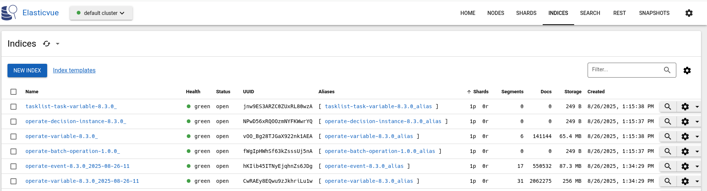

We can see that the indices have only one primary shard, but no replication.

The system is working as expected with the normal load.

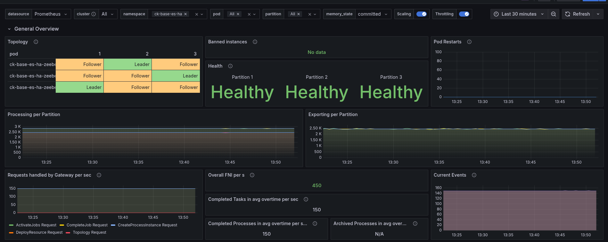


##### Restart first node

```sh
$ k delete pod elastic-0
pod "elastic-0" deleted
```

As soon as the Elasticsearch pod was restarted, the cluster reacted with backpressure. The decrease of exporting was detected, causing to throttle the writing. We can see the cluster load metric, which spiked. Having a direct impact of the processing performance.

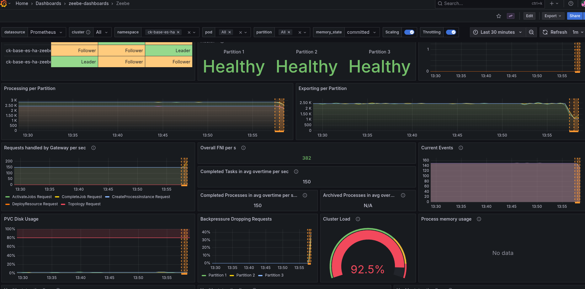

As soon as the Elasticsearch pod recovers and comes back the cluster and processing can recover as well.

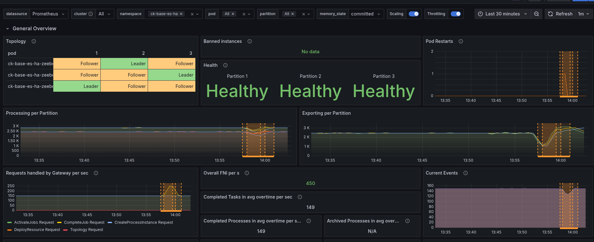

###### Restart primary

Looking at the nodes and the index distributions, we can, for example, see that Node 1 is the primary of the flow node instance index.

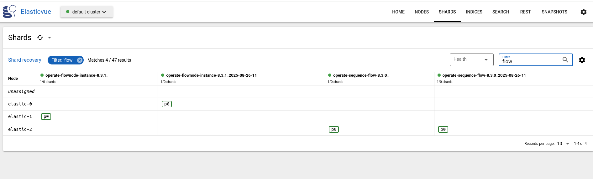 


**Querying for flownode instances:**

First, we have to port-forward to our Camunda instance.

```
k port-forward svc/camunda 8080
Forwarding from 127.0.0.1:8080 -> 8080
Forwarding from [::1]:8080 -> 8080
```

Search flow node instances following the [documentation ](https://docs.camunda.io/docs/next/apis-tools/operate-api/specifications/search-4/), we can copy the cURL command (removing the Authorization header as we don't need it with our current installation):

```sh
 curl -L 'http://localhost:8080/v1/flownode-instances/search' \
      -H 'Content-Type: application/json' \
      -H 'Accept: application/json' \
      -d '{
  "filter": {
    "key": 0,
    "processInstanceKey": 0,
    "processDefinitionKey": 0,
    "startDate": "string",
    "endDate": "string",
    "flowNodeId": "string",
    "flowNodeName": "string",
    "incidentKey": 0,
    "type": "UNSPECIFIED",
    "state": "ACTIVE",
    "incident": true,
    "tenantId": "string"
  },
  "size": 0,
  "searchAfter": [
    {}
  ],
  "sort": [
    {
      "field": "string",
      "order": "ASC"
    }
  ]
}'
{"status":400,"message":"Sort has invalid field(s): string","instance":"f5ddf702-7ad6-4a05-af9a-9112f2436706","type":"Data invalid"}
```

Seems to cause some issues with the sorting. Removing this and setting the size to 1 (as this was another failure returned), we run into:

```
 curl -L 'http://localhost:8080/v1/flownode-instances/search' -H 'Content-Type: application/json' -H 'Accept: application/json' -d '{
  "filter": {
    "key": 0,
    "processInstanceKey": 0,
    "processDefinitionKey": 0,
    "startDate": "string",
    "endDate": "string",
    "flowNodeId": "string",
    "flowNodeName": "string",
    "incidentKey": 0,
    "type": "UNSPECIFIED",
    "state": "ACTIVE",
    "incident": true,
    "tenantId": "string"
  },
  "size": 1 
}'
{"status":500,"message":"Error in reading flownode instances","instance":"a50c501e-161c-42fb-bac1-dc71416580d7","type":"API application error"}
```

Not clear what the issue is. Removing the filters and just setting size, returns us something.

```
$ curl -L 'http://localhost:8080/v1/flownode-instances/search' -H 'Content-Type: application/json' -H 'Accept: application/json' -d '{
  "size": 1  
}'
{"items":[{"key":2251799817981066,"processInstanceKey":2251799817981049,"processDefinitionKey":2251799813685298,"startDate":"2025-08-26T12:13:23.156+0000","endDate":"2025-08-26T12:13:23.156+0000","flowNodeId":"start","flowNodeName":"start","type":"START_EVENT","state":"COMPLETED","incident":false,"tenantId":"<default>"}],"sortValues":[2251799817981066],"total":10000}
```

Now going ahead and restarting Elasticsearch node 1.

```
$ k delete pod elastic-1
pod "elastic-1" deleted
...
$ curl -L 'http://localhost:8080/v1/flownode-instances/search' -H 'Content-Type: application/json' -H 'Accept: application/json' -d '{
  "size": 1
}'
{"items":[{"key":2251799817981066,"processInstanceKey":2251799817981049,"processDefinitionKey":2251799813685298,"startDate":"2025-08-26T12:13:23.156+0000","endDate":"2025-08-26T12:13:23.156+0000","flowNodeId":"start","flowNodeName":"start","type":"START_EVENT","state":"COMPLETED","incident":false,"tenantId":"<default>"}],"sortValues":[2251799817981066],"total":10000}
```

The restart seem to be rather quick and had no real impact on the query API. Checking the primary distribution again, we realized that actually `elastic-2` is the primary of the historic indices.

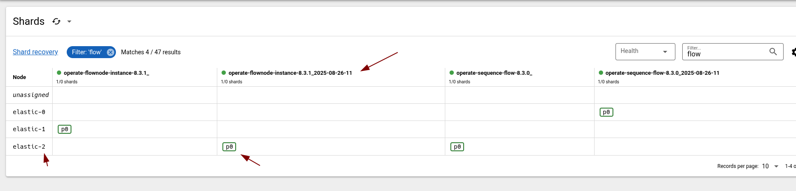

Doing it again, we can also observe that the historic index is unassinged at this time.

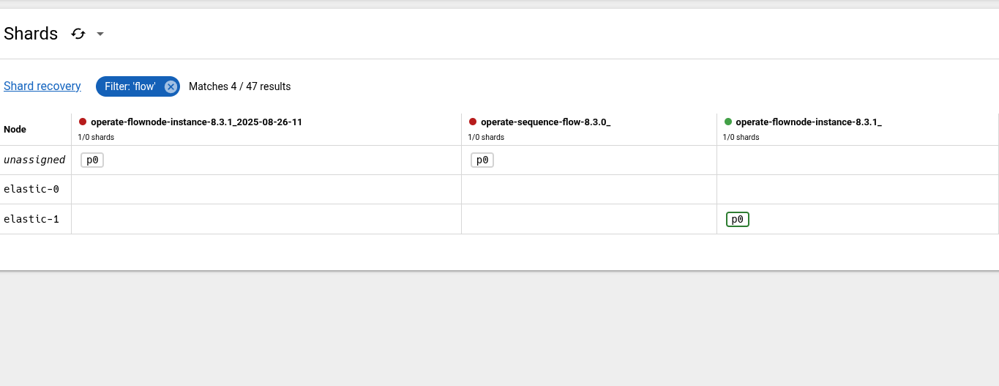

Interestingly, is that we are not seeing any error from the query API. We still return some data.

```
 curl -L 'http://localhost:8080/v1/flownode-instances/search' -H 'Content-Type: application/json' -H 'Accept: application/json' -d '{
  "size": 1
}'
{"items":[{"key":2251799818189380,"processInstanceKey":2251799818189363,"processDefinitionKey":2251799813685298,"startDate":"2025-08-26T12:16:09.754+0000","endDate":"2025-08-26T12:16:09.754+0000","flowNodeId":"start","flowNodeName":"start","type":"START_EVENT","state":"COMPLETED","incident":false,"tenantId":"<default>"}],"sortValues":[2251799818189380],"total":10000}
```

To better understand this, we introduce some sorting based on the key.

```
curl -L 'http://localhost:8080/v1/flownode-instances/search' -H 'Content-Type: application/json' -H 'Accept: application/json' -d '{
  "size": 1, "sort": [ { "field": "key" } ]
}'
{"items":[{"key":2251799817981066,"processInstanceKey":2251799817981049,"processDefinitionKey":2251799813685298,"startDate":"2025-08-26T12:13:23.156+0000","endDate":"2025-08-26T12:13:23.156+0000","flowNodeId":"start","flowNodeName":"start","type":"START_EVENT","state":"COMPLETED","incident":false,"tenantId":"<default>"}],"sortValues":[2251799817981066,2251799817981066],"total":10000}
```

We can see the returned FNI has the key `2251799817981066`. If we now remove the primary of the historic indices (elastic-2).

```
 k delete pod elastic-2
pod "elastic-2" deleted
[cqjawa (No connection:-) ~/(main)]$ curl -L 'http://localhost:8080/v1/flownode-instances/search' -H 'Content-Type: application/json' -H 'Accept: application/json' -d '{
  "size": 1, "sort": [ { "field": "key" } ]
}'
{"items":[{"key":2251799818301951,"processInstanceKey":2251799818301934,"processDefinitionKey":2251799813685298,"startDate":"2025-08-26T12:18:43.362+0000","endDate":"2025-08-26T12:18:43.362+0000","flowNodeId":"start","flowNodeName":"start","type":"START_EVENT","state":"COMPLETED","incident":false,"tenantId":"<default>"}],"sortValues":[2251799818301951,2251799818301951],"total":9916}
```

We retrieve `2251799818301951` which is likely in the runtime index, an instance that haven't been archived yet.

The Query API is handling the Elasticsearch availability transparently, by returning different results (likely this depends on the filter criteria). Something we (and users) should be aware. 

Just for the sake of completeness, I tested with restarting `elastic-1` and `elastic-2` and run the same query.

```
$ k delete pod elastic-2 elastic-1 &
[1] 201244
pod "elastic-2" deleted
pod "elastic-1" deleted
$ curl -L 'http://localhost:8080/v1/flownode-instances/search' -H 'Content-Type: application/json' -H 'Accept: application/json' -d '{
  "size": 1, "sort": [ { "field": "key" } ]
}'
{"status":500,"message":"Error in reading flownode instances","instance":"1fa0c323-082f-4a9f-99d1-01208ecccbd5","type":"API application error"}
```

The error handling should be improved to better indicate the current issue.

#### One replica

##### Set up

Setting: `--set zeebe.config.zeebe.broker.exporters.CamundaExporter.args.index.numberOfReplicas=1` should allow us to configure the CamundaExporter to create indices with one replica (instead of zero as per default).

Deploying a configmap with:

```
   zeebe:
      broker:
        exporters:
          CamundaExporter:
            args:
              index:
                numberOfReplicas: 1
```

This seems to have no affect.

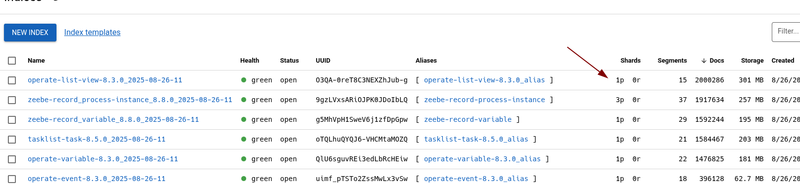

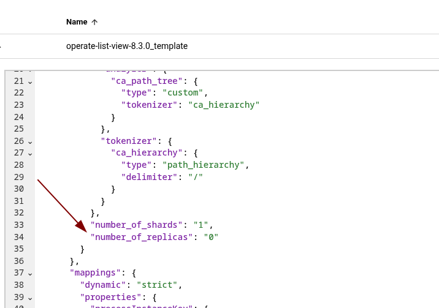

The reason is that the config has been moved to: `camunda.database.index.numberOfReplicas` (in the current SNAPSHOT). After changing the configuration (and restarting the pods), the indices settings are updated.

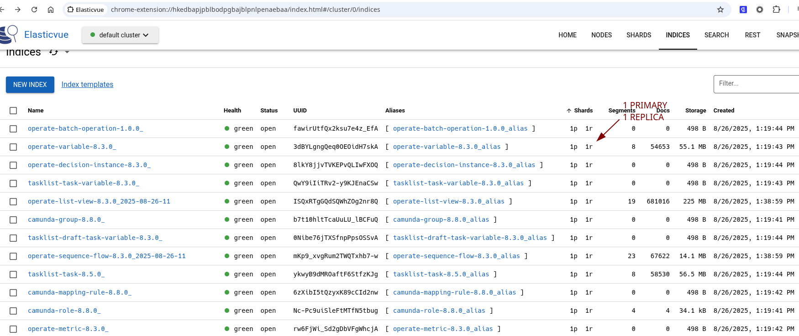

Generally, the performance of the cluster seem to be highly affected.

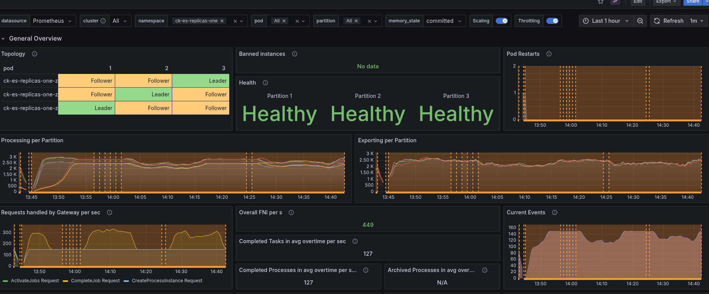

Looking at the CPU usage, we can see the Elasticsearch CPU went from around 1 core to almost 2. The throttling is around 60%, which likely impacts the performance a lot. 

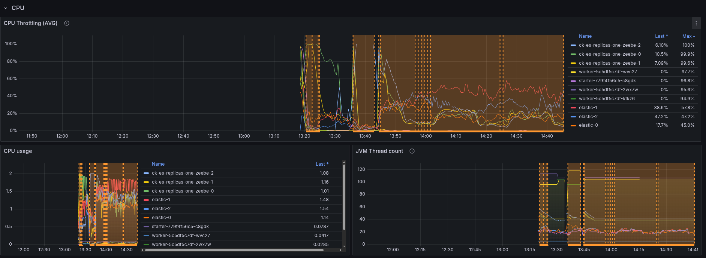

In comparison to the base.

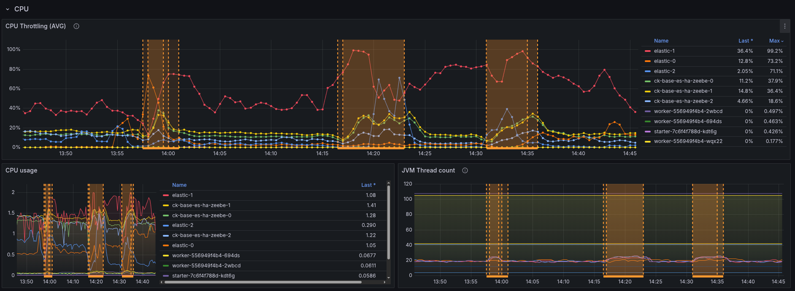

I think in general it is not suprising, as the ES nodes need to do more (replicating), but something we should be aware of when rolling it out.

This means enabling the replicas can highly impact the system performance, and likely need some resource adjustments (not only disk space).

##### Restart first node

Even though the performance is already impacted, we should see less impact when restarting the first node, so we will continue with the experimentation for now.

```
$ k delete pod elastic-0
pod "elastic-0" deleted
```

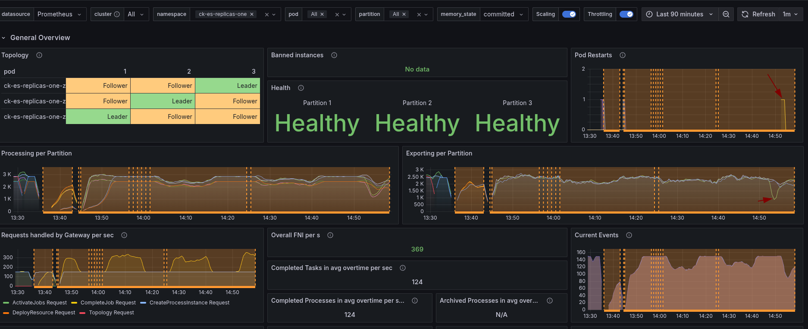

When restarting the first node, we can see that "only" one partition seems to be affected. But due to the limit of resources on the nodes and already existing CPU throttling, this also impacts other nodes. Causing our cluster load going up, and backpressure in consequence. 

Compared to the base, we still can see some difference, as it was before it impacted all partitions.

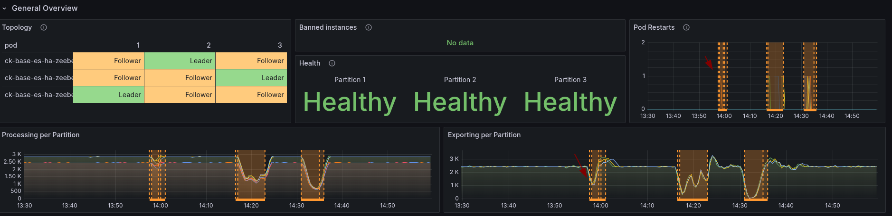

It might be interesting to do the experiment again, with increased resources.

###### Restart primary

When we check the index-node distribution, we can see the replicas as well.

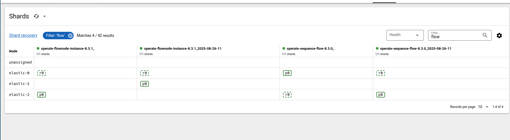

We have already seen in our base that the query API still works when one of the historic or runtime indices is available. 

Interesting would be now, if we still return the same result, even when we restart the primary of the historic index.

```
$ curl -L 'http://localhost:8080/v1/flownode-instances/search' -H 'Content-Type: application/json' -H 'Accept: application/json' -d '{
  "size": 1, "sort": [ { "field": "key" } ]
}'
{"items":[{"key":2251799813772120,"processInstanceKey":2251799813772101,"processDefinitionKey":2251799813685252,"startDate":"2025-08-26T11:22:09.083+0000","endDate":"2025-08-26T11:22:12.640+0000","flowNodeId":"task","flowNodeName":"task","type":"SERVICE_TASK","state":"COMPLETED","incident":false,"tenantId":"<default>"}],"sortValues":[2251799813772120,2251799813772120],"total":10000}

$ k delete pod elastic-0
pod "elastic-0" deleted

$ curl -L 'http://localhost:8080/v1/flownode-instances/search' -H 'Content-Type: application/json' -H 'Accept: application/json' -d '{
  "size": 1, "sort": [ { "field": "key" } ]
}'
{"items":[{"key":2251799813772120,"processInstanceKey":2251799813772101,"processDefinitionKey":2251799813685252,"startDate":"2025-08-26T11:22:09.083+0000","endDate":"2025-08-26T11:22:12.640+0000","flowNodeId":"task","flowNodeName":"task","type":"SERVICE_TASK","state":"COMPLETED","incident":false,"tenantId":"<default>"}],"sortValues":[2251799813772120,2251799813772120],"total":10000}
```

As expected, the results are the same (as we have a replica).

## Result

When running the experiment against the base, we were not expecting that the Query API handles ES unavailability until a certain point. The error messaging needs to be improved here if there is actually a problem, like a wrong filter or no index available.

Enabling the replicas was harder than expected, as we are currently in the process of changing our configuration (unified configuration). After finding the right properties (thanks to Houssain), we were even able to update an existing installation. 

The replicas setting has an unforeseen performance impact; we expected disk space increase in our past discussions, but not how it impacts the general performance. It should be considered when rolling it out by default.

Having this setting allows to better handle ELS unavailability, especially for the Query API. When enough resources, likely also for the Camunda Exporter, this should be re-tested.

### Observations

* Query API handles ELS unavailability transparently; we should clarify whether this is expected
* Query API returns useless errors when the needed indices are not available or when the given filter doesn't work
* The Query API documentation is not easy to start with - we should give a command that can be easily tried out
* Replicas setting has an impact on cluster performance - as ELS can run in CPU throttling, causing slow in general processing (due to write throttling).

