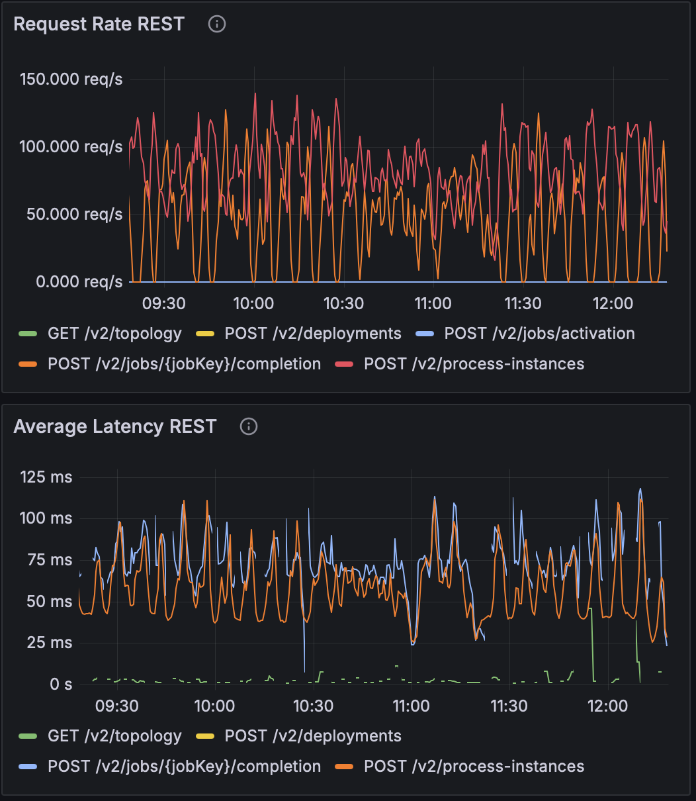
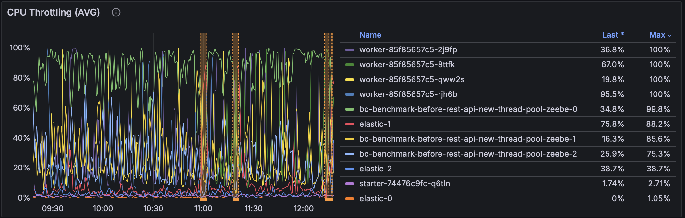
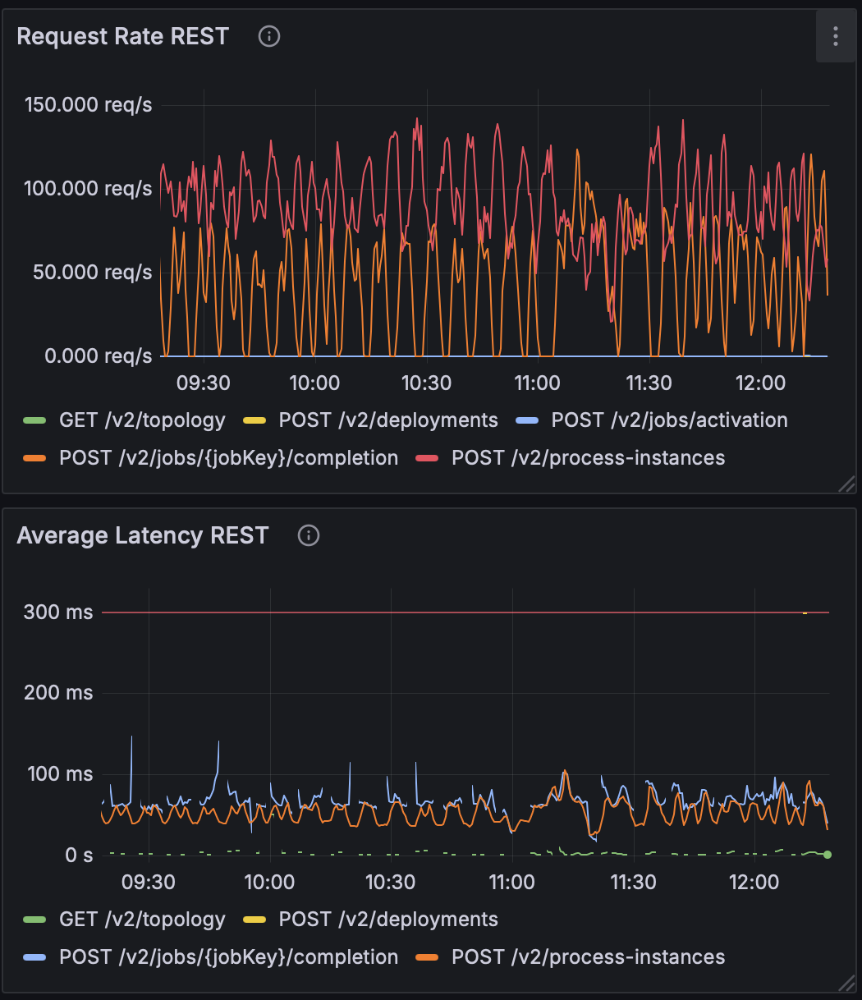
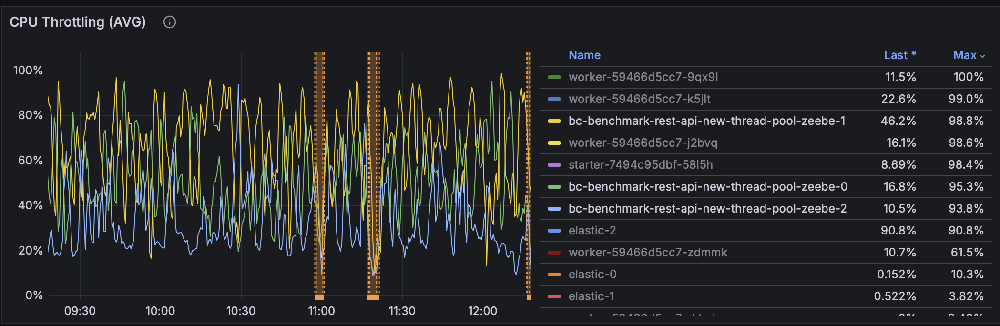
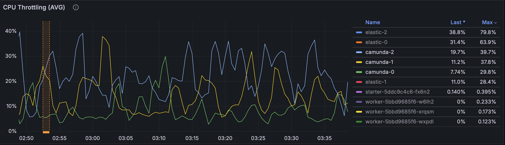
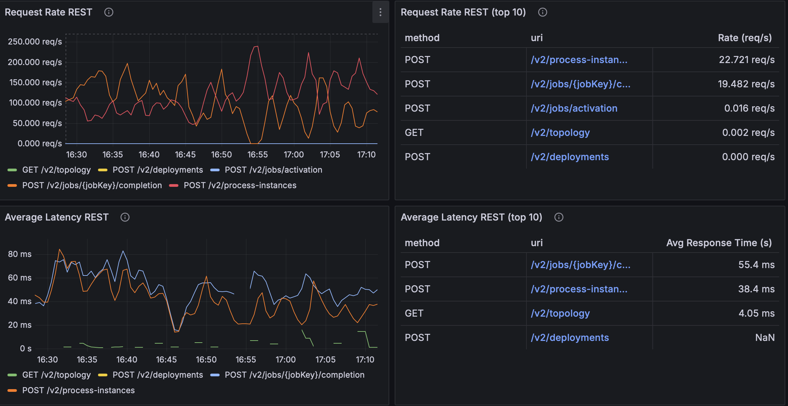
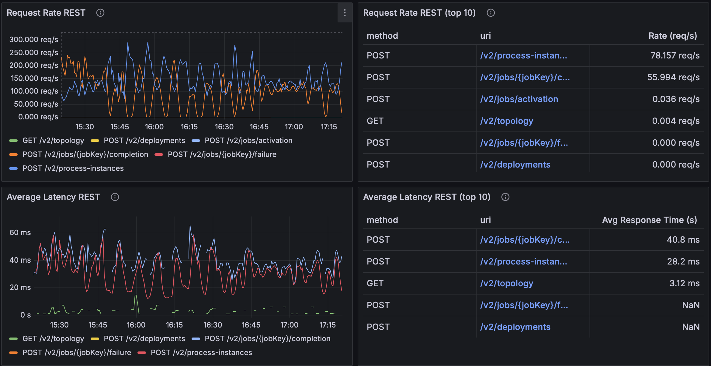
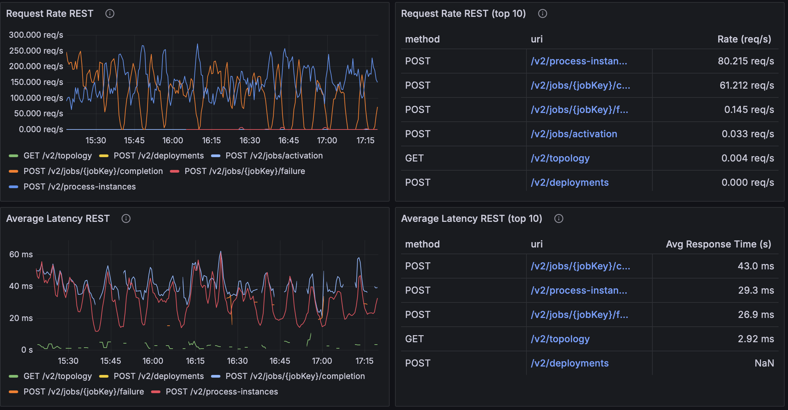

# REST API: From ForkJoin to a Dedicated Thread Pool

During the latest [REST API Performance load tests](https://camunda.github.io/zeebe-chaos/2025/07/02/Follow-up-REST-API-performance), 
we discovered that REST API requests suffered from significantly higher latency under CPU pressure, even when throughput numbers looked comparable. 
While adding more CPU cores alleviated the issue, this wasn’t a sustainable solution — it hinted at an inefficiency in how REST handled broker responses. 
See related [section](https://camunda.github.io/zeebe-chaos/2025/07/02/Follow-up-REST-API-performance#request-handling-execution-logic) from the previous blog post.

This blog post is about how we diagnosed the issue, what we found, and the fix we introduced in [PR #36517](https://github.com/camunda/camunda/pull/36517) 
to close the performance gap.

## The Problem

A difference we spotted early between **REST API** and **gRPC** request handling was the usage of the `BrokerClient`:

- **gRPC:** `BrokerClient` calls are wrapped with retries and handled directly in the request thread.
- **REST:** requests are executed without retries, and responses are handled asynchronously using the common `ForkJoinPool`.

On clusters with 2 CPUs, the JVM defaults to a single thread for the common `ForkJoinPool`. 
Our expectation was that this could cause contention: one thread might not be fast enough to process responses in time, leading to delays in the Gateway ↔ Broker request-response cycle.

## The Solution Journey

Solving this issue wasn’t a straight line — we tried a few approaches before landing on the final design. 
Each iteration gave us valuable insights about Java’s thread pool usage and its impact on REST API performance.

### 1. First Attempt: SynchronousQueue

We began with a custom `ThreadPoolExecutor` that used a `SynchronousQueue` for task handoff:

```java
new ThreadPoolExecutor(
    corePoolSize,
    maxPoolSize,
    keepAliveSeconds,
    TimeUnit.SECONDS,
    new SynchronousQueue<>(),
    threadFactory,
    new ThreadPoolExecutor.CallerRunsPolicy());
```

A `SynchronousQueue` has **no capacity** — each task submission must immediately find a free worker thread. 
If no thread is available, the caller blocks until one frees up.

In practice, this meant concurrency was **artificially limited**: bursts of REST requests had to wait for a thread to become available, reducing parallelism. 
The results were modest:

- **Request rate:** unchanged
- **Average latency:** improved slightly (from ~120 ms → ~100 ms)
- **CPU throttling:** dropped only marginally (100% → 90%)

Before any changes introduced, results looked like this:



Then we started benchmarking after introducing executor with `SynchronousQueue`:



This hinted we were on the right track — a dedicated executor helped — but the queue strategy was too restrictive.

### 2. Experiment: ArrayBlockingQueue + AbortPolicy

Next, we switched to an `ArrayBlockingQueue` with a capacity of 64. 
This allowed the pool to **buffer short micro-bursts** of requests instead of blocking immediately. 
At the same time, we replaced `CallerRunsPolicy` with `AbortPolicy`:

```java
new ThreadPoolExecutor.AbortPolicy();
```

The idea was to **fail fast** on saturation: if the queue filled up and no thread was free, the executor would throw `RejectedExecutionException` immediately. 
This boosted the measured request rate, but at a cost:

- Many requests were simply rejected outright.
- Measuring true performance became tricky, since high throughput numbers hid the rejections.
- Operationally, this wasn’t acceptable — REST clients would constantly see errors under load.

Because of this, we abandoned the fail-fast approach.

### 3. Final Decision: CallerRunsPolicy + Higher Max Pool Size

Finally, we returned to `CallerRunsPolicy`. 
Instead of rejecting tasks, this policy makes the caller thread execute the task itself when the pool is saturated. 
This introduces **natural backpressure**: clients slow down automatically when the system is busy, without dropping requests.

To give the executor more headroom, we also increased the maximum pool size from `availableProcessors * 2` to `availableProcessors * 8`.

This combination made the breakthrough:

- **Request rate (REST):** stabilized around 150 RPS with spikes up to 200 RPS
- **Average latency:** dropped dramatically (from ~120 ms → ~25 ms)
- **CPU throttling:** reduced significantly (100% → 30-40%)

Here are the final results:



This design struck the right balance: elastic concurrency, backpressure, and resource efficiency.

### Key Takeaways

1. **SynchronousQueue limits concurrency** — good for handoff semantics, but too restrictive for REST workloads.
2. **Fail-fast rejection looks good in benchmarks but fails in production** — clients can’t handle widespread request errors.
3. **CallerRunsPolicy provides natural backpressure** — throughput stabilizes without dropping requests, and latency improves.
4. **CPU-aware max pool sizing matters** — scaling pool size relative to cores unlocks performance gains.

## More Benchmarking

To validate that our executor change holds up across configurations, we ran extra tests on our benchmark cluster provisioned with 2 vCPUs per Camunda application.

### 1) Comparing Max Pool Size (×4, ×8, ×16)

We ran the same workload while varying `maxPoolSize = availableProcessors × {4, 8, 16}`. Below are the observed tops from Grafana panels in the screenshots:

`maxPoolSizeMultiplier=4`


`maxPoolSizeMultiplier=8`


`maxPoolSizeMultiplier=16`


| Multiplier | Request Rate (proc-instances) | Request Rate (completion) | Avg Latency (proc-instances) | Avg Latency (completion) |
|---:|------------------------------:|--------------------------:|-----------------------------:|-------------------------:|
| ×4  |                   ~51.6 req/s |               ~42.3 req/s |                     ~40.2 ms |                 ~57.4 ms |
| ×8  |              ~144.4 req/s |              ~144.7 req/s |                     ~21.4 ms |                 ~24.1 ms |
| ×16 |               ~22.7 req/s |             ~19.5 req/s |                     ~38.4 ms |                 ~55.4 ms |

**What this suggests (in our setup):**
- **×8** is the clear **sweet spot**: highest sustained throughput with the lowest average latencies.
- **×4** under-provisions the pool (lower RPS, higher latency).
- **×16** shows **diminishing/negative returns** (likely scheduler contention or oversubscription): much lower RPS and latencies drifting back up.

**Takeaway:** In our setup, ×8 balances elasticity and scheduling overhead, delivering the best throughput–latency trade-off.

### 3) Comparing Queue Capacity (16 vs 64 vs 256)

We varied the executor **queue capacity** and compared **16**, **64** (our current/default for this run), and **256** under the same workload.  
Below are the observed tops from the Grafana panels for the two hot endpoints:

- POST /v2/process-instances
- POST /v2/jobs/\{jobKey\}/completion

`queueCapacity=16`  


`queueCapacity=64`  


`queueCapacity=256`  


#### Measured summary

| Queue Capacity | Request Rate (proc-instances) | Request Rate (completion) | Avg Latency (proc-instances) | Avg Latency (completion) |
|---:|---:|---:|---:|---:|
| 16  | ~78.2 req/s | ~56.0 req/s | ~28.2 ms | ~40.8 ms |
| 64  | ~144.4 req/s | ~144.7 req/s | ~21.4 ms | ~24.1 ms |
| 256 | ~80.2 req/s | ~61.2 req/s | ~29.3 ms | ~43.0 ms |

**What this suggests (in our setup):**
- **Queue = 64** is the clear **sweet spot**: highest sustained throughput (~144 req/s on hot endpoints) with the lowest avg latencies (~21–24 ms). Likely large enough to absorb micro-bursts, but small enough to avoid long queue waits.
- **Queue = 16** under-buffers: lower RPS (~78 / ~56 req/s) and higher latency (~28–41 ms). With `CallerRunsPolicy`, the queue fills quickly and the caller runs tasks often → frequent backpressure throttles producers.
- **Queue = 256** shows **diminishing/negative returns** relative to 64: lower RPS (~80 / ~61 req/s) and higher latency (~29–43 ms). The big buffer hides saturation, adding queueing delay before execution without delivering extra useful work at the same CPU budget.

## Conclusion

Moving off the common `ForkJoinPool` to a dedicated, CPU-aware executor with bounded queueing and `CallerRunsPolicy` backpressure turned an overload problem into graceful degradation: fewer 5xxs, steadier RPS, and far lower tail latency under the same CPU budget.

**Final takeaways**
- **Isolation beats sharing.** A dedicated pool prevents noisy neighbors from the common `ForkJoinPool`.
- **Backpressure beats drops.** `CallerRunsPolicy` slows producers when saturated, stabilizing the system without mass rejections.
- **Right-sized knobs matter.** `maxPoolSize ≈ cores × 8` and `queueCapacity ≈ 64` hit the best throughput/latency balance in our runs; smaller queues over-throttle, larger queues hide saturation and add wait time.
- **Results are environment-specific.** At higher core counts, the sweet spot may shift—re-benchmark when CPUs or workload mix change.

**Note:** Results are environment-specific; at higher core counts, the sweet spot may shift—re-benchmark when CPUs or workload mix change.
In this experiment, we focused on CPU-bound scenarios.
