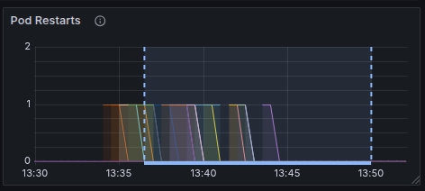

# Chaos Experiment Summary

With version 8.8, we introduced the ability to add new partitions to an existing Camunda cluster. This experiment aimed to evaluate the resilience of the scaling process under disruptive conditions.

**Summary:**
* Several bugs were identified during testing.
* After addressing these issues, scaling succeeded even when multiple nodes were restarted during the operation.

## Chaos experiment

### Expected

The scaling operation should complete successfully, even if multiple nodes are restarted during the process.

### Setup

We initialized a cluster with the following configuration:
* `clusterSize = 3`
* `partitionCount = 3`
* `replicationFactor = 3`

The cluster is running with a steady throughput of completing 150 jobs/s. 

The target configuration was:
* `clusterSize = 6`
* `partitionCount = 6`
* `replicationFactor = 3`

### Experiment

We first started new brokers using using:

```
kubectl scale statefulset <zeebe-statefulset> --replicas=6
```

Next, we triggered the scaling operation via Camunda's management API:

```
curl -X 'PATCH' \
    'http://localhost:9600/actuator/cluster' \
    -H 'accept: application/json' \
    -H 'Content-Type: application/json' \
    -d '{
          "brokers": {
             "add": [3,4,5]
          },
          "partitions": {
             "count": 6,
             "replicationFactor": 3
          }
        }'
```

Once the API request succeeded and scaling began, we started restarting pods one at a time using `kubectl delete pod <zeebe-n>`, choosing pods in random order. Each pod was restarted multiple times throughout the experiment.

### Results

During the initial run, scaling stalled at a specific step. The cluster status showed that bootstrapping partition 6 was not progressing:

```
  "pendingChange": {
     "id": 2,
     "status": "IN_PROGRESS",
     "completed": [
          ...
     ],
     "pending": [
        {
          "operation": "PARTITION_BOOTSTRAP",
          "brokerId": 5,
          "partitionId": 6,
          "priority": 3,
          "brokers": []
        },
        ...
     ]
  }
```

Investigation uncovered a [bug](https://github.com/camunda/camunda/issues/37495). After fixing it, we repeated the experiment.

In the second attempt, we observed that after bootstrapping a new partition, [adding a second replica to that partition became stuck](https://github.com/camunda/camunda/issues/37892). This revealed an unhandled edge case in the Raft join protocol. Since manual pod restarts are non-deterministic, reproducing this issue was challenging. To address this, we incorporated the scenario into our [randomized Raft test](https://camunda.com/blog/2022/12/bulletproofing-zeebe-concurrency-bugs/), which exposed additional edge cases that could block the join operation. These were subsequently fixed. Thanks to the improved test coverage, we are now confident that these issues have been resolved.

After applying the fixes, we reran the experiment. :tada: This time, scaling completed successfully, even with repeated node restarts.

The scaling began at 11:35, with node restarts occurring during the operation.



 Throughput was severely impacted by the muliple restarts of the brokers at the same time. 


But the scaling process still completed within 15 minutes.


The cluster status query shows the last completed scaling operation.
```
"lastChange": {
    "id": 2,
    "status": "COMPLETED",
    "startedAt": "2025-10-02T11:35:59.852+0000",
    "completedAt": "2025-10-02T11:49:32.796+0000"
  },
```

 While the operation would have finished faster without node failures, the key takeaway is that it remained resilient in the face of disruptions.

## Participants

 * @deepthi