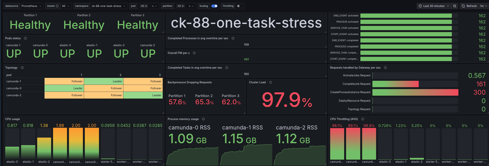
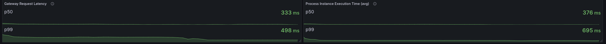
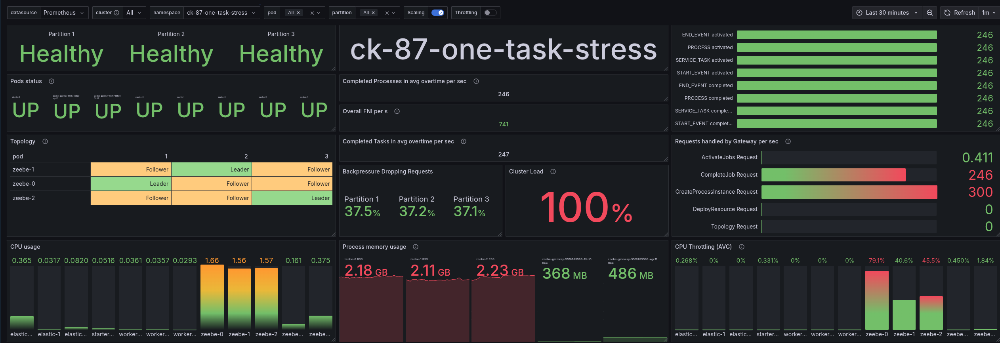
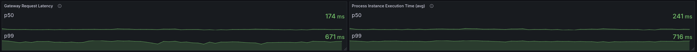
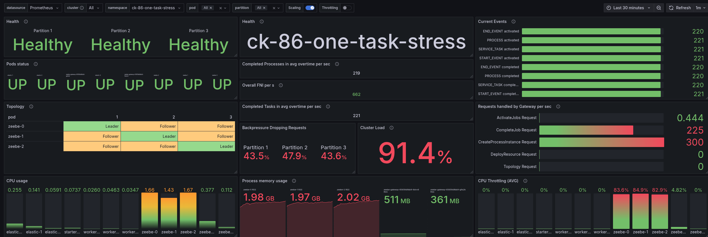
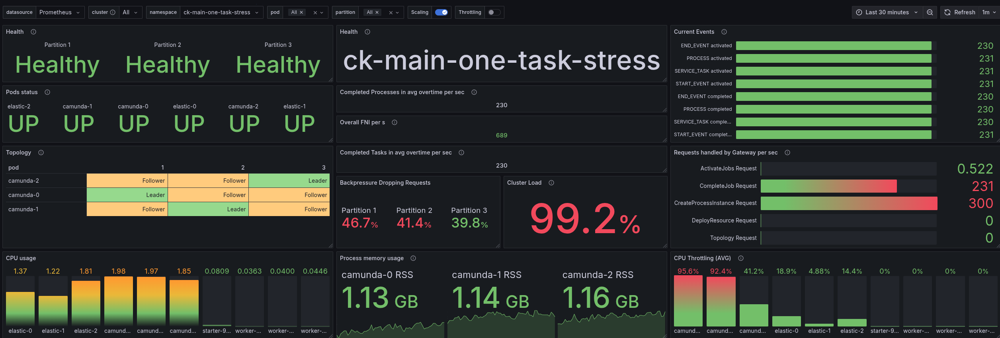
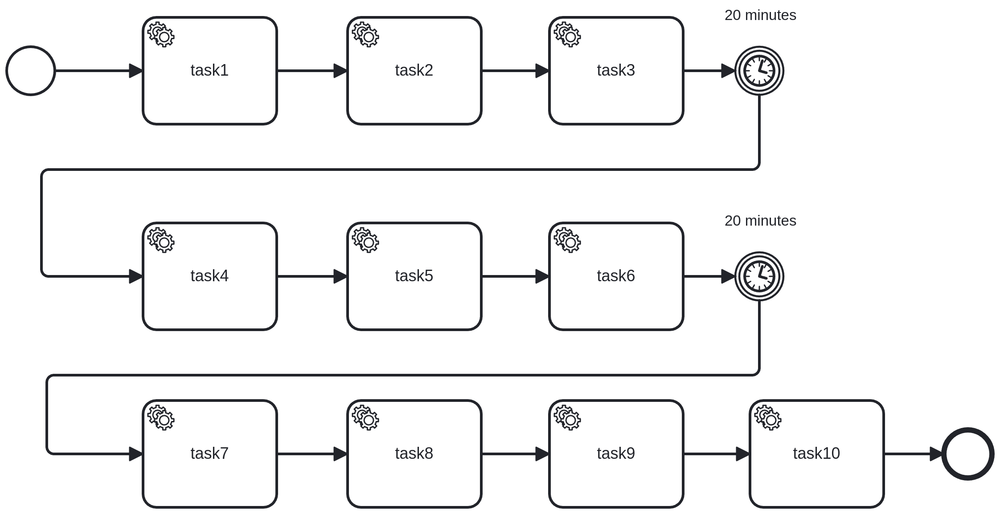
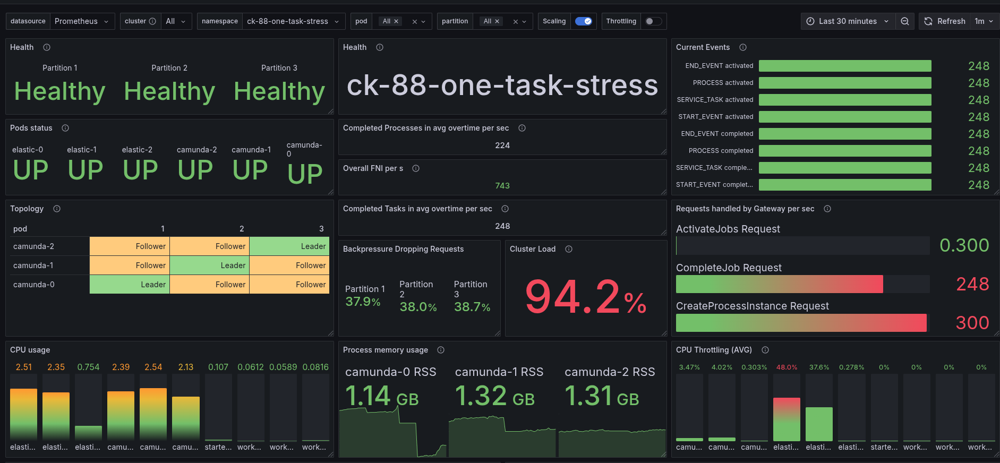
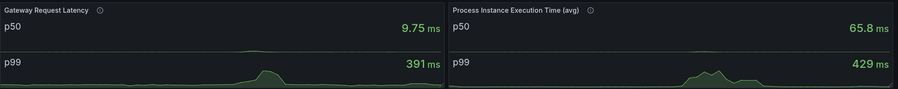
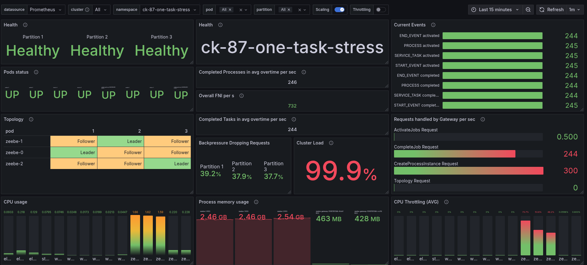

# Chaos Day Summary

In today's chaos experiment, we focused on stress-testing the Camunda 8 platform under high-load conditions. We simulated a large number of concurrent process instances to evaluate the performance of processing and system reliability.

Due to our recent work in supporting [load tests for different versions](https://github.com/camunda/camunda/issues/38829), we were able to compare how different Camunda versions handle stress.

**TL;DR:** Overall, we saw that all versions of Camunda 8 are robust and can handle high loads effectively and reliably. In consideration of throughput and latency, with **similar** resource allocation among the brokers, 8.7.x outperforms other versions. If we consider our streamlined architecture (which now contains more components in a single application) and align the resources for 8.8.x, it can achieve similar throughput levels as 8.7.x, while maintaining significantly lower latency (a factor of 2). An overview of the results can be found in the [Results](#results) section below.

:::info
[Update: 28.11.2025]

After the initial analysis, we conducted further experiments with 8.8 to understand why the measured processing performance was lower compared to 8.7.x. The blog post (including TL;DR) has been updated with the new findings in the section [Further Experiments](#further-Experiments) below.

:::

<!--truncate-->

## Chaos Experiment

Weekly, we run [endurance tests](https://github.com/camunda/camunda/blob/main/docs/testing/reliability-testing.md#variations) to validate the stability of our systems. This time, we decided to push the limits further by increasing the load significantly and observing how Camunda handles the stress.

Additionally, we wanted to see how far we can go and how this differs between versions. Therefore, we compared the performance of Camunda 8.8.x and 8.7.x under identical stress conditions.

### Setup

Details on the setup can be read in our  [reliability testing](https://github.com/camunda/camunda/blob/main/docs/testing/reliability-testing.md#setup) documentation.

Important to know is that the architecture has changed slightly over the versions. In 8.8.x, we have a single Camunda application deployed, whereas in earlier versions, we had a split architecture between broker and gateway. This change has implications for how the system handles load and scales.

### Load Generation

We have a custom [load generation application](https://github.com/camunda/camunda/tree/main/load-tests/load-tester) (split into starter and worker applications), which we deploy separately from Camunda. The starter creates process instances at a configurable rate, while the worker completes the corresponding service tasks.

We will start simple, with a process that has a single service task. This is not very realistic, but it gives us a good sense of maximum load, as this is one of the smallest processes (including a service task) we can model. Reducing the used feature set to a small amount allows easy comparison between tests, as fewer variations and outside factors can influence test results. Additionally, it is a model we use in [our endurance test](https://github.com/camunda/camunda/blob/main/docs/testing/reliability-testing.md#normal-artificial-load) as well, allowing us to compare it and know where to start. Our endurance tests usually have a load of 150 process instances per second (PI/s). Where the [payload is rather small ~0.5 KB](https://github.com/camunda/camunda/blob/main/load-tests/load-tester/src/main/resources/bpmn/typical_payload.json). In our stress test, the starter application will create process instances at a rate of 300 per second, while we will have six worker applications deployed processing the service tasks.

### 8.8.x Results

#### Single Service Task

After setting up the load test environment and starting the load generation, we monitored the system's performance metrics, including CPU usage, memory consumption, latency (gateway response time and process instance execution time), and throughput (how many process instances, tasks, and flow-node instances were completed per second).

Looking at the dashboard, we can see that we have reached the limit of our cluster. We have high back pressure (and a cluster load of nearly 100%). Our system is heavily CPU-throttled (~100% CPU utilization). This means that the system is not able to keep up with the incoming load of 300 PI/s.

Interesting (or important) to note is that our backpressure mechanism allows us to keep the latency always steady and low. But not that low as compared to other versions, we will see later.

##### Increasing resources

Out of interest, I increased the resources of the cluster (increasing CPU to 3 cores; memory increase was not necessary as we were not reaching our limit). 

When increasing the CPU resources by adding one core, we were able to increase the throughput by ~37% (220/160=1.375). We are still not able to handle the full load of 300 PI/s.

The p50 latency has been decreased significantly, while the p99 is similar to before. In general, we are seeing only one pod being CPU throttled. Likely related to the fact that we do not properly distribute our load across the gateways, see issue [9870](https://github.com/camunda/camunda/issues/9870).

### 8.7.x Results

#### Single Service Task

The results for 8.7.x are quite different. Here we can see that we are able to handle much higher load ~ 246 PI/s. The backpressure is lower, and the CPU usage (and throttling) is not as high as in 8.8.x.

Surprisingly, the memory usage is higher in 8.7.x compared to 8.8.x. Short research showed that the broker got in 8.7 [4GB of memory assigned](https://github.com/camunda/camunda/blob/stable/8.7/zeebe/benchmarks/camunda-platform-values.yaml#L163), and [25% is used by the JVM](https://github.com/camunda/camunda/blob/stable/8.7/zeebe/benchmarks/camunda-platform-values.yaml#L91). While in 8.8 we have [2GB assigned to the Camunda application](https://github.com/camunda/camunda/blob/main/load-tests/camunda-platform-values.yaml#L76). Additionally, in 8.8 we reduced the RocksDB memory (as [experiment](https://github.com/camunda/camunda/issues/31706#issuecomment-2944455152)) to [64 MB per partition](https://github.com/camunda/camunda/blob/main/load-tests/camunda-platform-values.yaml#L149) (instead of previously 500MB). This should explain the difference.

The latency is also lower in 8.7.x compared to 8.8.x. The p50 latency is approximately 170ms for gateway requests and 240ms for PI execution, while the p99 latency increases to 700ms under high load.

### 8.6.x Results

#### Single Service Task

The results for 8.6.x are comparable to those of 8.8.x, with more resources, but still lower than those of 8.7.x. We can handle approximately 220 PI/s with similar backpressure and CPU throttling as in 8.8.x, using 3 CPU cores.

Even the latency is comparable to the first 8.8.x test, while the p99 is much higher.

### Main

For comparison, I also ran the same test on the main branch (which will become 8.9.x). Here, the results are better than 8.8.x with 3 CPU cores. We are reaching ~230 PI/s with similar latency characteristics. Still, it is not as good as 8.7.x.

Looking at the latency, we can see that it is comparable to 8.7.x test results.

## Summary of Results

In terms of throughput, 8.7.x performs best, followed by main and 8.6.x. Increasing resources in 8.8.x helps, but it still cannot match the performance of 8.7.x. Just looking at 8.7 and 8.8, this means a decrease of ~35% in throughput (160 / 246 = 0.65).

The latency is lowest in 8.8.x with increased resources, followed by main and 8.7.x. 8.6.x has the highest latency among the tested versions.

| Version  | Throughput (PI/s) | p50 PI execution Latency (ms) | p99 PI execution Latency (ms) | CPU Throttling |
|----------|-------------------|-------------------------------|-------------------------------|----------------|
| 8.7.x    | ~**246**              | ~200                          | ~700                          | 80% one pod    |
| 8.6.x    | ~220              | ~400                          | ~960                          | 80+% all pods  |
| 8.8.x    | ~160              | ~370                          | ~700                          | 90+% all pods  |
| 8.8.x (3 CPU) | ~220              | ~**90**                           | ~**490**                          | 80% one pod    |
| Main     | ~230              | ~180                          | ~497                          | 90+% two pods  |

Likely reasons for the performance differences could be related to [architectural changes](https://camunda.com/blog/2025/03/streamlined-deployment-with-camunda-8-8/), like having identity part of the Camunda application, a new Camunda Exporter (doing all the work previously Importers have done), etc. Further investigation is needed to pinpoint the exact causes and potential optimizations.

## Next Steps

Based on the results above, we will continue our investigation into the performance differences between the versions. We will analyze the changes made in the architecture and codebase to identify potential bottlenecks or optimizations that could explain the observed performance variations. Likely, we will also need to examine the resource allocation and configuration settings to determine if any differences could impact performance.

Furthermore, we plan to explore the impact of different process designs and workloads on the system's performance.
An everyday use case for Camunda is the implementation of straight-through processes that utilize service tasks. Therefore, we designed a simple BPMN process that consists of a start event, ten service tasks, some intermediate timer catch events, and an end event. The service tasks are configured to be handled by the worker application. In one of our next experiments, we will run the same stress test with this process model to see how the system handles more complex workflows under high load.

## Further Experiments

:::info

[Update: 28.11.2025]

We conducted further experiments with 8.8 to understand why the performance is lower compared to 8.7.x.

:::

As noted, the architecture in 8.8.x has changed to a single Camunda application. Combining several components, like Zeebe Broker, Zeebe Gateway, Operate Webapp + Importer, Tasklist Webapp + Importer, and Identity. Thus, it should not be surprising that resource demands have changed.

We experimented further with 8.8.x by increasing the CPU resources to 3.5 cores and, for example, enabling client load balancing. Increasing our resources already allowed us to reach a throughput of ~250 PI/s, which is comparable to 8.7.x performance, while the latency remained a factor of 2 lower.
Client load balancing enabled us to utilize our resources more effectively.

### CPU Resources increase

In previous experiment we increased the CPU resources from 2 to 3 cores. To understand whether this has an impact on performance, we ran an experiment where we increased the CPU resources to 3.5 cores.

With the increased CPU resources, we are able to reach the same number of processed PI/s as in 8.7.x (~248 PI/s).

The latency of 8.8 is much better than in 8.7.x.

### RocksDB memory settings

As we have mentioned [above](#87x-results), we reduced the RocksDB memory settings in 8.8.x to 64 MB per partition (instead of previously 512MB). Therefore, we ran an experiment where we increased the RocksDB memory back to 512MB per partition. To understand whether this has an impact on performance.

We can see that the throughput stays, but the memory consumption is much higher (as expected).

### More Workers

I realized that in previous experiments, we only had three worker applications deployed to process the service tasks. As I used a wrong configuration. My suspicion was that this limited the performance, so I scaled them to six. I did this for 8.8.x and 8.7.x to have a fair comparison.

We can see that the job activation rate has increased, but the overall throughput stays the same. Thus having more workers does not help in this scenario.

### Client Load Balancing

Out of curiosity, we wanted to validate the usage of [client load balancing](https://github.com/camunda/camunda/pull/38916) and the impact on the system resources and performance (as this would cause better distribution of the load). This is currently a custom feature (not yet implemented e2e).

This shows the best results so far. We are able to reach ~250 PI/s with low latency and great utilization of our resources. Limited CPU throttling on only one pod.

### Results

Summarizing the further experiments, we can see that increasing the CPU resources to 3.5 cores and enabling client load balancing significantly improved the performance of 8.8.x, allowing it to reach throughput levels comparable to 8.7.x while maintaining low latency.

| Version  | Throughput (PI/s) | p50 PI execution Latency (ms) | p99 PI execution Latency (ms) | CPU Throttling |
|----------|-------------------|-------------------------------|-------------------------------|----------------|
| 8.7.x    | ~246          | ~200                          | ~700                          | 80% one pod    |
| 8.6.x    | ~220              | ~400                          | ~960                          | 80+% all pods  |
| 8.8.x    | ~160              | ~370                          | ~700                          | 90+% all pods  |
| 8.8.x (3 CPU) | ~220              | ~90                       | ~490                      | 80% one pod    |
| Main     | ~230              | ~180                          | ~497                          | 90+% two pods  |
| 8.8.x (3.5 CPU) | ~248          | ~65                           | ~429                          | ~40% two pods  |
| **8.8.x (3.5 CPU + Client LB)** | ~**248**          | ~**64**                           | ~**350**                          | **35% one pod**    |    
| 8.8.x (3.5 CPU + 512MB RocksDB) | ~248          | ~64                           | ~418                          | 35% two pod    |
