# Chaos Day Summary
Happy New Year, everyone :tada:! Time for some chaos experiments again :smiley:.

In today's chaos day, I was joined by [Pranjal](https://github.com/pranjalg13), our newest addition to the reliability testing team at Camunda (welcome :tada:)

We planned to experiment with the new data availability metric, which we have recently added to our load testing infrastructure, for more details see related [PR](https://github.com/camunda/camunda/pull/42553). In short, we measure the time from creating a process instance until it is actually available to the user via the API. This allows us to reason how long it also takes for Operate to show new data.

The goal for today was to gain a better understanding of how the system behaves under higher loads and how this affects data availability. The focus was set here on the orchestration cluster, meaning data availability for Operate and Tasklist.

**TL;DR:** We have observed that increasing the process instance creation rate results in higher data availability times. While experimenting with different workloads, we discovered that the [typical load test](https://github.com/camunda/camunda/issues/42244) is still not working well. During our investigation of the platform behaviors, we found a recently introduced [regression](https://github.com/camunda/camunda/issues/43713) that is limiting our general maximum throughput. We also identified [suboptimal error handling in the Gateway](https://github.com/camunda/camunda/issues/43715), which causes request retries and can exacerbate load issues.

<!--truncate-->

## Chaos Experiment

In our experiments, we wanted to explore the new metric we have introduced for measuring data availability and how it behaves on different load characteristics. 

This means:

   * We will run our normal and typical load test, with a focus on data availability as a base
   * We will monitor the data availability metric during the test and understand the basis for the metric
   * After running the first load tests (or even in parallel), we will start different types of tests with varying load (stress tests) and observe how the platform and data availability metric behaves

### Expected

In general, what we expected is that the data is available within acceptable time frames (around 2 seconds) after creating a process instance.

* Around 2 seconds, data availability seems to be acceptable by most users
  * This means the average data availability should be below 2 seconds
  * In ideal case the p99 should also be below 2 seconds, imagine a user creating a process instance and then immediately trying to access it - if this takes longer than 2 seconds this might cause friction. Even if this only happens for 1% of the cases, it will eventually happen to a user.
  * In our current state, we might not yet achieve that (but it is good to have it as a goal)
* If we increase the load (process instance creation rate) the data availability might increase a bit, but should stay within acceptable limits
  * Important is here what is acceptable? Below 5 seconds?
  * Everything higher than 5 seconds will likely cause friction for users and the usage, because at some point, users will notice that data is not available right away and start to wonder what is going on, refresh the page, etc. (making it worse).
* Expectation: no matter the process model, we should see similar data availability behavior
  * caveat that longer process instances might have slightly different behavior because of more data being written, but in general, should be similar

### Actual

#### Base typical load test

We started with our [typical load test](https://github.com/camunda/camunda/blob/main/docs/testing/reliability-testing.md#typical-load) with creating 50 process instances per second.
We realized quickly that this test is still affected by [issue 42244](https://github.com/camunda/camunda/issues/42244) and unstable. Making it hard to interpret the results.

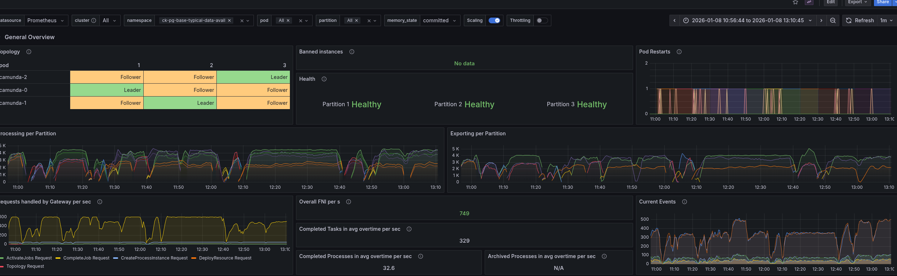

The data availability metric shows high values and is unstable because of this as well.

#### Base stress test

For better comparison and evaluation, we fall back to the [stress test](https://github.com/camunda/camunda/blob/main/docs/testing/reliability-testing.md#max--stress-load-test) load, using one task per process instance and creating 150 process instances per second.

This test is more stable and allows us to reason about the data availability metric better.

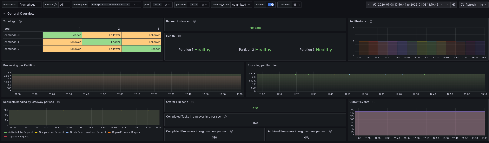

#### Stress test with high load

We increased the load of the stress test to 300 process instances per second. After doing so we observed that the system is not able to handle this load and the process instance creation rate seem to be limited at ~150 PIs, which was unexpected.

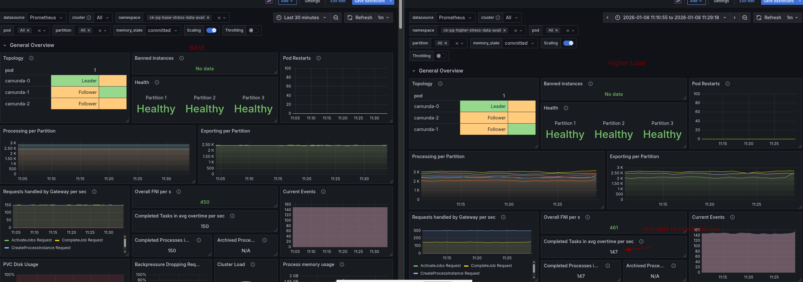

Looking at the data availability metric, we can see that it is affected by the higher load as well. It goes up to one minute and higher, which is way beyond acceptable limits.

#### Investigation

Based on the observation, we started to investigate the reasons for the limited throughput and high data availability.

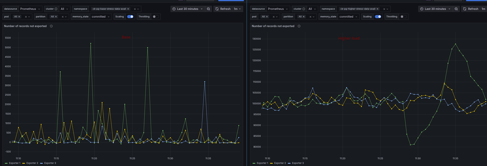

Camunda seems to lag behind with exporting data to ELS, which causes the high data availability times. Expecting ELS to be the bottleneck, we looked at its CPU usage and throttling.

This seems to be fine, with low throttling and CPU usage. At least lower than under normal load.

It is interesting that the CPU usage on the Camunda side is much higher and also shows higher throttling.

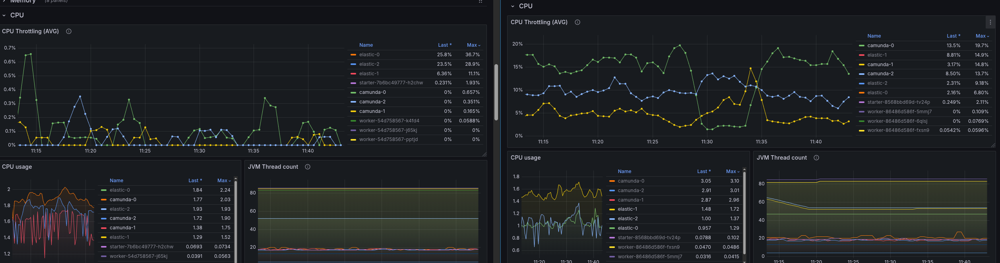

Further investigation showed that the commit latency is higher as well, which could explain the slowdown of the system.

As we have introduced recently, daily max load tests, we remembered that the maximum achievable load was previously higher, like ~200 PIs. Looking at the historical data we could confirm this.

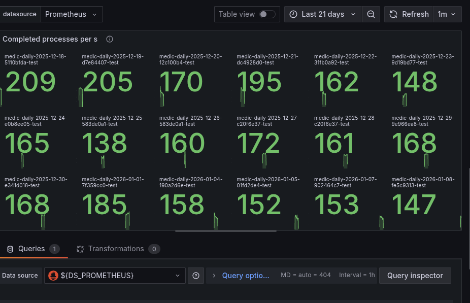

Before 19.12, we were normally able to reach 200+ PIs per second; after that, it seems to slow down.

Looking at the current events over time, we can observe this as well.
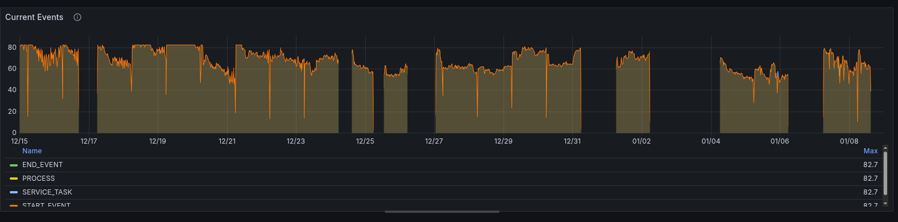

This view also allows us to better compare differences in latencies. For example, in the commit latency, we can see that after 19.12, the latency is higher on average.

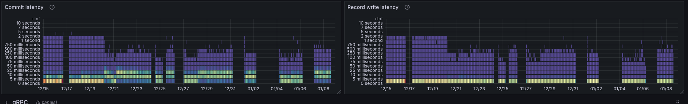
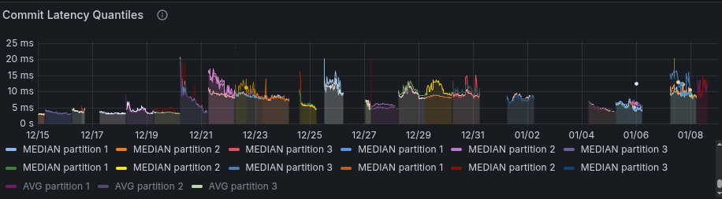

While the journal append latency seemed to decrease, the flush latency went up.

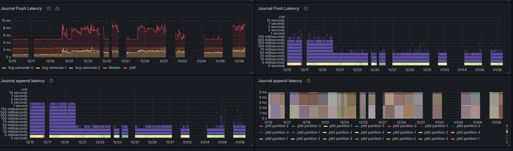

Some panels are also not correctly showing the expected data, after adding the quantiles we were able to see that the append latency is actually higher as well.

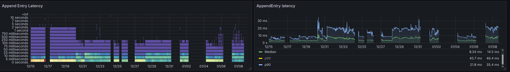

As this indicated a change around 19.12, we have investigated [related changes in the code basis](https://github.com/camunda/camunda/commits/main/?since=2025-12-19&until=2025-12-19&before=dfe3ffb6f781e98e5094ebaa7c1ed331d4da4929+105). The changes had to be related to raft or the journal flushing, which is why the following changes stand out:

 * [feat: set default segment-preallocation-strategy to POSIX_OR_FILL](https://github.com/camunda/camunda/pull/43090)
 * [deps: Update dependency io.netty:netty-bom to v4.2.7.Final (main)](https://github.com/camunda/camunda/pull/33442)

To validate whether these changes are the root cause, we have created a benchmark reverting these changes and running the stress test again.

It turned out that the netty changes (especially the decoding changes) were the root cause (or at least part) of the performance regression.

We achieved a throughput of at least 185 PIs per second. The commit latency also decreased again by a factor of 2, which also had a similar effect on the process instance execution time.

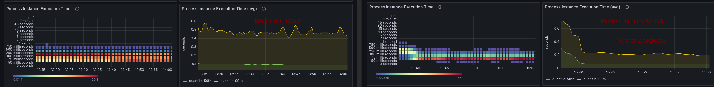

#### Additional investigation of request counts

During our investigation of our high-load stress tests, we have observed high backpressure at higher loads. We have also observed that the process instance rate is still constant and does not show that the starter is actually retrying requests. But we have seen that the messages sent in the cluster, especially to the Command API, are unexpectedly high, hinting at some internal retries.

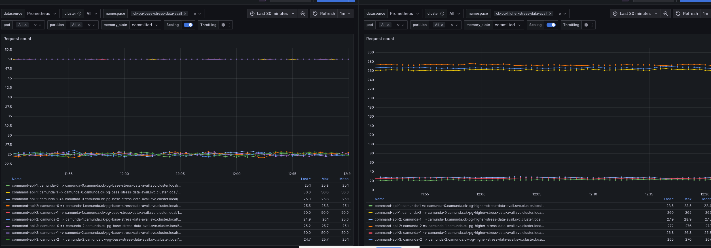

When investigating this further, we have found out that in the Gateway / Endpoint Manager, we are retrying requests [on resource exhausted errors (we try the next partition)](https://github.com/camunda/camunda/blob/main/zeebe/gateway/src/main/java/io/camunda/zeebe/gateway/impl/broker/RequestRetryHandler.java#L148).

**Problem:** As we sent our load round-robin, we can expect that partitions experience equal load. If one of these partitions experiences resource exhaustion, it is **likely** that other partitions will experience the same problem. Meaning if we now retry the request to the next partition, it will likely also fail, causing more retries and more load on the orchestration cluster.

As an experiment, we tried to fix this behavior [#43679](https://github.com/camunda/camunda/pull/43679) and run some further tests, but it didn't fully help in restoring our general performance.

### Summary of findings

* We have observed that the data availability metric is affected by the load on the system. Increasing the process instance creation rate leads to higher data availability times.
* We still seem to be affected by [issue 42244](https://github.com/camunda/camunda/issues/42244), causing instability in our typical load test.
* We have identified a performance regression introduced around 19.12, related to Netty changes, which limited our max throughput and increased commit latencies.
* We have identified that high load causes resource exhaustion errors in the orchestration cluster, leading to request retries in the Gateway, which further increases load on the system. This exacerbates load issues and can lead to higher data availability times.

While we were not able to prove our expectations or hypotheses, we have identified several areas for improvement and further investigation to enhance our performance and data availability under high load conditions.

