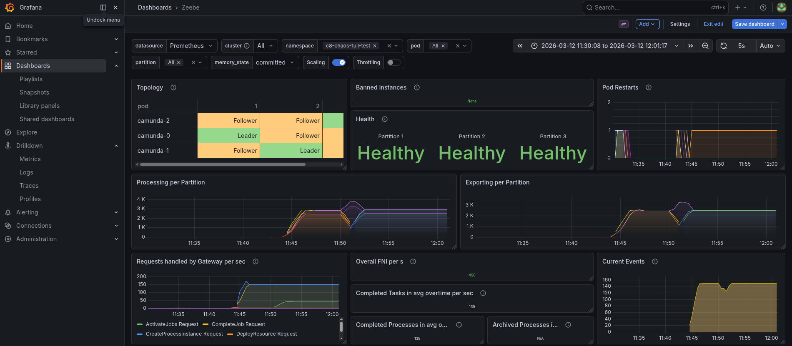
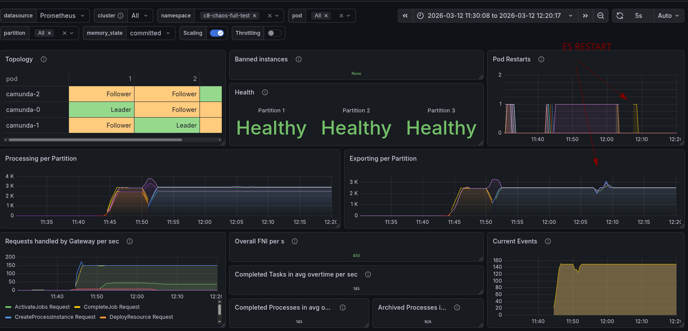
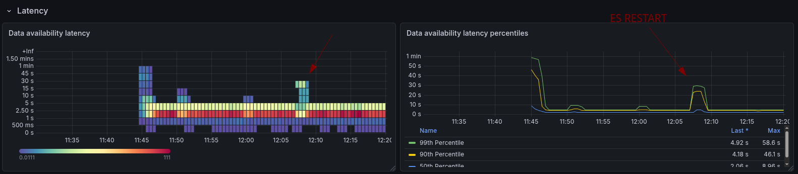
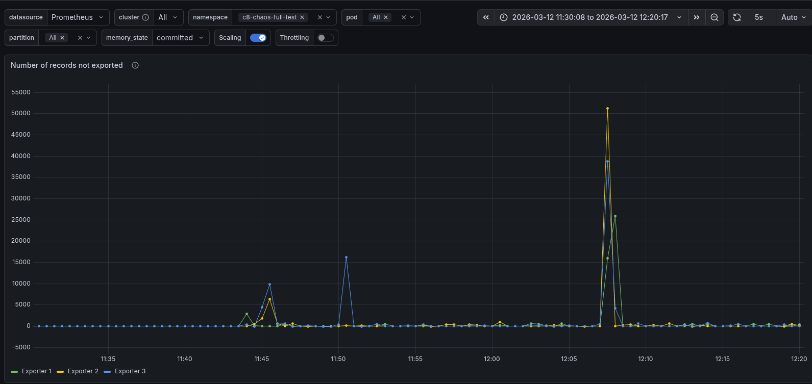
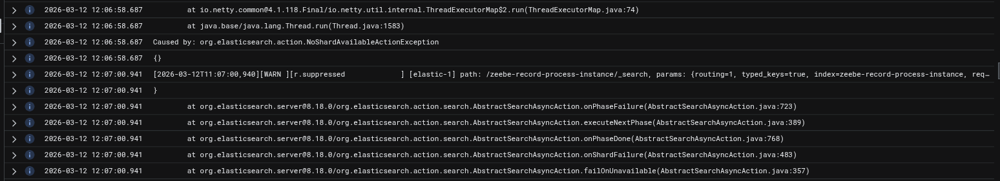
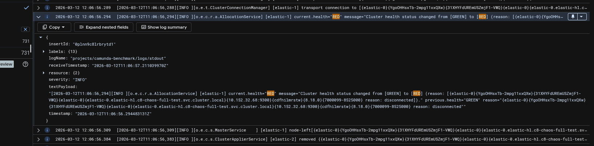
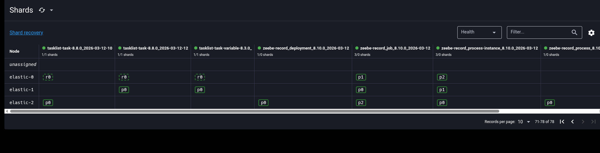

# Chaos Day Summary

In todays Chaos day we explored the impact of Elasticsearch availabilty on Camunda 8.9+ (testing against main).

While we tested last year already resiliency of our System against ES restarts, see [previous post](../2025-08-26-Resiliency-against-ELS-unavailability/index.md), we have run OC cluster only. Additionally, certain configurations have been improved (default replica configurations, etc.). 

This time we wanted to see how the system behaves with OC + ES Exporter + Optimize is enabled in addition.

I was joined by [Jon](https://github.com/multani) and [Pranjal](https://github.com/pranjalg13) the newest members of the reliability testing team.

**TL;DR;** While we found out that short ES unavailabiliies do not impact the processing performance, depending on the configuration it can impact the data availability. For longer outages, this would then also impact Camunda processing. To mitigate this proplem, necessary configurations are not properly exposed, and need to be fixed in the Helm Chart.


<!--truncate-->

## Chaos Experiment

As mentioned earlier, we ran this time the complete Orchestration Cluster, with Optimize included, Authentication enabled (Keycloak, Identity).

For reference the setup is documented here, in short we ran the following components:

* Optimize deployment (importer,webapp)
* Keycloak 
* Managed Identity
* PostgreSQL (for Identity and Keycloak)
* Camunda Cluster (3 Nodes)
* Elasticsearch Cluster (3 Nodes)
* Starter and Worker (load test deployment)

### Expected

When restarting one Elasticsearch Node, we expected no impact for the Customer, at least in regards to processing.

### Actual

While starting up the cluster, we experienced a longer delay, it seems that Camunda applications are now more tightly coupled to ES. This means ES needs to be available, so Camunda can start the first time.

```sh
$ kgpo -w
NAME                                            READY   STATUS       RESTARTS      AGE
c8-chaos-full-test-connectors-c7bd56bdd-fj2lc   0/1     Running      0             101s
c8-chaos-full-test-identity-5f85fc588b-b7cxq    0/1     Running      0             101s
c8-chaos-full-test-keycloak-0                   1/1     Running      0             101s
c8-chaos-full-test-optimize-bc8f64d8b-9hghx     0/1     Init:Error   2 (21s ago)   28s
c8-chaos-full-test-optimize-bc8f64d8b-lwwnb     0/1     Init:Error   3 (57s ago)   101s
c8-chaos-full-test-postgresql-0                 1/1     Running      0             101s
camunda-0                                       0/1     Running      0             101s
camunda-1                                       0/1     Running      0             101s
camunda-2                                       0/1     Running      0             101s
elastic-0                                       0/1     Running      0             101s
elastic-1                                       0/1     Running      0             100s
elastic-2                                       0/1     Running      0             100s
prom-els-exporter-65484b6684-56hx2              1/1     Running      0             95s
starter-8458c4b895-wt2zf                        1/1     Running      0             98s
worker-c994df6c7-bbc9x                          1/1     Running      0             98s
worker-c994df6c7-jsddj                          1/1     Running      0             98s
worker-c994df6c7-wjmlv                          1/1     Running      0             98s
.....
.....     ES starts first
.....
elastic-0                                       1/1     Running      0             106s
elastic-1                                       1/1     Running      0             106s
c8-chaos-full-test-optimize-bc8f64d8b-9hghx     0/1     Init:CrashLoopBackOff   2 (12s ago)   37s
elastic-2                                       1/1     Running                 0             112s
c8-chaos-full-test-optimize-bc8f64d8b-9hghx     0/1     Init:0/1                3 (26s ago)   51s
c8-chaos-full-test-optimize-bc8f64d8b-9hghx     0/1     PodInitializing         0             58s
c8-chaos-full-test-optimize-bc8f64d8b-9hghx     0/1     Running                 0             59s
camunda-2                                       1/1     Running                 0             2m24s
camunda-1                                       1/1     Running                 0             2m25s
c8-chaos-full-test-identity-5f85fc588b-b7cxq    1/1     Running                 0             2m28s
camunda-0                                       1/1     Running                 0             2m31s
c8-chaos-full-test-connectors-c7bd56bdd-fj2lc   1/1     Running                 0             2m32s
```


> Note:
>
> This is something we might be able to improve in the future. 
> The reason is that we bootstrap the SchemaManager (component which is responsible for the ES/OS schema) and wait for its completion.
> This can only complete when ES is up and running, the bootstrap of further components is delayed until the SchemaManager is done.


After a short period of time all the components came up.




When we deleted the `elastic-0` pod, we saw that the Exporting shortly dipped, but the processing was in general not impacted.



Looking at the data availability metrics, which we measure in our load test applications, we saw that it was increasing from ~5s to ~30s (p99).



Looking into this further, we can see that the Exporters had experienced a sort of backlog of not exported records, during the time of ES unavailability.



As we were thinking and discussing this, we were actually expecting with three ES nodes to have no impact. 

Because of this we investigated the ES logs furhter, we saw exceptions of shards not available and ES become RED.




Driven by these findings we looked further, into ES, as we expected some wrong configuration with the indices.



Indeed, we were able to find out that the `zeebe-record` indices had no replication configured. 

This means when an elasticsearch node goes down, the Elasticsearch Export will fail to flush. Normally the exporters have a batch of around 1000 records, but eventually they have to flush their data. If this fails, this will block further exporting.

This will not only block the Elasticsearch Exporter, which is needed for Optimize, but also the new CamundaExporter which is writing the Operate and Tasklist indices. 

This is why we see an increase in data availability during this time. If the availability takes longer than, what we have experienced ~2 minutes, then it might even cause more issues. Camunda supports a certain backlog until it starts to backpressure, and no longer accepts new incoming requests.

Good news is, that this can be mitigated by configuring the Elasticsearch Exporter, and the replica properly. This obviosluy requires a cluster of multiple Elasticsearch nodes, and has an additional impact on the load of ES, so this need to be properly load tested as well.

Bad news, it seems to be not easy to configure with the current Helm Charts. Workaround is to use the [`extraConfiguration`](/home/cqjawa/go/src/github.com/zeebe-io/zeebe-chaos/chaos-days/blog/2026-03-12-Elastic-restart-impact-on-Camunda/index.md)

Example configuration for the Elasticsearch Exporter can be found [here](https://docs.camunda.io/docs/next/self-managed/components/orchestration-cluster/zeebe/exporters/elasticsearch-exporter/#example). The `index.numberOfReplicas` configuration is not documented, but exposed [here](https://github.com/camunda/camunda/blob/main/zeebe/exporters/elasticsearch-exporter/src/main/java/io/camunda/zeebe/exporter/ElasticsearchExporterConfiguration.java#L256)


## Found Weaknesses / Learnings

- Bootstrapping Camunda now depends on ES - which makes bootstrapping take longer (compared to previous architecture in 8.7)
- When ES indicies are not set up properly, then multi-node ES Cluster doesn't help. Unavailability of an ES Node will impact Camunda
- Per default the Helm Charts are not configuring the replicas for ES Exporter indices
- In the Helm Chart it is hard to configure it. We must use the `extraConfiguration`
- The `index.numberOfReplicas` configuration is not documented, but exposed [here](https://github.com/camunda/camunda/blob/main/zeebe/exporters/elasticsearch-exporter/src/main/java/io/camunda/zeebe/exporter/ElasticsearchExporterConfiguration.java#L256)


