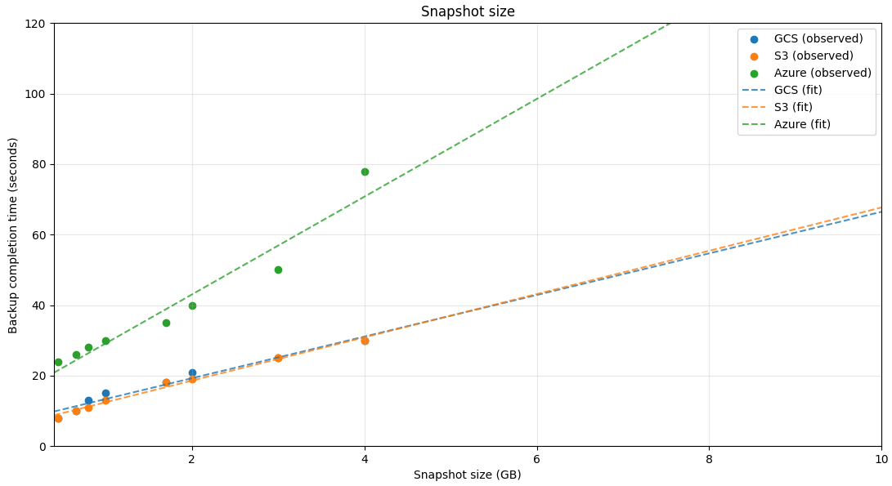

# Chaos Experiment Summary

With the introduction of the RDBMS support in Camunda 8.9, we needed a reliable and consistent mechanism to back up Zeebe’s primary storage. To address this, we introduced scheduled backups, which allow operators to configure a backup interval with the same processing guarantees the engine already provides, since backups are also supported by the logstream itself.

Since our goal is to achieve the highest possible RPO (Recovery Point Objective) without sacrificing processing throughput, we’ve made several improvements across the supported backup stores. This experiment measures where we currently stand in practice.

Within the bounds of this experiment, we compare backup-store performance across the three major cloud providers: Google Cloud Storage (GCS), AWS S3, and Azure Blob Storage.

## Chaos experiment

### Expected outcomes

The expectations of this experiment are to:
- Assess how well scheduled backups meet our RPO requirements under sustained high load.
- Provide a rule of thumb for configuring the scheduler’s backup interval based on cluster usage and runtime state size.

### Setup

The experiment uses a max-throughput benchmark from our [Camunda load tests project](https://github.com/camunda/camunda-load-tests-helm), running on its own Kubernetes cluster.

The cluster uses a standard setup of 3 Zeebe brokers with 3 partitions and a replication factor of 3. Zeebe brokers are provisioned with 2 GiB of memory and 3 CPUs, similar to what a [base 1x cluster](https://docs.camunda.io/docs/components/best-practices/architecture/sizing-your-environment/#camunda-8-saas) is.

The benchmark scenario is fairly simple:
- A single service-task process definition
- An external client creating new process instances at a rate of 300 PIs/sec, including large variables
- Three workers completing service tasks with a configured delay of 500 ms, also injecting large variables into the process instance scope

We inject large variables to increase Zeebe’s runtime state, which increases the RocksDB snapshot size and therefore the overall required backup size.

### Experiment

To introduce scheduled backups, we configured the Zeebe brokers as follows:

```
CAMUNDA_DATA_PRIMARYSTORAGE_BACKUP_CONTINUOUS=true
CAMUNDA_DATA_PRIMARYSTORAGE_BACKUP_CHECKPOINTINTERVAL=PT30S
CAMUNDA_DATA_PRIMARYSTORAGE_BACKUP_SCHEDULE=PT2M
```

See [the documentation](https://docs.camunda.io/docs/next/self-managed/components/orchestration-cluster/zeebe/configuration/broker-config/#camundadataprimary-storagebackup) for configuration option definitions. In short, we take a full Zeebe backup every 2 minutes and inject marker checkpoints into the log stream every 30 seconds.

#### Measurement

We sampled results using the provided [Grafana dashboard](https://github.com/camunda/camunda/blob/7a24435ba60e341db9095d381ce510fa6794db5f/monitor/grafana/zeebe.json).

- **Backup size:** Approximated via RocksDB live data size per partition (metric: _zeebe_rocksdb_live_estimate_live_data_size_).
- **Backup duration:** Captured via the dashboard panel _Take Backup Latency_. The expression's window was calibrated to 10 minutes (instead of 1 hour) to better capture latency in our setup. With backups taken every two minutes, the latency averages a window of roughly 5 backup executions

_Throughout the experiment, we aimed to maintain >80% cluster load while sustaining ~300 process instances per second.

### Results

Results were collected over an average of three benchmark runs for each backup store.

| Size  | Google Cloud Storage | AWS S3 | Azure Blob Storage |
|------:|----------------------:|-------:|------------------:|
| 450MB | 8s                    | 8s     | 24s               |
| 660MB | 10s                   | 10s    | 26s               |
| 800MB | 13s                   | 11s    | 28s               |
| 1GB   | 15s                   | 13s    | 30s               |
| 1.7GB | 18s                   | 18s    | 35s               |
| 2GB   | 21s                   | 19s    | 40s               |
| 3GB   | 25s                   | 25s    | 50s               |
| 4GB   | 30s                   | 30s    | 78s               |

Based on the collected data points, all backup stores behave roughly linearly with respect to runtime state size, which makes it straightforward to extrapolate expected backup latency.



Zeebe actors distinguish between CPU-bound and I/O-bound tasks, with CPU-bound tasks taking precedence. Because our scenario sustains high CPU utilization, backup completion time is impacted. Capturing the same runtime state sizes without load can reduce backup time by up to ~50%.

## Conclusion

Maximizing your RPO means having backups available as close to the failure point as possible. With scheduled backups, this becomes more feasible while being backed up by the engine’s processing guarantees.

Runtime state size is only one of the factors affecting backup completion time and provides a good starting reference point. During our experiments, throughput interference was minimal—dare I say barely noticeable.

As a rule of thumb, the backup schedule's interval should be higher than tge backup completion latency. Multiple in-flight backups can potentially hinder cluster performance. The provided Grafana dashboards make it straightforward to track these metrics and configure scheduled backups accordingly.

### Future work

During these experiments, we also investigated:
- Utilizing connection-based GZIP compression for backup contents
- Pre-compressing backup contents

These approaches yielded improvements in backup completion latency, but added overhead on the processing side and slightly reduced overall throughput. These were draft investigatory implementations for future reference.

An improvement that would most likely have the largest impact in taking a backups is performing proper RocksDB incremental snapshots, since that would minimize the amount of data
required per backup. However, this approach come with it's own problems to tackle, not being that straightforward either.
