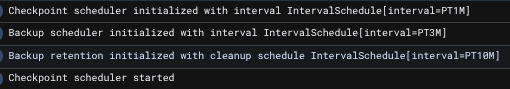
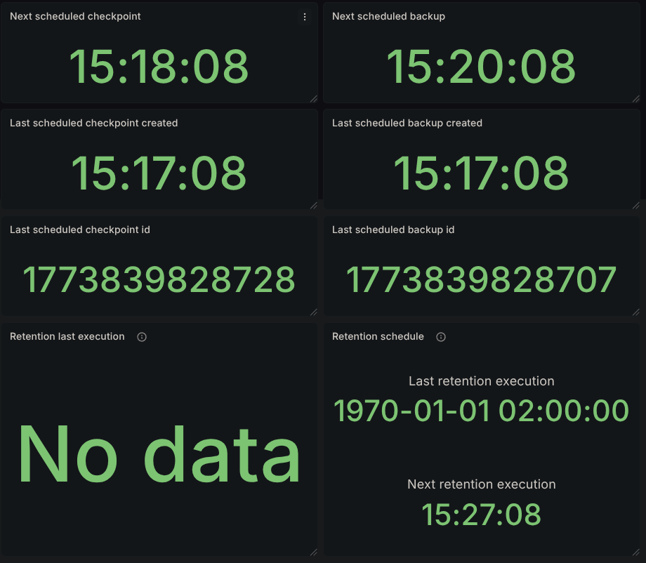
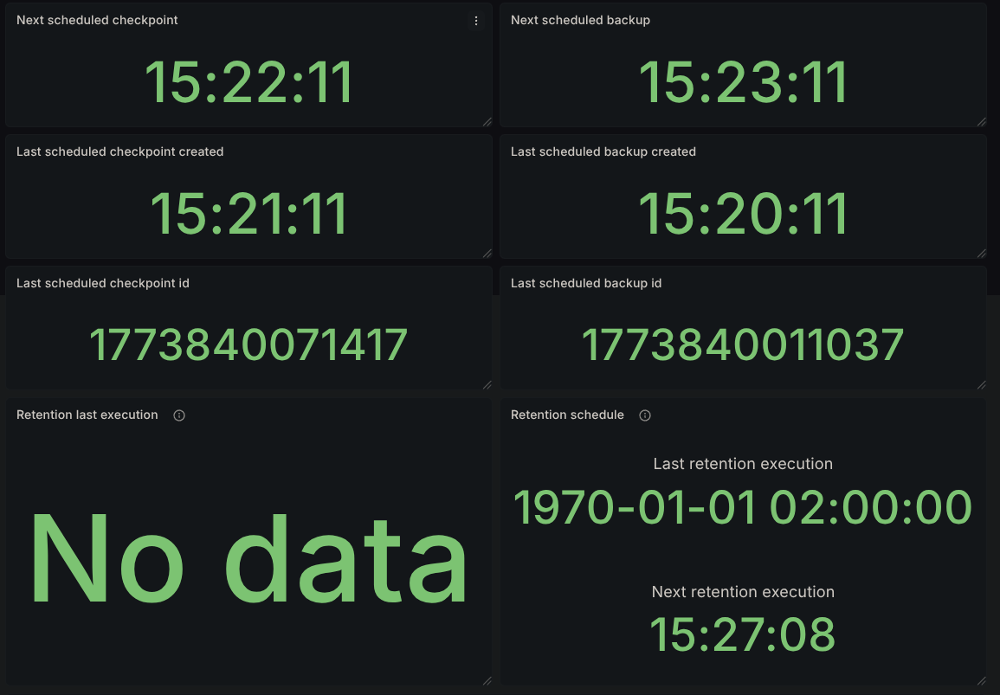
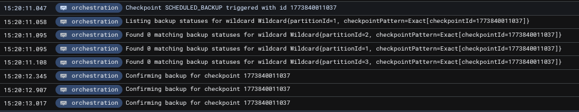
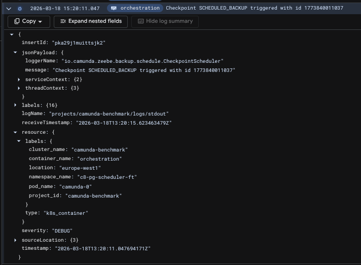
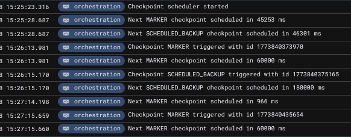
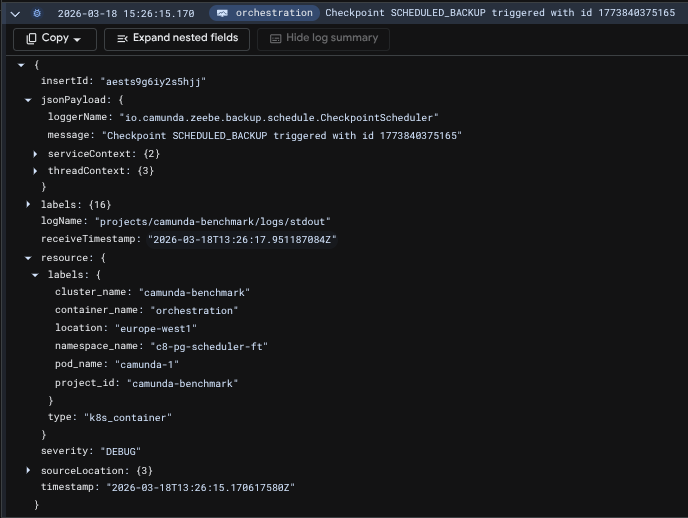
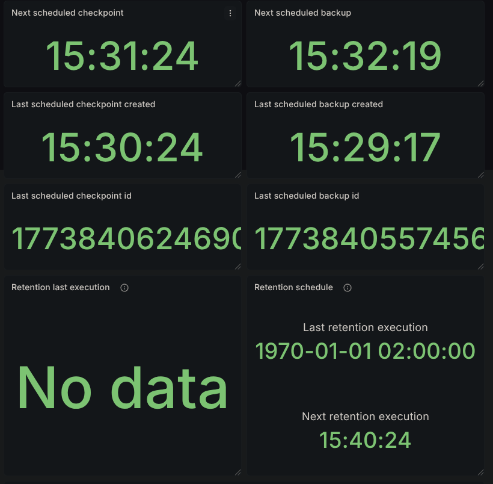
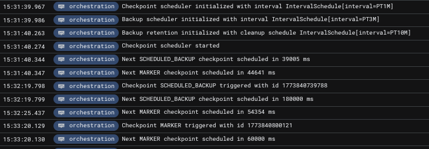
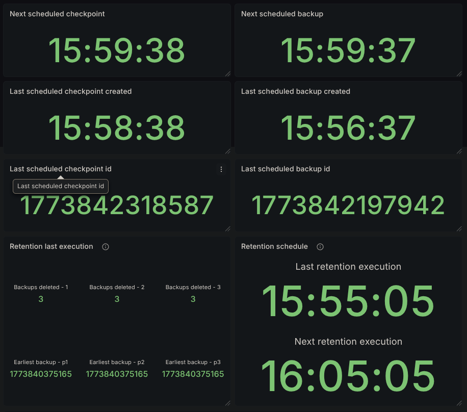

# Chaos Experiment Summary

With the introduction of RDBMS support in Camunda 8.9, we needed a reliable and consistent mechanism to automatically back up Zeebe's primary storage. It was mandatory to have a resilient scheduling mechanism that was able to survive cluster disruptions. To address this, we introduced scheduled backups, which allow operators to have a deterministic mechanism to back up the cluster's primary storage.

This experiment validates the resiliency of the Checkpoint Scheduler services under adverse conditions. Specifically, we test whether this critical service can maintain its configured schedule when brokers are disconnected and cluster topology changes occur, ensuring continuous backup operation even during partial cluster failures.


## Scheduler introduction

To guarantee the continuity and correctness of primary storage backups, it was required to have a cluster-level service responsible for performing backups at predefined intervals. For this reason, we introduced the _Checkpoint Scheduler_, which serves as the timekeeper of checkpoint creation in the cluster, fanning out the creation of checkpoints to all partitions.

The scheduler is always assigned to the broker with the lowest `id` that is part of the replication cluster. Under normal operation, that would mean that the `camunda-0` pod is the one with the service registered. The scheduler's interval, while preconfigured, is dynamic and will adapt to network issues in a best-effort manner to maintain the desired interval.

Currently, it supports two types of checkpoints:
- `MARKER`: Used as reference points for point-in-time restore operation
- `SCHEDULED_BACKUP`: Trigger a primary storage backup


Alongside the scheduler, a retention service is also registered on the same broker if a retention schedule is configured. This service is responsible for deleting backups outside the configured window to reduce storage costs. Furthermore, backups that are too old are not that useful in a disaster recovery scenario.

The checkpoint scheduler and the retention mechanism can be configured via the available [options](https://docs.camunda.io/docs/next/self-managed/components/orchestration-cluster/zeebe/configuration/broker-config/#camundadataprimary-storagebackup).


## Chaos experiment

### Expected outcomes

The expectation of this experiment is to prove that the checkpoint and backup scheduler is resilient to network and topology changes that can occur within a cluster's lifespan.

### Setup

In this experiment, we'll be using a standard Camunda 8.9 Kubernetes installation with the checkpoint scheduler and retention enabled. The installation consists of 3 brokers in the `camunda` stateful set, labeled as `camunda-0`, `camunda-1` and `camunda-2`.

#### Enabling the scheduler

To enable the checkpoint & backup schedulers, we supply the following configuration parameters for the `camunda` stateful set:

```
CAMUNDA_DATA_PRIMARYSTORAGE_BACKUP_CONTINUOUS=true
CAMUNDA_DATA_PRIMARYSTORAGE_BACKUP_CHECKPOINTINTERVAL=PT1M
CAMUNDA_DATA_PRIMARYSTORAGE_BACKUP_SCHEDULE=PT3M
CAMUNDA_DATA_PRIMARYSTORAGE_BACKUP_RETENTION_WINDOW=PT30M
CAMUNDA_DATA_PRIMARYSTORAGE_BACKUP_RETENTION_CLEANUPSCHEDULE=PT10M
```

This means that we take a full Zeebe backup every 3 minutes and inject marker checkpoints into the log stream every 1 minute. We also want to maintain a rolling window of 30 minutes' worth of backups, and we check for backups to be deleted every 10 minutes.

#### Node disconnect

To simulate disconnecting a node from the Camunda Orchestration cluster, we can use a simple Kubernetes network policy:
```yaml
apiVersion: networking.k8s.io/v1
kind: NetworkPolicy
metadata:
  name: isolate-pod
  namespace: <namespace>
spec:
  podSelector:
    matchLabels:
      isolated: "true"
  policyTypes:
  - Ingress
  - Egress
```

This policy matches the given label `isolated` present on deployed pods; disconnecting a node just requires applying this label. For example, `kubectl label pod camunda-0 isolated=true --overwrite` will result in the pod `camunda-0` being removed from the Orchestration cluster.

### Experiment

#### Starting the cluster

Upon applying this configuration we see the following logs being produced, verifying the presence of the scheduler:



You may notice that these logs are present on all brokers; this is intentional, as the service being active is based on the intra-cluster discovery protocol, which is updated in real-time. This means that when, for example, `camunda-0` is considered _gone_, `camunda-1` is ready to take over the service and pick up where it should.

Also, the first backup has already been taken. As there was no previous backup present, an immediate one is captured. With that in mind, if a cluster sustains a prolonged unhealthy state for more than the configured backup interval, the next backup will be immediately taken once the cluster reaches a healthy state.

And also [Grafana's dashboard](https://github.com/camunda/camunda/blob/7a24435ba60e341db9095d381ce510fa6794db5f/monitor/grafana/zeebe.json) related to the scheduler will start displaying proper data:



After the first 3 minutes pass, according to the backup interval, we should have a backup available:



and the corresponding logs related to it with the matching timestamps:



Inspecting the logs further, we see that the initiating node of that backup was the pod `camunda-0`, which is expected.




The checkpoints can also be verified by querying Zeebe's internal state via the actuator. Notice in the following response that the `checkpointId` for the backups and for the active ranges matches what's seen in the metrics as well.

_The result contains a single partition's state to reduce size_

```bash
curl localhost:9600/actuator/backupRuntime/state

{
  "checkpointStates": [
    {
      "checkpointId": 1773840131794,
      "checkpointType": "MARKER",
      "partitionId": 2,
      "checkpointPosition": 1695,
      "checkpointTimestamp": "2026-03-18T13:22:11.781+0000"
    }
  ],
  "backupStates": [
    {
      "checkpointId": 1773840011037,
      "checkpointType": "SCHEDULED_BACKUP",
      "partitionId": 2,
      "checkpointPosition": 1465,
      "firstLogPosition": 1,
      "checkpointTimestamp": "2026-03-18T13:20:13.001+0000"
    }
  ],
  "ranges": [
    {
      "partitionId": 2,
      "start": {
        "checkpointId": 1773839828707,
        "checkpointType": "SCHEDULED_BACKUP",
        "checkpointPosition": 1095,
        "firstLogPosition": 1,
        "checkpointTimestamp": "2026-03-18T13:17:10.852+0000"
      },
      "end": {
        "checkpointId": 1773840011037,
        "checkpointType": "SCHEDULED_BACKUP",
        "checkpointPosition": 1465,
        "firstLogPosition": 1,
        "checkpointTimestamp": "2026-03-18T13:20:13.001+0000"
      }
    }
  ]
}
```

#### Disconnecting camunda-0

Executing `kubectl label pod camunda-0 isolated=true --overwrite` causes broker 0 to be disconnected from the cluster. For the scheduling service, this effectively means that it should be handed over to the `camunda-1` broker. Sure enough, the logs confirm this:





We can clearly see in the logs that the next expected backup is scheduled in less than the configured 3 minutes. This is intentional; as mentioned before, the scheduler's interval is dynamically adapting to maintain the backup schedule.

#### Disconnecting camunda-1

Applying the `isolated` label on camunda-1 causes the cluster to reach an unhealthy state, since it has now suffered 2 node losses. The remaining node, `camunda-2`, cannot form a cluster and is unable to proceed in the startup sequence to start initiating backups.

#### Rejoining brokers

Removing the label from the disconnected pods,

```bash
kubectl label pod camunda-0 isolated-
kubectl label pod camunda-1 isolated-
```

causes yet another handover, this time back to the `camunda-0` node, and the schedule's execution continues as expected.






## Bonus: Retention

Having the cluster running long enough causes retention to kick in, so its metrics and results are also available in the dashboard. We can see that we have 3 backups deleted for each partition.



We also see the earliest backup still present that was not picked up by retention, `1773840375165`. Looking in the logs, we can also confirm its execution time, `15:26`.


Since our backups started at `15:17`, we expect to have backups available at the following timestamps:

- 15:17
- 15:20
- 15:23
- 15:26
- 15:29...

Since retention was executed at `15:55`, the reported count of backups pruned is on par with what's expected. Backups taken at `15:17`, `15:20`, and `15:23` all satisfy being 30 minutes before the retention mechanism execution.


## Conclusion

In this experiment, we've validated that the checkpoint and backup scheduler can maintain the configured backup interval while surviving broker disconnects and topology changes. The service successfully demonstrated automatic failover, transferring from `camunda-0` to `camunda-1` when the primary broker was isolated, and seamlessly returning control when the original broker rejoined the cluster.

Key findings include:

1. **Automatic failover**: The scheduler service correctly reassigns to the next available broker with the lowest ID when the current scheduler node becomes unavailable
2. **Dynamic interval adjustment**: The scheduler adapts its timing to compensate for disruptions, ensuring backups remain on schedule despite temporary delays
3. **Retention reliability**: The retention mechanism functions properly, maintaining the configured rolling window and properly cleaning up expired backups

These results confirm that operators can rely on the checkpoint scheduler to maintain continuous backup operations even with cluster-level disruptions, guaranteeing the system's ability to properly maintain the configured schedule without manual intervention.
