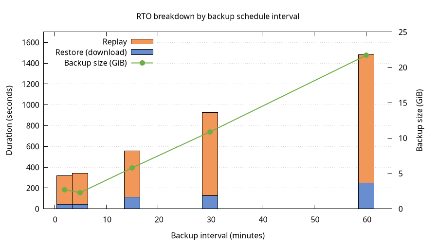

# Chaos Day Summary

With the upcoming Camunda 8.9 release, we will support RDBMS as secondary storage as an alternative to Elasticsearch and OpenSearch.
Because there is no common API for taking backups of relational databases, we had to revise our approach to backup and restore significantly.
We now support a `continuous` backup mode that allows users to take backups of secondary and primary storage independently from each other.
Backups of primary storage will cover a contiguous time range, allowing us to restore from one or multiple primary storage backups to match the state in secondary storage.

In this chaos day, we are testing our Recovery Time Objective (RTO), the time it takes to recover data from backups and become fully operational again, with varying backup schedules.
When backups are taken less frequently, each backup covers a longer time window and therefore includes more accumulated log segments.
We want to understand how this translates to RTO.

<!--truncate-->

## Chaos Experiment

We run the same Kubernetes cluster under the same load with different backup schedules, then perform a restore for each schedule.
We measure the time it takes to restore the data and the time it takes to replay that data.
By keeping everything constant except the schedule interval, we can isolate its effect on RTO.

### Hypothesis

We expect RTO to increase roughly linearly with the backup schedule interval because:

1. Backup sizes increases because Zeebe accumulates log segments proportional to processing throughput in the backup timeframe.
2. After restore, the log needs to be replayed. This should also be proportional to processing throughput in the backup timeframe.

Concretely, if a 5-minute schedule produces backups that take ~45 seconds to restore, a 30-minute schedule should produce backups that take roughly 6× longer to download, yielding an RTO in the range of ~4-5 minutes.

We also expect the RocksDB snapshot portion of the backup to remain roughly constant across schedules (it depends on runtime state, not backup frequency), so the growth should come entirely from log segment size.

### Setup

We use 5 GCS-backed clusters on GCP (`europe-west1`) with Postgres as secondary storage — one per backup schedule — so trials can run in parallel.

**Cluster configuration:**
- 3 Zeebe brokers (StatefulSet `camunda`), 3 partitions, replication factor 3
- Continuous backups enabled (`CAMUNDA_DATA_PRIMARYSTORAGE_BACKUP_CONTINUOUS=true`)
- Checkpoint interval: `PT30S` (constant across all trials)
- PostgreSQL as secondary storage
- PVCs sized at 64 GiB

**Load:**
- A "typical" benchmark scenario (single service-task process)
- Starter: 50 PI/s
- 6 Workers

**Backup schedules under test:**

| Trial | Schedule interval | Expected backups in 1 hour | Checkpoint interval |
|-------|-------------------|----------------------------|---------------------|
| 1     | `PT2M`            | ~30                        | `PT30S`             |
| 2     | `PT5M`            | ~12                        | `PT30S`             |
| 3     | `PT15M`           | ~4                         | `PT30S`             |
| 4     | `PT30M`           | ~2                         | `PT30S`             |
| 5     | `PT1H`            | ~1                         | `PT30S`             |

For each trial, we simulate a full disaster recovery while the cluster is running under load: restore Postgres from a backup taken between two primary storage backups, then restore primary storage to match.

#### Per-trial procedure

For each backup schedule:

1. Configure the backup schedule and let the cluster run under load until the first backup completes.

2. Take a Postgres backup (while the cluster is still running under load):
   ```
   kubectl -n $NS exec postgres-postgresql-0 -- \
     env PGPASSWORD=camunda pg_dump -U camunda -Fc camunda > pg-backup-trial-N.dump
   ```

3. Wait for the next scheduled backup to complete (one full interval). Verify via:
   ```
   curl -s http://localhost:9600/actuator/backupRuntime/state | jq .
   ```

4. Measure the latest backup size in GCS:
   ```
   gsutil du -sh gs://<bucket>/<basepath>/contents/<partition>/<backup-id>/
   ```

5. Simulate disaster — scale down brokers and delete volumes:
   ```
   kubectl -n $NS scale sts camunda --replicas=0
   kubectl -n $NS delete pvc -l app.kubernetes.io/component=zeebe-broker
   ```

6. Restore Postgres from the backup:
   ```
   kubectl -n $NS exec -i postgres-postgresql-0 -- \
     env PGPASSWORD=camunda pg_restore -U camunda -d camunda --clean --if-exists \
     < pg-backup-trial-N.dump
   ```
   The `exporter_position` table now reflects how far each partition had exported at dump time.
   The restore app uses this to determine which primary storage backups to download.

7. Deploy Kubernetes jobs which restore each broker's data disk.
   The init container uses the same `startup.sh`, config volume mounts, and environment variables as the main container, plus `ZEEBE_RESTORE=true`.

8. Scale up brokers again

8. Measure two things:
   - **Restore duration**: time from "Starting to restore" to "Successfully restored broker" in the restore job logs.
   - **Replay duration**: time from broker start ("Starting broker") to last "Processor finished replay" — one per partition leader.

### Results

#### Restore duration
The restore init container downloads backups from GCS and assembles the data directory.

| Schedule | Backup size | Restore duration (range across pods) |
|----------|-------------|--------------------------------------|
| PT2M     | 2.7 GiB     | 42.5 – 44.0s                         |
| PT5M     | 2.3 GiB     | 38.5 – 42.4s                         |
| PT15M    | 5.8 GiB     | 105.8 – 114.7s                       |
| PT30M    | 10.9 GiB    | 126.8 – 128.9s                       |
| PT1H     | 21.7 GiB    | 234.9 – 247.8s                       |

Restore duration scales roughly linearly with backup size: ~11s per GiB on GCS.

The PT2M and PT5M results are notably similar. Looking at the restore logs, PT2M restored **3 backups per partition** while PT5M restored **2**. The extra backup in PT2M is an artifact of experiment timing: the disaster simulation took over 4 minutes, during which 2 additional PT2M backups were created. The restore app included these in its restore set, inflating the total data to 2.7 GiB — comparable to PT5M's 2.3 GiB. In a real scenario where the disaster happens between two consecutive backups, PT2M would only need 1–2 backups and its RTO would be lower.

With faster reactions on the disaster, PT2M should yield lower RTO than PT5M because there's less data to download and replay.

#### Replay duration

After the restore init container completes, the broker starts and replays journal entries to rebuild in-memory state.
We measure the time between the first broker starting and the last leader finishing replay.

| Schedule | Replay duration (slowest pod) |
|----------|-------------------------------|
| PT2M     | 273s (~4.5 min)               |
| PT5M     | 298s (~5 min)                 |
| PT15M    | 442s (~7.4 min)               |
| PT30M    | 796s (~13.3 min)              |
| PT1H     | 1234s (~20.6 min)             |

Replay dominates total RTO.
While the restore init container takes 43s–248s, replay takes 273s–1234s — consistently 3–6× longer than the download phase.

#### Full RTO breakdown

| Schedule | Backup size | Restore (download) | Replay | Total RTO (worst pod) |
|----------|-------------|--------------------|--------|-----------------------|
| PT2M     | 2.7 GiB     | ~44s               | ~273s  | **~5.3 min**          |
| PT5M     | 2.3 GiB     | ~42s               | ~298s  | **~5.7 min**          |
| PT15M    | 5.8 GiB     | ~115s              | ~442s  | **~9.3 min**          |
| PT30M    | 10.9 GiB    | ~129s              | ~796s  | **~15.4 min**         |
| PT1H     | 21.7 GiB    | ~248s              | ~1234s | **~24.7 min**         |

#### Analysis



The hypothesis that RTO grows linearly with backup interval is partially confirmed:
- **Restore (download) duration** scales linearly with backup size, which scales linearly with the interval. Doubling the interval roughly doubles the download time.
- **Replay duration** also grows with the interval, but accounts for the majority of total RTO. This is expected: more log segments means more entries to replay after assembly.

Note that these clusters were running under sustained high load.
Replay time is proportional to the number of records in the journal, which is directly tied to processing throughput.
Clusters with lower load will accumulate fewer log entries per backup interval, resulting in proportionally shorter replay times and smaller backup sizes.

### Conclusion

RTO for continuous backup restore grows with the backup schedule interval, driven primarily by replay time rather than download time.

For operators:
- **Short intervals give fast recovery**: Total RTO is under 6 minutes, with most time spent in replay rather than download. The marginal cost of very frequent backups is minimal.
- **Long intervals compound RTO significantly**: A PT1H schedule results in ~25 minutes of total RTO — roughly 5× longer than PT2M. For clusters where recovery time matters, prefer shorter intervals.
- **RTO is dominated by Replay**: Even with the largest backups (21.7 GiB), download takes only ~4 minutes on GCS. The replay phase takes 3–6× longer. Optimizing replay performance (faster disks, more CPU) would have a larger impact on RTO than optimizing download speed.
