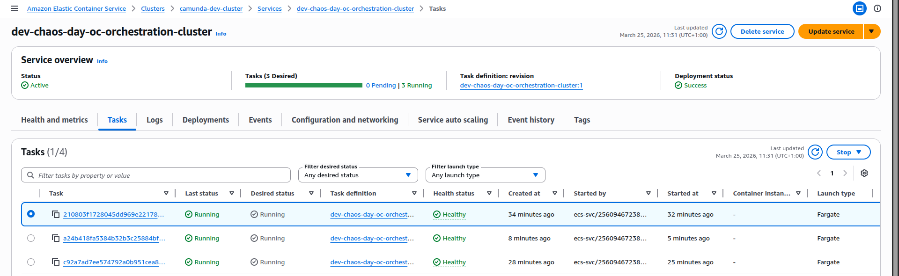

# S3-lease manipulation

With 8.9, we support C8 deployments on ECS. Camunda 8 is originally designed for Kubernetes StatefulSets, where each broker has a stable identity and disk. On Amazon ECS, tasks are ephemeral: IPs and container instances change frequently, and you rely on external storage like EFS and S3 instead of node-local disks.

To make this work safely, the Camunda 8 ECS reference architecture introduces a dynamic NodeIdProvider backed by Amazon S3. Each ECS task:

- Competes for a lease stored in S3 that represents a specific logical broker node ID.
- When it acquires the lease, it becomes that broker and uses a dedicated directory on shared EFS for its data.
- Periodically renews the lease; if renewal fails or preconditions are violated, the task shts down immediately to avoid corrupting data or having two brokers think they own the same node. 

In this experiment we explore what happens when a broker loses its S3-backed NodeId lease and another broker acquires it. In this experiment we simulate that scenario by artificially overwriting the lease object in S3 to represent a new owner and then observe how the original holder reacts.

## Goal

Hypothesis:  
If the S3 lease for a node Id is lost by the task, the NodeIdProvider should:

- Detect the inconsistency via conditional writes,
- Refuse to renew the lease,
- Shut the broker down cleanly so that ECS can replace it with a fresh task that acquires a new, valid lease.

## Setup

- Camunda 8 (Zeebe) on AWS ECS Fargate
- 3 brokers, 3 partitions
- Shared data on EFS
- NodeIdProvider using S3 leases:
  - One object per logical node (e.g. `2.json`)
  - Metadata carries the task id, version, and acquirable flag
  - Object body holds the lease payload (node id, version, known version mappings, timestamp)

Before the experiment, the S3 object for node 2 looked like this.

**Metadata:**

```json
"Metadata": {
  "taskid": "0afffc8d-3807-46cb-9a2e-3f65f96d2acb",
  "version": "2",
  "acquirable": "true"
}
```

**Payload:**

```json
{
  "taskId": "0afffc8d-3807-46cb-9a2e-3f65f96d2acb",
  "timestamp": 1774433501584,
  "nodeInstance": { "id": 2, "version": 2 },
  "knownVersionMappings": {
    "mappingsByNodeId": {
      "0": 2,
      "1": 3,
      "2": 2
    }
  }
}
```

This represents broker node 2, version 2, with a lease that is currently acquirable.

## Injecting failure: overwriting the lease in S3

To simulate the loss of the lease, we modified the timestamp and the taskId in the current `2.json` object and overwrote the object.

```bash
aws s3api put-object \
  --bucket "dev-chaos-day-oc-bucket" \
  --key "2.json" \
  --body 2.json \
  --metadata "version=2,acquirable=true,taskId=abc"
```

From the broker’s point of view, the lease it thought it owned has now been rewritten by someone else. In a real cluster, this situation should not occur as long as the current holder keeps renewing its lease within the configured lease duration. The overwrite here is artificial and is meant to simulate a scenario where the current holder has stopped renewing, and another broker has legitimately acquired the lease in the meantime.

## What we observed in the logs

Shortly after the override, the task assuming the role of node 2 started logging S3 errors during lease renewal:

- S3 precondition failure (HTTP 412) while trying to acquire/renew the lease:
  - `S3Exception: At least one of the pre-conditions you specified did not hold (Status Code: 412)`
- The NodeIdProvider logs clearly indicate:
  - “Failed to renew the lease: process is going to shut down immediately.”
  - “NodeIdProvider terminating the process.”

Once the NodeIdProvider decides the lease can’t be renewed safely, the broker begins a controlled shutdown. From the outside, this looks like a broker failure triggered by lease validation logic, not by ECS itself.

```
March 25, 2026, 11:20
[2026-03-25 10:20:41.663] [NodeIdProvider] WARN io.camunda.zeebe.dynamic.nodeid.RepositoryNodeIdProvider - Failed to renew the lease: process is going to shut down immediately. software.amazon.awssdk.services.s3.model.S3Exception: At least one of the pre-conditions you specified did not hold ...
March 25, 2026, 11:20
[2026-03-25 10:20:41.663] [NodeIdProvider] WARN io.camunda.zeebe.broker.NodeIdProviderConfiguration - NodeIdProvider terminating the process
```

## Replacement task and new lease

ECS notices that the service is now below the desired task count and starts a replacement task for the orchestration cluster:

1. The old task transitions to stopped.
2. A new ECS task is started for the same service.
3. On startup, the new task:

   - Acquires a new S3 lease for node 2 with version 3:
     - New `taskid` in metadata (the new ECS task id),
     - `"version": "3"`,
     - `"acquirable": "true"`.
   - Initializes a new data directory:
     - `/usr/local/camunda/data/node-2/v3` is created by copying from `/usr/local/camunda/data/node-2/v2`.
   - Starts rest of the services and joins the cluster.

```
March 25, 2026, 11:24
[2026-03-25 10:24:12.031] [main] INFO io.camunda.zeebe.dynamic.nodeid.fs.VersionedNodeIdBasedDataDirectoryProvider - Initializing data directory /usr/local/camunda/data/node-2/v3 by copying from /usr/local/camunda/data/node-2/v2
orchestration-cluster
March 25, 2026, 11:24
[2026-03-25 10:24:11.480] [NodeIdProvider] INFO io.camunda.zeebe.dynamic.nodeid.RepositoryNodeIdProvider - Acquired lease w/ nodeId=NodeInstance[id=2, version=Version[version=3]]. Initialized[metadata=Metadata[task=Optional[6670d8e5-ec20-4c03-9d99-6993f48b6617], version=Version[version=3], acquirable=true], lease=Lease[taskId=6670d8e5-ec20-4c03-9d99-6993f48b6617, timestamp=1774434266329, nodeInstance=NodeInstance[id=2, version=Version[version=3]], knownVersionMappings=VersionMappings[mappingsByNodeId={2=Version[version=3]}]], eTag="98e0408dfd5c07143686697207d411df"]
```

The resulting S3 object now represents node 2, version 3, with a fresh lease owned by the new task.

In ECS:

- The Tasks view shows three running tasks, all Healthy again.
- From the cluster’s perspective, we’re back to a stable, 3-broker topology.



## Takeaways

Overall, this experiment shows that when a broker loses its lease and another broker acquires it, the combination of NodeIdProvider safety checks and ECS rescheduling steers the system toward a safe recovery path rather than silent data corruption.