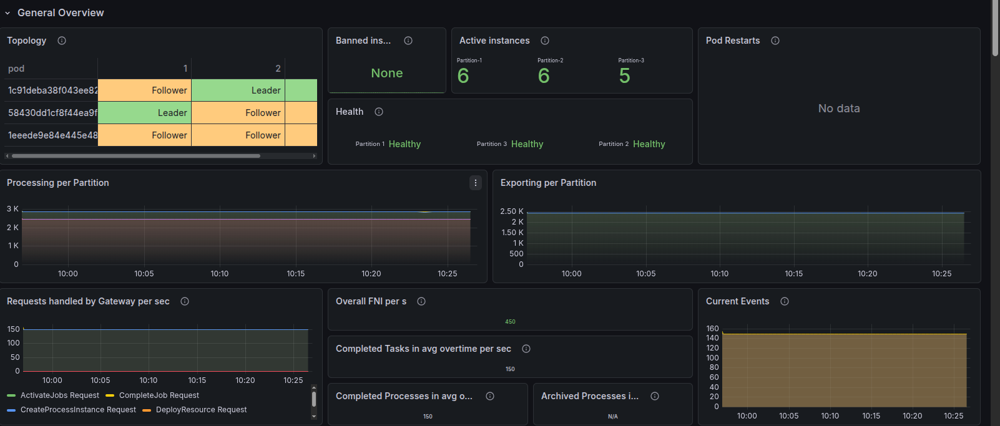
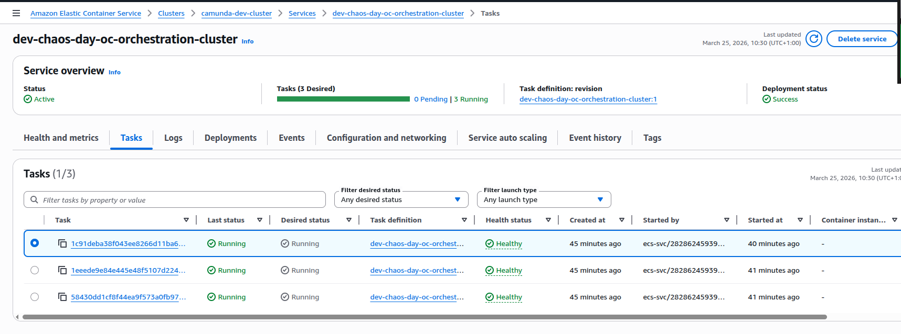
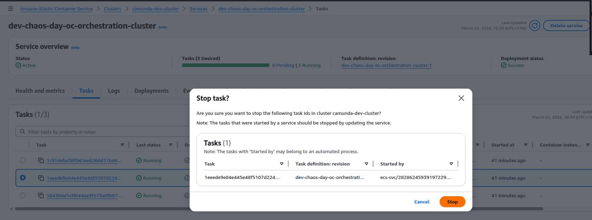
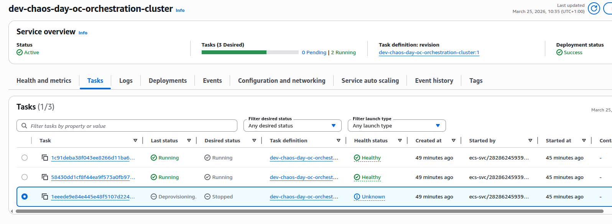
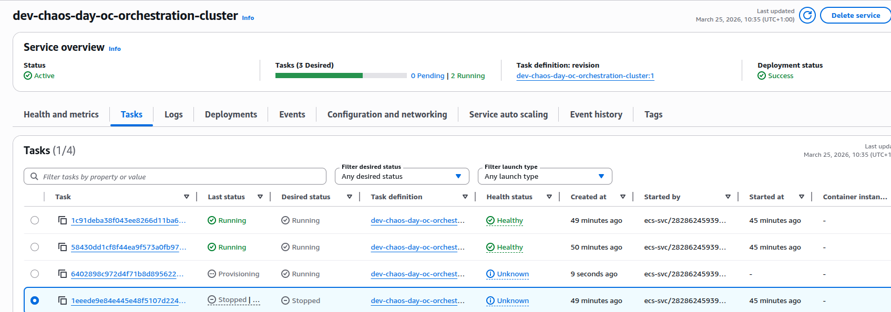
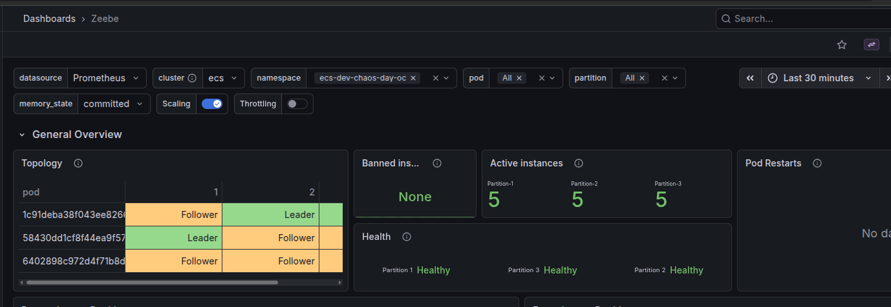

# Chaos Day Summary 

With 8.9, we support C8 deployments on ECS. Camunda 8 is originally designed for Kubernetes StatefulSets, where each broker has a stable identity and disk. On Amazon ECS, tasks are ephemeral: IPs and container instances change frequently, and you rely on external storage like EFS and S3 instead of node-local disks.

To make this work safely, the Camunda 8 ECS reference architecture introduces a dynamic NodeIdProvider backed by Amazon S3. Each ECS task:

- Competes for a lease stored in S3 that represents a specific logical broker node ID.
- When it acquires the lease, it becomes that broker and uses a dedicated directory on shared EFS for its data.
- Periodically renews the lease; if renewal fails or preconditions are violated, the task shts down immediately to avoid corrupting data or having two brokers think they own the same node. 

The experiments in this post tests how well this S3-backed lease mechanism behaves under specfic failure scenarios where a task is killed and replaced by a new one.


# Experiment

Our first chaos experiment on ECS was simple: what happens to a Camunda 8 cluster on AWS ECS when we kill a single broker task by hand?

The cluster was running Camunda 8 (Zeebe) on AWS ECS with 3 brokers and 3 partitions. Before we started the experiment, the dashboards showed a healthy topology, stable processing and exporting rates. The AWS console confirmed three running, healthy tasks for the orchestration cluster service.


## Baseline: healthy 3-broker cluster

At steady state:

- **Cluster topology**: 3 brokers, each participating in the 3 partitions as leader or follower.
- **Health**: All partitions reported as healthy, with no restarts.
- **Throughput**: Processing and exporting metrics were flat and stable.
- **ECS**: Service view showed 3/3 tasks running and healthy.






## Injecting failure: stopping one ECS task

To inject a failure, we manually stopped one of the ECS tasks for the orchestration cluster from the AWS console.



This triggers a graceful shutdown of the broker, and we can see that NodeIdProvider released its S3 lease.

```
March 25, 2026, 10:34
[2026-03-25 09:34:19.666] [NodeIdProvider] INFO io.camunda.zeebe.dynamic.nodeid.repository.s3.S3NodeIdRepository - Release lease Initialized[metadata=Metadata[task=Optional[03acfc2a-6ff8-4e76-8e56-0a2a4e7227e7], version=Version[version=1], acquirable=true], lease=Lease[taskId=03acfc2a-6ff8-4e76-8e56-0a2a4e7227e7, timestamp=1774431273727, nodeInstance=NodeInstance[id=1, version=Version[version=1]], knownVersionMappings=VersionMappings[mappingsByNodeId={0=Version[version=1], 1=Version[version=1], 2=Version[version=1]}]], eTag="07b2daecf534e87cae5a3993f1102b22"]
orchestration-cluster
March 25, 2026, 10:34
[2026-03-25 09:34:19.638] [SpringApplicationShutdownHook] [{broker-id=Broker-1}] INFO io.camunda.zeebe.broker.system - Broker shut down.
orchestration-cluster```
```


## Replacement task and recovery

ECS replaces the stopped task to meet the configured desired task count.

1. The old task went into *deprovisioning* and eventually *stopped*.



2. ECS launched a new task for the same service a couple of minutes later.


3. On startup, the new broker instance:
   - Acquired the S3 lease for the same logical node with a new version (v2).
   - Copied the previous data directory into a fresh `v2` directory (versioned data layout).

```
March 25, 2026, 10:36
[2026-03-25 09:36:27.555] [main] INFO io.camunda.zeebe.dynamic.nodeid.fs.VersionedNodeIdBasedDataDirectoryProvider - Initializing data directory /usr/local/camunda/data/node-1/v2 by copying from /usr/local/camunda/data/node-1/v1
orchestration-cluster
March 25, 2026, 10:36
[2026-03-25 09:36:27.037] [main] WARN io.camunda.configuration.beanoverrides.BrokerBasedPropertiesOverride - The following legacy property is no longer supported and should be removed in favor of 'camunda.data.exporters': zeebe.broker.exporters
orchestration-cluster
March 25, 2026, 10:36
[2026-03-25 09:36:26.979] [main] WARN io.camunda.configuration.UnifiedConfigurationHelper - The following legacy configuration properties should be removed in favor of 'camunda.data.primary-storage.directory': zeebe.broker.data.directory
orchestration-cluster
March 25, 2026, 10:36
[2026-03-25 09:36:26.912] [NodeIdProvider] INFO io.camunda.zeebe.dynamic.nodeid.RepositoryNodeIdProvider - Acquired lease w/ nodeId=NodeInstance[id=1, version=Version[version=2]]. Initialized[metadata=Metadata[task=Optional[5228b3d3-7cde-4365-b4c5-7afd0ae094cd], version=Version[version=2], acquirable=true], lease=Lease[taskId=5228b3d3-7cde-4365-b4c5-7afd0ae094cd, timestamp=1774431401724, nodeInstance=NodeInstance[id=1, version=Version[version=2]], knownVersionMappings=VersionMappings[mappingsByNodeId={1=Version[version=2]}]], eTag="9f0c6e1c2a92bbaa1fde872e1d545e05"]
orchestration-cluster
```

The new task becomes healthy and the orchestration cluster service is now fully healthy. 



## What we learned

This first experiment validated that:

- **S3-based leases behave correctly under node loss**: when a task is killed, the broker releases its lease, and a new task can safely acquire a new versioned lease.
- **Graceful shutdown still happens under forced task stop**: even though we stopped the task from the ECS console, the broker had enough time to drain and shut down its internal components cleanly.
- **Replace task becomes healthy**: the replacement task comes up, reuses the data via a new versioned directory, and rejoins the cluster without any issues.

