# Chaos Day Summary

Over the past weeks, we have been spending more time improving [our load testing and reliability testing coverage.](https://github.com/camunda/camunda/issues/47618) One of the things we did was to enable REST API (by default, we tend to use gRPC).

While [doing such](https://github.com/camunda/camunda/pull/49938), we were experiencing [a weird load pattern.](https://github.com/camunda/camunda/pull/49938#issuecomment-4149559679) This seems to be  when enabling the REST API usage in our load tester clients, together with OIDC.

On today's Chaos day, we want to verify how the system behaves when using the REST API and OIDC together, and how this changes under different loads and versions. We were also validating whether this was related to the cluster configuration (testing with SaaS).

**TL;DR;** We were seeing these patterns, especially at higher load (300 PIs), but at lower load they were not visible. The issue was reproducible in 8.8 as well, so it was not related to the changes in 8.9. We haven't reproduced this pattern in SaaS, as we weren't able to achieve the same load as in the small clusters we used. While experimenting, we discovered several areas for improvement. During experimenting [Nic](https://github.com/nicpuppa) already fixed the underlying issue via [#50124](https://github.com/camunda/camunda/pull/50124) :rocket:

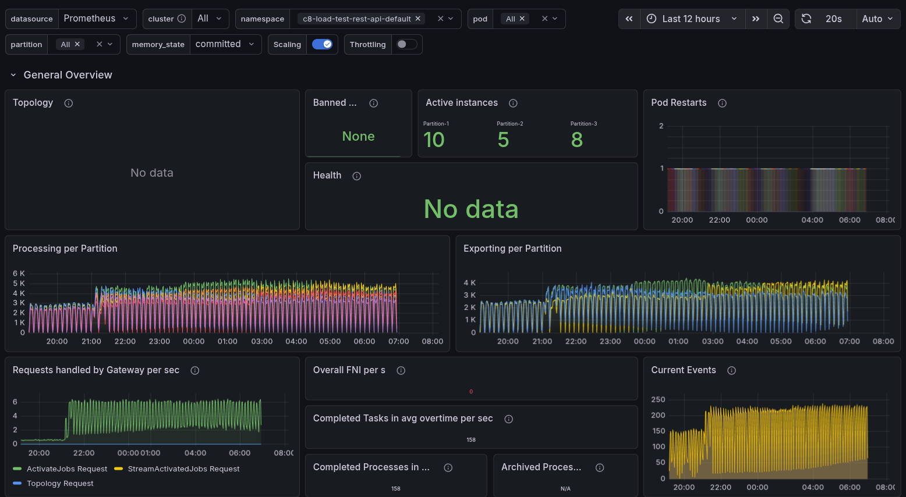

<!--truncate-->

## Chaos Experiment

As mentioned earlier, we were testing the system with REST API enabled and OIDC. We were testing different loads (100, 200, 300 PIs) and different versions (8.8 and main). We also wanted to validate whether this is related to the cluster configuration, so we also tested with SaaS.

The following experiments were run:

  * Stress test with 300 PIs
  * Lower load 100 PIs
  * Lower load 200 PIs
  * Test with SaaS 300 PIs
  * Test with 8.8 300 PIs

### Expected

As we already experienced this pattern, we expected to see it again when enabling REST API and OIDC together. We expected that this was related to the load, so for a lower load, this should not be visible. We also expected that this might be related to the version, so we shouldn't see the same pattern in 8.8. Finally, we were not sure whether this was related to the cluster configuration, so we wanted to validate whether we could see the same pattern in SaaS or not.

*Expectations:*

  * Stress test with 300 PIs - we expect to see the pattern
  * Lower load 100 PIs - we expect to not to see the pattern
  * Lower load 200 PIs - we expect to see the pattern, but less visible
  * Test with SaaS 300 PIs - we were not sure - if it is not visibile it might be related to a different cluster configuration
  * Test with 8.8 300 PIs - we expect to not to see the pattern, as it should be related to the changes in 8.9

### Actual

#### Stress test with 300 PIs

When we set up a stress test with 300 PIs and the REST API enabled, we observed the pattern we had already seen. The starter is heavily CPU throttled and under high memory pressure. We were not able to reach 300 PIs; we reached ~140.

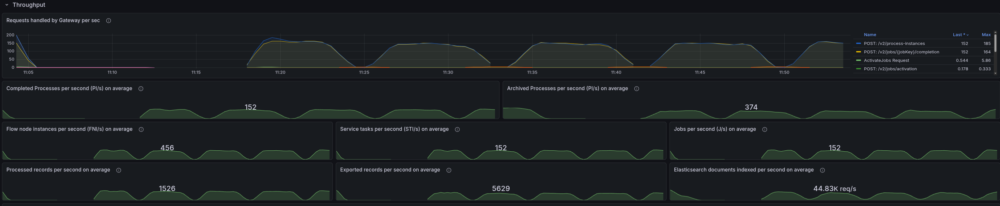

In general, it is interesting that we tend to use much more memory and CPU when using the REST API, whereas with gRPC, we are not seeing such high resource usage. This is something we need to investigate further, as it is unexpected and should not occur.

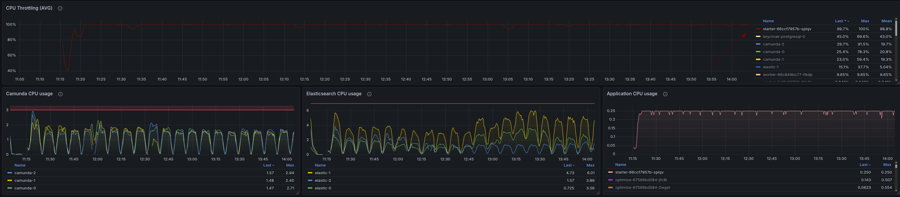
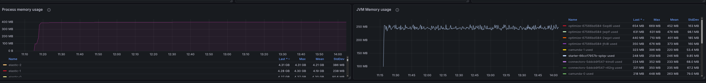

When we compare this to our daily stress tests, which are run with gRPC, we can see that the starter is not CPU-throttled and shows no signs of memory pressure.

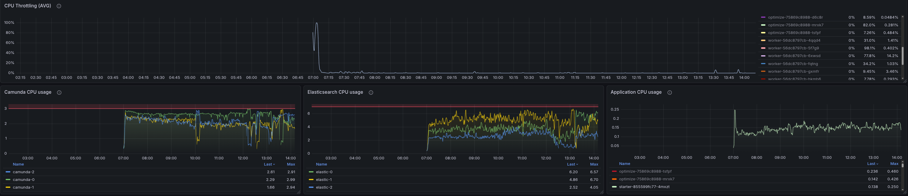
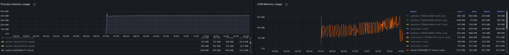

#### Lower load 100 PIs

When setting up a lower load with 100 PIs, we no longer saw the pattern. The starter is not CPU throttled, and there are no signs of memory pressure.

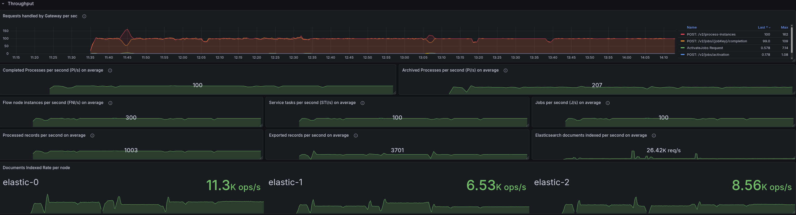
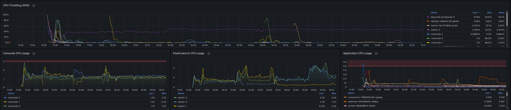

#### Lower load 200 PIs

Also, with 200 PIs, we were not able to see the pattern anymore. The starter is not CPU throttled, and there are no signs of memory pressure.

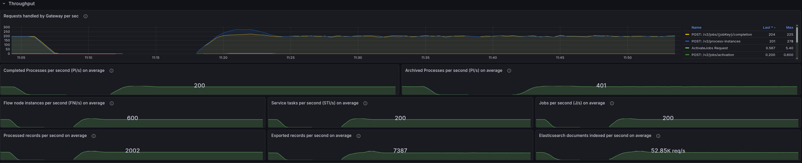
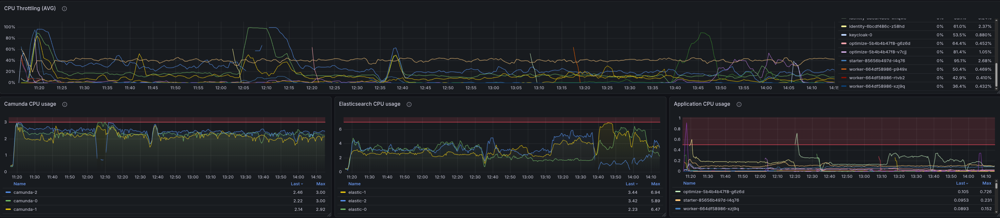

#### Test with 8.8 300 PIs

When testing with 8.8, we were still able to see the pattern, so this indicates it is not related to the changes in 8.9 and either an existing bug or related to some configuration.

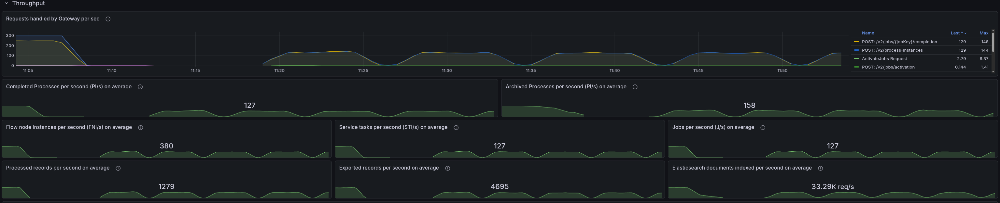

#### Test with SaaS 300 PIs

When testing with SaaS, we were not able to reach the same load as with our self-managed clusters (as we used quite small packages).

There were several surprising behaviors we observed during experimentation with the SaaS clusters:

1. When starting an 8.9 cluster in SaaS, we were observing that the job completion rate dropped to 0 in a recurring pattern.
2. When testing with an 8.8 cluster, we observed that even when starting 300 PIs (from our load applications), the cluster was actually only processing 10 PIs, but we haven't seen any back pressure (from the server or client side). 

##### 8.9 Cluster (SaaS)

When starting an 8.9 cluster in SaaS, we were observing that the job completion rate dropped to 0 in a recurring pattern.

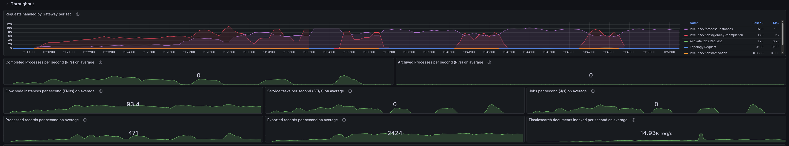

This was unexpected, and further investigation revealed that the workers were actually going OOM. After digging deeper through the metrics, we saw that too many jobs were pushed to the clients, and the worker was actively rejecting them.

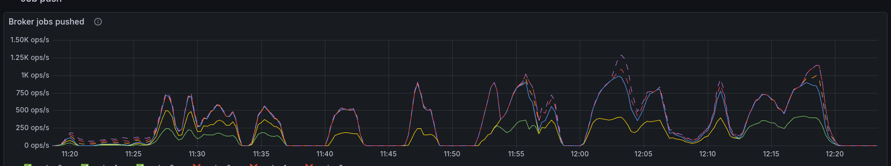
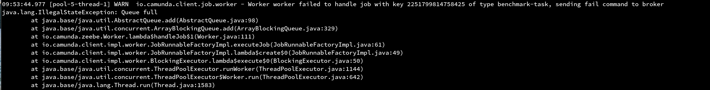

In comparison to our daily tests we seem to send a factor ~2-3 more jobs to the clients. 

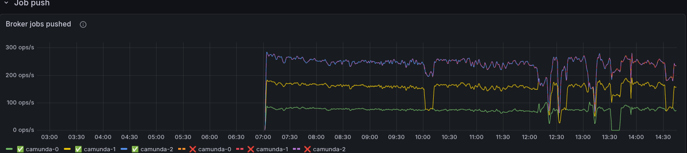

After increasing the workers' memory, we reduced OOMs, but we still couldn't reach the same load as in our self-managed clusters. Causing us not to reproduce the same behavior as with our self-managed clusters.

##### 8.8 Cluster (SaaS)

As we expected certain misconfigurations, we wanted to validate the same with 8.8 in SaaS. When starting the 300-PI load, we were only able to reach ~10 PIs.

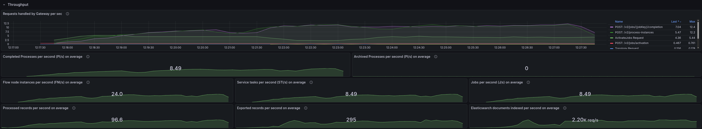

Even more interesting is that we were unable to see any back pressure on the server or client side, which is unexpected, given that we are pushing more load than the cluster can handle. But we observed that the gateway is actually heavily CPU-throttled. Interesting to note that almost all traffic hit one node.

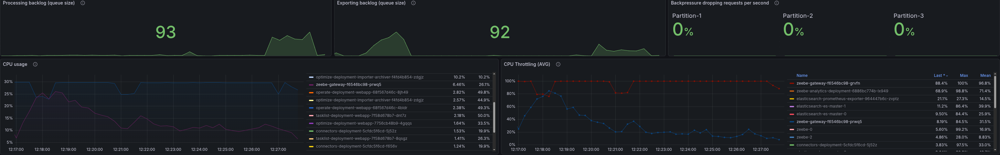

Each request took 5-9s to complete, which might be why we are not seeing any back pressure, as the clients are not sending more requests until the previous ones are completed. The HTTP client we use might be saturated.

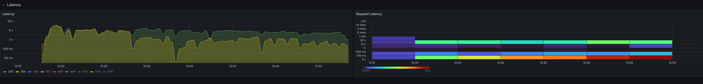

When we increased the gateway resources, we were able to reduce the CPU throttling and reached higher load. Now we were also able to see backpressure.

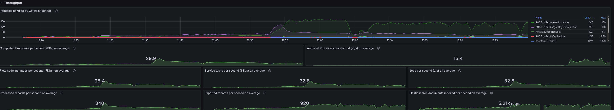
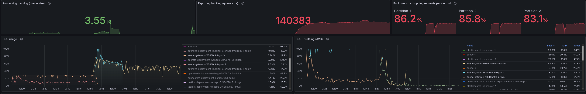

## Found Weaknesses / Learnings

- REST API usage causes higher CPU and memory usage on the client side
- REST API usage together with OIDC showed a recurring throughput drop pattern under high load, which was not visible with gRPC.
- This behavior was not reproducible with a lower load, so it seems to be related to the load we are pushing to the cluster.
- This was not related to the changes in 8.9, as it was also visible in 8.8, so it was an existing bug.
- In SaaS, we were not able to reach the same load as with our self-managed clusters, which prevented us from reproducing the same behavior as with our self-managed clusters.
- We have some observability gaps, as we were not able to see any back pressure from the server or client side when the gateway is overloaded. This is unexpected, as we are pushing more load than the cluster can handle. 
    - This might be related to the HTTP client we use, which might be saturated, but we need to investigate further to understand the root cause.

### Further investigations

Based on the observations and learnings we had during the experiments, we identified several knowledge gaps we need to overcome:

- We need to investigate further why REST API usage causes higher CPU and memory usage on the client side, and whether this can be improved.
- We need to investigate further the recurring throughput drop pattern under high load when using the REST API together with OIDC, and fix the underlying issue.
- We need to have a better measurement of request response times and back pressure, to be able to better understand the behavior of the system under high load, and to be able to identify bottlenecks and issues more easily.

### Possible improvements for our load testing and reliability testing

As we experimented and used our load testing tooling, we identified several things we can improve:

- Rethink GitHub Workflow inputs for load test, where the description can be made more compact and readable.
- Add a separate job output to print all the input values the user provided in the load test
- Provide a user option to choose between OIDC/Basic and none
- Fix the bug which causies isses when redeploying twice and replacing the client-secret
- Improve logging of the starter and worker applications
