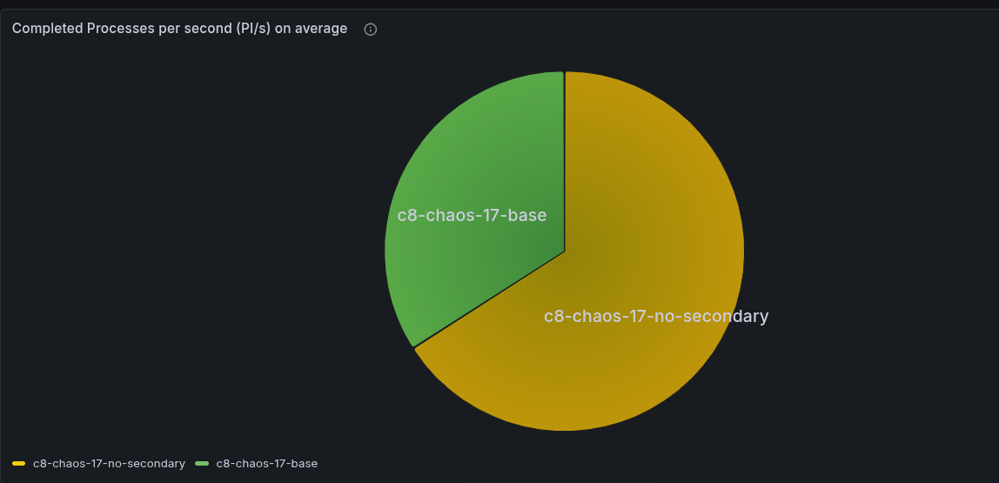
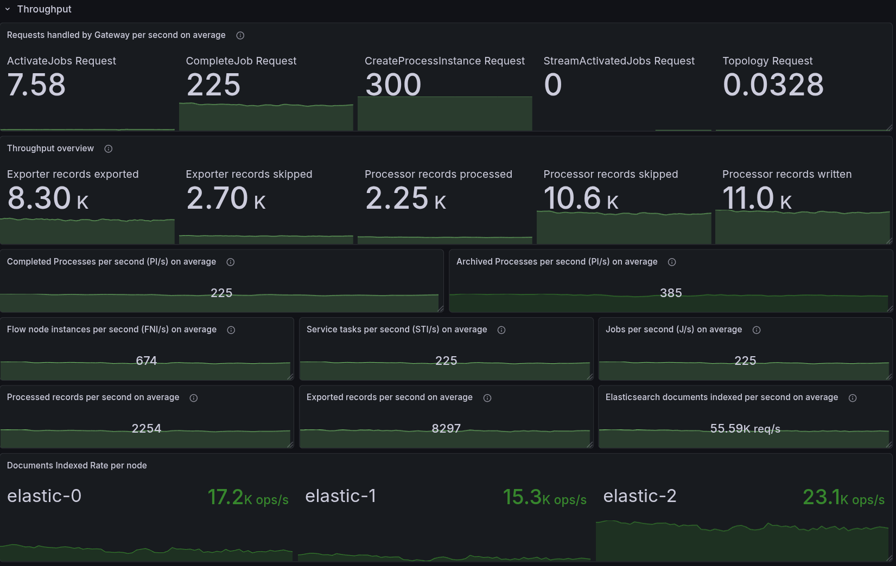
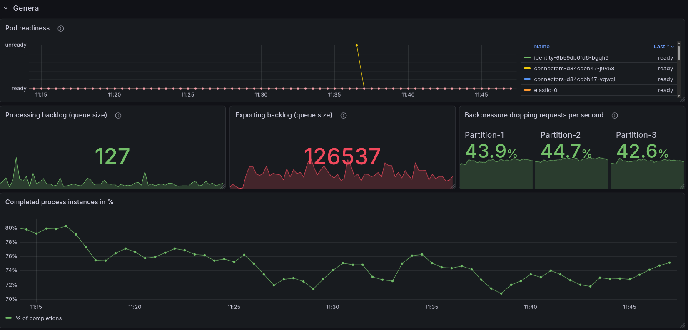
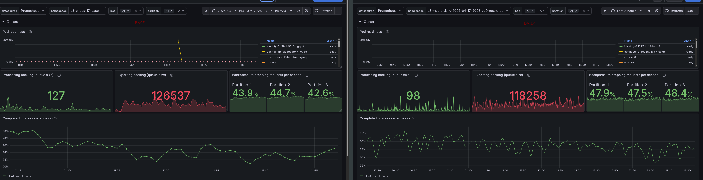
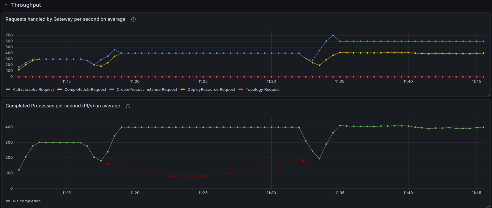
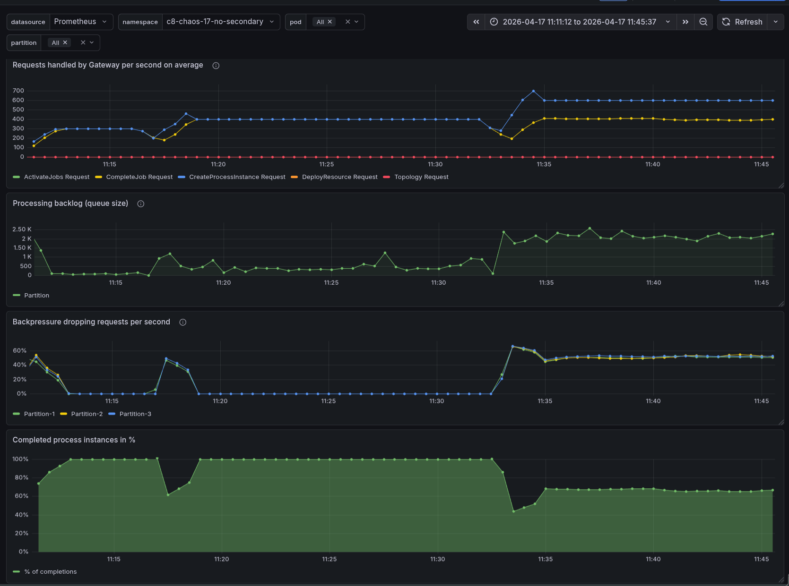
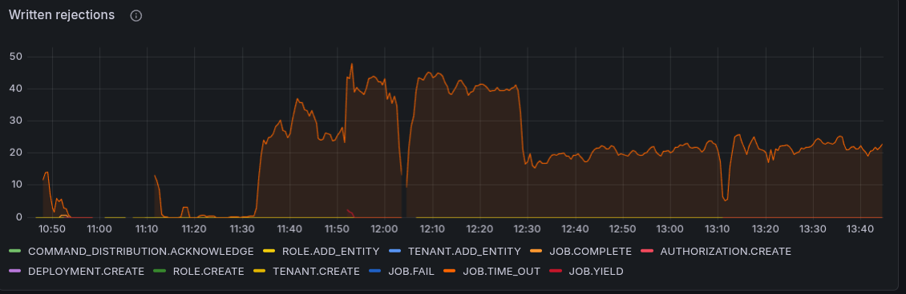
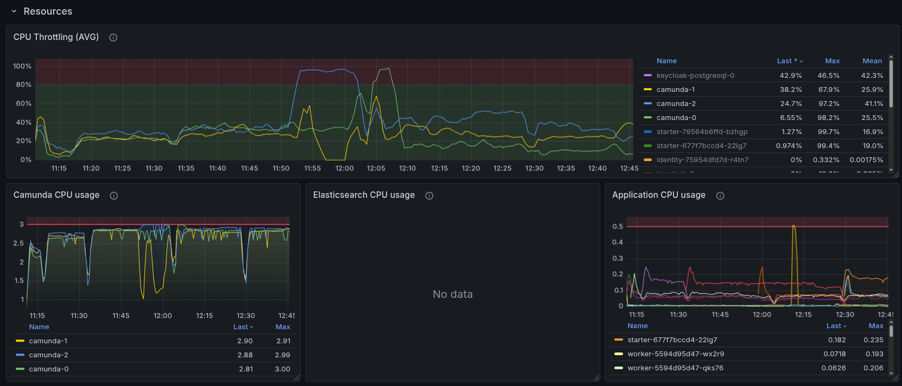
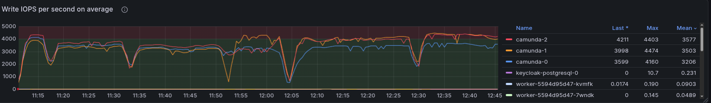
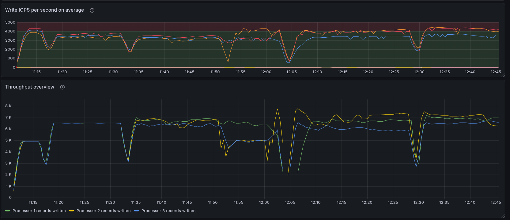

# Chaos Day Summary

On this Chaos Day, we conducted an experiment to evaluate the performance of our platform without the use of the secondary storage. The goal was to understand how the system behaves under such conditions and whether and how performance would improve.

**TL;DR;** We observed that a cluster without secondary storage achieves significantly higher throughput, as it is not throttled by secondary storage and can reach up to 400 PI/s without issues. That is a factor of *1.7x* higher than the cluster with secondary storage.



<!--truncate-->

## Chaos Experiment

 We ran two clusters, one with secondary storage and one without, and compared their performance under load. For better comparison and better performance, we used gRPC. As a workload, we used our stress test workload; details can be found [here](https://github.com/camunda/camunda/blob/main/docs/testing/reliability-testing.md#max--stress-load-test).

It is important that one process instance has one task to complete. It is the smallest process instance we can get, and it is a good way to stress test the system.

### Expected

We expected that the cluster without secondary storage would perform better, as it would not have to write to secondary storage and would not be throttled by, for example, Elasticsearch (CamundaExporter).

The maximum performance of a partition was not clear, but we expected that it would be higher than the cluster with secondary storage, which has a maximum performance of around 200 process instance completions per second (PI/s).

### Actual

As a base, we started a load test with [our default configuration](https://github.com/camunda/camunda/blob/main/load-tests/camunda-platform-values.yaml) using gRPC and a max workload (300 PI/s).

#### Base: gRPC with secondary storage

We can see that while we receive 300 PI/s, the cluster with secondary storage is throttled at around 230 PI/s.



The backlog of exporting to secondary storage is rather high, and causes us to have around ~40% backpressure, which is the reason for the throttling.



Compared to our daily tests, this looks similar.



#### gRPC without secondary storage

At the beginning, we had some issues with how to properly configure the cluster without secondary storage. We found a useful documentation about how [to disable the secondary storage](https://docs.camunda.io/docs/self-managed/concepts/secondary-storage/no-secondary-storage/)

The important part is this (which does all the magic):

```yaml
global:
  noSecondaryStorage: true
```

The open question was whether Authorization would work. After experimenting with it, we found out that actually the right profiles are configured: `admin, broker, consolidated-auth`, our initial authorizations are properly set (for our load tests), and the starter and worker are able to push data through the system.

The only issue was that the search for data availability was still enabled, which caused some failures (as obviously the REST API will not work without a secondary storage).

After disabling the search for data availability, we were able to run the load test without any issues. The load stabilized at 300 PI/s, and there was no backpressure.
We were able to increase to 400 PI/s, and it worked without any issues. When we increased to 600 PI/s, we started to see some backpressure, which indicates that we are reaching the limits of the system.



The increased load, first 400 PI/s, later 600 PI/s, produced a bigger processing queue, causing backpressure at the end around ~40-50%. We can see that we are no longer able to complete 100% of the process instances created.




Investigating a bit further, we realized that we saw several JOB_TIMEOUT rejections, which could be either because Workers are too slow, or because we have too few workers. These job timeouts get rejected when jobs are already due, and actually want to time out the job, but the completion still happens just before the actual timeout can be processed. Means either it is standing long in the queue of the worker (or due to the processing queue). We also saw some requestLimitExhaust rejections, which indicate that we are reaching the limits of the system.





We disabled the flow control and throttling configs and increased the number of workers. None of it improved the performance; we observed fewer timeout rejections at least.

In general, the CPU and IOPS were at their limits, and we were not able to increase the performance further. We can see that the CPU is at 100% for the broker, and the IOPS are also at their limits, which indicates that we are reaching the limits of the system.




We haven't increased the resources of the cluster, as we wanted to compare the performance with and without secondary storage with a similar configuration. But this would be an interesting follow-up experiment to see how much we can increase the performance by increasing the resources of the cluster. For example, increasing the disks and CPU, as this is the limiting factor of IOPS in GCP, and Camunda is I/O intensive.



### Conclusion

We can conclude that the cluster without secondary storage has a significantly higher throughput performance, as it is not throttled by the secondary storage, and can reach up to 400 PI/s without any issues.

That is a factor of *1.7x* higher than the cluster with secondary storage.

#### What we have learned:

 * We can run Camunda without secondary storage, which might be useful for users who have a certain performance requirement and do not want to use secondary storage. 
   * This obviously has some limitations/drawbacks, as several features (depending on the secondary storage) will not work. You can find more in our [documentation](https://docs.camunda.io/docs/self-managed/concepts/secondary-storage/no-secondary-storage/?configuration=helm#limitations-and-considerations).
 * Even without secondary storage, we can use OIDC for Authentication and Authorization
