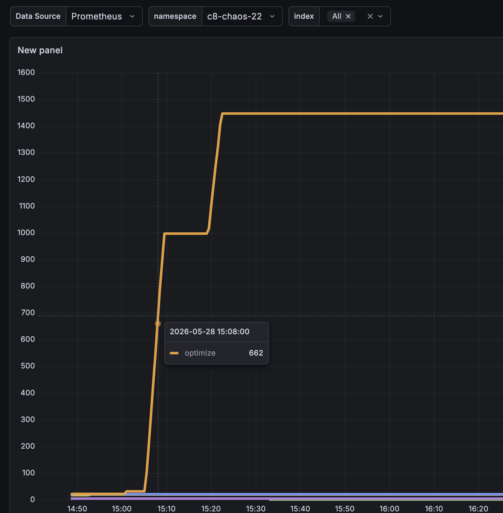
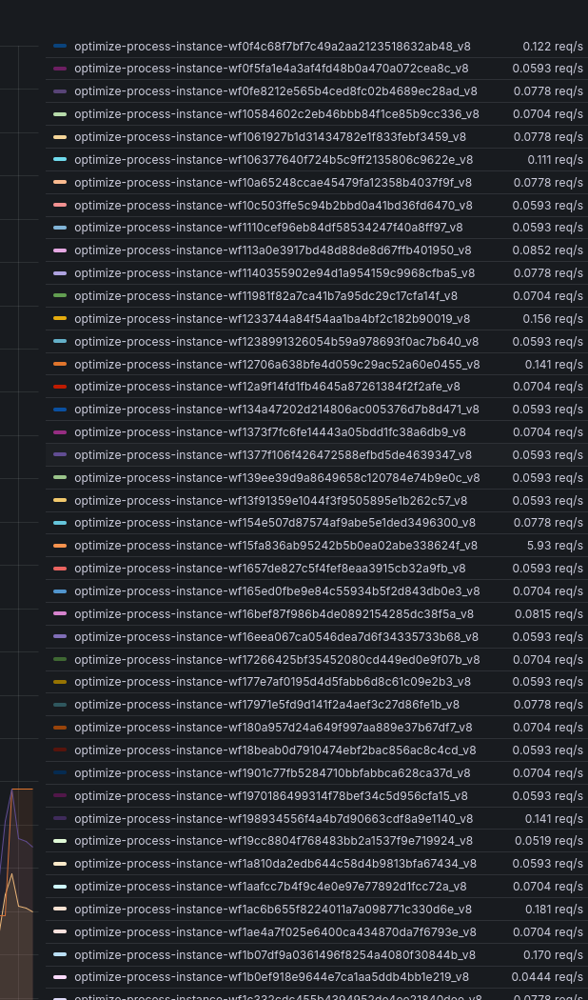
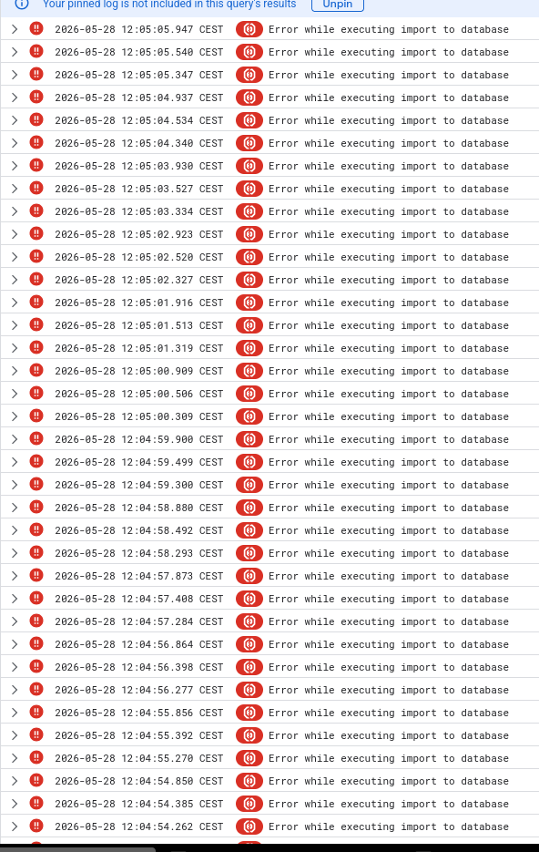
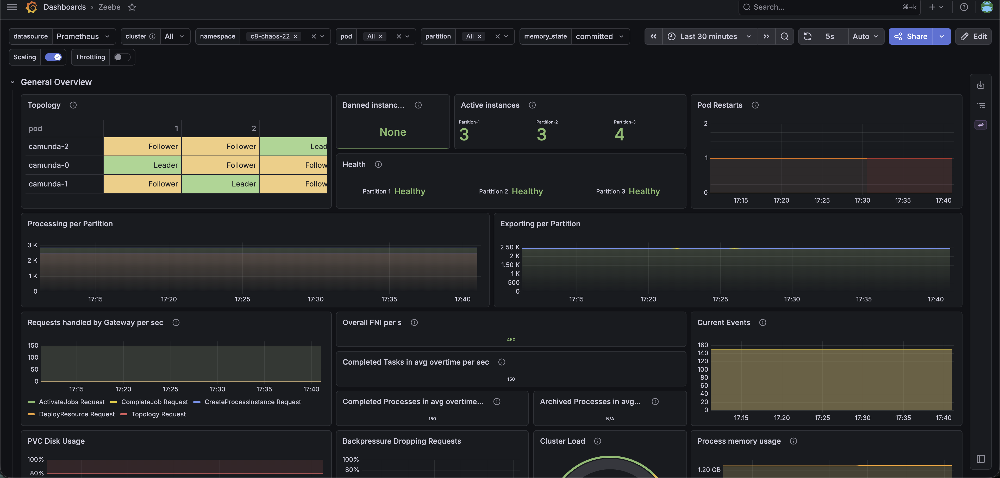
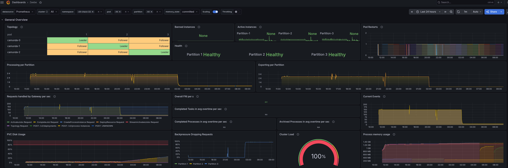
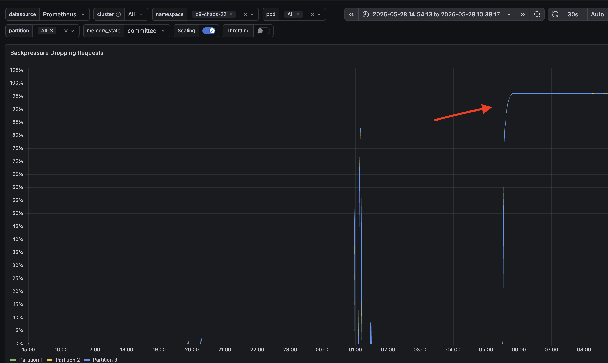
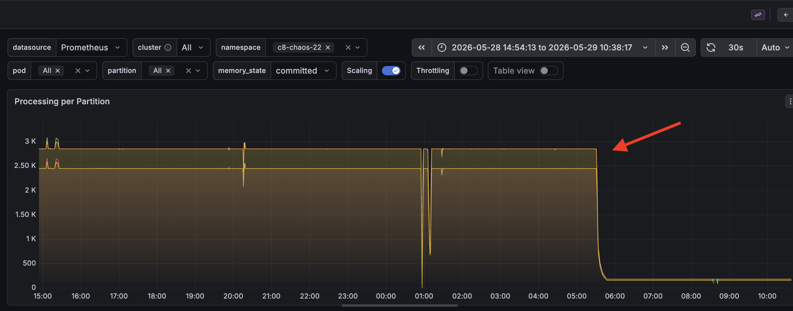

# Chaos Day Summary

On this Chaos Day, we conducted an experiment to observe the impact on Elasticsearch when deploying a large number of process versions to a Camunda cluster, and how that pressure propagates through Optimize, the Zeebe Elasticsearch exporter, and ultimately back to the Camunda engine itself. During recent investigations, we identified a dependency between deployed process models and Elasticsearch shard usage, and wanted to experiment with it to understand what happens when we deploy X process models and where the actual limit lies.

**TL;DR;** We discovered a 1:1 relationship between Optimize indices and deployed processes, providing a clear, measurable limit on the number of process models that can coexist with Optimize on a given Elasticsearch cluster. Once the Elasticsearch cluster reaches its maximum normal shard limit (default `1000` per node, e.g., `3000` for a 3-node cluster), it stops creating new indices. The Zeebe engine remains unaffected initially, but the failure cascades the next day: once the Zeebe Elasticsearch exporter attempts to create its new dated index, the request is rejected, the exporter stalls, and the Camunda engine hits unrecoverable backpressure. Recovery requires manual intervention (raise `cluster.max_shards_per_node`, add nodes, or delete indices).

<!--truncate-->

## Chaos Experiment

### Setup

For setup, we created a load test in the `c8-chaos-22` namespace running the simple [`one_task`](https://github.com/camunda/camunda/blob/main/load-tests/load-tester/src/main/resources/bpmn/one_task.bpmn) process at `150 PI/s`. On top of this running load test, we then used [`c8ctl`](https://github.com/camunda/c8ctl) to deploy approximately `~2000` versions of `one_task`. This way, we could observe both the shard-side effect and the engine-side effect at the same time.

### Expected

Deploying a large number of process definitions and versions should not degrade the availability of the core Camunda workflow engine (Zeebe). If reporting and archival systems (such as Optimize) reach capacity limits, they should fail gracefully without blocking the Camunda engine's execution or progress.

From recent investigations, we already expected to hit the Elasticsearch shard limit at some point. The goal of this experiment was to validate how the system actually behaves when that limit is reached.

### Actual

We observed that the number of Optimize indices grows in a 1:1 relationship with the number of deployed process definitions. As we ramped up deployments in the `c8-chaos-22` namespace, the Optimize index count grew linearly with each new process version, climbing from a baseline of ~20 to over `1400` indices within ~20 minutes:



We can observe this 1:1 pattern in production clusters as well, where each deployed process gets its own dedicated Optimize index:



Each Optimize index is also configured with a default of `1` shard per index (see the [Optimize importer/archiver configmap](https://github.com/camunda/camunda-operator/blob/8a82eb615853421330684d765cfb7d577c836b2a/templates/optimize_configmap_importer_archiver.yaml#L32)). However, because Optimize uses `1` replica by default, the effective shard count contributed per Optimize index is doubled (primary + replica), so the total shard usage from Optimize is `2 × number of process models`.

Once the maximum Elasticsearch shard limit is reached, the cluster blocks the creation of any new indices or shards. Optimize logs with thousands of errors due to data import failures. The rejection from Elasticsearch looks like this:

```
co.elastic.clients.elasticsearch._types.ElasticsearchException: [es/indices.create] failed: [validation_exception] Validation Failed: 1: this action would add [2] shards, but this cluster currently has [3000]/[3000] maximum normal shards open; for more information, see https://www.elastic.co/guide/en/elasticsearch/reference/8.18/size-your-shards.html#troubleshooting-max-shards-open;
```



Camunda continues to make progress temporarily because the archiver is decoupled and the current runtime indices already exist. The orchestration cluster keeps processing instances even after the shards have filled up:



#### The Critical Failure (Confirmed)

When we ended the test, the engine itself was still progressing, the `150 PI/s` workload was being processed without backpressure, and process instances kept completing. The real damage surfaced the next day, as we expected. When the Zeebe Elasticsearch exporter rolled over and attempted to create its new dated index, Elasticsearch rejected the request for the same `max_shards_per_node` reason. The exporter stalled, backpressure propagated to the Camunda engine, and process execution halted. The cluster could only be recovered by manual intervention (raising the shard limit, adding nodes, or deleting indices).



Backpressure climbed to 100%:



Processing dropped to 0:



## What We Learned

* **Optimize creates one index per deployed process model.** This 1:1 relationship is the root cause of the shard pressure. Combined with the default `1` shard + `1` replica per Optimize index ([source](https://github.com/camunda/camunda-operator/blob/8a82eb615853421330684d765cfb7d577c836b2a/templates/optimize_configmap_importer_archiver.yaml#L32)), each deployed process model consumes effectively `2` shards in the cluster. The shard count, therefore, grows as `2 × processes` and exhausts the cluster shard budget prematurely.
* **Elasticsearch's shard limit is a hard ceiling for the whole platform.** Once `cluster.max_shards_per_node` is reached, no component can create new indices. Optimize import and archiver fail first.
* **Camunda's engine stays healthy only as long as no new index needs to be created.** Runtime processing continues to work because the existing dated indices are still writable. The risk surfaces when a new dated index is needed, which is exactly what triggered the next-day cascade.
* **Decoupling helps, but only delays the impact.** The archiver being decoupled from the engine hot path bought us time, but it did not prevent the eventual cascade once the exporter needed a new dated index.

## Possible Improvements

* **Reactive (once we hit the issue):** Dynamically balance shards by adding an extra Elasticsearch node, increasing the `cluster.max_shards_per_node` limit, or deleting older indices (which results in data loss). These are mitigations to apply once the cluster is already in a bad state, not a prevention.
* **Preventative:** Implement a capacity limit to block customers from deploying process models beyond a threshold that would put the cluster shard budget at risk. Note that we already have an implicit process-model limit imposed by the shard ceiling, so explicitly capping it (or lowering the per-Optimize-index shard/replica count) gives us free headroom on the cluster.
* **Long-term:** Refactor Optimize to use a different, more scalable data model that does not require a 1:1 index-to-process mapping (e.g., a single shared index keyed by process definition).
