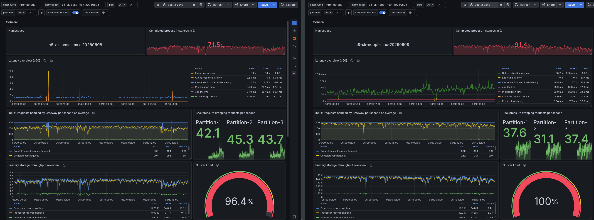
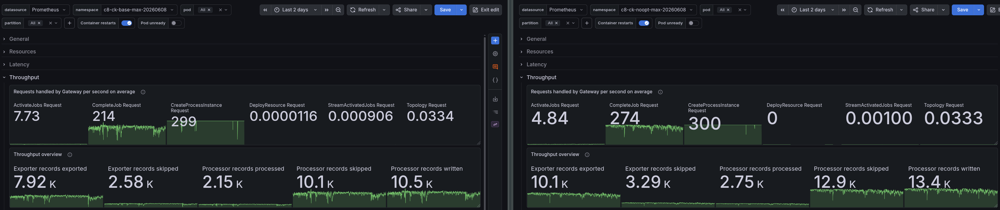
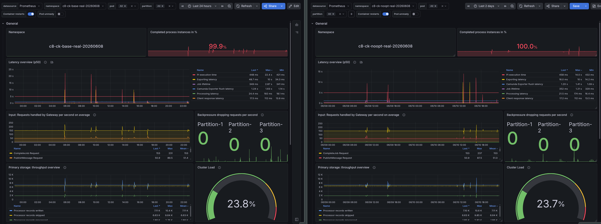
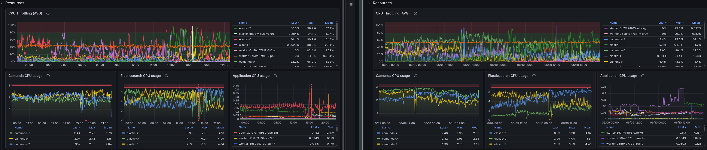
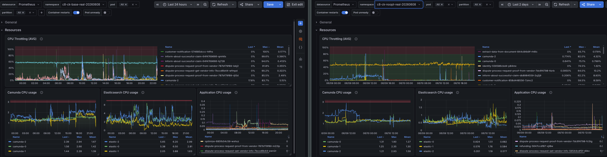
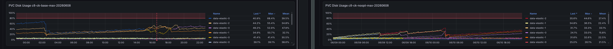
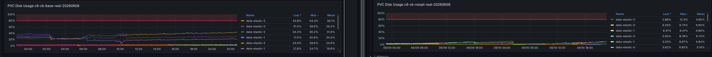

# Chaos Day Summary

On this Chaos Day, we measured the impact of Optimize on cluster performance and resource usage. We ran four 2-day load tests on Camunda 8.9.6 — two with Optimize enabled (max and realistic workloads) and two without — and compared throughput, latency, CPU, memory, and disk across all four.

**TL;DR;** Optimize has a measurable negative impact on throughput under high load (-22% completed PI/s), but the most striking finding is its additional CPU load on Elasticsearch and extra disk footprint: Elasticsearch CPU at a realistic workload was 3.4x higher with Optimize enabled. After two days at a realistic workload, the cluster with Optimize accumulated at maximum **221.5 GiB of ES data vs. 61.5 GiB without Optimize** which is a 3.6x difference. This is a critical finding for customers running Optimize at production scale, as it means that ES resources must be sized to account for Optimize's overhead, even at non-stress workloads.

<!--truncate-->

## Chaos Experiment

We ran all four clusters in parallel on the same benchmark infrastructure using `orchestration-tag=8.9.6` and `optimize-tag=8.9.6`. Each test ran for two days to capture steady-state resource consumption, not just startup effects.

The four configurations:

| Name | Scenario | Optimize |
|---|---|---|
| Base Max | max (300 PI/s) | enabled |
| Base Realistic | realistic | enabled |
| No-Optimize Max | max (300 PI/s) | disabled |
| No-Optimize Realistic | realistic | disabled |

The **max** scenario uses the smallest possible process (one task) driven at 300 PI/s to stress the engine. The **realistic** scenario uses a more complex process model at a sustainable production rate, where each process instance has multiple tasks, sub-processes, and longer lifecycle — designed to simulate real customer workloads rather than peak stress.

Metrics were captured over a 1-hour steady-state window using PromQL against the cluster's central Prometheus.

### Expected

We expected Optimize to impose overhead on Elasticsearch — it writes analytics data on top of the standard Zeebe export — but we were uncertain how large that overhead would be relative to the base ES load, and whether it would affect Camunda throughput or just ES resources.

### Actual

#### Max workload: Throughput and backpressure

Under the max workload (300 PI/s attempted), Optimize has a direct impact on how much the cluster can actually complete:

| Metric | Base Max | No-Opt Max | Delta |
|---|---|---|---|
| Completed PI/s | 214.0 | 274 | **+22%** without Optimize |
| Completion ratio | 71.5% | 91.4% | ~20 pp |
| Backpressure | ~45% | ~35% | ~10 pp |

Without Optimize, the cluster completes 22% more process instances per second and reaches 91.4% completion vs. 71.5%. The extra ES write pressure from Optimize's analytics indices causes the exporter to fall behind, which in turn drives up backpressure on the brokers.

#### Realistic workload: Throughput and backpressure

At the realistic workload, both clusters complete ~100% of started instances with zero backpressure, so from a correctness and latency standpoint the workload is comfortably within limits either way:

| Metric | Base Realistic | No-Opt Realistic |
|---|---|---|
| Completed PI/s | 1.0 | 1.0 |
| Completion ratio | 99.9% | 100% |
| Backpressure | 0% | 0% |

The realistic scenario is not throughput-constrained, so Optimize's overhead does not affect process execution. Where the difference shows up is in resources.

#### Max load: CPU

| Metric | Base Max | No-Opt Max | Delta |
|---|---|---|---|
| Camunda CPU (cores) | 2.7 | 2.98 | 0.28 |
| ES CPU (cores) | 7 | 6.98 | ~0.02 |

We can see in the max scenario that ES CPU is essentially identical with or without Optimize, likely the free resources are consumed by the exporter catching up with the write load. Camunda broker CPU is slightly higher without Optimize, likely because it is not bottlenecked by ES and can process more PI/s.

#### Realistic load: CPU

| Metric | Base Realistic | No-Opt Realistic | Delta |
|---|---|---|---|
| Camunda CPU (cores) | 2.94 | 1.9 | 1.04 |
| ES CPU (cores) | 6.4 | 1.7 | 4.7 |

For the realistic workload, the difference is much more pronounced. Camunda CPU is about 1 core higher with Optimize, but the ES CPU difference is dramatic: 6.4 cores with Optimize vs. 1.9 cores without — a 3.4x increase in ES CPU usage. In a non stress scenario, at a workload where throughput and backpressure are identical. This suggests that Optimize's background work of maintaining analytics indices is consuming significant ES resources!

#### Memory

Memory consumption for both Camunda and ES is relatively stable across all configurations, with no significant differences attributable to Optimize.

#### Max load: Disk — Elasticsearch

Before we look at the disk usage, we need to clarify that the ES disks are configured with 500 GiB capacity.

| Metric | Base Max | No-Opt Max | Delta |
|---|---|---|---|
| ES disk usage (GiB) | 68.4% | 44.6% | 23.8% |

The results for the max workload show that the cluster with Optimize enabled is using 68.4% of the ES disk capacity, while the cluster without Optimize is using 44.6%. This means that Optimize is consuming an additional 23.8% of the ES disk capacity under max load, which is a significant increase. However, the more striking finding comes from the realistic workload, which is more representative of typical production usage.

#### Realistic load: Disk — Elasticsearch

| Metric | Base Realistic | No-Opt Realistic | Delta |
|---|---|---|---|
| ES disk usage (GiB) | 44.3% | 12.3% | 32% |

The difference in ES disk usage is even more significant under the realistic workload. The cluster with Optimize enabled is using 44.3% of the ES disk capacity, while the cluster without Optimize is using only 12.3%. This means that Optimize is consuming an additional 32% of the ES disk capacity under realistic load, which is a substantial increase and highlights the significant storage overhead that Optimize introduces to Elasticsearch.

To speak in total numbers instead of percentages, 32% of 500 GiB is 160 GiB. This is additional used disk space consumed by Optimize, something which should be considered during cluster sizing and capacity planning for production environments.

### What We Learned

- **Optimize degrades throughput at high load.** At 300 PI/s, disabling Optimize recovers 22% completed PI/s and reduces backpressure by 10 pp. The mechanism is extra ES write pressure from Optimize's analytics indices causing the exporter to lag and additional CPU load for the Elasticsearch exporter.
- **Optimize's ES CPU overhead is disproportionately large at low throughput.** At a realistic workload with zero backpressure, Optimize consumes 3.4x more ES CPU than the base workload requires. This overhead is not throughput-proportional — it is likely related to the workload like variables and process structure (multi-instance, call-activity, etc.)
- **Optimize dominates Elasticsearch disk usage.** After two days, the realistic Optimize cluster used ~4x more ES disk than the no-Optimize cluster. For customers running Optimize at production scale, ES storage sizing must account for this.
- **Memory is not affected.** ES heap is pre-allocated; Optimize does not meaningfully change the memory footprint at these workloads.
- **Camunda broker resources are similar.** The broker itself is not significantly affected by Optimize — the most overhead lands on Elasticsearch.

### Possible Improvements

Based on these findings, the following are worth investigating:

- **Document Optimize's resource footprint.** The [sizing guidance](https://docs.camunda.io/docs/next/components/best-practices/architecture/sizing-your-environment/) should include concrete estimates for Optimize's additional ES storage and CPU requirements. This will help customers plan their clusters more accurately and avoid surprises in production.
- **Expose benchmark guidance for Optimize.** The [sizing benchmarks](https://docs.camunda.io/docs/next/components/best-practices/architecture/sizing-benchmarks/) do not properly cover Optimize. Adding an Optimize-enabled scenario would let customers understand the storage and CPU overhead before sizing their clusters.
- **Tuning options for Optimize.** For high-throughput clusters where Optimize's write pressure causes backpressure, explore whether Optimize's import frequency, batch size or variable filtering can be tuned to reduce the impact.
- **Investigate new architecture.** The team is exploring new ideas for an improved architecture of Optimize that should substantially reduce the resource overhead. The findings here provide a concrete baseline to measure that improvement against.
