# Chaos Day Summary

In todays, Chaos day we wanted to experiment with disks becoming full due to soft-pausing exporters. We have recently run into some incidents about disks filled by this. We wanted to understand how Zeebe behaves in such scenarios. We had the following experiment planned: reproducing full disks because of Exporters are not confirming positions (due to soft-pausing).


**TL;DR;** We were able to reproduce the full disk scenario with soft-pausing exporters. The node becomes unresponsive and rejects requests. After unpausing the exporters, we were able to free up disk space again, but it took a while, as the exporters needed to re-export all not acknowledged records after restart. Some interesting learnings from this experiment are that we should not keep exporters soft-paused for a long time. This can especially problematic if nodes get restarted. When the disk is full, backpressure still reports zero, but all requests are rejected. Even REST requests are no longer successful.

<!--truncate-->

## Chaos Experiment

In this experiment we want to understand how Zeebe behaves when the disk is full, because of an Exporter not exporting. This can happen when backups have been taken but exporters haven't been unpaused.

The idea is to set up a realistic load test, pause the exporters, fill the disk, restart the node (for maximum impact), and then unpause the exporters to see if the node can recover and can reclaim the disk space by clearing the log.


### Expected

We expected that the after filling the disk, the node would become unresponsive, and we would see timeouts and increased latency in processing requests. However, once we unpause the exporters, we expected that the node would be able to clear the log and reclaim disk space, allowing it to come back to life and resume normal operations.

### Actual


We have set upa new realistic load test using the `c8-chaos-full-disk` namespace, and we are using the `8.9.9` image as the last stable release.

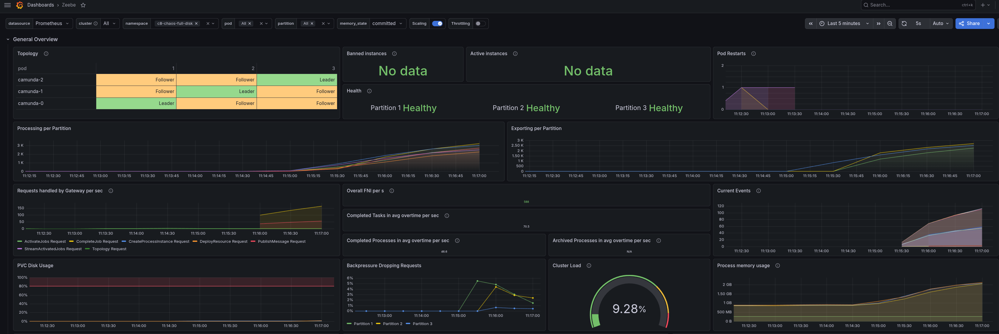

After observing the system under load, we soft-paused the exporters using the [management API](https://docs.camunda.io/docs/next/self-managed/components/orchestration-cluster/zeebe/operations/management-api/#soft-pause-exports).

```sh
kubectl port-forward svc/camunda 9600:9600 -n c8-chaos-full-disk &
sleep 5
curl -X POST http://localhost:9600/actuator/exporting/pause?soft=true
{"body":null,"status":204,"contentType":null}
```

[Soft-pausing](https://docs.camunda.io/docs/next/reference/glossary/#soft-pause-exporting) allows the exporter to continue exporting without confirming positions, which means that the log will continue to grow until the disk is full. This is normally used during backups. We observed that the log was growing and the disk usage was increasing as expected.


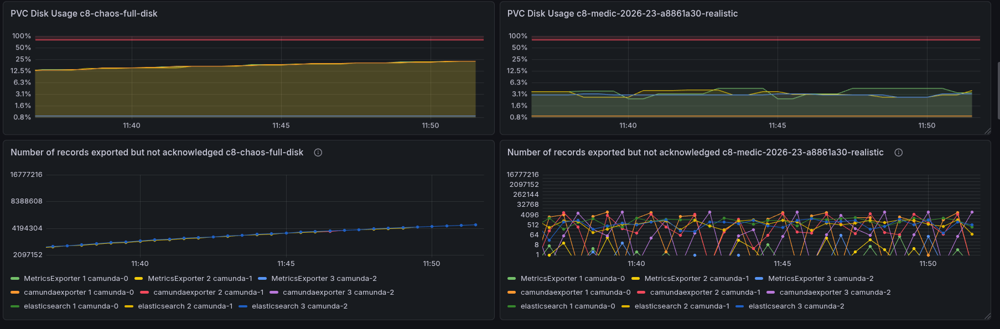

To compare the disk usage we took as base one of our weekly load tests, where we can see the disk space usage is constant and the number of records exported and acknowledged fluctuates between 0 and ~4k. With pausing the exporter we are see a large spike in unackwlodged positions.


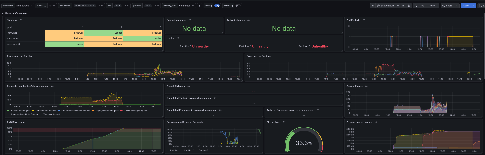


After reaching the disk capacity, we can see how requests and processing stops. What is interesting is that the backpressure metric itself is 0, as would no requests are counted as coming in (they are rejected directly by the node). The client itself doesn't log that much, as RESOURCE_EXHAUSTED errors are mostly not logged.

> Note: 
>
> This is something we should improve, as it might be hard to understand that the node is rejecting requests because of a full disk, but the backpressure metric is 0.


In the gRPC metrics we can see that the node is rejecting requests.

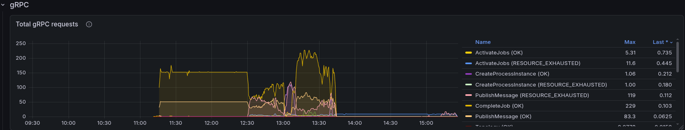

The starter is not successfully sending requests.

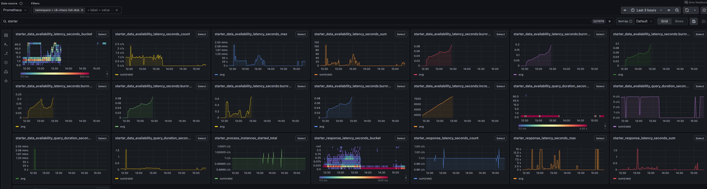

Even the REST query requests are not successful, which is unexpected, as we do not need to write to disk and do not need processing for them. This impacts the data availability metric.

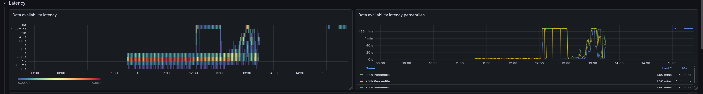

> Note:
>
> We should investigate this further why REST requests stop, as this should still be possible to query data from the secondary storage.

After reaching the full disk we restarted the cluster. This is something which is not so unlikely to happen in real life, as if the node becomes unresponsive, an operator might try to restart it. We wanted to see what happens in this case.


```
kubectl delete pod camunda-0 camunda-1 camunda-2
```

After restart unpausing the exporters via:

```sh
kubectl port-forward svc/camunda 9600:9600 -n c8-chaos-full-disk &
sleep 5
curl -X POST http://localhost:9600/actuator/exporting/pause?soft=true
{"body":null,"status":204,"contentType":null}
```

We can see that the disk space usage is slowly decreasing as the exporters start to acknowledge the records and the log is cleared. But it takes a while.

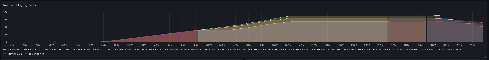

What was **suprising** for us was that it not took immediate effect and we were not able to directly reclaim the space. This can especially seen on the exporter positions. After restart, we see a HUGE spike in not exported records.

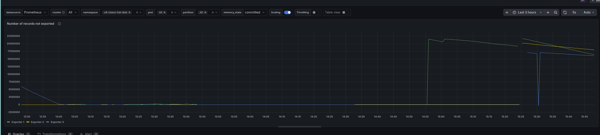

We realized that the reason for this is that after a restart, the exporters need to export from the position they have last acknowledged. This is before the soft-pausing. Only after they are re-exported and acknowledged the records, the corresponding log can be cleared. This means that if we have a large backlog of records in the log, it can take some time for the exporters to catch up and for the log to be cleared.


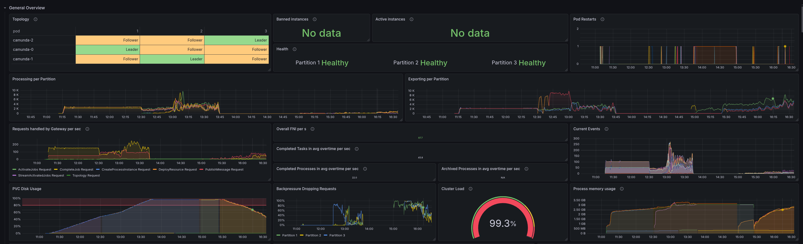

This is especially important to *not keep soft-pausing for a long time*.

The whole process of re-exporting all the data can especially seen on the high stress of Elasticsearch, as it gets a large number of documents to index again.

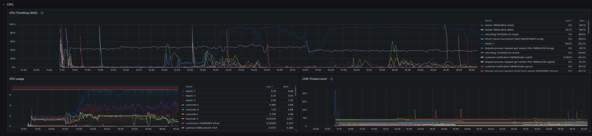


After reclaiming some disk space, the node becomes responsive again and we can see that the backpressure metric is reporting, and requests are being processed again.


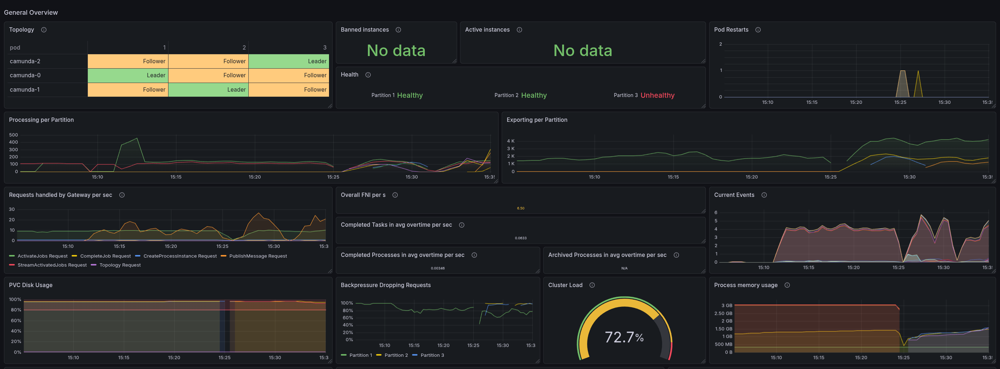

Interesting to note, is that some partition got unhealthy after the restart. Based on the log it seemed that the Engine (StreamProcessor) got blocked while processing records (it run longer than usual). 

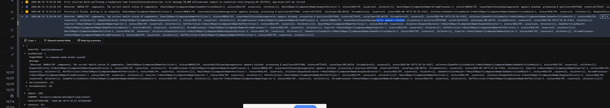

This seems to be because of certain records take longer than usual to process. While normally we are between 50 - 250 ms for processing a record, we see that some records take up to 5-10s to process after restarting and unpausing.

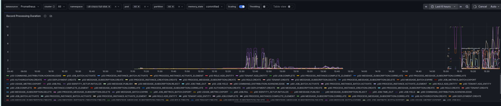

At the end we were able to reclaim the disk space, but it took around the same time as the time we kept the exporters soft-paused.


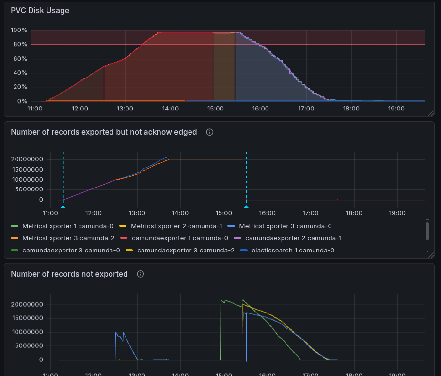

# Key learnings

- Learning 1: When exporters are soft-paused, and we restart a node the exporters need to re-export all not acknowledged records. Ideally, unpause them without restarting, to avoid this.
- Learning 2: Do not keep exporters soft-paused for a long time, as it can lead to a large backlog of records in the log.
- Learning 3: When the disk is full, the node becomes unresponsive and rejects requests, but the backpressure metric is 0, which can be misleading. 
- Learning 4: When the disk is full, even REST requests are not successful, which impacts data availability. 
- Learning 5: Record processing can take much longer than usual when having a full disk and a large backlog to export.


