# Chaos Day Summary


In today's Chaos Day, we wanted to experiment with slow disks. As we have recently run into some incidents related to that. We want to understand and document how Camunda behaves in such scenarios. 

We have two main experiments planned: one for primary storage and one for secondary storage (in this case, Elasticsearch) using slow disks.


**TL;DR;** 

<!--truncate-->


## Chaos experiment: Slow disk on primary storage

We have certain recommendations for disk types in our [documentation](https://docs.camunda.io/docs/next/self-managed/reference-architecture/kubernetes/#minimum-cluster-requirements), especially using SSDs, high-throughput, low-latency disks, as Camunda is an IO-intensive application. What we miss in our documentation is actually showing why this is important. 

In this experiment, we want to understand how the Camunda cluster behaves when the primary storage disks are slow. How does this affect the cluster's performance and availability?

We plan to set up a realistic load test using a Camunda cluster with a standard hard disk for primary storage.


### Expected 

We only support SSDs, as Camunda is generally IO-intensive, and we expect that using slower disks will degrade performance. We expect the system to become unresponsive, leading to timeouts and increased request processing latency.

#### Actual

As we run our tests and set up in GCP, we use the standard hard disks that GCP provides.

[GCP persistent disk types:](https://docs.cloud.google.com/compute/docs/disks/persistent-disks#disk-types) The standard storage class maps to the pd-standard GCP disk type:

```sh
$ k get storageclasses.storage.k8s.io standard -o yaml
apiVersion: storage.k8s.io/v1
kind: StorageClass
metadata:
  name: standard
allowVolumeExpansion: true
provisioner: kubernetes.io/gce-pd
reclaimPolicy: Delete
volumeBindingMode: Immediate
parameters:
  type: pd-standard
```


We were setting up a [realistic load test](https://docs.camunda.io/docs/components/best-practices/architecture/sizing-benchmarks/#reference-benchmark-scenario) using the `c8-chaos-25-pd-standard` namespace, and we are using the `8.9.9` image as the last stable release. We have configured the cluster to use standard hard disks for the primary storage.


```diff
orchestration:
  ## @param core.pvcStorageClassName can be used to set the storage class name which should be used by the persistent volume claim.
  # It is recommended to use a storage class, which is backed with a SSD. Set to "-" to disable use of default storage class.
-  pvcStorageClassName: benchmark-ssd-zonal-v1
+  pvcStorageClassName: standard
```

We will compare this test with our 8.9. x release tests that use SSDs to see the difference in performance and availability.

At the beginning of the test, the throughput looked promising, but after about 30 minutes, we saw a significant drop in throughput, and latency increased. Compared to the same test with SSDs, we see a significant performance degradation of around 50%.

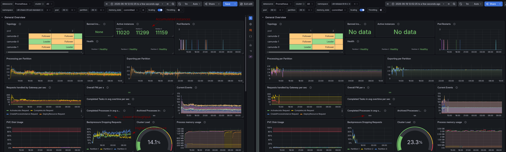

We can see in the release test for 8.9 that at the start it struggled as well, because some load test applications restarted, but later it ran stably at ~51 PI/s and ~101 Tasks per second, while the test with standard disks ran at ~25 PI/s and ~58 Tasks per second.

It is interesting to note that, based on [GCP documentation, the disk throughput](https://docs.cloud.google.com/compute/docs/disks/performance#pd-ssd_12) looks similar. Some might wonder what the difference is here and why we need to use SSDs. The difference is that the standard disks have a much higher latency, which can cause significant performance degradation for an IO-intensive application like Camunda. This is not well documented in hyperscalers like this.

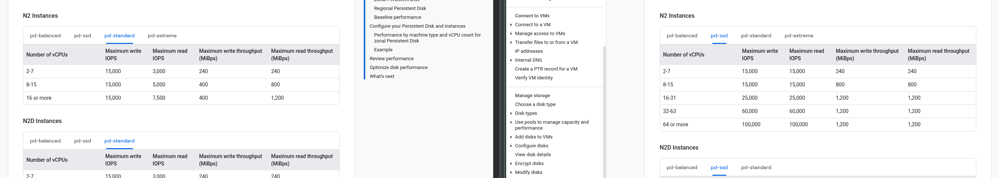

This can be especially seen in the record write and commit latencies.

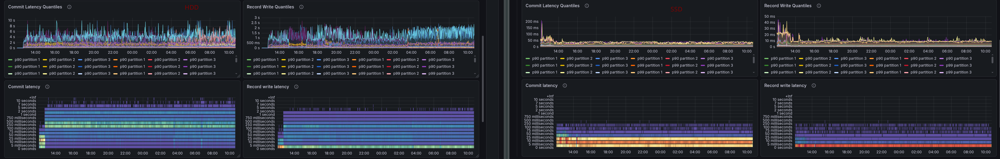

These latencies have a significant impact on the cluster's overall performance. As a leader, one needs to replicate and commit to a command before it is allowed to process and respond to it. A follower needs to write and flush such before it can acknowledge the replication to the leader. 

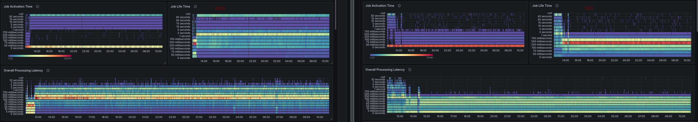

This means that the disk's latency directly impacts request processing latency and can cause significant performance degradation, as we also see in the metrics.

Using slower disks not only affects overall processing performance but also disrupts the underlying RAFT cluster.

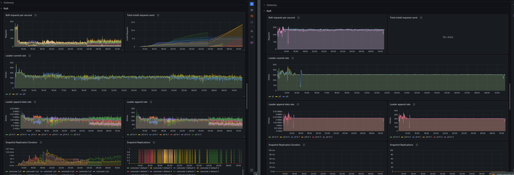
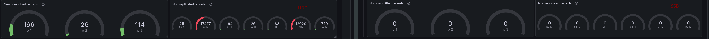


If followers are slow, they lag behind the leader even more than they would naturally, which is already the case, and this will cause snapshot replications. Depending on disk latency, this could even cause more severe issues, such as retry loops on append operations. Depending on the state size (snapshot size), this could put additional load on the network.


## Conclusion

We were able to demonstrate the negative impact that slow disks can have. We were able to reproduce significant performance degradation and increased latency when using simple HDDs. With this, it is visible that not only disk throughput is important, but also disk latency.

This is why we [recommend using SSDs](https://docs.camunda.io/docs/next/self-managed/reference-architecture/kubernetes/#minimum-cluster-requirements) for the primary storage in Camunda clusters, as they significantly improve performance and availability.

## Chaos experiment: Slow disk on secondary storage

Similar to the first experiment, we want to understand how the Camunda cluster behaves when we use a slower disk for the secondary storage. In this case, we will use Elasticsearch as the secondary storage.

As part of our documentation, we recommend using SSDs for Camunda (primary storage), but we do not have a specific recommendation for secondary storage in the [reference architecture](https://docs.camunda.io/docs/next/self-managed/reference-architecture/#secondary-storage-architecture) or [sizing guides](https://docs.camunda.io/docs/next/components/best-practices/architecture/sizing-self-managed/#elasticsearch-scaling).


### Expected 

In general, it must be clear that if secondary storage is not performing well, it will negatively impact Camunda (see related posts).

### Actual

Setup follows a similar pattern as [above](#actual), but we will use a slower disk for the Elasticsearch nodes. We will compare this test with our 8.9.x release tests that use SSDs to see the difference in performance and availability.


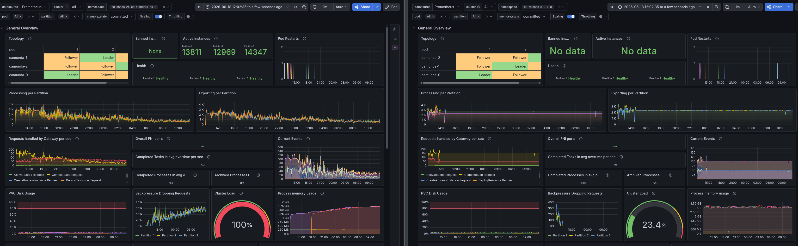


The cluster's performance is even worse than in the first experiment, with a significant drop in throughput and increased latency. We see that the performance is around 15.1 PI/s and 47.1 Tasks per second, which is a significant degradation compared to the test with SSDs.

The backpressure is also significantly higher, as in the first experiment, which indicates that the cluster is struggling to keep up with the load. The backpressure is tightly coupled with the exporting backlog, which would explain this. We have a constant backlog of ~200k records that are not exported.

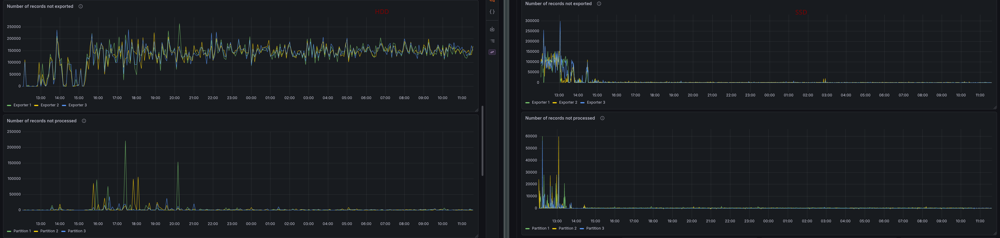

Obviously, this affects the data availability measurement and reaches its maximum value.

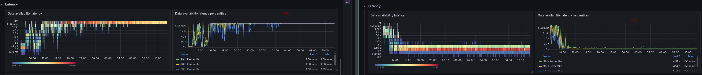

We can see in the exporter metrics that flushes to Elasticsearch now have much higher latency.

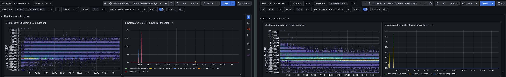

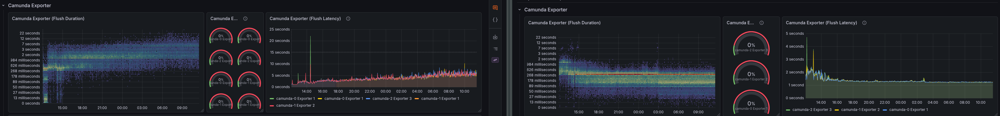

Flush duration can reach 8-10 seconds.

In CPU metrics, we wouldn't see anything in this case, as the cluster isn't able to process as many requests (i.e., it's not handling the same throughput), and the CPU isn't fully utilized.

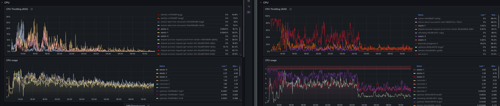

It is interesting that Camunda's memory usage (and GC activity) increases when using HDD for secondary storage. This is likely the case because the in-flight records are not exported, and we keep them in memory.

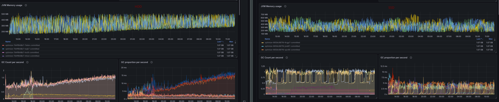

Looking at the Elasticsearch metrics and dashboard (provided by Prometheus) we couldn't see reason why it would perform worse. Something we should keep in mind is that most metrics here are related to throughput, not latency (which is the reason for the performance degradation)


## Conclusion

We were able to show that using slower disks, such as HDDs, for secondary storage can have a significant negative impact on the Camunda cluster's performance as well. It is even worse than using slower disks for the primary storage. 

This is why we should also recommend using SSDs for secondary storage in Camunda clusters, as they significantly improve performance and availability. We should reflect that in our documentation as well.


