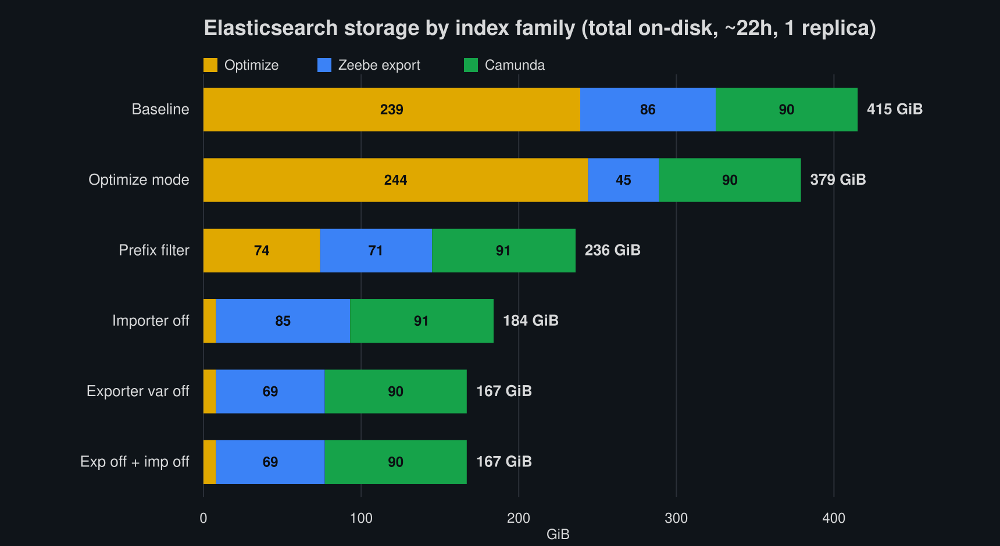
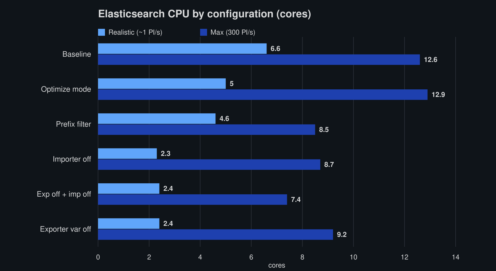
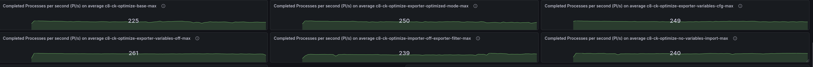

<!--
Charts: storage-by-family.png and es-cpu-by-config.png are rendered from measured data (committed).
Still TODO — capture from Grafana before publishing: real-general.png, max-general.png, max-throughput.png
(dashboard overviews + throughput-over-time, which show run-to-run variance naturally).
-->

# Chaos Day Summary

In a [previous Chaos Day](https://camunda.github.io/zeebe-chaos/2026/06/10/Impact-of-Optimize-on-Camunda/) we measured what Optimize costs a cluster: at a realistic workload it drove **3.4x higher Elasticsearch CPU** and **~4x more ES disk** than running without it. That post ended with an open question — *can variable handling be tuned to reduce the impact?* This Chaos Day answers it.

We ran **twelve** load tests on Camunda 8.9.9 — six variable-filtering configurations, each at both a **realistic** and a **max** workload — and compared throughput, CPU, memory, and ES disk across all of them. All twelve started together and ran in parallel on identical infrastructure and the same Helm chart, each started fresh with an empty Elasticsearch, so their footprints are directly comparable.

**TL;DR;** Keeping variables out of Optimize is the big lever. Disabling variable export (`index.variable=false`) cuts **total Elasticsearch storage ~60%** and **ES CPU ~65%** at a realistic load, and recovers **~15–25% throughput** at max load. The surprising part: **Optimize stores a variable ~14× more expensively than the raw Zeebe export does** (≈29× for high-cardinality string variables), so the cost lives almost entirely in Optimize's imported indices — not in the export. And because in Camunda 8.9 the Elasticsearch exporter feeds **only Optimize**, this costs you Optimize variable analytics *only* — Operate and Tasklist (served by the Camunda Exporter) keep their variables untouched.

<!--truncate-->

## Chaos Experiment

All twelve clusters ran in parallel on the same benchmark infrastructure with `orchestration-tag=8.9.9`, the same `camunda-platform-8.9` Helm chart (pinned to a single chart revision so index/replica settings are identical), and Optimize enabled everywhere. Each cluster started with an empty Elasticsearch so disk figures reflect only this run's accumulation, and all were started together so equal-age comparisons are valid.

All disk figures below are **total store size (primary + replica)** as reported by `_cat/indices`, which equals the real on-disk footprint and matches the cluster's filesystem-used metric. The benchmark runs **1 replica**, so total ≈ 2× the primary-only figure; ratios are identical either way.

### Configurations tested

Each configuration changes only how process **variables** are exported to Elasticsearch and/or imported by Optimize:

| Name | What it changes | Key setting |
|---|---|---|
| Baseline | Default — all variables exported and imported | _(none)_ |
| Importer off | Optimize skips importing variables (still exported to ES) | `CAMUNDA_OPTIMIZE_ZEEBE_VARIABLE_IMPORT_ENABLED=false` |
| Prefix filter | Only variables named `customer*` are exported | `zeebe.broker.exporters.elasticsearch.args.index.variableNameInclusionStartWith[0]=customer` |
| Exporter variable off | No variable records exported at all | `zeebe.broker.exporters.elasticsearch.args.index.variable=false` |
| Exporter off + importer off | Both of the above (belt-and-suspenders) | `index.variable=false` + `VARIABLE_IMPORT_ENABLED=false` |
| Optimize mode | Exporter writes only what Optimize needs | `zeebe.broker.exporters.elasticsearch.args.index.optimizeModeEnabled=true` |

**A note on the 8.9 architecture, because it shapes every result:** the Elasticsearch exporter being tuned here feeds **only Optimize** (plus any custom data-ingestion pipeline a customer wires up). **Operate and Tasklist get their data from the Camunda Exporter** — a separate path. So all of these levers affect Optimize alone; Operate and Tasklist keep full variable data regardless. We confirm this empirically below.

Each configuration was run at two workloads, mirroring the previous post:
- **realistic** — a complex process model at a sustainable production rate (~1 PI/s), each instance carrying multiple tasks, sub-processes, and variables; representative of real customer workloads.
- **max** — driven at 300 PI/s to push the engine to its throughput ceiling and surface backpressure.

The two workloads use **different variable payloads**, which matters for the prefix filter:

- the **realistic** payload has 15 named variables, including three `customer`-prefixed ones (`customer`, `customerId`, `customer_claim_frequency`) alongside `disputeDetails`, `fraud_score_result`, and others — so the `customer` prefix filter keeps a meaningful subset.
- the **max** payload uses generic names (`var1`…`var14`, `businessKey`) with no `customer`-prefixed variables — so the `customer` prefix filter matches nothing and behaves identically to disabling variable export. The prefix-filter result is therefore **not** comparable across the two workloads; at max load it is effectively a second "exporter variable off" data point.

### Validating the configuration at the data level

Before trusting the resource numbers, we confirmed each configuration actually does what it claims — not just that the Helm values rendered, but that the data landing in Elasticsearch reflects the filter. A terms aggregation on the Zeebe variable record index shows which variable names reached ES:

```bash
curl -s -H 'Content-Type: application/json' \
  'localhost:9200/zeebe-record_variable*/_search' -d '{
    "size": 0,
    "track_total_hits": true,
    "aggs": { "names": { "terms": { "field": "value.name", "size": 50 } } }
  }'
```

Counts for one non-`customer` variable (`disputeDetails`) and one `customer`-prefixed variable (`customer`) per realistic cluster:

| Configuration | Total variable docs | `disputeDetails` | `customer` |
|---|---|---|---|
| Baseline | 11.4M | 16,001 | 1,615,967 |
| Optimize mode | 11.5M | 16,114 | 1,627,390 |
| Prefix filter (`customer`) | 1.67M | 0 | 1,637,615 |
| Exporter variable off | 0 | 0 | 0 |
| Exporter off + importer off | 0 | 0 | 0 |
| Importer off | 11.5M | 16,164 | 1,632,452 |

This confirms the filters at the data level: **exporter variable off** writes no variable records; the **prefix filter** drops every non-`customer` variable (`disputeDetails` → 0) while keeping `customer*`; and **importer off** / **optimize mode** leave the full variable stream in the export (their effect is downstream, in Optimize's own indices).

### Expected

We expected configurations that remove variable data to reduce ES disk and CPU, with the deepest cuts where variables never reach ES at all. Open questions: how much does each lever actually save, whether disabling only the Optimize *importer* (variables still exported) saves storage, and whether any of this recovers throughput at max load.

### Actual

#### Realistic workload: where the storage goes

*This is the primary story — at a realistic workload throughput is unconstrained (all six held ~1 PI/s with zero backpressure), so the differences land entirely in Elasticsearch.*

Breaking total ES storage into three families makes the picture clear — **Optimize** (`optimize-*`, the ES exporter's only consumer), **Zeebe export** (`zeebe-record*`, the raw exporter output), and **Camunda** (`operate-*` + `tasklist-*` + `camunda-*`, written by the independent Camunda Exporter):



| Configuration | Optimize | Zeebe export | Camunda | **Total** | vs base |
|---|---|---|---|---|---|
| Baseline | 239 | 86 | 90 | **415 GiB** | — |
| Importer off | 8 | 85 | 90 | **184 GiB** | −56% |
| Prefix filter | 74 | 71 | 91 | **236 GiB** | −43% |
| Exporter variable off | 8 | 69 | 90 | **167 GiB** | −60% |
| Exporter off + importer off | 8 | 69 | 90 | **167 GiB** | −60% |
| Optimize mode | 244 | 45 | 90 | **379 GiB** | −9% |

Three things stand out:

- **The Optimize index is the whole story.** It is ~58% of baseline storage, and removing variables (by import *or* export) collapses it from 239 GiB to ~8 GiB — a **97% cut**. Everything else barely moves.
- **The Camunda bucket is flat at ~90 GiB across every configuration**, including `exporter variable off`. That is the proof of the architecture note above: Operate/Tasklist variables come from the Camunda Exporter and are completely untouched by these levers.
- **Importer-off and exporter-off are nearly identical** (184 vs 167 GiB). Both kill the Optimize cost; the ~17 GiB difference is just the variable records that importer-off leaves sitting in the Zeebe export.

##### Optimize stores variables 14–29× more expensively than the export

The most striking result is the *amplification*. The same variables that occupy a modest slice of the raw export balloon in Optimize's nested representation:

- **All variables: ~14×.** Removing them shrinks Optimize by **231 GiB** (239 → 8) but removes only **~17 GiB** of Zeebe variable records.
- **`customer*` string variables: ~29×.** The prefix filter adds back only `customer*` — **+2.3 GiB** in the export, but **+66 GiB** in Optimize (74 vs 8). High-cardinality string variables amplify far worse than the numeric average.

In other words, the lever that matters is keeping variables *out of Optimize*; trimming the export alone barely dents the total.

And the Optimize-mode result, often assumed to be a storage win, is not: it leaves the Optimize index essentially unchanged (244 vs 239 GiB) but **halves the Zeebe export** (86 → 45 GiB). Those ~41 GiB it strips are *non-variable* records (jobs, etc.) that Optimize never imports — pure dead weight in an Optimize-only export, but irrelevant to the Optimize index itself.

#### Realistic workload: CPU and memory



ES CPU tracks the storage story almost exactly (the chart above shows both workloads; the max bars are discussed below):

| Metric (cores) | Baseline | Importer off | Prefix filter | Exporter var off | Exp off + imp off | Optimize mode |
|---|---|---|---|---|---|---|
| ES CPU | 6.6 | 2.3 | 4.6 | 2.4 | 2.4 | 5.0 |
| Camunda CPU | ~4.5 | ~4.2 | ~5.5 | ~3.9 | ~4.9 | ~4.4 |

Removing variables from Optimize cuts ES CPU by ~65% (6.6 → ~2.4 cores). **Camunda broker CPU is unaffected** — it sits around 4–5 cores regardless. Variable filtering is purely an Elasticsearch-side lever. ES (and total) memory was likewise flat (~13–15 GiB ES) across all six — not a tuning lever.


#### Max workload: throughput and backpressure

*At 300 PI/s the clusters are throughput-constrained, so the question becomes which configuration sustains the most completed instances by freeing Elasticsearch write capacity.*



| Metric | Baseline | Importer off | Prefix filter | Exporter var off | Exp off + imp off | Optimize mode |
|---|---|---|---|---|---|---|
| Completed PI/s | 222 | 235 | 244 | 266 | 230 | 253 |
| Dropped req/s (backpressure) | 416 | 374 | 345 | 267 | 379 | 318 |

The robust signal: **baseline is consistently the worst** (~205–224 PI/s with the highest backpressure across every sample), and configurations that keep variables out of the export sustain **~15–25% more throughput**. The fine ranking *among* the variable-reduced configs sits inside run-to-run / noisy-neighbour variance (±~20 PI/s), so we don't read precise positions into it — e.g. Optimize mode read 253 PI/s here but 207 in a later sample, so we make no throughput claim for it.

One subtlety worth calling out: at max load, **only export-side removal recovers throughput**. Importer-off barely helps (235 vs 222) — it leaves the export write load unchanged, and at max load the Zeebe→Elasticsearch write path is the bottleneck, not Optimize's downstream import.

On resources, the ES CPU chart above tells the max story too: the variable-reduced configurations run **cheaper** (~7–9 cores) than baseline and Optimize mode (~13 cores) — and they do so while sustaining *higher* throughput, so the lever wins on both axes at once.

(We deliberately don't show a max-load storage breakdown: at 300 PI/s each configuration completes a *different* number of instances, so the Zeebe and Camunda index sizes there reflect differing throughput rather than the variable setting. Only the equal-rate realistic decomposition above is a clean apples-to-apples comparison.)

ES CPU and disk at max mirror the realistic picture — the variable-reduced configs run materially cheaper (ES CPU ~7–9 vs ~13 cores; less than half the ES disk) — with the same caveat that baseline and Optimize mode are the heaviest.

## Configuration Guide

For each lever: what it controls, the measured effect, and when to use it. (Storage figures are total on-disk at a realistic load; all of them touch **Optimize only** — Operate and Tasklist keep their variables.)

- **Exporter variable off** (`index.variable=false`) — *recommended default.* Variables are never written to the Optimize-facing export. Total ES storage −60%, Optimize index −97%, ES CPU −65%, and ~15–25% more throughput at max with the lowest backpressure. Trade-off: Optimize loses variable-level analytics. Use whenever Optimize doesn't need variable data.
- **Importer off** (`CAMUNDA_OPTIMIZE_ZEEBE_VARIABLE_IMPORT_ENABLED=false`) — same effect on the Optimize index (−97%), slightly less total saving (−56%, the export keeps the variable records), and it does **not** recover max throughput. Use when you still want the raw variable records in the export (e.g. a custom pipeline) but want to spare Optimize the storage.
- **Prefix filter** (`variableNameInclusionStartWith`) — a tunable middle ground (−43% total, −72% Optimize index here), scaling with how much of the payload matches. Use when a bounded, named set (e.g. `customer*`) carries the analytics value and the rest is noise.
- **Exporter off + importer off** — belt-and-suspenders; behaves like exporter-off (−60%). No additional benefit over exporter-off alone for an Optimize-only setup.
- **Optimize mode** (`optimizeModeEnabled=true`) — **not** a variable-storage lever (Optimize index unchanged, −9% total). It strips ~41 GiB of non-variable records the export doesn't need for Optimize — useful only to slim the raw export in an Optimize-only deployment.

### What We Learned

- **The Optimize index is where variables cost you** — ~58% of baseline ES storage. Removing variables from import or export cuts it ~97% (239 → 8 GiB) and ES CPU ~65%, with zero throughput cost at a realistic load.
- **Optimize amplifies variable storage ~14× over the raw export** (≈29× for high-cardinality string variables) — so trimming the export alone barely helps; the variables must be kept out of Optimize.
- **Importer-off ≈ exporter-off for storage**, but only **export-side** removal recovers throughput at max load (the export write path is the max-load bottleneck).
- **Optimize mode is not a variable lever** — it shrinks the export (jobs etc.), not the Optimize index.
- **It only affects Optimize.** The Camunda Exporter keeps Operate/Tasklist variables intact (~90 GiB, flat across all configs). Camunda broker CPU and memory are unaffected — this is an Elasticsearch-side lever.

### Possible Improvements / Recommendations

- If you run Optimize but don't need variable analytics, set **`index.variable=false`** — the largest, simplest saving (~60% total ES storage, ~65% ES CPU), with no impact on Operate/Tasklist.
- If you need a *subset* of variables in Optimize, use the **prefix filter** rather than exporting everything — the saving scales with how little you keep.
- Update the [sizing guidance](https://docs.camunda.io/docs/next/components/best-practices/architecture/sizing-your-environment/) with these concrete variable-filtering numbers ([camunda-docs#9118](https://github.com/camunda/camunda-docs/issues/9118)).
