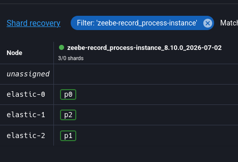
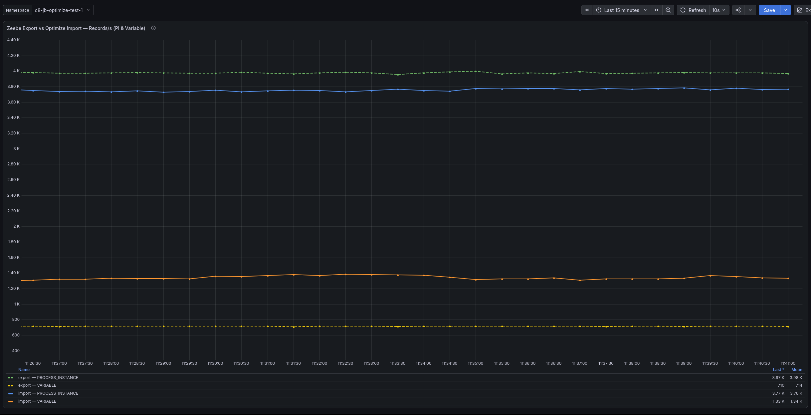
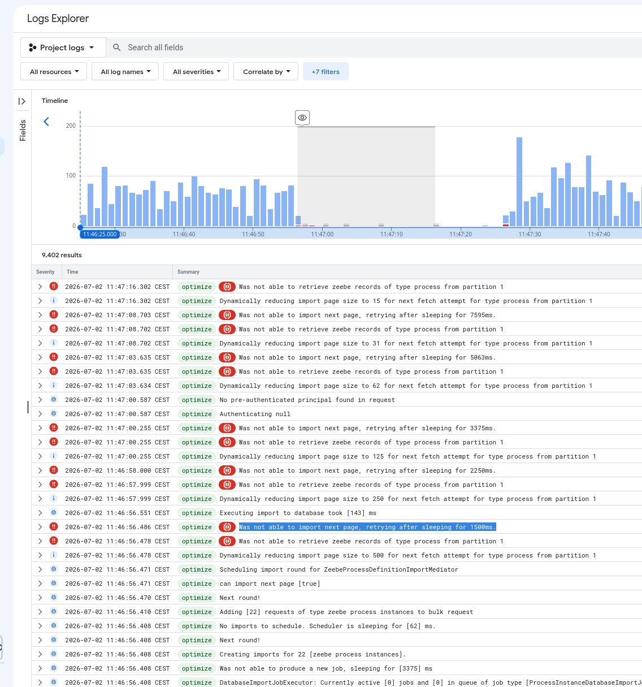
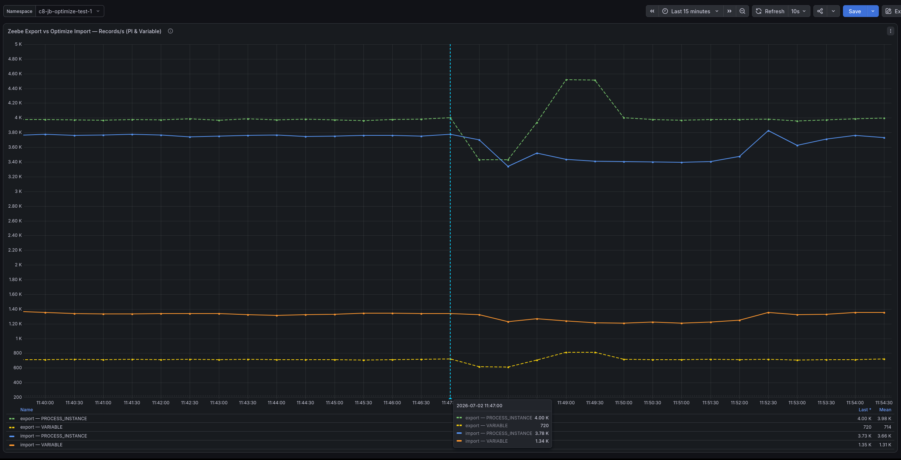
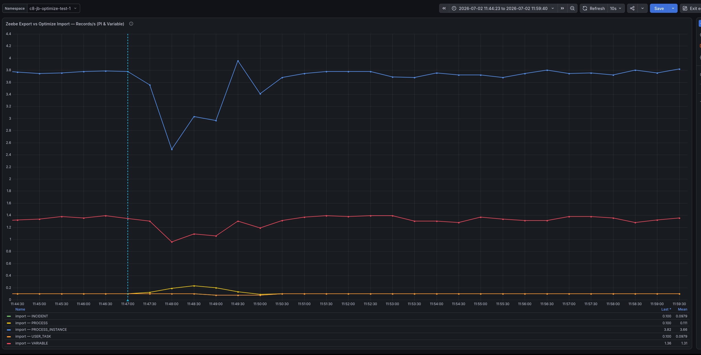
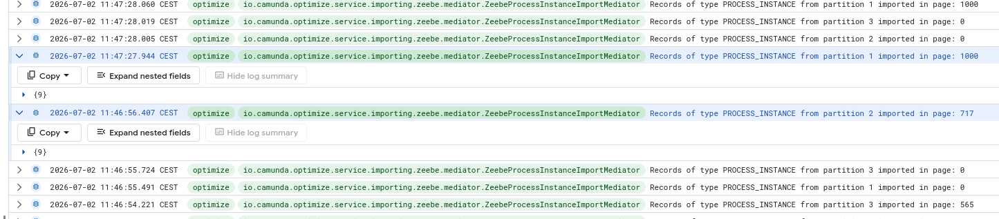
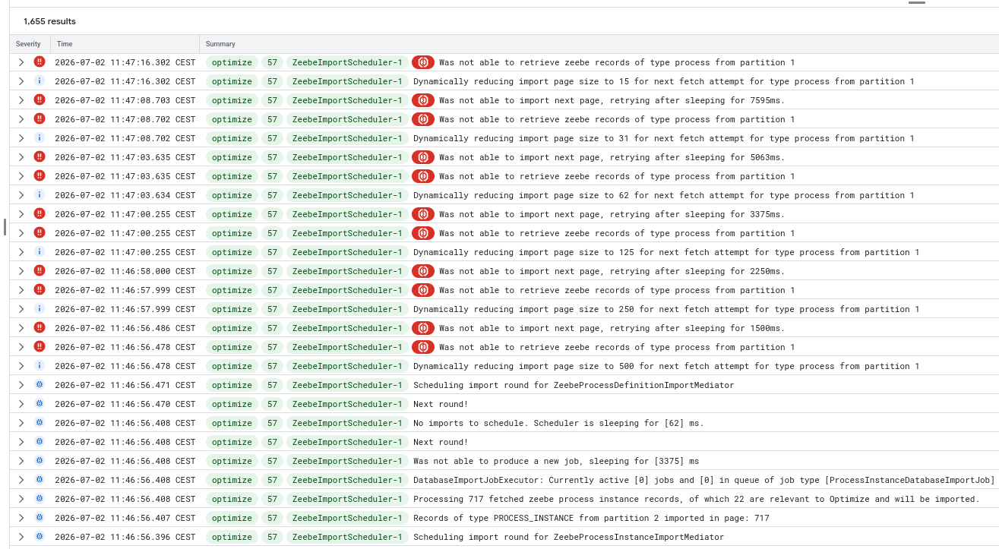
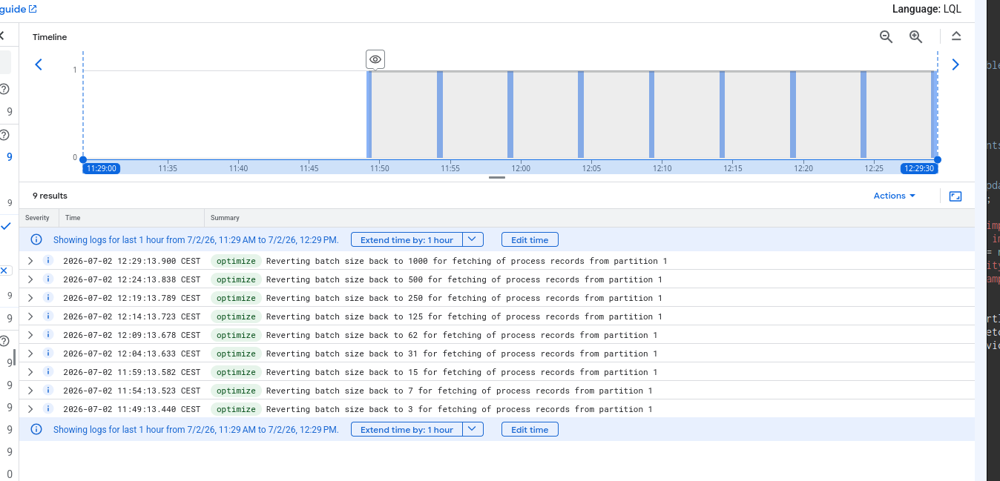

# Chaos Day Summary

In today's Chaos Day, we continued our experiment on Optimize and assessed its behavior with the default configuration when the underlying Elasticsearch cluster restarts.

This exercise is the continuation of the recent improvements and clarification we added to our documentation concerning the scaling and impact of Optimize.

**TL;DR;** 
1. Default configuration not OK: missing replicas
2. Affected replica

<!--truncate-->

## Chaos Experiment: Optimize behavior when Elasticsearch nodes restart

Our [minimal default recommendation to deploy Elasticsearch as Camunda's secondary storage](https://docs.camunda.io/docs/self-managed/concepts/secondary-storage/managing-secondary-storage/) is to deploy:

1. A 3 nodes Elasticsearch cluster
2. 1 or more primary shards per indices
3. At least one replica shard per indices

As it turns out, our default configuration doesn't exactly follow these recommendations and is not [always creating replica shards for all the
indices](https://github.com/camunda/camunda/issues/55366). Although Elasticsearch's documentation is relatively clear about what to expect when shards
are (temporarily) unavailable (for instance, because one of the Elasticsearch node has been restarted), we wanted to confirm the effects missing
shards would have on Optimize: during one of the internal load tests we are regularly conducting, we TODO


TODO
We recently investigated 


Most of the time, Optimize correctly recovers when Elasticsearch nodes restart.

We found some cases where Optimize doesn't, and we want to undertand these edge cases.


hypothesis:

1. Size of the shards (too big, slow ES)
2. OK: restart node with no shard
3. to test: restart node with at least one shard used by Optimize
    with / without replication
4. to test: restart the node holding the shard containing partition 2 and 3 (routing bug)


to test: how adding replicas help?

### Expected

When one of the node of the Elasticsearch cluster restarts, we expect to see a short duration slow down of importing, while the Elasticsearch cluster readjust, follow by a short spike when Optimize catches up, and eventually a return to the same steady state as before the restart in a short amount of time (couple of minutes).


### Actual

During the experiment, we tried to reproduce the issue we saw in our internal weekly load tests, where an Elasticsearch node holding one or more
primary shards for the `zeebre-record-*` indices, used by Optimize to import its own data, and configured without any replica, restarts.

1. The current `zeebe-record_process-instance` index is configured with 3 primary shards *but* not replicas.


In addition, we recently discovered a bug where some of the shards used to store the Zeebe records are completely empty. We realized that Zeebe
exports its records to the `zeebe-record-$objectType` indices and routes them to Elasticsearch shards using the partition ID.

> By default, Zeebe organizes its data into [partitions](https://docs.camunda.io/docs/components/zeebe/technical-concepts/partitions/) and we usually
> configure Zeebe with 3 partitions ([default value for our Helm
> Chart](https://github.com/camunda/camunda-platform-helm/blob/7ca27f1eb2ae094af80d6e9189d4f163d5fc03d5/charts/camunda-platform-8.9/values.yaml#L2661-L2662),
> default value provided on Camunda SaaS).


As the number of values for "partition ID" is really low (a handful of values), the possibilities of routing the same partitions to the same shards
and/or to no shard at is very high. This can be very quickly experimented using Murmur3 (this is [the algorithm Elasticsearch uses](https://artifacts.elastic.co/javadoc/org/elasticsearch/elasticsearch/9.4.3/org.elasticsearch.server/org/elasticsearch/cluster/routing/Murmur3HashFunction.html):

```python3
>>> import mmh3
>>> number_of_shards = 3
>>> for partition_id in {b"1", b"2", b"3"}:
...     hash = mmh3.hash(partition_id)
...     shard_number = hash % number_of_shards
...     print(f"Partition {partition_id} ⇒ shard {shard_number}")
Partition b'1' ⇒ shard 2
Partition b'2' ⇒ shard 0
Partition b'3' ⇒ shard 0
```

We can also confirm this directly using [Elasticsearch `_search_shards`
API](https://www.elastic.co/docs/api/doc/elasticsearch/operation/operation-search-shards):

1. We give to the API the number of the index and the routing key (here, the Zeebe partition ID)
2. Elasticsearch returns (in particular) the node(s) and shard(s) that will be used by a search query.

For instance, we can ask which shard would be used by partition ID `3` with:
```shell
curl "localhost:9200/zeebe-record_process-instance_8.10.0_2026-07-02/_search_shards?routing=3" | jq .shards
```

This gives:
```json
{
  "nodes": {...}
  "shards: [
    [
      {
        "state": "STARTED",
        "primary": true,
        "node": "oKkfytvPQEKiEQLEqbn76Q",
        "relocating_node": null,
        "shard": 1,
        "index": "zeebe-record_process-instance_8.10.0_2026-07-02",
        "allocation_id": {
          "id": "tmD1vSTuQ-uAwdshonUHnA"
        },
        "relocation_failure_info": {
          "failed_attempts": 0
        }
      }
    ]
  ]
}
```

With all our partition ID, we observe a similar type of response as in our example using Python:

```shell
$ for partitionID in 1 2 3
do
    shard=$(curl -s "localhost:9200/zeebe-record_process-instance_8.10.0_2026-07-02/_search_shards?routing=$partitionID" | jq '.shards[][].shard')
    echo "Partition ID $partitionID ⇒ shard=$shard"
done
```

gives:
```
Partition ID 1 ⇒ shard=2
Partition ID 2 ⇒ shard=1
Partition ID 3 ⇒ shard=1
```


#### Actual test

In any case, we initially wanted to check that, if we restart the node that holds the empty shard, with no replica, the impact on Optimize would be
null.

First, we confirmed our routing findings and that shard 0 doesn't have any document, by checking the Elasticsearch content itself:

1. Shard 0 is completely empty (`docs=0`)
2. Shard 1 and 2 contain many documents (and shard 1 is twice the size of shard 2, confirming the routing tests did above)

```
$ curl -s "localhost:9200/_cat/shards/zeebe-record_process-instance*?v=true"
index                                           shard prirep state     docs   store dataset ip            node
zeebe-record_process-instance_8.10.0_2026-07-02 0     p      STARTED      0    249b    249b 10.152.18.136 elastic-0
zeebe-record_process-instance_8.10.0_2026-07-02 1     p      STARTED 708701 108.4mb 108.4mb 10.152.4.5    elastic-2
zeebe-record_process-instance_8.10.0_2026-07-02 2     p      STARTED 353889  47.1mb  47.1mb 10.152.70.198 elastic-1
```

This index really has no replicas! (with [Elasticvue](https://elasticvue.com/))




We also confirmed that we have a steady state:

1. The green line indicates the amount of exported Process Instance by Camunda: ~4000 records/second
2. The blue line indicates the amount of imported Process Instance by Optimize: a bit less at ~3800 records/second (it's actually unclear why we don't
   import all the documents at the moment :) )



And that all the Optimize indices have replica shards configured (`rep=1`):

```
$ curl -s "localhost:9200/_cat/indices/optimize*?v=true"
health status index                                            uuid                   pri rep docs.count docs.deleted store.size pri.store.size dataset.size
green  open   optimize-process-instance-bankdisputehandling_v8 NJP28c2VTValgK_Pm0oNLA   3   1    3070686       633049      5.6gb          2.8gb        2.8gb
green  open   optimize-settings_v3                             Sm_dhf78QAy5Aqr4f91cww   1   1          0            0       498b           249b         249b
green  open   optimize-dashboard_v8                            P1z3F5HKSJCoptzv5XiYhg   1   1         10            0       21kb         10.5kb       10.5kb
green  open   optimize-dashboard-share_v4                      xzqcZbQXRye8c6IGH3qR4Q   1   1          0            0       498b           249b         249b
green  open   optimize-single-process-report_v11               jPRlutcNQEeNseET4RAFTQ   1   1          3            0      151kb         75.5kb       75.5kb
green  open   optimize-tenant_v3                               YgxSAjtnR_iV50rMUZ1TlQ   1   1          0            0       498b           249b         249b
green  open   optimize-report-share_v3                         pXydGPf7TBW4b0jzJMMgrA   1   1          0            0       498b           249b         249b
green  open   optimize-process-definition_v6                   nGxETXInRLSbQ7JTgKTR_g   1   1          2            0    424.8kb        212.4kb      212.4kb
green  open   optimize-collection_v5                           vYAuSvGYTD-U8GevLL-KVQ   1   1          0            0       498b           249b         249b
green  open   optimize-decision-definition_v5                  cA-_3YboT3Gb9VJ7heOSog   1   1          0            0       498b           249b         249b
green  open   optimize-timestamp-based-import-index_v5         -qNwD0w0QamUcxBLuWeWGg   1   1          0            0       498b           249b         249b
green  open   optimize-single-decision-report_v10              HRO-TnwjSl6nc-x_YTDtMA   1   1          0            0       498b           249b         249b
green  open   optimize-variable-label_v1                       yBOjeMYhRQOETGsuBlAW3Q   1   1          0            0       498b           249b         249b
green  open   optimize-combined-report_v5                      _AtBcQdeRleBsrKmrbSJGQ   1   1          0            0       498b           249b         249b
green  open   optimize-alert_v4                                qjCe3m6zQzC_fgE4ElQULw   1   1          0            0       498b           249b         249b
green  open   optimize-terminated-user-session_v3              xSzciMRQTZCg8B6-j86vaw   1   1          0            0       498b           249b         249b
green  open   optimize-external-process-variable_v2-000001     K5rkpnBWTG66BMy3IlDWSw   1   1          0            0       498b           249b         249b
green  open   optimize-process-overview_v2                     Khnz7wy-TNyFd0QKvpbw4Q   1   1          2            0      9.7kb          4.8kb        4.8kb
green  open   optimize-metadata_v3                             iAuJil4lRN681wlFZD6g3Q   1   1          1            0      9.5kb          4.7kb        4.7kb
green  open   optimize-instant-dashboard_v1                    dOpIbXIJSc-JGzzmKHh2yQ   1   1          0            0       498b           249b         249b
green  open   optimize-business-key_v2                         EHtHbEFaRDiqmb2R9gSaLw   1   1          0            0       498b           249b         249b
green  open   optimize-position-based-import-index_v3          emgDxywLThOI0R3ZKyJbHw   1   1         15            0    305.3kb        152.6kb      152.6kb
green  open   optimize-process-instance-refundingprocess_v8    HCRGR_aGS_eVLDphlT6mDg   3   1    1779172       196828      2.3gb          1.1gb        1.1gb
```


Then, we restarted the Elasticsearch node `elastic-0` 🔥

```
kubectl delete pod elastic-0
```


#### Observations


After the restart, we start to see different unexpected behaviors.

First, we quickly start to see error logs from Optimize and mentions that it starts to throttle requests to Elasticsearch:



This is unexpected ... but actually expected: the logs mention the `process` datatype, not the `process instance` datatype, which was the only one we
actually cared about before the experiment.

We quickly checked how the Zeebe record index was configured for the `process` datatype:

```
$ curl -s "localhost:9200/_cat/shards/zeebe-record_process_*?v=true"
index                                  shard prirep state   docs   store dataset ip            node
zeebe-record_process_8.10.0_2026-07-02 0     p      STARTED    6 845.3kb 845.3kb 10.152.18.137 elastic-0
```

1. There's a single primary shard configured for this index
2. There are no replica shards configured at all
3. The single primary shard is hosted on `elastic-0`, which is the node we restarted.

So obviously, when the node is not available, Optimize is not able to read data from the index and it reports the errors we can see in the logs.

However, this index is very small (6 documents!) and there are no errors logs for our `process instance` records, which is what we were expecting! ✅

After a few minutes (to give time to come back to a steady state and for Prometheus to collect the metrics), we looked again at our export/import
metrics:




On the Camunda export side (green line), we see an expected behavior:
1. When the node is unavailable: TODO

===== TODO
exporting: a drop followed by spike:

* 4k -> 3.4k -> 4.5k -> back to 4k


hypothesis: an index in which we write in had a primary shard without replica hosted on elastic-0. Confirmed at least with job index:

```
$ curl -s "localhost:9200/_cat/shards/zeebe-record_job_*?v=true" 
index                              shard prirep state     docs   store dataset ip            node
zeebe-record_job_8.10.0_2026-07-02 0     p      STARTED      0    249b    249b 10.152.70.198 elastic-1
zeebe-record_job_8.10.0_2026-07-02 1     p      STARTED 614165 106.7mb 106.7mb 10.152.18.137 elastic-0      <===========
zeebe-record_job_8.10.0_2026-07-02 2     p      STARTED 307064  42.8mb  42.8mb 10.152.4.5    elastic-2
```
===== TODO

2. When the nodes come back online, Camunda process the short accumulated backlog of record until it returns to its steady state, in less than 3
   minutes.

However, on the Optimize import side, we observe a much large impact than anticipated. If we zoom in only on Optimize imports throughput:

===== TODO
importing: small drop: 
* 3.8k -> 3.3kk then back to 3.8k

===== TODO





We started to formulate our hypothesis:

1. Importing from the `zeebe-record-process` index was not possible because of the missing single shard
2. Optimize started to backoff importing (just for this index, or generally)
3. Did optimize start to backoff all the activity with elasticsearch?


##### Impact from `zeebe-record-process`

We quickly found out the issue for this specific index as the logs were very clear.


1. At 11:46:56 CEST, we can see the first reaction from Optimize about the node restarting:
   ```
   Was not able to import next page, retrying after sleeping for 5063ms.
   ```
   In turn caused by:
   ```
   org.elasticsearch.client.ResponseException: method [POST], host [http://elastic:9200], URI [/zeebe-record-process/_search?routing=1&typed_keys=true&request_cache=false],
        status line [HTTP/1.1 503 Service Unavailable]
   {
     "error": {
       "root_cause": [{ "type": "no_shard_available_action_exception", "reason": null }],
       "type": "search_phase_execution_exception",
       "reason": "all shards failed",
       "phase": "query",
       "grouped": true,
       "failed_shards": [
         {
           "shard": 0,
           "index": "zeebe-record_process_8.10.0_2026-07-02",
           "node": null,
           "reason": {"type": "no_shard_available_action_exception", "reason": null}
         }
       ]
     },
     "status": 503
   }
   ```
   This matches our hypothesis: the single shard is not availabe, Optimize can't read from the index.
2. After that, Optimize's logs continue to mention about the unavailability and that it's throttling the imports for this datatype. All the backoffs
   accumulate to about 30 seconds:
   * `not able to retrieve zeebe records of type process [...] retrying after sleeping for 10000ms.`
   * `not able to retrieve zeebe records of type process [...] retrying after sleeping for 7595ms.`
   * `not able to retrieve zeebe records of type process [...] retrying after sleeping for 5063ms.`
   * `not able to retrieve zeebe records of type process [...] retrying after sleeping for 3375ms.`
   * `not able to retrieve zeebe records of type process [...] retrying after sleeping for 2250ms.`
   * `not able to retrieve zeebe records of type process [...] retrying after sleeping for 1500ms.`


What was NOT expect through where the debug logs regarding Zeebe `process instance`: as we mentioned earlier, our assumption was that as the shard on
the node we restarted was completely empty, it should not have any impact on Optimize `process import` importer.

However, we can also clearly see the same 30 seconds gap within the `process instance` importer:




```
2026-07-02 11:47:27.944 CEST
    io.camunda.optimize.service.importing.zeebe.mediator.ZeebeProcessInstanceImportMediator
        Records of type PROCESS_INSTANCE from partition 1 imported in page: 1000

2026-07-02 11:46:56.407
    CEST io.camunda.optimize.service.importing.zeebe.mediator.ZeebeProcessInstanceImportMediator
        Records of type PROCESS_INSTANCE from partition 2 imported in page: 717
```


We started to be suspicious about the multi-threading behavior: we were originally assuming that all the importers would be running independently from each other, but having one importer (for `process` records) having an influence on another importer (for `process-instance` records) made us think that they were perhaps run only on a single thread?

This was also quickly found out: the Optimize logs already report which thread is responsible for the event logs and we have a single thread that
seems to read from all the Zeebe record indices, with `threadID=57` and `threadName=ZeebeImportScheduler-1`:




We continued the session by diving into the source code for the Optimize Zeebe records importers.

====== TODO
however importing is affected for ~3 minutes (in the metrics)

summary:

1. "process" importer is backed off because single shard unavailable
2. other importers are also impacted: single thread importer?
====== TODO

Eventually, Optimize seems to recover completely but only 45 minutes after the beginning of the incident, by slowly (every 5 minutes) removing the
throttling mechanism put in place just after Elasticsearch restarted:




## Found Bugs

We reported a new issue:

* [Single scheduler thread blocks all Optimize importing during ES unavailability (#56541)](https://github.com/camunda/camunda/issues/56541)


However, this is the accumulation of several factors that are leading to all the issues found with Optimize:

* [No replicas by default for exported Zeebe records indices (#55366)](https://github.com/camunda/camunda/issues/55366)
* [Documents not evenly distributed in Zeebe records indices (#54601)](https://github.com/camunda/camunda/issues/54601)


---

Notes:


note for the DL team: if they change the routing mechanism, they should also sync with the data consumers (optimize?)
