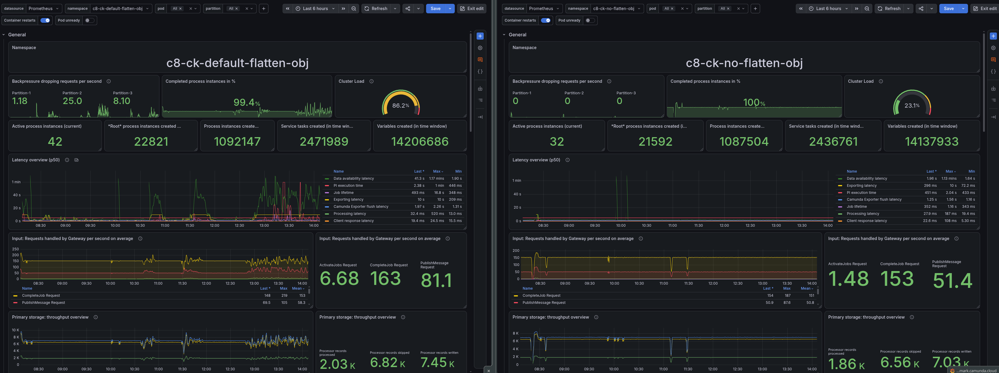
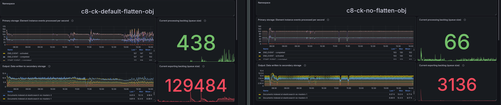
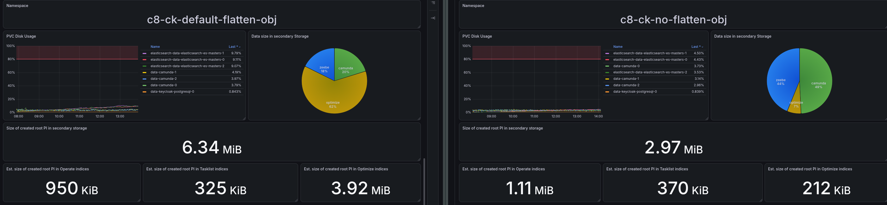

<!--
Charts: screenshots from the `chvrsl2` "Camunda Performance - Optimize investigation" dashboard
(dashboard.benchmark.camunda.cloud), both namespaces:
- Panel 81 "Data size in secondary Storage" (piechart) — Optimize/Zeebe/Camunda disk split, both configs
- Panels 85/86/88 (root PI / PI/variables created) alongside panel 81, to show the sizing-per-unit-of-work numbers
Raw numbers for all of these are in the "Actual" and "Cross-validating with Grafana" sections below.
-->

# Chaos Day Summary

In a [previous Chaos Day](https://camunda.github.io/zeebe-chaos/2026/06/10/Impact-of-Optimize-on-Camunda/) and its [variable-filtering follow-up](https://camunda.github.io/zeebe-chaos/2026/06/25/Impact-of-Optimize-Variable-Filtering/), we measured Optimize's Elasticsearch overhead against Self-Managed load tests. Running the same kind of test against a Camunda SaaS cluster turned up something we didn't expect: Optimize's disk footprint there looks nothing like what we'd measured on Self-Managed. This Chaos Day tracks that discovery down to its root cause and confirms it with a controlled experiment.

**TL;DR;** A week-long test against a SaaS Advanced 4x cluster showed Optimize's indices taking up only ~7-10% of total Elasticsearch disk, versus ~59-100% on our Self-Managed weekly load test running the exact same workload. The cause: Optimize's `includeObjectVariableValue` flag (env `CAMUNDA_OPTIMIZE_ZEEBE_INCLUDE_OBJECT_VARIABLE`) defaults to `true` and **flattens every JSON object variable into one stored variable per property, plus the raw serialized object itself**. Camunda SaaS explicitly disables this; the public Self-Managed Helm chart does not, so any Self-Managed deployment that hasn't touched this setting silently pays for it. We confirmed this is the *entire* explanation, not just a correlation, with an isolated A/B test that changes only this one flag: **Optimize's ES disk share dropped from 62.8% to 7.6%, an 8.3x reduction**, for the same workload. The number that matters most for capacity planning: **total secondary storage per root process instance dropped from 6.34 MB to 2.97 MB, a 2.13x reduction** — that's the actual "how much more disk do I need to buy" answer, net of the Zeebe/Camunda storage this flag doesn't touch. We're disabling it in our own load tests, and there's an open discussion about changing Optimize's shipped default to match SaaS.

<!--truncate-->

## Chaos Experiment

### How we got here

While setting up a SaaS test comparable to our Self-Managed weekly load test (Advanced 4x, closest match to our Self-Managed hardware), we expected similar behavior to what we'd already measured: Optimize being the dominant Elasticsearch disk consumer, eventually filling the disk without a tighter ILM policy than SaaS's defaults (30 days for Operate/Tasklist, 180 for Optimize, vs. our load test's 1-3 days).

What we found instead, after a week:

| | SaaS (Advanced 4x) | Self-Managed (weekly load test) |
|---|---|---|
| Optimize's share of total ES disk | ~7-10% | ~59-100% |

Same realistic workload (~1 root PI/s, 50 sub-process instances per root), same process definitions, wildly different Optimize disk footprint. The batch size and page-fetch metrics also differed between the two, hinting at a configuration gap somewhere, but nothing obviously explained a footprint difference this large.

### Finding the flag

During the investigation, we detected the object variable handling. Our `realisticPayload.json` load-test payload includes a `customer` variable that's a JSON object (five string fields: `firstname`, `lastname`, `email`, `phone`, `address`) and a `disputeDetails` variable, also an object. Optimize's [object variable flattening](https://docs.camunda.io/docs/next/self-managed/components/optimize/configuration/object-variables/) feature, controlled by `includeObjectVariableValue`, turns each object variable into one stored Optimize variable per property, plus the raw serialized value. That's a plausible source of a large, silent multiplier.

Checking the code confirmed it:
- Optimize's own shipped default ([`service-config.yaml`](https://github.com/camunda/camunda/blob/main/optimize/util/optimize-commons/src/main/resources/service-config.yaml)) is `true`.
- In our SaaS environment, this is explicitly overridden to `false`, a deliberate scalability decision made for C8 SaaS, apparently inherited from a feature originally built for Camunda 7.
- The public Self-Managed Helm chart sets no equivalent override, so it silently inherits `true`, including our own load tests, which never touched this setting either.

A first live comparison (SaaS cluster vs. a Self-Managed weekly load test cluster running the identical scenario) measured the impact directly:

| Process | Metric | Self-Managed | SaaS | Ratio |
|---|---|---|---|---|
| `bankDisputeHandling` | variables / instance | 1,221 | 208 | 5.9x |
| `bankDisputeHandling` | variable value bytes / instance | 59,174 | 1,880 | **31.5x** |
| `refundingProcess` | variables / instance | 15 | 2 | 7.5x |
| `refundingProcess` | variable value bytes / instance | 635 | 13 | **48.8x** |

Strong evidence, but not yet proof: the Self-Managed and SaaS environments differ in more than just this one flag (hardware, ILM/retention policy, exporter batch config). We opened [camunda/camunda#57127](https://github.com/camunda/camunda/issues/57127) to track changing Optimize's shipped default, and a [load-test PR](https://github.com/camunda/camunda/pull/57190) to stop our own load tests from silently paying this cost, but wanted a cleaner experiment before calling the root cause confirmed.

### Expected

If object variable flattening is really the *entire* explanation, then toggling only that one flag (everything else held identical) should reproduce the same magnitude of difference we saw between the very differently-configured SaaS and Self-Managed environments.

### Actual: the controlled A/B test

We deployed two namespaces on the `realistic` scenario, identical except for one environment variable: `CAMUNDA_OPTIMIZE_ZEEBE_INCLUDE_OBJECT_VARIABLE`. Same `realistic` scenario, same 1 root-PI/s rate (confirmed via `zeebe_process_instance_creations_total`), same `historyCleanup` config (`ttl=P1D`, cleanup enabled), same partition count, same age (~6h) at measurement time.



Already, in the general overview, we can see that the load test with the default flatten behavior has some issues with the data availability latency. This is explained by the much larger exporting backlog, which limits in general the throughput and affects the latency.




*Side note: We were able to improve our dashboard to show the actual created root process instances, general process instances (child included), service tasks and variables over time.*

Example query for the root instances (something interesting to share):

```promql
# All process instances created over the selected time range
# Subtracted by child process instances 
# = Root process instances

sum(increase(zeebe_element_instance_events_total{namespace=~"$namespace",partition=~"$partition",pod=~"$pod", action="activated", type="PROCESS"}[$__range]))
-
sum(increase(zeebe_element_instance_events_total{namespace=~"$namespace", partition=~"$partition",pod=~"$pod", action="activated", type="CALL_ACTIVITY"}[$__range]))
```

The result was cross-checked against Elasticsearch data and naive calculations of `1 (instance per second) * 60 (Seconds) * 60 (Minutes) * 6 (hours) = 21600` root process instances created over the ~6h test window, which matched the Prometheus query result exactly. This number can be used for further calculations, for example to compute the per-root-PI disk and index usage for each namespace (which we will see later).

Looking at the disk consumption, we can see that with the default behavior of flattening object variables, Optimize's share of total ES disk is ~62%, while with flattening disabled, it drops to ~7%.



We were able to create new panels on our dashboard based on secondary storage disk and index sizes and the root process instance count, which let us estimate the per-root-PI disk and index usage for each namespace.

The per-instance variable counts and value bytes also match the earlier SaaS-vs-Self-Managed ratios almost exactly. We cross-checked the data against Elasticsearch and obtained the following results.

**Result:**

| Metric | flatten=`true` | flatten=`false` | Ratio |
|---|---|---|---|
| Optimize's share of total ES disk | 62.8% | 7.6% | **8.3x** |
| `bankDisputeHandling` index size (per instance) | 3.07 MB | 145 KB | ~21x |
| `refundingProcess` index size (per instance) | 25.1 KB | 1.18 KB | ~21x |
| `bankDisputeHandling` sampled instance: vars / value bytes | 1,222 / 59,144 | 208 / 1,828 | 5.9x / 32.4x |
| `refundingProcess` sampled instance: vars / value bytes | 15 / 629 | 2 / 13 | 7.5x / 48.4x |

The per-instance ratios are nearly identical to the earlier SaaS-vs-Self-Managed numbers (5.9x/31.5x and 7.5x/48.8x there, vs. 5.9x/32.4x and 7.5x/48.4x here) despite this test controlling away every other difference between those two environments. That upgrades the finding from "strongly correlated" to **causally confirmed**: this one flag, in isolation, fully explains the SaaS-vs-Self-Managed Optimize disk gap.

Total Elasticsearch disk usage over the ~6h test window climbed at ~1.52%/hour with flattening on, vs. ~0.58%/hour with it off.


#### The number that actually matters for sizing

The above metrics helped us explain how the configuration change affects the system and provide a general estimate of process instance disk/index usage. We can see the direct effect.

The number that really matters is the size of a root process instance in the secondary storage (Elasticsearch). This is the number that will drive a capacity planning decision. We can compute this number by taking the total actual on-disk Elasticsearch bytes (via `kubelet_volume_stats_used_bytes`, which includes the replica — cross-checked against `elasticsearch_indices_store_size_bytes_primary` × 2, agreeing within ~2%), divided by root process instances created:

```promql
sum(kubelet_volume_stats_used_bytes{namespace=~"$namespace", persistentvolumeclaim=~"elastic.*"})
/
(sum(increase(zeebe_element_instance_events_total{namespace=~"$namespace", action="activated", type="PROCESS"}[$__range]))
 - sum(increase(zeebe_element_instance_events_total{namespace=~"$namespace", action="activated", type="CALL_ACTIVITY"}[$__range])))
```

| | flatten=`true` | flatten=`false` | Ratio |
|---|---|---|---|
| Total secondary storage / root PI | **6.34 MB** | **2.97 MB** | **2.13x** |
| Total PVC bytes used | 167 GiB | 69.4 GiB | 2.4x |

This is the direct answer to "how much more disk do I need to provision for the same workload?" — smaller than the 8.3x Optimize-specific disk-share ratio because it's diluted by the fixed Zeebe/Camunda baseline, but it's the number that actually drives a capacity-planning decision.

### A closed-form formula for the variable-count multiplier

Pulling the raw `variables[]` array from a sampled `refundingProcess` document in each namespace (the simpler of our two processes — one service task, no nested sub-processes) let us go one step further than an empirical ratio.

With flattening **on**, the document has 15 variables:
```
disputePosition.name, disputePosition.transactionDate, disputePosition._id, disputePosition,
customer.lastname, loopCounter, disputeId, customer.address, disputePosition.amount, customer,
disputePosition.currency, customer.email, disputePosition.index, customer.firstname, customer.phone
```

With flattening **off**, it has 2:
```
disputeId, loopCounter
```

So `refundingProcess`'s real variable set is two primitives (`disputeId`, `loopCounter`) and two object variables (`customer`, 5 fields; `disputePosition`, 6 fields). That gives a formula that matches both documents exactly:

```
StoredVariables(flatten=false) = P                      (object variables dropped entirely — not even stored unflattened)
StoredVariables(flatten=true)  = P + O + ΣF_i            (each object variable → 1 raw + F_i child-field variables)
```

where `P` = primitive variable count, `O` = object/JSON variable count, `F_i` = field count of object variable `i`.

For `refundingProcess`: `P=2`, `O=2`, `ΣF = 5 + 6 = 11`.
- flatten=`true`: `2 + 2 + 11 = 15` — matches the live document exactly.
- flatten=`false`: `2` — matches exactly.
- Ratio: `15 / 2 = 7.5x` — matches the measured ratio exactly.

Combined with the per-value storage overhead established in the [variable-filtering post](https://camunda.github.io/zeebe-chaos/2026/06/25/Impact-of-Optimize-Variable-Filtering/) (nested-doc indexing + up to 6 secondary representations per stored value, empirically ~5-11x depending on field type), this gives a two-layer sizing model:

```
Total disk multiplier ≈ A_flatten × A_per_value
A_flatten = (P + O + ΣF_i) / P
```

The useful part: `A_flatten` is computable directly from a process's BPMN model and payload schema — no load test required. Long term, we should come up with something even more generic for general disk usage (not just scoped to Optimize).

### Validating the formula against the bigger process

`refundingProcess` is the simple case: one service task, no nesting. `bankDisputeHandling` is far more complex (24 unique flow node ids, nested sub-processes, its own multi-instance constructs), and reconciling it exactly needed two additions that the simple case didn't exercise. Pulling the exact variable names (not just counts) from both namespaces' sampled documents:

| Variable | Where it's set | Occurrences (N) | Type | Fields (F) | Per-occurrence count | Total stored (flatten=`true`) | Contributes to P (flatten=`false`)? |
|---|---|---|---|---|---|---|---|
| `loopCounter` | MI loop counter, 2 constructs × 50 iterations | 100 | primitive | — | 1 | 100 | yes (100) |
| `correlationKey` | "Vendor fraud claim validation" (MI, ×50) + "Document Request Process" (×1) | 51 | primitive | — | 1 | 51 | yes (51) |
| `disputeId` | call activity input mapping, per iteration | 50 | primitive | — | 1 | 50 | yes (50) |
| `type` | send-task local input, path-dependent | 2 | primitive | — | 1 | 2 | yes (2) |
| `vendor_claim_frequency` | fraud subprocess output | 1 | primitive | — | 1 | 1 | yes (1) |
| `isRefund` | DMN/gateway output | 1 | primitive | — | 1 | 1 | yes (1) |
| `isHighFraudRatingConfidence` | DMN/gateway output | 1 | primitive | — | 1 | 1 | yes (1) |
| `customerId` | root start variable | 1 | primitive | — | 1 | 1 | yes (1) |
| `customer_claim_frequency` | fraud subprocess output | 1 | primitive | — | 1 | 1 | yes (1) |
| **Primitives subtotal** | | | | | | **208** | **P = 208** |
| `customer` | root (×1) + call-activity input mapping per iteration (×50) | 51 | object | 5 | 1+5=6 | 306 | no (dropped) |
| `disputePosition` | MI loop item, 2 constructs × 50 iterations | 100 | object | 6 | 1+6=7 | 700 | no (dropped) |
| `disputeDetails` family | root object: raw + `disputePositions._listSize` + `disputeId` + `disputeAmount.{amount,currency}` + `disputeStartDate` | 1 | object (nested + 1 list field) | — | 6 | 6 | no (dropped) |
| `fraud_score_result` | top-level list variable: raw + `_listSize` | 1 | list | — | 2 | 2 | no (dropped) |
| **Total** | | | | | | **1222** | **208** |

`1222 / 208 = 5.875 ≈ 5.9x` — matches the measured ratio exactly.

The `6` and `7` per-occurrence figures are `1 + F`: `customer` has 5 fields (`firstname`/`lastname`/`email`/`phone`/`address`) → `1+5=6`; `disputePosition` has 6 fields (`_id`/`index`/`name`/`amount`/`currency`/`transactionDate`) → `1+6=7`. 


The two additions this process required:

1. **Scope repetition.** A variable set inside a multi-instance loop occurs once *per iteration*, not once. This process has two independent 50-iteration multi-instance constructs, both looping over `disputeDetails.disputePositions` (an embedded sub-process and the call activity spawning `refundingProcess`), so `loopCounter` and `disputePosition` each occur 100 times (50+50). Generalized, the formula sums over every variable-defining *scope* `s`, weighted by how many times that scope executes (`n_s`):
   ```
   StoredVariables(flatten=false) = Σ_s n_s × P_s
   StoredVariables(flatten=true)  = Σ_s n_s × (P_s + O_s + ΣF_i,s)
   ```
2. **`F_i` is a recursive leaf count, and flattening has no depth limit.** `disputeDetails` looked like it didn't fit `1+F` — a mix of a list field, a nested object, and two plain fields. After checking the [source](https://github.com/camunda/camunda/blob/main/optimize/backend/src/main/java/io/camunda/optimize/service/importing/engine/service/ObjectVariableService.java#L156-L169): we detected that the flattening is recursive through nested JSON to arbitrary depth, emitting one entry per *leaf*, a primitive, or an array (arrays are never expanded element-by-element; any array, at any depth, collapses into a single `_listSize` marker instead).


**That also means there's no ceiling on how expensive one object variable can get.** Optimize's flattening cost isn't bounded by any config on Optimize's side; it's determined entirely by the shape of whatever JSON the process happens to pass in. A deeply nested object with several fields at each level multiplies out combinatorially (depth × branching factor), with nothing in this code path to stop it. Arrays are the one shape that doesn't compound this way; a `_listSize` marker costs the same one entry whether the array has 5 elements or 5,000, but a payload built from deeply nested plain objects, with no arrays at all, has no equivalent protection. The customer's payload shape, not anything Camunda controls server-side, determines the worst case here.

## What We Learned

- **A correlation across two differently-configured environments can look identical to full causation, and it's worth checking.** The SaaS-vs-Self-Managed comparison was already compelling (5.9x-7.5x variable count, 31.5x-48.8x bytes), but those two environments differ in hardware, retention policy, and exporter configuration as well. The isolated A/B test reproduced the same numbers almost exactly while controlling for all of that — the stronger and cheaper experiment to run when you can.
- **Optimize's object variable flattening, not cardinality, drove our earlier "~29x" figure.** We'd previously attributed a large Optimize storage multiplier to high-cardinality string variables (with different values); re-checking the actual benchmark payload showed that the variables involved are constants repeated across every instance. The real driver is the same flattening mechanism confirmed here.
- **SaaS already runs with this disabled; Self-Managed customers who haven't touched this setting are silently paying for it**, and our own load tests were one of them until now.
- **Object variable flattening has no depth limit, which makes it a genuinely open-ended cost, not just a fixed multiplier.** It's not "objects cost ~6x more" — it recurses through arbitrarily nested JSON, so cost scales with the *payload's own shape* (depth × branching factor), something Camunda has no control over. Arrays are the exception (they collapse to one marker regardless of length), but a deeply nested object with no arrays at all has nothing to cap it. That makes this a sizing risk that's hard to bound in advance for any given customer's process design, not just a config knob to flip.
- **The Optimize-specific disk-share ratio (8.3x) explains the mechanism; the total-disk-per-root-PI ratio (2.13x) is the number to size against.** Diagnosing *why* is different from sizing *how much* — the second question needs the denominator netted against everything the flag doesn't touch.
- New dashboard panels can save several hours of manual work, and give direct feedback

### Possible Improvements / Recommendations

- Change Optimize's shipped default for `includeObjectVariableValue` to `false`, matching what SaaS already runs at scale: [camunda/camunda#57127](https://github.com/camunda/camunda/issues/57127).
- Disable object variable flattening in our own load tests by default: [camunda/camunda#57190](https://github.com/camunda/camunda/pull/57190).
- Update Sizing guide with this mechanism and the controlled measurement: [camunda-docs#9326](https://github.com/camunda/camunda-docs/pull/9326).
