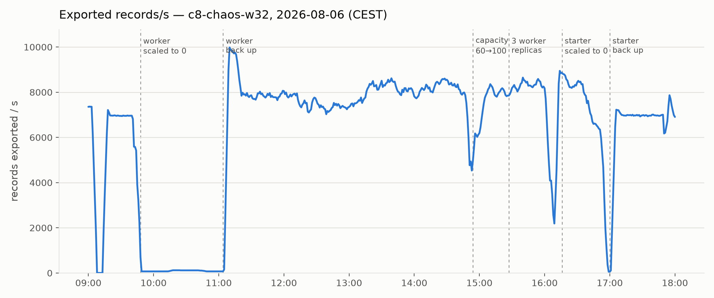
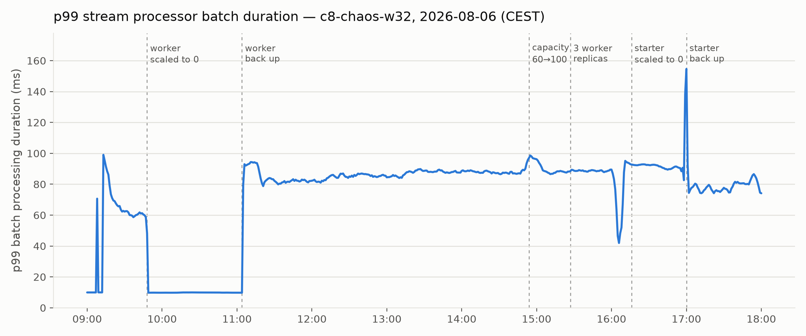

# Chaos Day Summary

In today's Chaos Day, we simulated an extended outage of a job worker in our realistic "bank customer complaint/dispute handling" load test, to see how well the system recovers once the worker comes back.

**TL;DR:**
1. We scaled the `extract-data-from-document` worker to 0 replicas for about 75 minutes, then scaled it back up.
2. Export throughput recovered within minutes and even briefly overshot its previous steady state, which looked like a clean recovery.
3. But the broker's own p99 batch processing duration jumped from a steady ~10ms before the outage to ~85-90ms afterward, and it never came back down for the rest of the day.
4. Increasing the worker's job capacity (60 → 100) and replica count (1 → 3) reduced how visibly the backlog was piling up, but did not fix the elevated processing duration.
5. We ended up draining the whole backlog by stopping the load generator instead of finding the root cause. This is still an open investigation.

<!--truncate-->

## Chaos Experiment

We used our `c8-chaos-w32` namespace running the realistic benchmark load test: a 3-partition Zeebe cluster with a set of dedicated job worker Deployments (one per job type) driving the "Bank: Customer complaint/dispute handling" process, plus a `starter` Deployment continuously creating new process instances.

Each worker is configured independently in the load-tests-helm chart, for example:

```yaml
workers:
  customer-notification:
    replicas: 1
    capacity: 30
    jobType: "customer_notification"
    payloadPath: "bpmn/emptyPayload.json"
    completionDelay: 300ms
    message:
      name: "dispute_process_receive_documents"
      correlationVariable: "correlationKey"
```

`capacity` controls how many jobs a worker fetches and works on concurrently, and `completionDelay` simulates how long the worker takes to complete each job. The load-tester application itself defaults to 10 execution threads per worker pod when not overridden.

### Expected

1. Throughput goes back to the previous steady state, or higher.
2. Recovery takes at most as long as the outage did, ideally less.
3. Increasing worker thread count increases throughput.
4. Increasing worker capacity (batch size) increases throughput, up to a point where it starts to slow the system down instead.

### Actual

#### The outage

Around 09:48 CEST, we scaled the `extract-data-from-document` worker Deployment down to 0 replicas, simulating a client-side outage. We kept it down for roughly 75 minutes before scaling it back up around 10:58 CEST.

Looking at the export throughput for the namespace over the whole day confirms the timeline:



Export throughput dropped from its ~7000-7300 records/s steady state to nearly zero for the whole outage window, then, within a few minutes of scaling the worker back up, shot up to almost 10,000 records/s as the broker caught up on the backlog, before settling into a new, noisier steady state around 7500-8500 records/s. By this measure alone, the system looked like it recovered well, even overshooting its previous throughput as expected.

#### Recovery... but something's off

Shortly after, while looking more closely at the per-activity breakdown of current events, we noticed the distribution had shifted: a much larger share of activity was now going into things other than completing service tasks, and jobs for the affected process branch were being created faster than they were being completed. The backlog was not actually shrinking, it kept accumulating even though the headline export-throughput number looked recovered.

This raised an obvious question: if a client can be down for an hour in production without us noticing anything worse than "throughput looks fine", is our configuration actually able to sustain and absorb that kind of failure, or are we just looking at a metric that hides the real problem?

#### Chasing worker capacity

Our first hypothesis was that the `dispute-process-request-proof-from-vendor` worker's capacity was now a bottleneck, since it hadn't been sized for catching up on an hour of backlog. A quick calculation backed this up:

```python
>>> completionDelay = 300  # ms
>>> threads = 30
>>> perSecondPerThread = 1000 / completionDelay
>>> perSecondPerThread * threads
100.0
>>> capacity = 60
```

With a 300ms completion delay and 30 threads, a single worker replica tops out at around 100 jobs/s, while its configured capacity was only 60. So we bumped it:

```
$ k edit deployments.apps dispute-process-request-proof-from-vendor
deployment.apps/dispute-process-request-proof-from-vendor edited
```

We increased the capacity from 60 to 100. This caused a short dip in throughput (visible in the chart above, just before 15:00 CEST) as the pods rolled, then recovered.

But it didn't meaningfully help the backlog. So we went further and scaled the worker out to 3 replicas instead of 1. That also didn't clearly fix things, throughput stayed in the same noisy 7500-8500 records/s band it had already settled into after the initial recovery.

#### The real anomaly: processing duration

While debugging, we pulled up the broker's own record processing duration and noticed that some events were taking noticeably longer to process than before the outage, at the p90/p99 level. That pointed away from the worker entirely and toward the stream processor itself.

Re-plotting the broker's p99 batch processing duration for the same day makes this much clearer than the throughput chart does:



Before the outage, p99 batch processing duration was a flat ~10ms. During the outage, it drops to the same baseline since there was almost nothing to process. But from the moment the worker came back up, it jumped to ~85-90ms, roughly nine times higher than before, and it stayed there. Neither the capacity increase nor the extra replicas moved this number at all; you can see both changes on the chart and neither one shows up as a dip in processing duration.

This is the part that we don't currently have an explanation for: something about draining the backlog left the stream processor doing meaningfully more work per batch (or slower work) than before, and it never recovered on its own for the rest of the day.

#### Draining the backlog

By late afternoon, we hadn't isolated the cause, and running out of time, we shared a reference on Elasticsearch shard sizing as a possible angle to revisit later, then took a more pragmatic path: stop generating new load entirely and let the system fully drain.

```
$ timedatectl; k scale deployment starter --replicas=0
               Local time: Thu 2026-08-06 16:15:39 CEST
                Time zone: Europe/Berlin (CEST, +0200)
System clock synchronized: yes
deployment.apps/starter scaled
```

Both charts show this clearly: throughput tapers off over the following 40 minutes as the remaining backlog is processed, hits zero once everything is drained ("All processed at 2026-08-06T16:55:59+02:00"), then climbs back to the original ~7000 records/s baseline once the starter is scaled back to 1 replica. Interestingly, the p99 batch processing duration also settles to a somewhat lower ~75-85ms after this full drain and restart, still nowhere near the original ~10ms.

## Open Questions

We did not get to a root cause today, and haven't filed a GitHub issue yet, we want to dig into the stream processor's batch composition before doing so. The main open questions are:

* Why does p99 batch processing duration jump roughly 9x after a worker outage and backlog catch-up, and why doesn't it recover even hours later?
* Is this caused by something about the shape of the backlog (larger batches, different record mix), by Elasticsearch/exporter-side back-pressure, or something else entirely in the stream processor?
* Would the same jump happen with a shorter outage, or does it need a large enough backlog to trigger?

## Conclusion

Coming back online after a dependency outage is the easy part to verify, throughput bounced back and even overshot within minutes. What's harder to see, and what we only caught because we happened to look at the right panel, is that the broker's own processing latency quietly settled into a state roughly nine times worse than before, and no amount of worker-side tuning (capacity, replicas) touched it.

This is a good reminder that "throughput recovered" is not the same as "fully recovered", and that we should keep an eye on record processing duration, not just throughput, in future chaos days. We'll pick this back up in a follow-up experiment once we've had time to dig into the stream processor metrics more closely.
