# Chaos Day Summary

On today's Chaos Day, we simulated an extended outage of a job worker in our realistic "bank customer complaint/dispute handling" load test to see how well the system recovers once the worker returns.

We picked this scenario because it had already happened to us once, by accident: a worker in one of our other load tests had gone down for a while, and when it came back, throughput looked fine while something underneath clearly was not. We never got to the bottom of it at the time. Today, we deliberately reproduced the same shape of failure, with the time to actually dig in.

**TL;DR:** We experimented with our realistic workload and took a job worker down for 80 minutes. Throughput recovered within seconds of its return, but the backlog behind it grew for another two hours, because the step we removed fans one process instance into 50 downstream jobs. Adding capacity and replicas shifted the throughput, but the backlog reduction always remained at the same rate. Two reasons for this. First, job push is prioritized, as new jobs are handed straight to a worker, so they never enter the queue the backlog lives in, leaving polling to drain it while competing for the same capacity. Second, the client's poll path has four defects of its own: two explain what we measured, and two more we found by reading the code. All observed behaviors are filed as issues: [camunda/camunda#59631](https://github.com/camunda/camunda/issues/59631) for the engine side and [camunda/camunda#59635](https://github.com/camunda/camunda/issues/59635) for the client.

<!--truncate-->

## Chaos Experiment

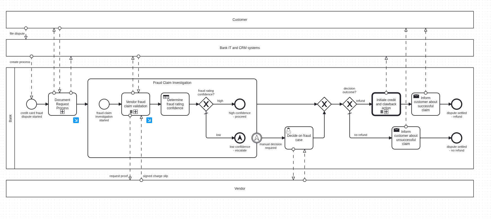

This is the process our load test drives end-to-end; we will come back to its two multi-instance activities further down.

We run our realistic load test in the `c8-chaos-w32` namespace. The setup: a 3-partition Zeebe cluster with a set of dedicated job worker Deployments (one per job type) driving the "Bank: Customer complaint/dispute handling" process, plus a `starter` Deployment continuously creating new process instances.

Each worker is configured independently in the [`camunda-load-tests-helm`](https://github.com/camunda/camunda-load-tests-helm) chart, via a values file that this scenario mirrors in-repo ([`load-tester-values-realistic-benchmark.yaml`](https://github.com/camunda/camunda/blob/53c704ef5e146d9c4867d1827a8597409ffd5bcc/load-tests/setup/scenarios/load-tester-values-realistic-benchmark.yaml)), for example:

```yaml
workers:
  ...
  dispute-process-request-proof-from-vendor:
    replicas: 1
    capacity: 60
    threads: 30
    jobType: "dispute_process_request_proof_from_vendor"
    payloadPath: "bpmn/emptyPayload.json"
    completionDelay: 300ms
    message:
      name: "dispute_process_refund_approved"
      correlationVariable: "correlationKey"
    logLevel: "INFO"
```

Some of these knobs matter a lot later, so it is worth being precise about what they map to in the Java client ([`application.yaml`](https://github.com/camunda/camunda/blob/c0cbe225642e0002a3bce445aaaa9cafd394f269/load-tests/load-tester/src/main/resources/application.yaml#L57-L67)):

* `capacity` becomes `max-jobs-active`, the number of jobs a worker will accept concurrently.
* `completionDelay` is how long our handler sleeps before completing, simulating real work.
* `threads` is the number of threads in the worker's handler pool, which is also the number of jobs it can handle concurrently. By default, this is set to [10](https://github.com/camunda/camunda/blob/c0cbe225642e0002a3bce445aaaa9cafd394f269/load-tests/load-tester/src/main/resources/application.yaml#L122-L128), though the two busiest job types in this scenario, `dispute_process_request_proof_from_vendor` and `refunding`, override it to `30`. That override matters later.
* The job `timeout` is a static `1800ms` for all our workers, which is the time the broker will wait for a job to be completed before it times out and becomes available again.

We planned to take the `extract-data-from-document` worker Deployment down to 0 replicas for around one hour, then bring it back up and watch how the system recovers.

### Expected

Before starting our experiment, the following expectations were set when a worker goes down and comes back up:

1. Throughput goes back to the previous steady state, or higher.
2. Recovery takes at most as long as the outage did, ideally less.
3. Increasing worker thread count increases throughput.
4. Increasing worker capacity (batch size) increases throughput, up to a point where it starts to slow the system down instead.

### Actual

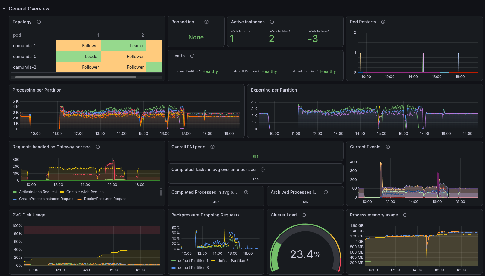

Looking back at the general overview, we can clearly see the impact of the outage on the system's throughput and recovery. From this angle, it looks like we recovered cleanly and our expectations are met, but the details are more interesting.

#### The outage

At 09:43 CEST, we scaled the `extract-data-from-document` worker Deployment down to 0 replicas, simulating a client-side outage. We kept it down for 80 minutes, scaling it back up at 11:04 CEST.

Here is the whole day at a glance, with every action we took marked directly on the chart:

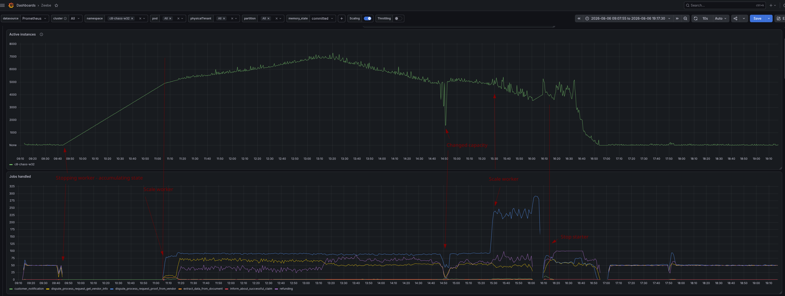

The top panel is active process instances for the namespace; the bottom panel is jobs handled per second, broken down by job type. Active instances climb in a straight line for the whole 80-minute outage, then keep climbing for another two hours past the point the worker was already back up, peaking around 13:00. Once we stop the starter just after 16:15, we are able to clean up the backlog quickly.

#### Recovery

Zooming into the outage window itself makes the mechanism obvious:

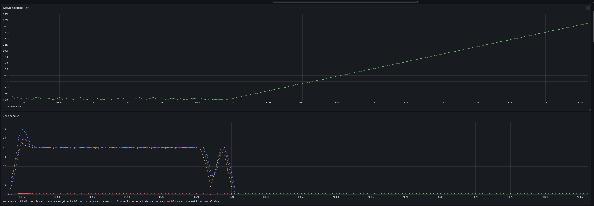

The moment `extract-data-from-document` goes to 0 replicas, every job type's handled rate drops to zero, not just the one whose worker we killed: `customer_notification`, `dispute_process_request_proof_from_vendor`, `dispute_process_request_get_vendor_info`, `refunding`, all of them. Every one of those job types sits downstream of the step we took out, so once nothing can get past it, nothing downstream has any work to do either. Active instances, meanwhile, start climbing the instant the worker goes down, since the starter keeps creating new instances at 1/s and each one now has nowhere to go once it reaches that step.

Once the worker came back, every job type's handled rate jumped back up within seconds, which is exactly what would make this look like a clean recovery if all we were watching was a single aggregate number:

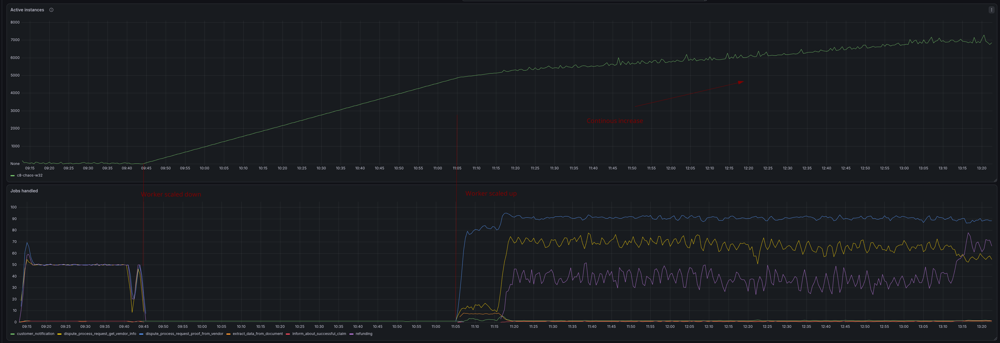

Taking a closer look, though, the job types split into two groups that behave nothing alike. The one
whose worker we actually killed is the well-behaved one.

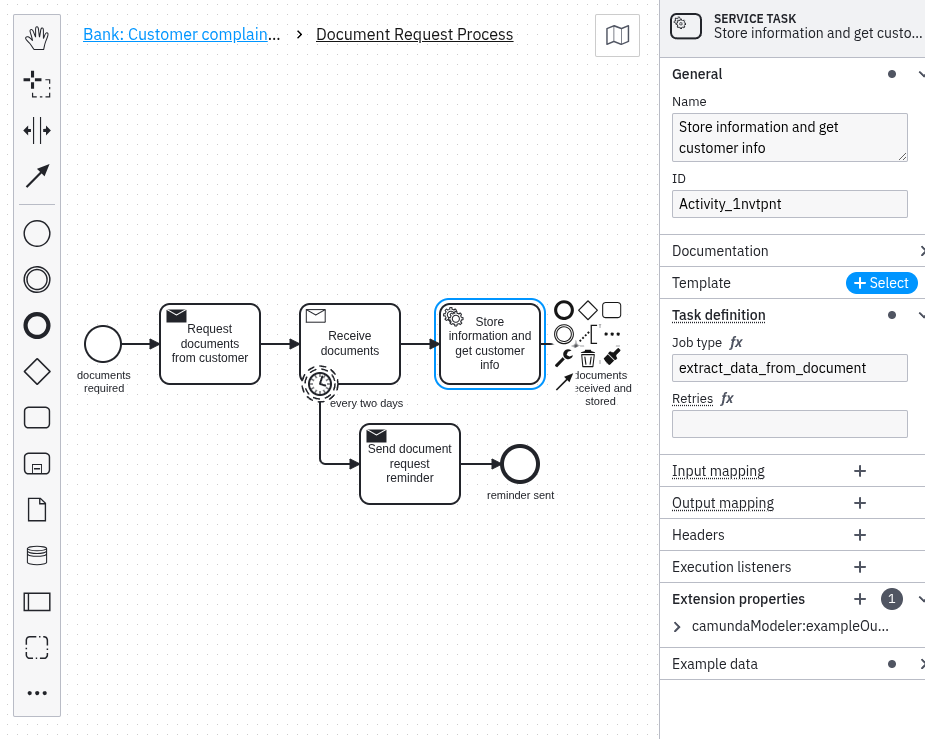

`extract_data_from_document` maps 1:1 to root process instances, so its backlog was roughly 4,800 jobs, one for each instance that piled up (80 minutes of outage at one new instance per second). It drains that within about 10 minutes and settles straight back to its steady 1/s.

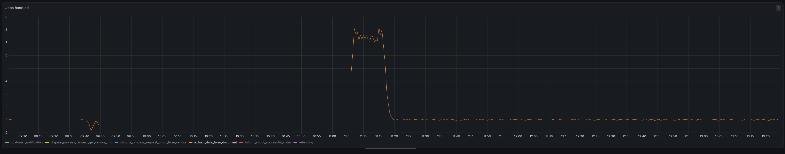


In contrast, `dispute_process_request_proof_from_vendor`, `dispute_process_request_get_vendor_info`, and `refunding` do the opposite.

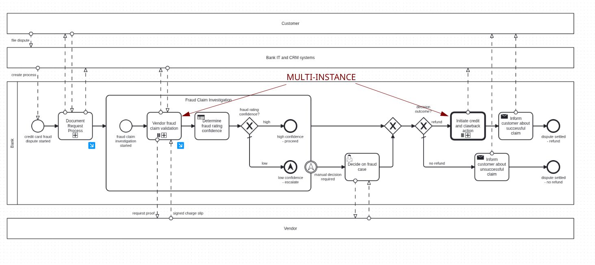

If we look at our process model again, we can see two multi-instance activities, which means each process instance creates many jobs for the tasks inside them. Both iterate over `disputeDetails.disputePositions`, and our load test's payload always sets that collection to 50 entries. One is the "Vendor fraud claim validation" subprocess, which contains `dispute_process_request_proof_from_vendor` and `dispute_process_request_get_vendor_info`. The other is the "Initiate credit and clawback action" call activity, which starts a `refundingProcess` instance per entry.

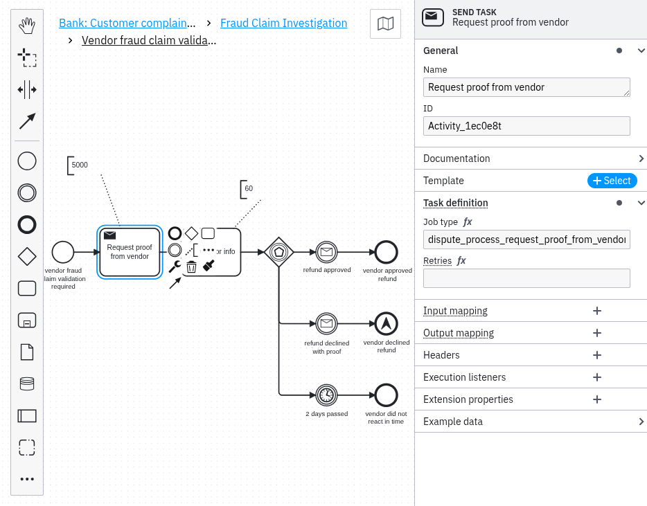

The moment the earlier worker drains its backlog, the following job workers jump into execution and then stay pinned near their ceiling for hours. That is the fan-out arriving: every process instance that clears `extract-data-from-document` produces exactly 1 `extract_data_from_document` job, but 50 each of `dispute_process_request_proof_from_vendor`, `dispute_process_request_get_vendor_info` and `refunding`. So the roughly 4,800 process instances that piled up during the outage were never a 4,800-job backlog. They were on the order of 720,000 jobs, about 150 per instance across three job types, all of which still have to be completed before the root instances can finish.

This is also why we first had to accumulate more process instances before we saw any drain at all: the backlog only starts shrinking once creation of new work is outpaced by completion of the fanned-out work already in flight. Around 13:15, we can see that a turn happens:

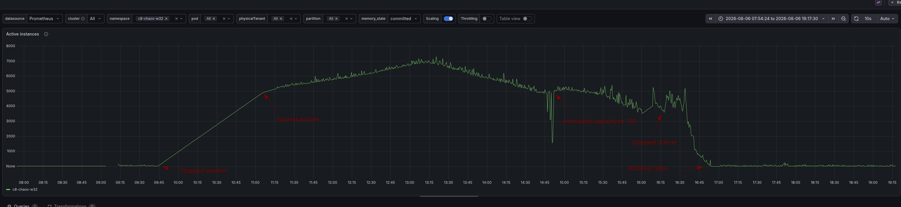

Continuing the experiment, we tried different approaches to speed up the draining of the backlog. We checked the Operate web app to see where most instances were currently stuck (we didn't capture a screenshot at the time) and noticed `dispute-process-request-proof-from-vendor` was the most affected, and focused there. As a first step, at 14:52 CEST, we increased its capacity from 60 to 100, then at 15:26 CEST scaled it out to 3 replicas instead of 1. That did change the number on the dashboard: the handled rate for that job type steps from roughly 90/s to a peak near 230/s and stayed between 210 and 230/s.

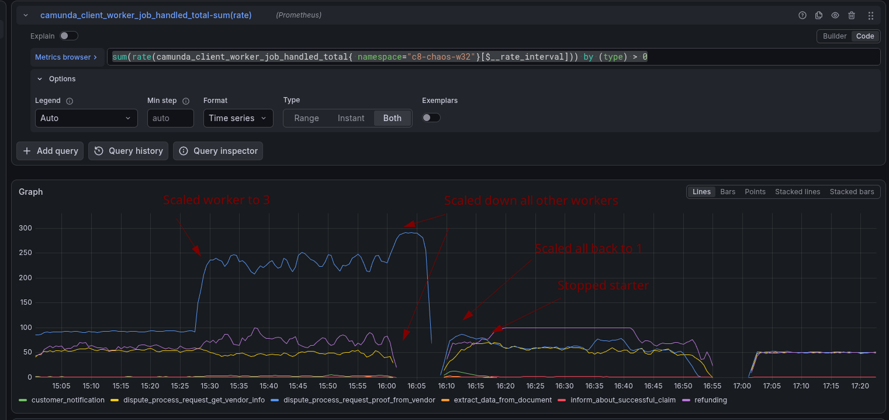

So we tried something blunter. If that one job type was the bottleneck, maybe every other worker was simply competing with it for cluster capacity, and taking them out of the picture would hand that capacity over. From 15:59 CEST, we scaled almost every other worker to zero, `customer-notification`, `dispute-process-request-get-vendor-info`, `extract-data-from-document`, `refunding`, and `inform-about-successful-claim`.
This peaks near 290/s once the other workers are out of the way. A 3x jump in handled jobs per second, and the backlog still did not drain much faster. At 16:05 CEST, we pushed `dispute-process-request-proof-from-vendor` up to 5 replicas, again with no difference.

Two separate things were going on. The first is that we should be careful about reading that 290/s as 290 jobs *progressing* per second. `jobHandled` is incremented when the handler method returns, not when the broker accepts the resulting command: [`JobRunnableFactoryImpl`](https://github.com/camunda/camunda/blob/42743d6fe90d8487d9a1f929f6e0d02981f60b3c/clients/java/src/main/java/io/camunda/client/impl/worker/JobRunnableFactoryImpl.java#L52-L66) runs the done-callback in a `finally` block, so a job whose deadline has already passed still runs, still returns, and still counts. Broker-side commands show that pressure is building up through exactly the window we were tuning in:

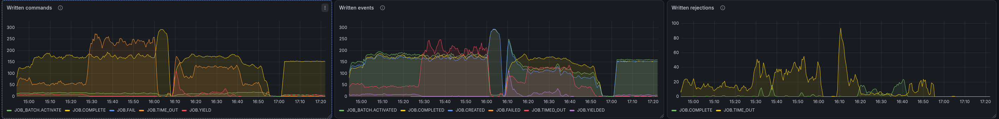

`JOB.TIME_OUT` commands climb through the afternoon, from a baseline of 50/s after 15:00 to a spike near 250/s at 15:25, when we first scaled the workers. The timeouts went away once we removed the load of the other workers entirely.


If we look back at the complete day, we see several interesting behaviors:

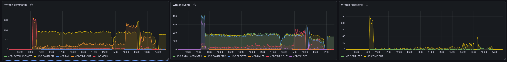

Not only timeout commands, but also rejections of both `JOB.TIME_OUT` and `JOB.COMPLETE`.
A rejected `JOB.TIME_OUT` means the broker went to time a job out and found it had already moved on, so a rising rate of them means a rising number of jobs finishing right at their deadline boundary. The largest burst of the whole day, around 255/s, sits at 11:00, which is the moment the recovered worker first met its backlog.

Over the day, we can see rejected `JOB.COMPLETE` commands, but around 16:15 they spike. A rejected completion means a worker finished a job it no longer owned, because the broker had already timed it out and made it available again. That is the deadline overrun described under sequential dispatch below, and every one of those jobs was counted as handled on the client while contributing nothing. This is the difference between the throughput number alone and real progress.

This small experiment showed that it is possible to increase one worker's throughput when others step down, but it does not actually make the backlog drain faster, because the backlog only moved one step ahead. Inside "Vendor fraud claim validation", `dispute_process_request_proof_from_vendor` is immediately followed by `dispute_process_request_get_vendor_info`. So every proof-from-vendor job we managed to complete created a get-vendor-info job for a worker we had just scaled to zero, and the queue shifted one task to the right rather than shrinking. We could have scaled that worker up again, and others down, but this felt a bit tedious, and what we wanted to try next was what happens when no new work arrives at all.

Which is why we scaled down the starter. This freed up capacity for the backlog to drain. After scaling it down at 16:15 CEST, the backlog drained over the next ~40 minutes, hitting its floor once everything was processed at 16:55 CEST.

```
$ timedatectl; k scale deployment starter --replicas=0
               Local time: Thu 2026-08-06 16:15:39 CEST
                Time zone: Europe/Berlin (CEST, +0200)
System clock synchronized: yes
deployment.apps/starter scaled
```

## Where this left us

The system is resilient to a worker outage in the sense that throughput recovers quickly once the worker comes back. However, the backlog of process instances that accumulated during the outage can continue to grow for hours after the worker has returned. Depending on the process, that can make things worse, as it did in our case, because of the fan-out in this particular process and the way job push interacts with the backlog. Simply increasing worker capacity or adding replicas does not effectively address this issue on its own. The root cause lies in both architectural decisions and client-side bugs, which we explore in detail below.

## Root cause

We were interested in the details and traced the engine, gateway, and client code, since "the backlog isn't shrinking while throughput looks fine" needed an explanation. We started from the metrics and a hypothesis that job push was being prioritized, then went looking for where that prioritization actually lives.

It turned out to be two independent things stacked on top of each other. The first is architectural and is true of every Camunda cluster. The second is a set of client bugs that turn "the backlog drains slowly" into "the backlog never drains".

### Layer 1: push hands out jobs that never enter the backlog

Inside the engine, a method called [`BpmnJobActivationBehavior#publishWork`](https://github.com/camunda/camunda/blob/a79395b4d0af9a578aceb7f2f34e69371c302bea/zeebe/engine/src/main/java/io/camunda/zeebe/engine/processing/bpmn/behavior/BpmnJobActivationBehavior.java#L78-L116) checks exactly one thing when a job becomes activatable: is there a live worker stream for this job type right now? If there is, the job is activated and pushed immediately. If there is not, the engine only records the job as `ACTIVATABLE` and notifies workers that work exists.

That check happens on job creation, on backoff-retry recurrence ([`JobRecurAfterBackoffProcessor`](https://github.com/camunda/camunda/blob/e931e33fcb21d14917f577defc1b00d03577a75d/zeebe/engine/src/main/java/io/camunda/zeebe/engine/processing/job/JobRecurAfterBackoffProcessor.java#L59)), on incident resolution ([`IncidentResolveProcessor`](https://github.com/camunda/camunda/blob/fb6cfe1a4da708b955e880fcd5f3840082ac2e56/zeebe/engine/src/main/java/io/camunda/zeebe/engine/processing/incident/IncidentResolveProcessor.java#L292)), and on a job failure that still has retries left ([`JobFailProcessor`](https://github.com/camunda/camunda/blob/41f13654c376d48a6e0bb3fce2db270e2103d058/zeebe/engine/src/main/java/io/camunda/zeebe/engine/processing/job/JobFailProcessor.java#L150)). It never checks whether an older backlog of the same job type is already waiting.

The consequence is: **a pushed job never enters the `ACTIVATABLE` pool at all**, so it never queues behind the backlog, because it is never in the same queue.

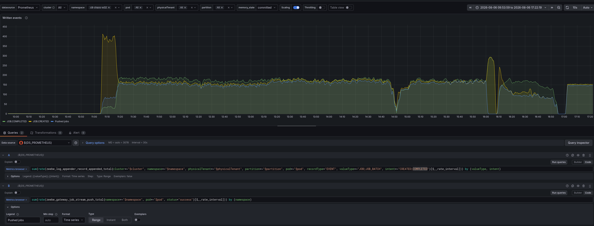

The broker's own counters make this concrete. The panel above plots job creations, job completions and successful stream pushes (`zeebe_gateway_job_stream_push_total`) on one axis, and from 11:20 to 16:00 all three track each other in a narrow band. Pushed sits just under created for the whole window, so almost every job the engine created went straight out to a worker over a stream rather than into `ACTIVATABLE`. Completions track creations just as closely, which is a system keeping pace with new work while making no impression on the backlog sitting behind it.

How this works in detail:


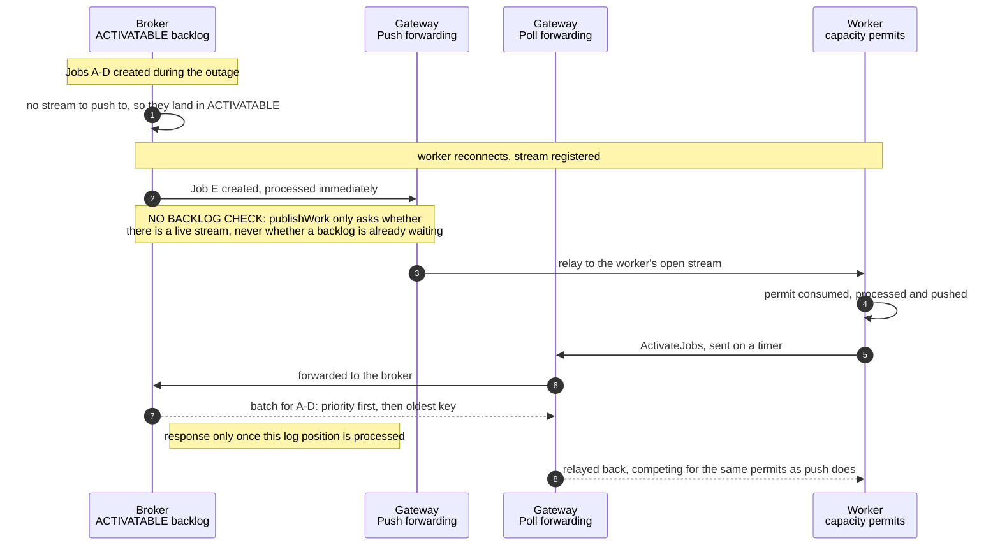

That lines up exactly with what we saw. Jobs created while `extract-data-from-document` was down had no stream to go to, so they landed in `ACTIVATABLE`. The moment the worker came back and registered its stream, every subsequently created job, from the ongoing new instance creation and from completing whatever backlog items did get through, was pushed straight out. The pre-existing backlog could only be served by the polling path, `ActivateJobs`, and polling was now competing for the exact capacity that push was continuously consuming.

We filed this as [camunda/camunda#59631](https://github.com/camunda/camunda/issues/59631). It is related to, but more specific than, the existing [camunda/camunda#15730](https://github.com/camunda/camunda/issues/15730), which already flagged in general terms that polling backfills jobs created before any streams existed.

Worth noting for completeness: the polling path itself is not buggy in its ordering. [`DbJobState#forEachActivatableJobs`](https://github.com/camunda/camunda/blob/a40b238a4e9c431761cee7a25c8808aba7dd2004/zeebe/engine/src/main/java/io/camunda/zeebe/engine/state/instance/DbJobState.java#L452-L470) walks the backlog in three phases, highest priority first and oldest job key first within a priority band. If polling gets a turn, it drains the right jobs. The problem is how often it gets a turn.

Additionally, when the Job push to the client on the Gateway is not successful (e.g., because the Client applies backpressure over the gRPC flow control), the corresponding job is yielded back to the broker. This job then ends in the same activatable job backlog/pool; only the polling approach is draining from it.

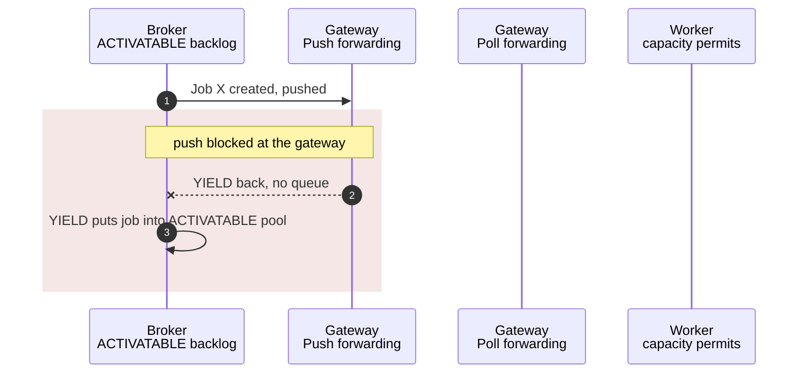


### Layer 2: four defects in the client's polling path

We expected to find that push simply outraces polling for the worker's capacity. That is true, but it is not the interesting part, and on its own, it would only slow the backlog down. What we actually found is that the polling path is more fragile than the push path.

Worth knowing before the details: in a default modern Java client, the two paths do not even share a transport. `DEFAULT_PREFER_REST_OVER_GRPC` is [`true`](https://github.com/camunda/camunda/blob/7965bc72ba24349c074921da8e699929b8d2042f/clients/java/src/main/java/io/camunda/client/impl/CamundaClientBuilderImpl.java#L95), so polling goes over REST while streaming is gRPC-only. In our tests, we used gRPC for both.


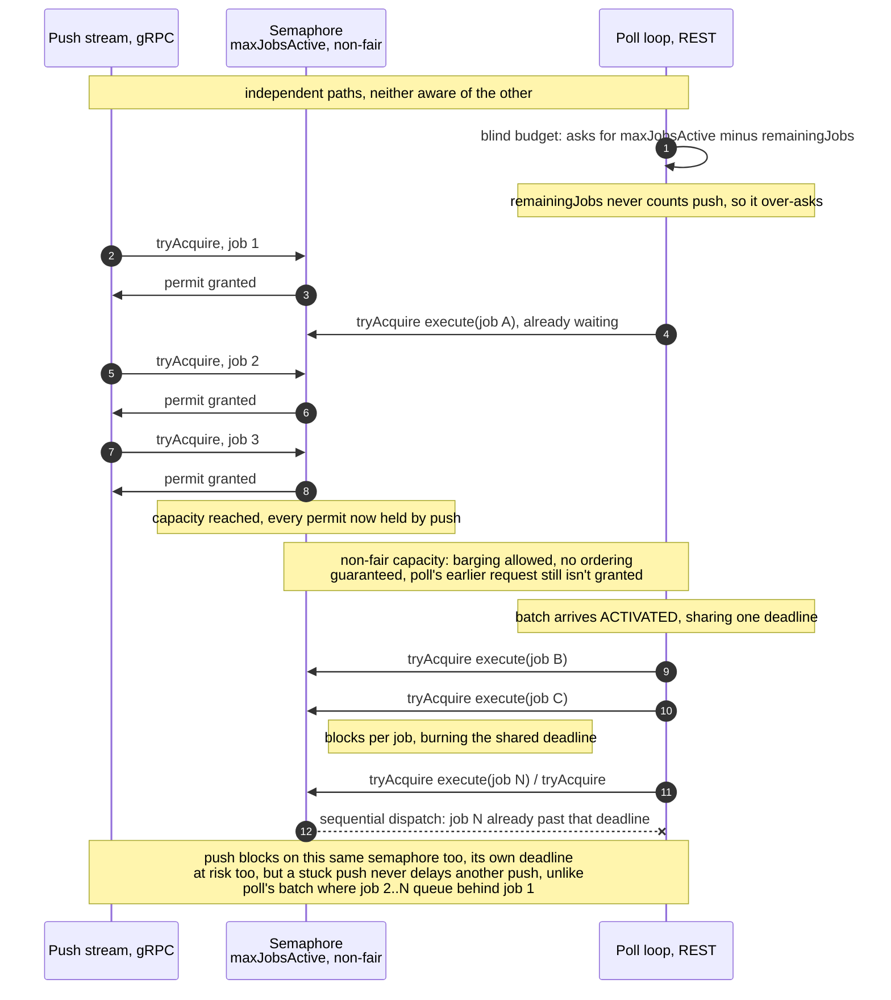

When streaming is enabled, both paths funnel activated jobs into one [`BlockingExecutor`](https://github.com/camunda/camunda/blob/051b1c8efee654694d03dd4dbce3652e939c0128/clients/java/src/main/java/io/camunda/client/impl/worker/BlockingExecutor.java#L38-L58), which wraps the handler thread pool in a semaphore sized by `maxJobsActive` ([`JobWorkerBuilderImpl`](https://github.com/camunda/camunda/blob/c4844344227ebbe3db3dc0b84ab4879607aab3c3/clients/java/src/main/java/io/camunda/client/impl/worker/JobWorkerBuilderImpl.java#L243-L277)). Aggregate capacity is genuinely respected. The stream's `onNext` blocks on that semaphore, which stalls gRPC's inbound flow control, which makes the gateway's [`responseObserver.isReady()`](https://github.com/camunda/camunda/blob/85d6b556712c4be6f7ada0f98338b5654142b82f/zeebe/gateway-grpc/src/main/java/io/camunda/zeebe/gateway/impl/stream/StreamJobsHandler.java#L154-L160) go false, so a full worker gets no more pushes. There is no missing capacity bound. What is missing is any arbitration of *order*, as the constructed and used semaphore is non-fair.

**[Non-fair capacity: a pushed job can barge past a waiting polled one (camunda#59734)](https://github.com/camunda/camunda/issues/59734)** It is constructed as [`new Semaphore(maxActivate)`](https://github.com/camunda/camunda/blob/051b1c8efee654694d03dd4dbce3652e939c0128/clients/java/src/main/java/io/camunda/client/impl/worker/BlockingExecutor.java#L34), the single-argument form, which the [`Semaphore(int)` javadoc](https://docs.oracle.com/en/java/javase/21/docs/api/java.base/java/util/concurrent/Semaphore.html#%3Cinit%3E(int)) defines as creating a semaphore with a "nonfair fairness setting". Under that setting, the [class documentation](https://docs.oracle.com/en/java/javase/21/docs/api/java.base/java/util/concurrent/Semaphore.html) states that "barging is permitted", meaning a thread arriving at [`tryAcquire`](https://github.com/camunda/camunda/blob/051b1c8efee654694d03dd4dbce3652e939c0128/clients/java/src/main/java/io/camunda/client/impl/worker/BlockingExecutor.java#L41) can be allocated a permit ahead of a thread that has been parked there waiting. The same documentation recommends initializing semaphores that guard resource access as *fair*, precisely so that no thread is starved out. That is exactly the shape we have. A pushed job arrives fresh on every `onNext`, so it can barge past a poll-delivered job that is already waiting.

On top of that ordering asymmetry sit three separate accounting bugs in the poll path, which mostly happen when the worker capacity is already full and the poll path is trying to get a turn. The three accounting bugs are:


**[Blind budget: the poll budget cannot see pushed jobs (camunda#59632)](https://github.com/camunda/camunda/issues/59632)** [`JobWorkerImpl`](https://github.com/camunda/camunda/blob/42743d6fe90d8487d9a1f929f6e0d02981f60b3c/clients/java/src/main/java/io/camunda/client/impl/worker/JobWorkerImpl.java#L204-L221) tracks in-flight work in `remainingJobs`, but only poll responses increment it and only `handleJobFinished` decrements it. Pushed jobs route to [`handleStreamJobFinished`](https://github.com/camunda/camunda/blob/42743d6fe90d8487d9a1f929f6e0d02981f60b3c/clients/java/src/main/java/io/camunda/client/impl/worker/JobWorkerImpl.java#L282-L284), which touches metrics only. So when the worker sizes its next request as `maxJobsActive - remainingJobs` ([L195](https://github.com/camunda/camunda/blob/42743d6fe90d8487d9a1f929f6e0d02981f60b3c/clients/java/src/main/java/io/camunda/client/impl/worker/JobWorkerImpl.java#L185-L202)), it asks for the full capacity even when push already holds every permit. The client systematically requests jobs it cannot accept, and the broker has already marked every one of them `ACTIVATED` with a running deadline before the client discovers it.

**[Leaked budget: rejected jobs are never given back, and polling stops for good (camunda#59633)](https://github.com/camunda/camunda/issues/59633)** A job that cannot get a permit within its timeout is dropped with a `RejectedExecutionException`, [logged, and forgotten](https://github.com/camunda/camunda/blob/42743d6fe90d8487d9a1f929f6e0d02981f60b3c/clients/java/src/main/java/io/camunda/client/impl/worker/JobWorkerImpl.java#L255-L272). Its runnable never runs, so `handleJobFinished` never fires, so its `+1` on `remainingJobs` is never returned. The counter ratchets upward permanently, and once enough has leaked, `shouldPoll` stays false and nothing re-arms the loop. In practice, it is hard to hit: each job's acquire window restarts when `execute()` is called for that job, so even one that has already blown the broker's deadline usually still gets its permit without throwing. We saw no sign of it in this run.


**[Sequential dispatch: a poll batch blocks on the semaphore one job at a time (camunda#59634)](https://github.com/camunda/camunda/issues/59634)** [`JobPollerImpl`](https://github.com/camunda/camunda/blob/0e583a991bf6c37331e325b0268ac49b57d2803b/clients/java/src/main/java/io/camunda/client/impl/worker/JobPollerImpl.java#L145-L161) does `jobs.forEach(jobConsumer)` and only afterwards reports the count. Each of those calls parks on `tryAcquire(timeout)`, so job N in a batch waits for jobs 1 to N-1 to each burn their full timeout first. Every one of those jobs had its `1800ms` deadline, which started when the broker built the batch. The tail of a large batch is therefore guaranteed to be past its deadline before it even starts, which means the handler runs and completes a job the broker has already timed out and possibly re-activated. That is duplicate execution, and it is the same symptom family as [camunda/camunda#42244](https://github.com/camunda/camunda/issues/42244).


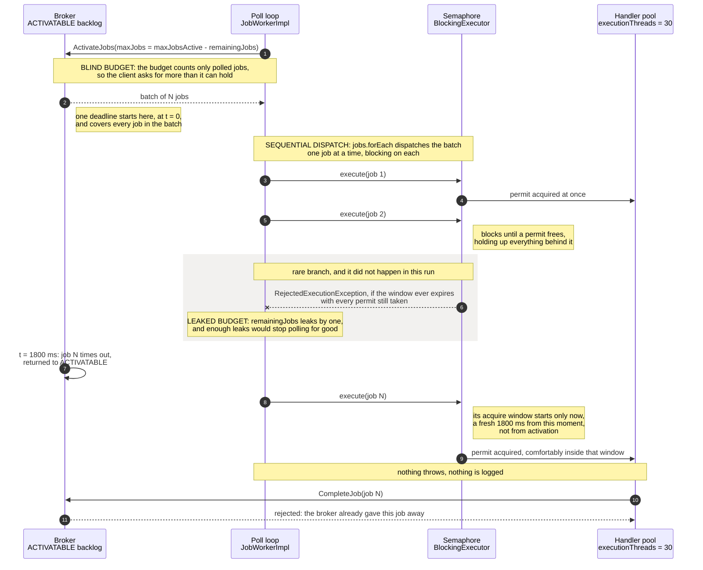

### Where a failed delivery ends up

The following failure modes recover into the polling path:

* A push that gets blocked at the gateway fails immediately, with no queueing or retry ([`RemoteStreamPusher`](https://github.com/camunda/camunda/blob/a0ee80db9873fc62be829e44b666d749c79a8d53/zeebe/transport/src/main/java/io/camunda/zeebe/transport/stream/impl/RemoteStreamPusher.java) documents itself as performing no retries of any kind), and the broker writes a [`YIELD`](https://github.com/camunda/camunda/blob/ff8dbe135d1523283ba1324ed42c98824150432d/zeebe/broker/src/main/java/io/camunda/zeebe/broker/jobstream/YieldingJobStreamErrorHandler.java#L20-L25) that puts the job back into `ACTIVATABLE`.
* A job that times out on the broker goes back to `ACTIVATABLE` too. [`JobTimeOutProcessor`](https://github.com/camunda/camunda/blob/a40b238a4e9c431761cee7a25c8808aba7dd2004/zeebe/engine/src/main/java/io/camunda/zeebe/engine/processing/job/JobTimeOutProcessor.java#L61) only notifies workers; it does not push. That is deliberate, and was [changed on purpose](https://github.com/camunda/camunda/pull/46641) after the duplicate-completion problems in the issue above.

`ACTIVATABLE` is served by polling and nothing else, so both of those paths depend on the poll loop getting a turn.

### It gets worse with more workers and more job types

One note before moving on: the single-worker view above understates the problem.

* **Replicas do not isolate.** [`RemoteStreamerImpl#pickStream`](https://github.com/camunda/camunda/blob/8f2a2fda80659787ed9437ff2d4ddec6cb251b27/zeebe/transport/src/main/java/io/camunda/zeebe/transport/stream/impl/RemoteStreamerImpl.java#L65-L83) shuffles the registered consumers and picks one at random. Every replica gets pushed to, so scaling out adds more workers competing for pushed jobs rather than giving you a clean spare that only drains the backlog. And if the budget leak does fire, it multiplies the number of workers that can stop polling instead of leaving one healthy.
* **Turning streaming off only helps if you do it everywhere.** Push eligibility is aggregated per job type across the cluster, so one opted-out replica changes nothing while a sibling still streams.
* **Job types compete inside the broker.** There is one stream processor actor per partition handling every job type's records, so push traffic for unrelated job types eats the same processing budget your backlog drain needs. This throttles the drain; it does not starve it, and it is worth keeping separate from the push-versus-poll problem because the fixes differ.
* **Job types also compete inside the client.** A single `CamundaClient` shares one handler thread pool across all its workers ([`CamundaClientImpl`](https://github.com/camunda/camunda/blob/d47275235bbc04f7b350f4931481d9e6bd1eafcf/clients/java/src/main/java/io/camunda/client/impl/CamundaClientImpl.java#L614-L652)). Each worker has its own semaphore, but they contend for the same threads, so one job type stuck in the reject-and-retry loop burns thread time its healthy siblings need.


## What you can actually do about it

**Detect.** All of these work today, without new instrumentation:

* Watch the gap between the client's [`jobActivated` and `jobHandled` counters](https://github.com/camunda/camunda/blob/dc62083c576e4acbc956e1abb068edc25fbae5d5/clients/java/src/main/java/io/camunda/client/impl/worker/metrics/MicrometerJobWorkerMetrics.java#L42-L49), and read it as a fill level rather than an error count. `jobActivated` is incremented [as soon as a job arrives](https://github.com/camunda/camunda/blob/42743d6fe90d8487d9a1f929f6e0d02981f60b3c/clients/java/src/main/java/io/camunda/client/impl/worker/JobWorkerImpl.java#L255-L258) and `jobHandled` only when its handler returns, so the cumulative difference is how many jobs the worker is holding right now, plus any it has dropped for good.

  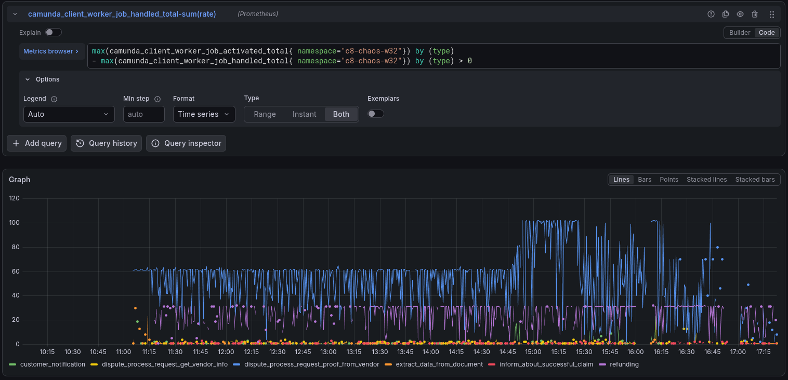

  `dispute_process_request_proof_from_vendor` pins to 60 from 11:00 onwards, which is exactly its `maxJobsActive`. That worker was completely full, continuously, for five hours. When we raised the capacity at 14:52, the ceiling simply moved with it, to 100. A worker parked on its configured ceiling indefinitely is one that is permanently in the regime where the semaphore has nothing to hand out, which is the precondition for all four client defects, so this is a good thing to alert on. Note what the pair does not catch at all. Because `jobHandled` counts handler returns and not accepted completions, a job that runs past its deadline and has its completion rejected is counted as handled. Wasted work looks identical to useful work in this metric, so pair it with the broker-side view below.
* Broker side, `zeebe_log_appender_record_appended_total{recordType="COMMAND_REJECTION"}` broken down by intent gives you the other half. Rising `JOB.TIME_OUT` rejections mean jobs are finishing right at their deadline boundary; rejected `JOB.COMPLETE` commands mean they finished past it and the work was thrown away. Neither is visible from the client's own counters.
* Alert on the client log line [`reached maximum capacity (maxJobsActive)`](https://github.com/camunda/camunda/blob/42743d6fe90d8487d9a1f929f6e0d02981f60b3c/clients/java/src/main/java/io/camunda/client/impl/worker/JobWorkerImpl.java#L55-L58). It currently reads like a benign tuning hint. It is not.
* A worker that has hit the budget leak emits no `ActivateJobs` requests at all while still holding a healthy stream. Absence of poll traffic from a live worker is an unambiguous signature, and it is cheap to check: `zeebe_gateway_total_requests_total{requestType="JOB_BATCH#ACTIVATE"}` never went quiet for us, which is how we ruled the budget leak out of this run.
* Broker side: job timeout rate per type, and created-minus-completed for the job type. Backlog age per job type is not exposed anywhere today, which is a real gap.

**Prevent.**

* **Size `maxJobsActive` so that a full worker can still meet its deadlines**, rather than raising it reactively when things look slow.

  Picture the worker completely full: it has accepted `maxJobsActive` jobs and every thread is busy. A job at the back of that queue has to wait for everything ahead of it to finish first. The threads work in parallel, so the queue drains in rounds of `execution-threads` jobs, each round taking one handler duration:

  ```
  waitForTheLastJob = (maxJobsActive / executionThreads) x handlerDuration
  ```

  Every job in the batch carries the same broker deadline, and that deadline started ticking when the batch was handed out. So the requirement is simply: `waitForTheLastJob < timeout`

  If we substitute the formula above and rearrange for `maxJobsActive`, we get:

  ```
  maxJobsActive < executionThreads x (timeout / handlerDuration)
                = 30 x (1800 / 300)
                = 180
  ```

  This means the maxJobsActive should be set to less than 180, so that even the last job in a full batch can finish before the broker's deadline. We were running 60 and raised it to 100, so we never came close. That is the part worth sitting with, because the formula tells you when a full batch is guaranteed to make its deadline, not what to aim for.

  **Why the job `timeout` is what the wait has to fit inside.** That one configured value is quietly doing two different things. On the broker, it is the job's deadline: once it expires, the broker takes the job back and hands it to someone else. In the client, it is *also* the longest a job will sit waiting for a free thread, because the same value is passed to the [`BlockingExecutor`](https://github.com/camunda/camunda/blob/c4844344227ebbe3db3dc0b84ab4879607aab3c3/clients/java/src/main/java/io/camunda/client/impl/worker/JobWorkerBuilderImpl.java#L273) and used as its [semaphore acquire timeout](https://github.com/camunda/camunda/blob/051b1c8efee654694d03dd4dbce3652e939c0128/clients/java/src/main/java/io/camunda/client/impl/worker/BlockingExecutor.java#L41).

  The two do not run down together, which is what makes this hard to see. The broker's deadline starts when the batch is handed out; the client's wait starts per job, when `execute()` is finally called for it. A job can blow the broker's deadline while still acquiring its permit within its own window, so nothing on the client ever throws.

  `maxJobsActive` is not a throughput knob. Throughput is `executionThreads / handlerDuration`. For this worker, 30 threads at a 300ms handler is a hard ceiling of 100 jobs/s, and we measured 87 to 91/s on the single pod, already about 90% of it. What `maxJobsActive` actually sets is the queue length, or how long a job waits before it runs, `maxJobsActive x handlerDuration / executionThreads`. Raising it from 60 to 100 took that wait from 600ms to 1000ms inside an 1800ms deadline, and to about 1300ms at the 390ms handler duration we actually measured once three replicas were contending. All that buys is a longer queue in front of an unchanged deadline.

* Keep the job `timeout` comfortably above your *worst-case* handler duration, not just the average. The bound above assumes every job takes about the same time, so a long tail quietly eats the waiting budget of every job queued behind it.

**Recover.**

* Restart the worker pods. The leaked counter is in-process state, so a restart is currently the only reliable reset for a worker that has stopped polling.
* Disabling streaming for the job type, on every client at once, removes the `BlockingExecutor` entirely, so there is nothing left to reject against.
* Pausing new instance creation is what finally cleared it for us. We stopped the starter at 16:15, and the queues were empty by roughly 16:55. We had also restarted every worker minutes before that, so this run cannot separate the two.

## Open Questions

* Would the backlog still balloon like this with a shorter outage, or does it need a large enough head start to outrun the polling path?
* Can the system recover without intervention under sustained load, once the four client defects are fixed? This is an interesting re-run because it isolates the architectural layer from the bugs.
* Does the engine's record processing duration degrade as the backlog grows, or does it stay flat while only the queue in front of it gets longer? It matters whether a large backlog is purely a queueing problem or also a processing-cost one.
* Was `refunding` about to become the next bottleneck? It reaches roughly 100 jobs/s in the final samples, which is exactly its own `executionThreads / handlerDuration` ceiling. Relieving one job type may simply promote the next one, in which case per-worker tuning is a treadmill, and the fix has to be architectural.
* Does starting a cluster with more partitions upfront change backlog recovery time? More partitions mean more independent stream-processor actors, so it may raise the aggregate ceiling, but it does nothing about the push-versus-poll inversion, which is per-partition independent.

## Conclusion

Coming back online after a dependency outage is the easy part to verify: every job type's throughput bounced back within seconds. What is harder to see is that the backlog kept growing underneath that healthy-looking throughput number for hours.

The mechanism turned out to have two layers. Architecturally, job push has no concept of a standing backlog: a pushed job never enters the queue that the backlog lives in, so an outage-induced backlog can only be drained by a path that is competing for the capacity push keeps taking. That alone would make recovery slow. What kept it from catching up is the client's poll path, which requests work without counting what push already delivered and then dispatches each batch one blocking job at a time, so the tail of every batch burns its deadline before it runs, and the completion is thrown away. A third defect, a capacity leak that can stop a worker polling altogether, would be worse than either of those, and it matters because both failure paths recover into the poll loop. It did not fire on the day, which we only established afterward by going back to the metrics.

The reminder for us is that "throughput recovered" is not "fully recovered". The backlog has to be watched alongside it.
