# Chaos Day Summary

Over the last week, we ran several endurance and stress tests against Camunda 8.7, 8.8, and 8.9 (using the latest patch versions). In this post, we want to summarize the results of our experiments, explain the differences between the versions, and share our findings with the community.

**TL;DR;** 
In stress tests, Camunda 8.7 was performing ~50% better than 8.8 and 8.9 in terms of processing throughput. The processing performance was traded for improved reliability and stability. This is done by applying queueing-theory-informed backpressure, which is a huge benefit for our users. As under stress 8.7 importing was not able to keep up with the processing performance, and the importing backlog and with this the data availability latency unbounded. In our tests up to nine hours. This data availability was kept under 40 seconds under stress in 8.8 and 8.9 (a factor 810 difference). In the endurance tests such data availability was more than factor two smaller. In terms of stability we observed in 8.7 the archiver failing, which led to a backlog of completed process instances in the runtime indices. A component which was know for its fragility in the past, this has been significantly improved in later versions. In addition to the above-mentioned re-architecture changes and improvements, 8.8 and beyond come with even more features (which might even help in such cases, like dynamic scaling) and stability improvements, which we will look into in future posts.
<!--truncate-->

## Chaos Experiment

We have selected for each version the last patch version available at the time of the experiment.

- [8.7.36](https://github.com/camunda/camunda/releases/tag/8.7.36)
- [8.8.34](https://github.com/camunda/camunda/releases/tag/8.8.34)
- [8.9.15](https://github.com/camunda/camunda/releases/tag/8.9.15)

For each version, we ran the same set of experiments, which included:

- [stress test](https://github.com/camunda/camunda/blob/main/docs/testing/reliability-testing.md#max--stress-load-test): running with high load for a short period of time (3 hours)
- [endurance test](https://github.com/camunda/camunda/blob/main/docs/testing/reliability-testing.md#realistic-load): running with realistic workload for a longer period of time (3 days)

For each version, all tests were run in the same environment, using the same Kubernetes cluster and a similar setup: three broker nodes and Elasticsearch as secondary storage with three nodes. For more details about the specific configuration and setup, see [here](https://github.com/camunda/camunda/tree/main/load-tests/setup). The only differences were the Camunda version being tested and version-specific configuration and setup changes (embedded vs. standalone gateways, Operate and Tasklist deployments, etc.).

## Endurance Test Results

All versions handled the load for the duration of the test (we were looking at the same time window). While the general load looks fine, some differences have been observed at a deeper level (see a later section). 

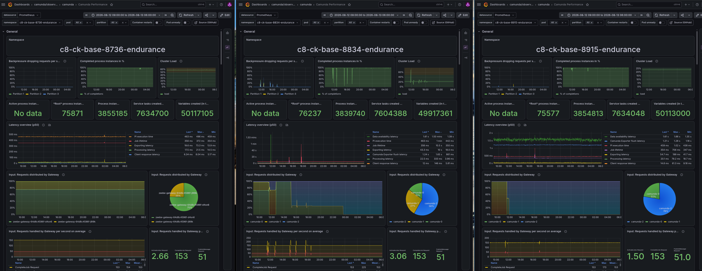

While 8.7 has a [different architecture](https://docs.camunda.io/docs/8.8/reference/announcements-release-notes/880/whats-new-in-88/#orchestration-cluster) and deployment with standalone gateways and separate web applications, we can see that it experiences a similar issue. The gRPC traffic is not evenly distributed across the gateways, leading to some gateways being overloaded while others are idle. This depends on the setup in general; in our load tests, we run in the same Kubernetes cluster and namespace, using the Kubernetes service to load-balance traffic. 

In a real production setup, there would likely be an ingress in front to load-balance traffic across the gateways, which would lead to better load distribution. Of course, having such an imbalance and using embedded gateways can cause some more friction and resource contention. This is something we will look into with [#59565](https://github.com/camunda/camunda/issues/59565).

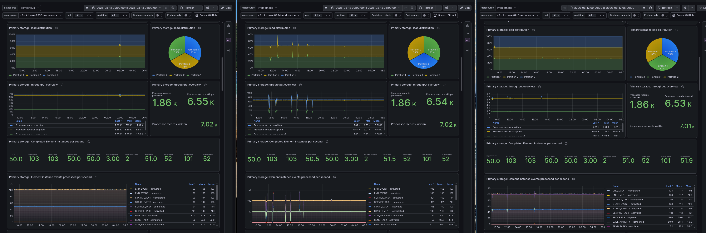

The general processing is well distributed across the partitions, and we see no difference here.

What is interesting is that even on the output side, meaning writing to the secondary storage, we see a similarly well-distributed load across the Elasticsearch nodes. Here we expected some difference, as we harmonized the indices to reduce duplication.

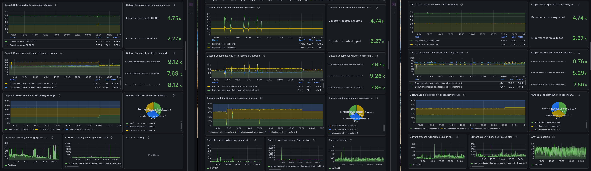

### Resources

The first real difference we can see is in the area of used resources.

The 8.8 version seems to use a bit more CPU than 8.7 and 8.9, while memory usage is similar across all versions. The CPU usage has some outliers (due to restarts), so this might be one explanation. With 8.9, we seem to have at least brought this under 8.7, which is a good sign.

Still, one interesting fact is that with 8.7, Elasticsearch seems to use more CPU, while with the other versions, Camunda and Elasticsearch are on par.

Memory-wise, we seem to have a similar usage across all versions, which is likely related to the usage of JVMs and assigning a similar set of resources, as we moved resources from the previous Operate and Tasklist deployments to Camunda StatefulSets.

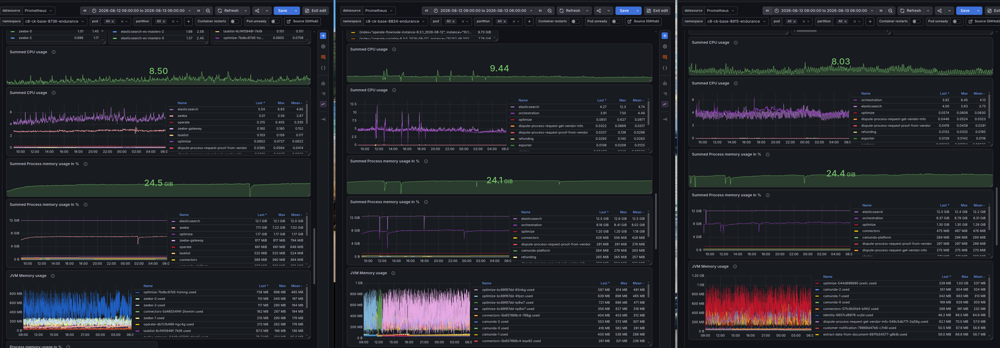

When we look at the JVM metrics, it is interesting to see that in all versions, Optimize is the application with the highest memory usage (excluding ES here).

The write IOPS metrics show that for 8.7, we seem to write more data into Elasticsearch. The IOPS are almost doubled compared to 8.8 and 8.9, which is likely related to re-architecture, introducing the Camunda Exporter vs. the previous Importer deployments (including the harmonization of the indices and the reduced duplication of data).

On the Zeebe side, all versions managed to do the same amount of work, but 8.7 needs fewer IOPS (~2k) than 8.8 and 8.9 (~3k) to do it. This is unexpected and we need to look into this in more detail.

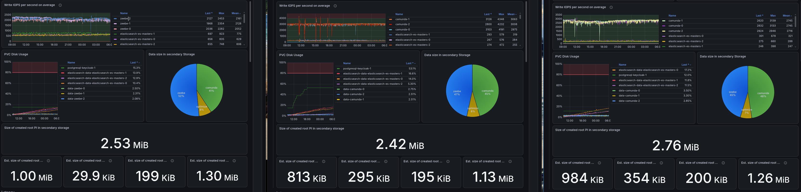

Checking the disk usage of the secondary storage, we would expect that 8.7 uses more disk space, as we have seen more IOPS on the Elasticsearch side, and we have Operate and Tasklist running separately and writing to different indices.

If we look deeper into the details, we can see that in 8.7 Operate runtime indices are constantly increasing, while in 8.8 we see a more stable pattern (skipping 8.9 here, for easier comparison). 

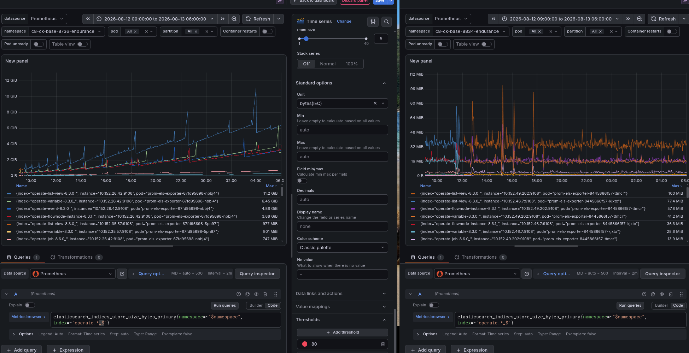

Here we can already see some reliability improvement of 8.8+ in action. Previously, the archiver was a separate, fragile component (either running inside the Operate deployment or as a separate deployment). This has been moved with the re-architecture to the Camunda Exporter as well, and received several improvements over the last releases.

[The archiver](https://docs.camunda.io/docs/8.7/self-managed/operate-deployment/importer-and-archiver/) is in charge of moving completed process instances from the runtime indices to the historic (dated) indices. In previous versions, this component was prone to failures and could lead to a backlog of completed process instances in the runtime indices, increasing their size. When an index (or shard) in Elasticsearch reaches a certain size, it can [slow down the cluster and cause issues](https://www.elastic.co/docs/deploy-manage/production-guidance/optimize-performance/size-shards).

Looking at the historic indices, we can see that 8.8, for example, was growing much faster than 8.7.

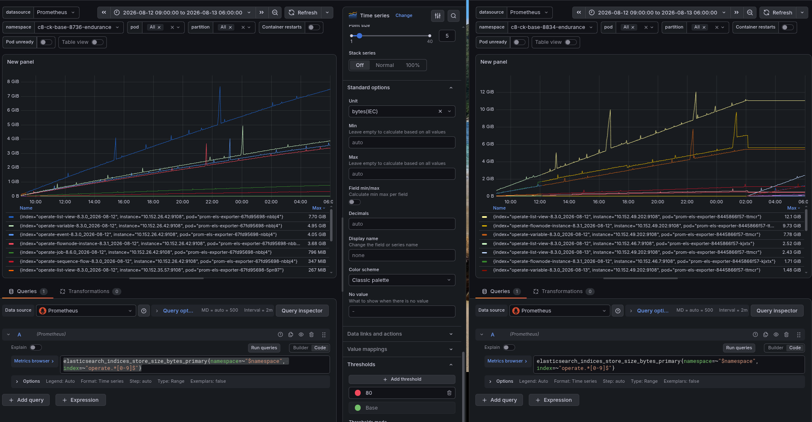

The archiver metrics show that 8.7 is not able to keep up with the number of completed process instances.

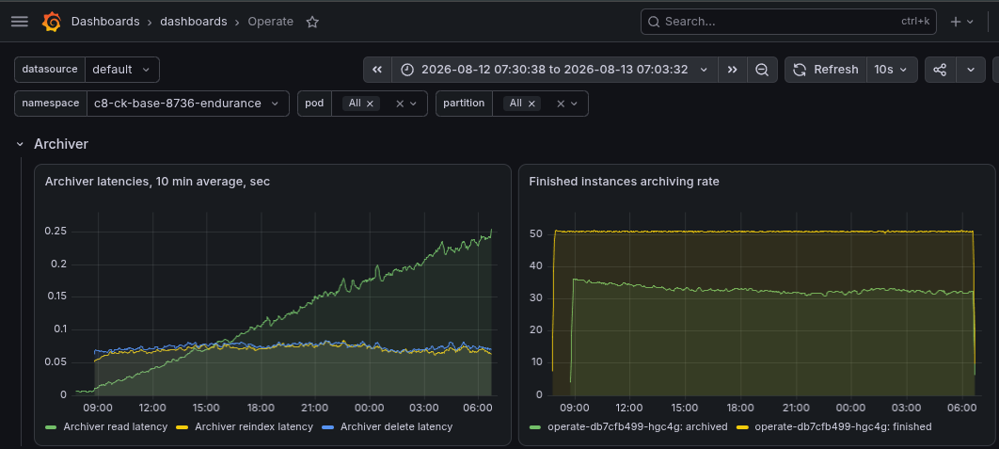

This is what happens when a queue becomes unstable: once the archiver's throughput (~32/s) falls below the arrival rate of completed process instances (50/s), the backlog no longer converges to an average; it grows without bound, and so does the time it takes for that data to be moved into the historic indices.

### Latency

Now we come to a set of metrics where we can see a real difference between the versions. One part is the processing latency, where we seem to have increased latency with 8.8 and 8.9; it roughly doubled. It should be noted, though, that the Camunda applications now do more in one deployment (which was previously distributed), which means there is higher contention between resources.

On the positive side, the re-architecture of the Camunda Exporter (in 8.8) has improved the latency of data available to the user, as we were reducing one step of write-and-read before aggregating. More details about this can be read [here](https://camunda.com/blog/2025/02/one-exporter-to-rule-them-all-exploring-camunda-exporter/).

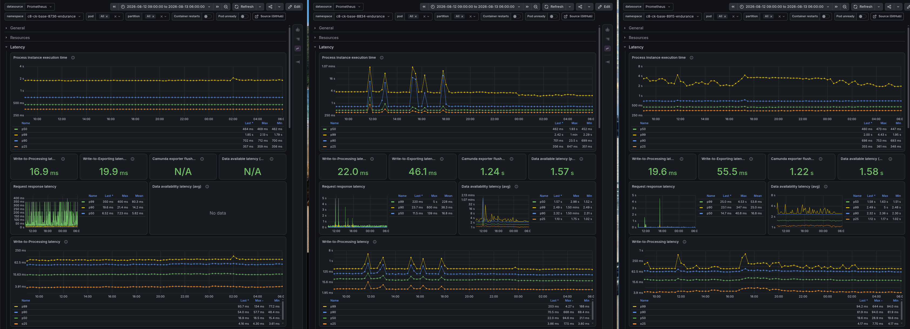

The [data availability metric](https://camunda.github.io/zeebe-chaos/2026/01/08/Experimenting-with-data-availability-metric) we use in our load tests is not available in 8.7, as it requires the REST API (which was added in 8.8 as well).

So we need to make use of some older Operate Importer metrics to approximate the data availability. The data availability is calculated (in 8.8) as the time between a process instance creation request being sent and it being available via the REST API. This means we need to look at the Importer latency, which is the time between a record being written in Zeebe and imported by Operate (including being written to Elasticsearch). Here, we need to add the Elasticsearch flush interval, [which is set on the Operate Indices to two seconds](https://github.com/camunda/camunda/blob/3197323996a39fa723b7306c93ad31f27009fa02/operate/schema/src/main/resources/schema/elasticsearch/create/template/operate-list-view.json#L4). This gives us roughly the time the data needs to be available/visible to the user (excluding the network time between client and server).

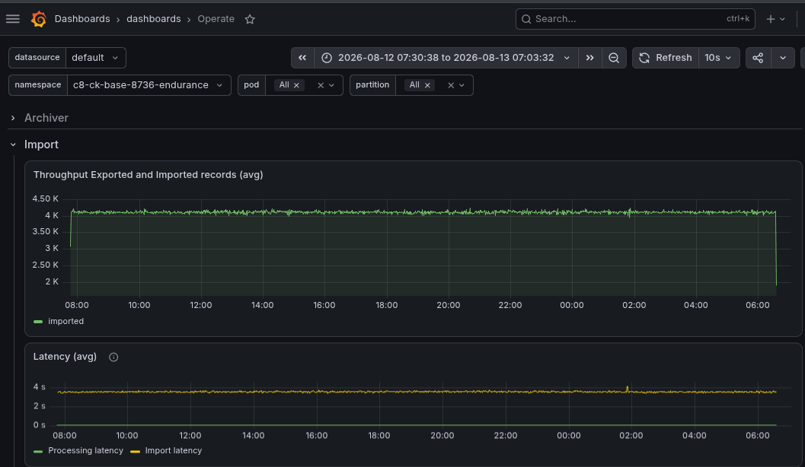

For 8.7 this means we are on average at ~3.5 seconds for the importing latency, plus two seconds for the Elasticsearch flush interval, which gives us a total of ~5.5 seconds. For 8.8 we are at ~1.5 seconds for the data availability in total, which is a significant improvement.

### Throughput

As mentioned earlier on the throughput side of things, we can't spot a difference between the versions. Interestingly, we even write the same amount of records, but have an increase in IOPS.

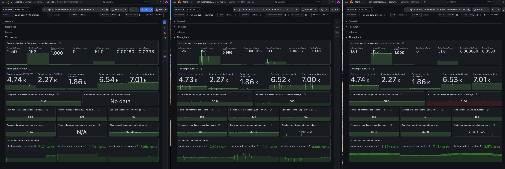

## Stress tests

In the following section, we will look at the results of our stress tests, which we ran against all versions from above. We are putting a higher load on the system (300 PI/s with one single task), which is expected to lead to some failures and issues. The interesting part is to see how the system behaves under stress and if we can spot any differences between the versions, like maximum throughput, latency, or other metrics.

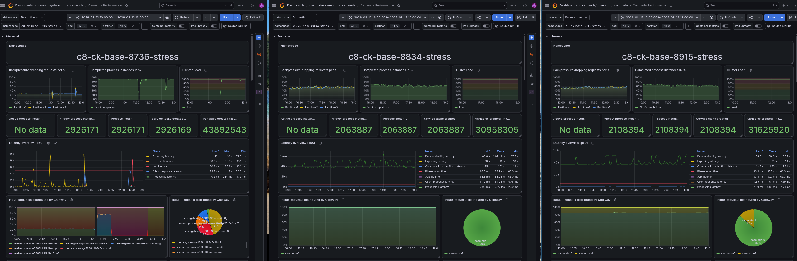

In our general metrics, we can already see a huge difference between the versions and how they handle the load. While 8.7 is almost able to handle the load, the completion rate is around 90%, and backpressure at ~20%. The versions 8.8 and 8.9 seem to be struggling with the incoming load; we see a completion rate of ~60% and backpressure at ~60% as well.

Again, here we can see that the load is not well distributed across the gateways, which leads to imbalance. Still, the load at the partition level is well distributed. We can see that the processing throughput difference is ~50% between 8.7 and 8.8/8.9.

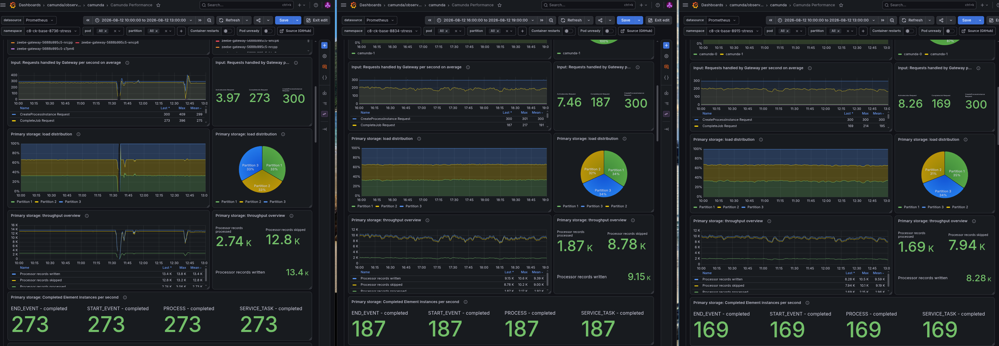

We can see how the [performance degrades over time in newer versions](https://github.com/camunda/camunda/issues/46993), while 8.7 is able to keep up with the load. This is something that is likely related to the accumulated state in the Camunda engine.

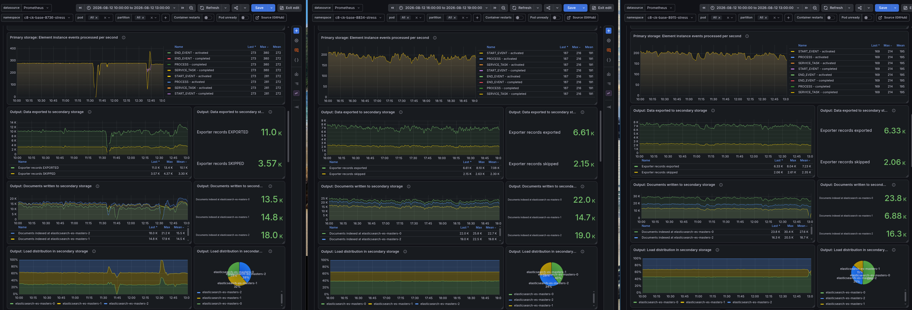

Interestingly, on the secondary storage side, many more documents are indexed in 8.8 and 8.9, which is likely because the Camunda Exporter is now more tightly coupled with the Camunda application and able to keep up. In newer versions, the Camunda application gives clients better backpressure, helping to reduce stress and keep latencies stable. We'll come to this in more detail next. 

We can see a stable exporting backlog (queue length), since request backpressure that also considers the exporter backlog was added with 8.8 as well.

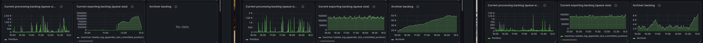

### Resources

In 8.7, we can see that the Zeebe gateway is heavily throttled. In addition, all versions put a high load on Elasticsearch, which is expected as we are writing a lot of data into the secondary storage.

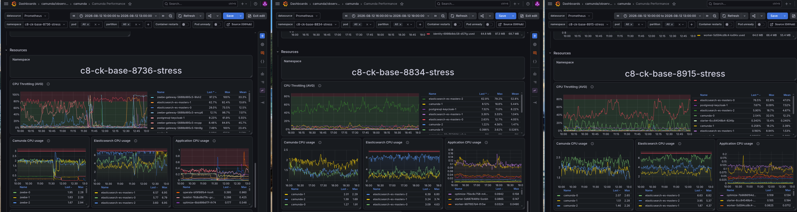

Overall resource usage under pressure is much lower on 8.8+ than on 8.7.

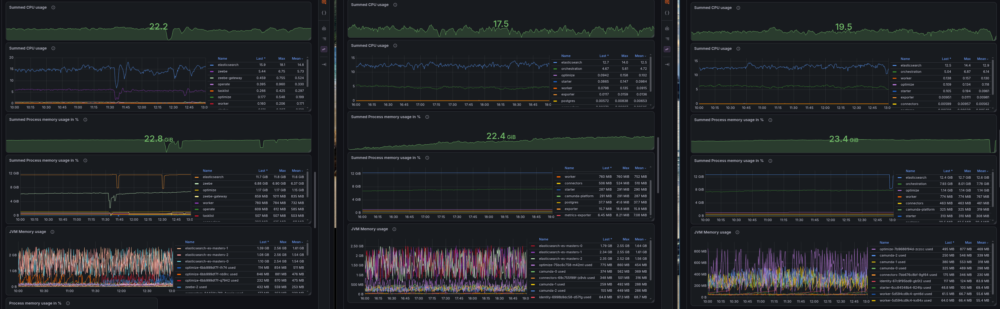

### Latency

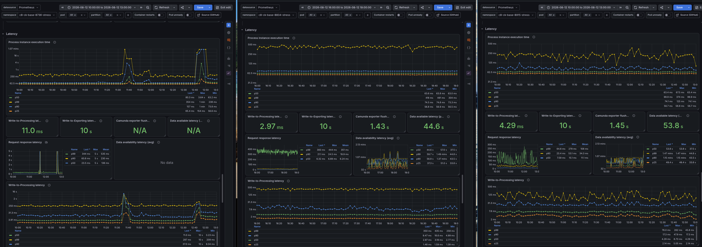

At first glance, latency metrics look similar across the versions. Under pressure, the data availability now goes up to ~40 seconds on newer versions. 

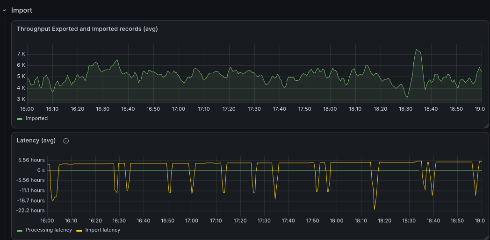

When we look deeper into the details, we can see that 8.7 is NOT able to keep up with the load on the web application and importer side. The importer latency spikes regularly to more than 4 hours; when we look over a longer time frame, this goes even up to 9 hours. This was exactly one of the most common complaints we had with the pre-8.8 architecture, having slow updates on Operate and Tasklist.

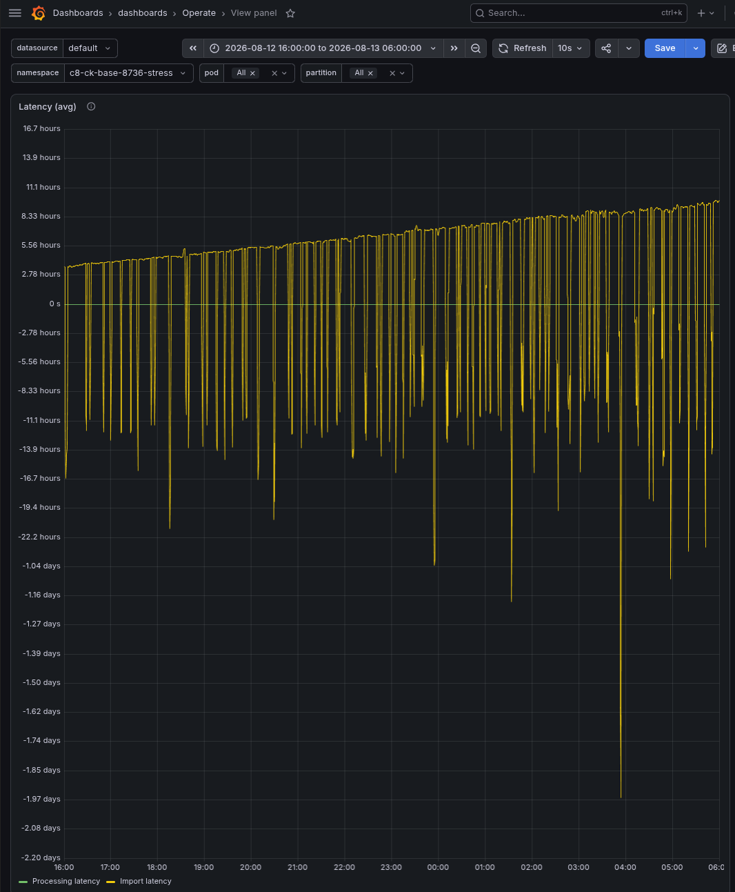

With 8.8, the queue is kept stable on purpose: 8.8+ rejects more requests up front (~60% backpressure above, versus ~20%), capping the arrival rate below capacity. That's the same trade-off used in highway on-ramp metering and TCP congestion control: a bounded arrival rate keeps both wait time and backlog finite (via [Little's Law](https://en.wikipedia.org/wiki/Little%27s_law)), instead of letting them diverge and cause the kind of unbounded delays we saw above.

This is what the new architecture gives us: a more stable and reliable system with backpressure to clients, allowing it to keep latencies stable.

## Conclusion

We have run and investigated load tests for the different versions of Camunda 8.7, 8.8, and 8.9. 

We clearly saw that the re-architecture of Camunda 8.8+ applied queueing mechanisms to improve the reliability and stability of the system. In our endurance test, we have seen how unreliable the previous archiver component was. Under stress, we saw data availability and resource consumption improve significantly.

All of this comes with the cost of some processing performance (throughput and latency), as we need to limit the arrival rate to keep the system stable.

There are certain areas that we will look into in the future to improve our system even further:

- like the IOPS on the Zeebe side, which seem to be higher in 8.8+ than in 8.7, while doing the same amount of work
- gRPC load balancing across gateways, which is not well distributed in our tests and likely in production as well. This is something we will look into with [#59565](https://github.com/camunda/camunda/issues/59565)
- accumulation of state in the Camunda engine, which seems to lead to performance degradation over time. This is something we will look into with [#46993](https://github.com/camunda/camunda/issues/46993)

As potential next tests to investigate improving processing throughput and latency, we plan to look into the following:

- Adding standalone gateway deployments to 8.8 and 8.9 to see if this improves throughput and latency
- Adding more resources to the Camunda application
