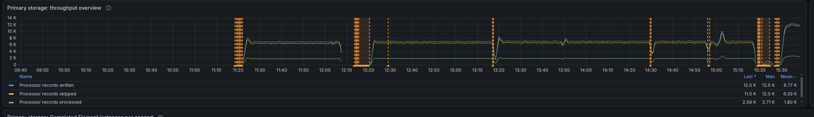
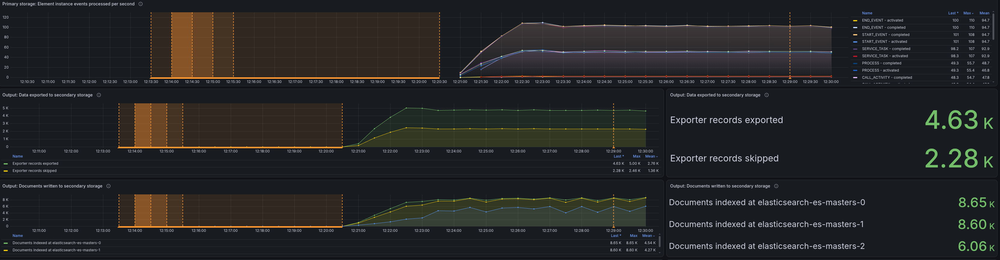
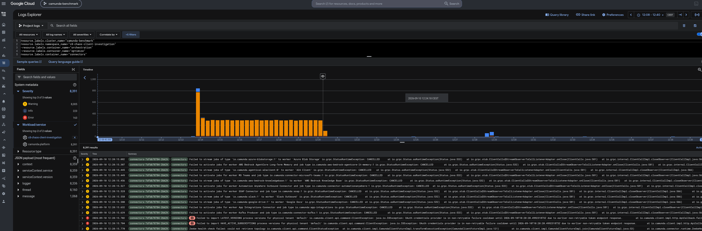
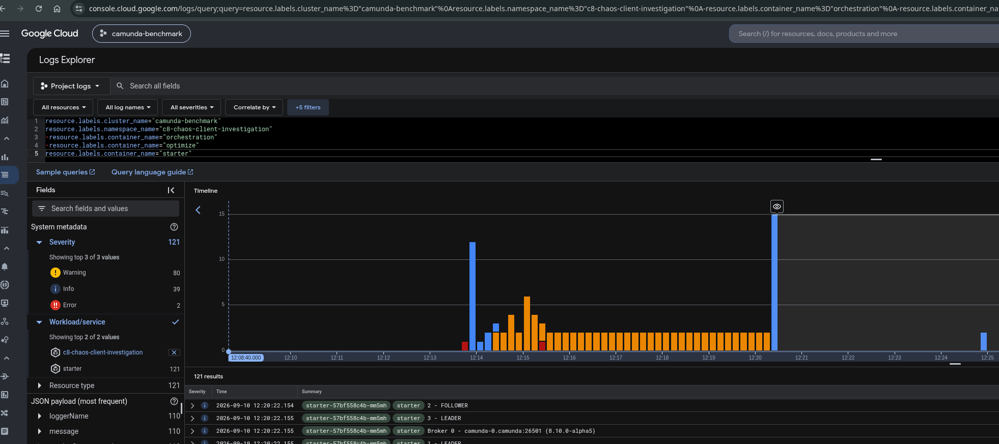
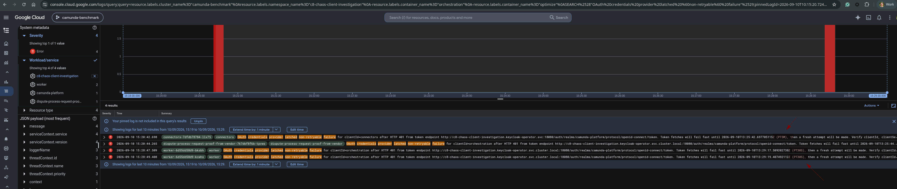
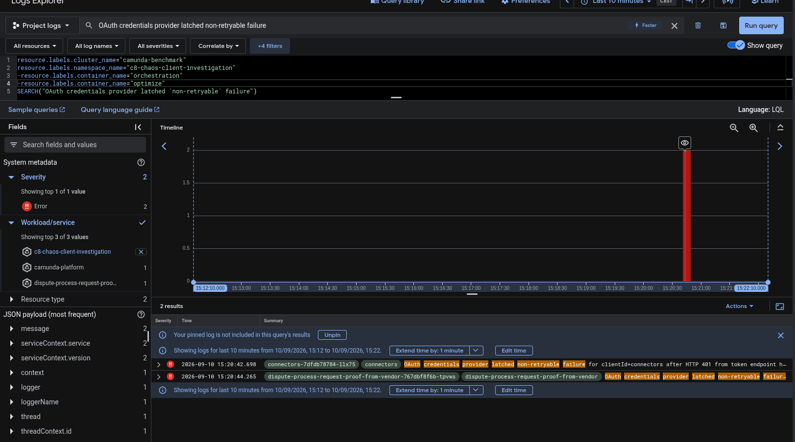

# Chaos Day Summary

On today's Chaos Day, we investigated how Camunda clients (starters and workers) behave while authenticating during cluster bootstrap, prompted by [camunda/camunda#58983](https://github.com/camunda/camunda/issues/58983), a report that load-test clients can be unable to authenticate for a long time right after a cluster is created. We wanted to walk through the whole startup sequence, Elasticsearch, Camunda, Identity, Keycloak, and clients, and find exactly where a client can get stuck.

**TL;DR:** During cluster bootstrap, a client can receive an OAuth 401 before Camunda has finished granting the permissions that make its token valid. The Camunda Java client's `OAuthCredentialsProvider` then latches into a non-retryable cooldown, which defaults to 5 minutes, so that single early 401 can leave a client unable to authenticate for minutes, even though the rest of the cluster recovers within seconds. Lowering `camunda.client.auth.token-fetch-non-retryable-cooldown` to 30 seconds fixes this for our load tests ([camunda/camunda#62862](https://github.com/camunda/camunda/pull/62862)). Along the way we also hit a false-positive `ERROR` log bug ([camunda/camunda#62686](https://github.com/camunda/camunda/issues/62686), fixed) and confirmed two observability gaps: Identity exposes no metrics, and the client exposes none for its OAuth token-fetch/retry behavior ([camunda/camunda#50684](https://github.com/camunda/camunda/issues/50684), [camunda/camunda#51113](https://github.com/camunda/camunda/issues/51113)).

<!--truncate-->

## Chaos Experiment

We ran our usual setup, a full Camunda 8 stack (Camunda, Identity, Keycloak, Elasticsearch, Optimize, Connectors) plus our [realistic "bank customer complaint/dispute handling" load test](https://github.com/camunda/camunda/blob/main/docs/testing/reliability-testing.md#realistic-load) (a starter and several job workers).

Our assumption going in was that clients keep a connection open and simply fail to renew it after a failure. To check that, we wanted to correlate three things across the same time window:

- Creation of Keycloak
- Bootstrapping of Identity
- Client connection behavior

### Expected

This was mostly an investigative exercise. We expected to confirm (or rule out) that clients keep a stale connection open and never renew it after a failure.

### Actual



The whole day at a glance: each orange band is one of the four experiments below, where we tore the cluster down (or restarted a dependency) and watched it come back.

#### First try

We spun up the namespace and watched pods come up. The starter logged repeated `Failed to retrieve topology` warnings with `Connection refused` while `camunda:8080` was still starting, then connected once it was ready:

```
"message":"Failed to retrieve topology: ","exception":"io.camunda.client.api.command.ClientException: org.apache.hc.client5.http.HttpHostConnectException: Connect to http://camunda:8080 [camunda/10.152.76.195] failed: Connection refused"
```

Workers hit the same pattern, retrying the token fetch with backoff:

```
"message":"Token fetch failed for clientId=orchestration (attempt 1/5), retrying in 577ms: Connection refused"
"message":"Token fetch failed for clientId=orchestration (attempt 4/5), retrying in 6394ms: Connection refused"
```

That much was expected: Camunda simply wasn't up yet. But the broker itself then logged an unrelated `ERROR` storm:

```
"severity":"ERROR","message":"Processor 'io.camunda.zeebe.engine.processing.bpmn.BpmnStreamProcessor' implements SuspensionAware but returned a null suspension behavior for command 'PROCESS_INSTANCE'; processing it normally. Please report this as a bug."
```

We took the test down at 12:06 to file this as a bug: [camunda/camunda#62686](https://github.com/camunda/camunda/issues/62686) (a false-positive log message, since fixed).

#### How the bootstrap actually orders itself

Before the second try, we mapped out what actually has to happen, in what order, for Elasticsearch, Keycloak, Identity, Camunda, and the clients to all come up together.

Sequential, and each step gates the next:

- Elasticsearch needs to come up and be ready.
- Only then can Camunda come up and create its Elasticsearch schema.
- Camunda's distributed system starts with partitions; every cluster node needs to join before a partition is marked ready.
- A leader is needed for partition one before anything can process on it.
- Only then does Camunda create the init permissions on partition one, via processing and then exporting.

In parallel with all of that:

- Postgres starts.
- Keycloak starts and writes into Postgres.
- MGMT Identity starts and writes into Keycloak (realms, etc.).
- Clients start and, once Keycloak has enough state, can retrieve a token.

The catch: a token retrieved at that point is not valid yet, because it needs the init permissions from the sequential chain above, which is not done yet either. A client that races ahead of that chain gets a 401, not because anything is actually broken, but because it asked one step too early.

#### Second try

Pods were running at 12:13:30, but load-test traffic only started around 12:20, a roughly seven-minute gap between "the pods exist" and "the cluster is actually doing work":



During that window, Connectors and the starter both hit the race described above. Connectors' own readiness probe (`/actuator/health/readiness`, 30s initial delay, 30s period) meant it kept failing readiness rather than crash-looping:





The actual failure, once we found it, was this:

```
Caused by: java.io.IOException: OAuth credentials provider is in non-retryable failure cooldown until 2026-09-10T10:20:20.499231873Z due to earlier non-retryable token endpoint response.
Caused by: java.io.IOException: Failed while requesting access token with status code 401 and message Unauthorized.
```

And, more explicitly, from a dedicated log search:

```
OAuth credentials provider latched non-retryable failure for clientId=orchestration after HTTP 401 from token endpoint .../protocol/openid-connect/token. Token fetches will fail fast until 2026-09-10T10:20:20.724006897Z (PT5M), then a fresh attempt will be made. Verify clientId, clientSecret, audience, and token URL configuration.
```

In short: the client doesn't retry after a 401, it fails fast for the rest of the cooldown window and only tries again once that expires. The relevant code:

- [`OAuthCredentialsProvider.java#L296`](https://github.com/camunda/camunda/blob/99b651843f9ba71de5aa05372b8f753415855056/clients/java/src/main/java/io/camunda/client/impl/oauth/OAuthCredentialsProvider.java#L296) and [`#L388`](https://github.com/camunda/camunda/blob/99b651843f9ba71de5aa05372b8f753415855056/clients/java/src/main/java/io/camunda/client/impl/oauth/OAuthCredentialsProvider.java#L388): the latch itself.
- [`OAuthCredentialsProviderBuilder.java#L99`](https://github.com/camunda/camunda/blob/0d5833d17e588d5725c603d878fd2760e3f90707/clients/java/src/main/java/io/camunda/client/impl/oauth/OAuthCredentialsProviderBuilder.java#L99): the default cooldown, 5 minutes.
- [`CamundaClientAuthProperties.java#L157`](https://github.com/camunda/camunda/blob/8dcc3bb29fd13333cf48bb2e43d9fabf61b3d533/clients/camunda-spring-boot-starter/src/main/java/io/camunda/client/spring/properties/CamundaClientAuthProperties.java#L157): the Spring Boot starter property backing it, [documented here](https://docs.camunda.io/docs/apis-tools/camunda-spring-boot-starter/properties-reference/#camundaclientauthtokenfetchnonretryablecooldown).

#### Third try, the fix

We recreated the load test with `camunda.client.auth.token-fetch-non-retryable-cooldown` set to `PT30S` instead of the 5-minute default:





The fix worked. The same latch message now reported the new window:

```
OAuth credentials provider latched non-retryable failure for clientId=orchestration after HTTP 401 from token endpoint .../protocol/openid-connect/token. Token fetches will fail fast until 2026-09-10T13:29:19.407492112Z (PT30S), then a fresh attempt will be made. Verify clientId, clientSecret, audience, and token URL configuration.
```

A client that races the bootstrap sequence now waits 30 seconds instead of 5 minutes before its next attempt, which is well within the time the rest of the cluster needs to finish coming up anyway. We applied this to the load-tester defaults in [camunda/camunda#62862](https://github.com/camunda/camunda/pull/62862).

#### Fourth experiment, identity restarts together with workers

Next we wanted to understand how the system behaves under identity restarts happening at the same time as worker restarts, relevant to [camunda/camunda#62647](https://github.com/camunda/camunda/issues/62647). We noticed Identity was sharing a node with a worker pod, which may also be the case in that issue.

We couldn't delete the node directly (due to RBAC restriction), so we deleted the Identity and worker pods instead, repeatedly, and also edited the Keycloak CR directly to force Keycloak itself to restart. After several rounds of this, we were not able to reproduce the original extended-outage failure mode; everything recovered.

We did separately confirm the same underlying symptom occurred the day before, in an unrelated stable-89 load test, as a worker's Spring context failing to start entirely:

```
Caused by: java.lang.IllegalStateException: Failed to retrieve topology due to authentication error; check your config
Caused by: io.camunda.client.api.command.ClientStatusException: Invalid bearer token
Caused by: io.grpc.StatusRuntimeException: UNAUTHENTICATED: Invalid bearer token
```

And, later in this same run, a variant where the client couldn't reach the token endpoint at all:

```
java.net.ConnectException: Connection refused
	at io.camunda.client.impl.oauth.OAuthCredentialsProvider.doFetchCredentials(OAuthCredentialsProvider.java:369)
	at io.camunda.client.impl.oauth.OAuthCredentialsCache.doForceRefreshIfChanged(OAuthCredentialsCache.java:250)
	at io.camunda.client.impl.oauth.OAuthCredentialsProvider.shouldRetryRequest(OAuthCredentialsProvider.java:205)
```

Both point at the same family of bootstrap-ordering races as the first three tries, just triggered by a mid-life restart instead of initial startup.

## Found Bugs and Follow-ups

- **Identity has no metrics at all.** We had no metric to point to for Identity's own health, readiness, or token-issuance behavior during this investigation, only log-scraping. Tracked as part of [camunda/camunda#51113](https://github.com/camunda/camunda/issues/51113).
- **Clients have no metrics for OAuth refresh, token requests, or failure rate.** We only found the non-retryable latch by reading debug logs live during the experiment. Tracked as [camunda/camunda#50684](https://github.com/camunda/camunda/issues/50684).
- **False-positive `SuspensionBehavior` ERROR log spam**, found during the first try: [camunda/camunda#62686](https://github.com/camunda/camunda/issues/62686) (fixed).
- **The config fix itself**: [camunda/camunda#62862](https://github.com/camunda/camunda/pull/62862), lowering the load-test default cooldown to `PT30S`.
- **Tooling gap**: to reliably reproduce the fourth experiment, we need a way to deliberately hold a pod down (for example, a blocking `initContainer`, or a tool like Chaos Mesh's `PodChaos`) rather than repeatedly deleting pods and hoping the timing lines up. Neither our `zbchaos` CLI nor the load-tests `chaos-killer` CronJob support this today; worth exploring for future chaos days.
