# Chaos Day Summary

On today's Chaos Day, we investigated a puzzling result of our daily load tests, reported in [camunda/camunda#62783](https://github.com/camunda/camunda/issues/62783): without secondary storage, the REST load test is much slower than the same test with Elasticsearch, while for gRPC it is the other way around, as one would expect.

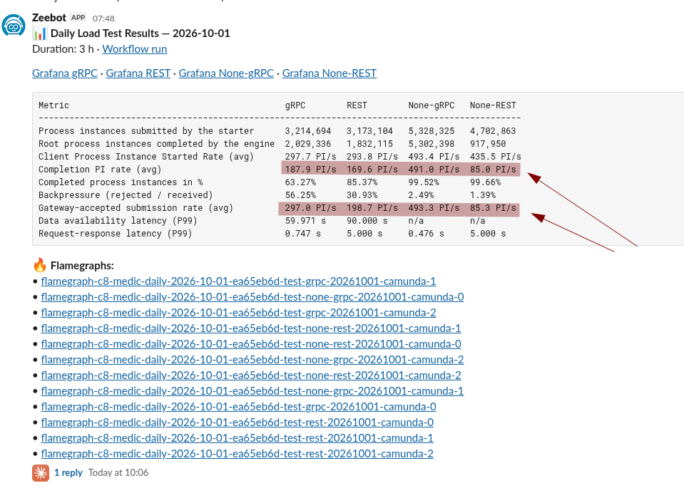

We run several load tests every day (gRPC and REST, each with and without Elasticsearch as secondary storage) against the current `main`. The "None" variants run without secondary storage to max out the engine and observe its limits. In the results above, None-gRPC completes about 491 PI/s, while None-REST completes only about 85 PI/s, even though its starter reports starting 435 PI/s. With Elasticsearch, the REST test completes about 170 PI/s and is at least in the same range as gRPC.

We had already seen that the starter, the application that creates process instances, was heavily CPU throttled. Today we wanted to find out why.

**TL;DR;** The bottleneck was the load tester itself, not Camunda.

- The starter's HTTP client has a pool of 100 connections. At a configured rate of 500 PI/s, the starter scheduled more requests than the pool completed and queued the rest in memory, up to about 85,000 requests.
- The full heap made the JVM spend most of its CPU on garbage collection, which slowed the starter down and caused the CPU throttling we saw. Giving the starter more CPU made it worse, most likely because the JVM then picks a different garbage collector that no longer slows the sender down. The starter ran out of memory and its scheduler died silently.
- Limiting the number of in-flight requests keeps the starter stable under the configured load, in an open workload model: when the system cannot keep up, the starter skips sends instead of queueing them. With this prototype we reach about 380 PI/s of the 500 PI/s configured, which is now limited by Camunda's CPU.
- We also added HTTP client metrics ([camunda/camunda#64477](https://github.com/camunda/camunda/pull/64477)) that made the backlog visible. The investigation produced eight new issues and five draft fixes for the load tester, the Java client and the load test configuration, listed at the end.

<!--truncate-->

## Chaos Experiment

We started with the existing data of the daily load tests, and then ran our own experiments against a setup without secondary storage (REST, no Elasticsearch) to reproduce and understand the behavior:

1. A run with the "normal" load that we also use with Elasticsearch: 300 PI/s.
2. A run with the higher load that the daily "None" test uses: 500 PI/s.
3. Several runs with changed starter resources and fixes, with additional HTTP client metrics.

### Expected

This was an investigation, we had no firm expectation besides the hypothesis from the original issue: the starter, not Camunda, limits the REST test. If so, 300 PI/s should run smoothly, and more load or less CPU for the starter should make it worse.

### Actual

#### The daily results

Comparing gRPC and REST without secondary storage shows distinct patterns in the server metrics.

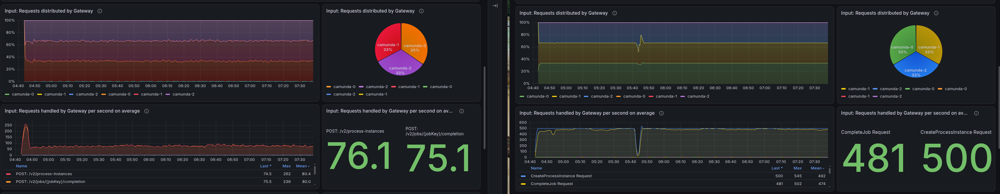

The starter metrics show nothing obvious. It counts a request rate in line with the configured load, as if it was not hitting any limit.

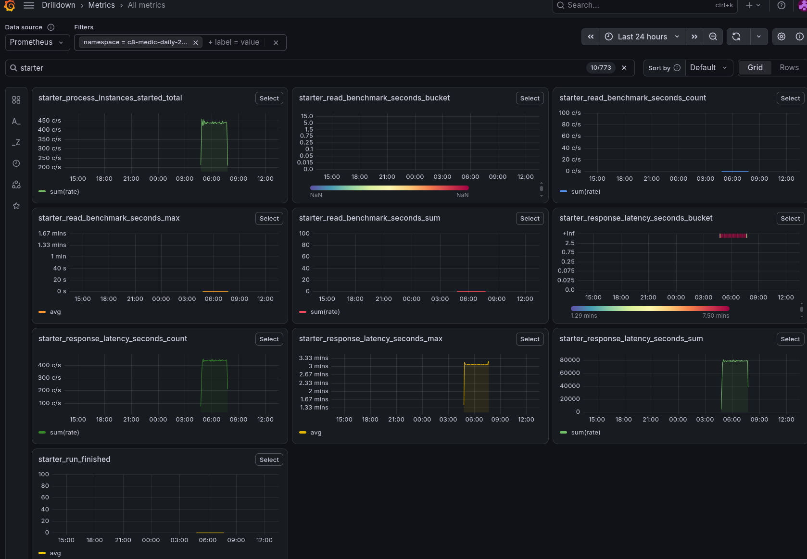

We realized that the starter counts a process instance when it *sends* the request, not when it gets the response. In the daily results above, the starter "started" 435 PI/s, while the gateway accepted only 85 PI/s. The headline "completed" percentage of 99.66% in the table is calculated against the instances the gateway accepted, so it hides that most submitted instances never got through.

The CPU throttling metrics, however, show that the starter was heavily throttled during the high load tests.

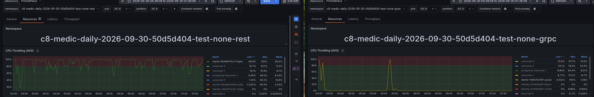

#### Logs

The starter logs showed two kinds of errors. First, the load test also runs REST read queries (to measure the read performance of the REST API). These are not possible without secondary storage, so they fail with a `403`.

```
io.camunda.client.api.command.ProblemException: Failed with code 403: 'Forbidden'. Details: 'class ProblemDetail {
    type: about:blank
    title: FORBIDDEN
    status: 403
    detail: This endpoint requires a secondary storage, but none is set. Secondary storage can be configured using the 'camunda.data.secondary-storage.type' property.
    instance: /v2/process-instances/6755399443006124
}'
	at io.camunda.client.impl.http.ApiCallback.handleErrorResponse(ApiCallback.java:153)
	...
```

_The `403` is a side effect of the missing secondary storage, not of a missing permission, so the status code is a bit misleading._

Second, we saw timeouts while waiting for a connection from the HTTP client's pool:

```
io.camunda.client.api.command.ClientException: org.apache.hc.core5.util.DeadlineTimeoutException: Deadline: 2026-09-30T03:34:45.481+0000, -116 MILLISECONDS overdue
	at io.camunda.client.impl.http.ApiCallback.failed(ApiCallback.java:88)
	...
	at org.apache.hc.core5.pool.LaxConnPool$LeaseRequest.failed(LaxConnPool.java:338)
	...
```

This was actually the first hint that we were building a backlog: requests waited longer than their deadline for a free connection.

#### Hypothesis 1: the REST read queries consume the CPU

The read queries run through the same HTTP client as the instance creation (a gRPC client has separate threads and connections). So the REST queries could be what burns the CPU and exhausts the connections.

We restarted the load test with the read queries disabled. The **hypothesis didn't hold**: the starter was still throttled and the throughput still degraded under high load. We still plan to implement a fix, because these REST read queries are not useful in this scenario.

#### Reproducing the degradation

We first ran 300 PI/s. This was stable and smooth.

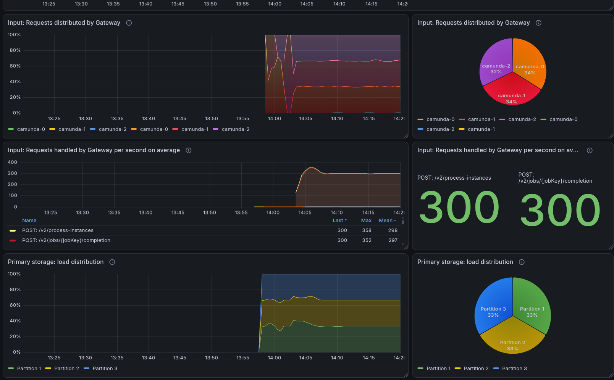

Then we increased the rate to 500 PI/s. It took a while until it actually broke down: for about ten minutes the system handled the load at a steady rate, and then the throughput collapsed.

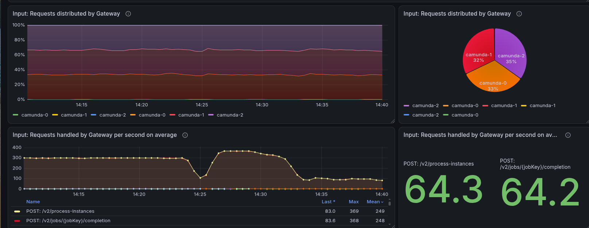

The starter hit its CPU limit (it had only 250 millicores), and the client response latency jumped to 5 seconds, the upper end of what the panel reports.

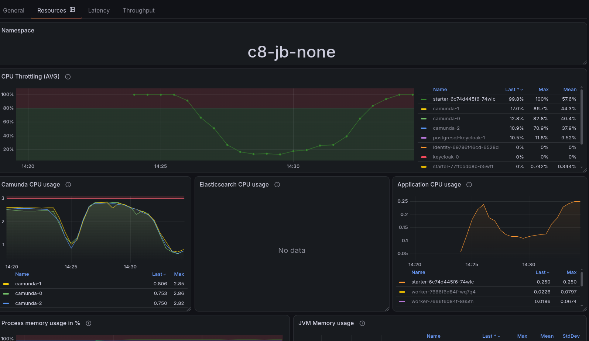

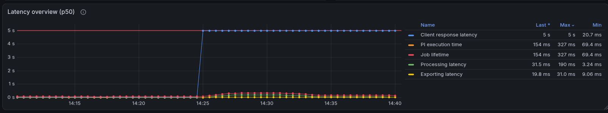

As soon as the starter was throttled, it sent less, and the load on Camunda vanished, which also shows in the CPU usage of the Camunda pods.

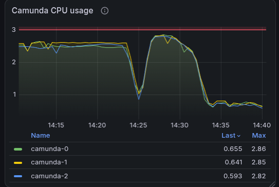

#### Reviewing the load tester code

While reading the starter code we found several things worth improving, which we tracked as follow-ups (see below): the process instance counter is incremented before the request is answered, and failed requests are not recorded. The data reader blocks its scheduler threads and shares its query context between threads without synchronization.

### Adding observability

We did not know what happens inside the client. The Camunda Java client exposes no metrics for its HTTP client, so we looked for a way to get them and found the [Apache HttpClient observation module](https://hc.apache.org/httpcomponents-client-5.6.x/observation.html), which can report request durations and connection pool statistics through Micrometer. We enabled it for the Java client in [camunda/camunda#64477](https://github.com/camunda/camunda/pull/64477) (the proposal for a proper client feature is [camunda/camunda#64528](https://github.com/camunda/camunda/issues/64528)). After a few attempts, we got the metrics we wanted. This is a scrape taken shortly after the start of the 500 PI/s test:

```
# TYPE http_client_inflight gauge
http_client_inflight{kind="async"} 315.0
# TYPE http_client_pool_available gauge
http_client_pool_available 0.0
# TYPE http_client_pool_leased gauge
http_client_pool_leased 100.0
# TYPE http_client_pool_pending gauge
http_client_pool_pending 232.0
# TYPE http_client_request_seconds histogram
http_client_request_seconds_count{method="POST",status="200"} 99
http_client_request_seconds_sum{method="POST",status="200"} 199.841334404
http_client_request_seconds_max{method="POST",status="200"} 4.536155268
```

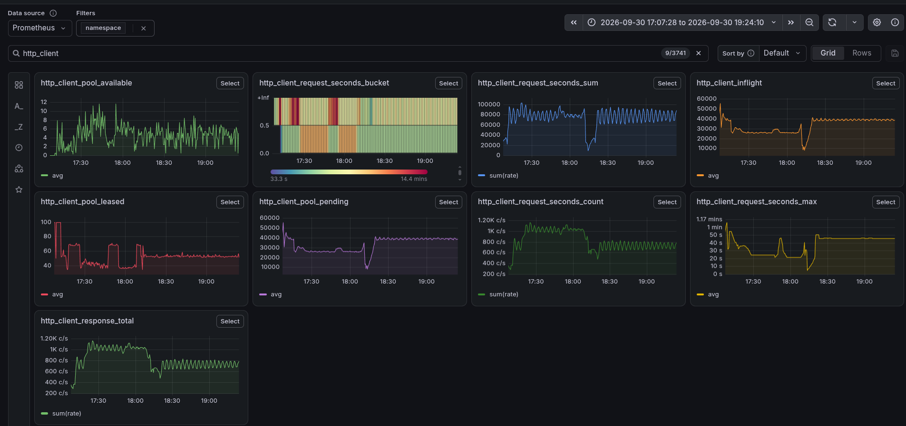

All 100 connections of the pool are leased and requests are waiting for one (`pending`), while the average `POST` takes about 2 seconds. As the test ran longer, the number of pending requests grew to about 80,000 and the slowest request took about two minutes. With 300 PI/s, the same metrics look very different: around 5 to 15 connections are in use, nothing is pending, and requests take 20 to 60 milliseconds at most. (Left: 500 PI/s, right: 300 PI/s.)

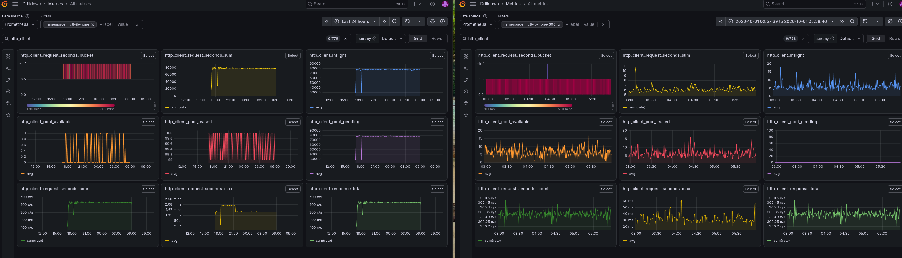

At 300 PI/s, the pool is far from its limit.

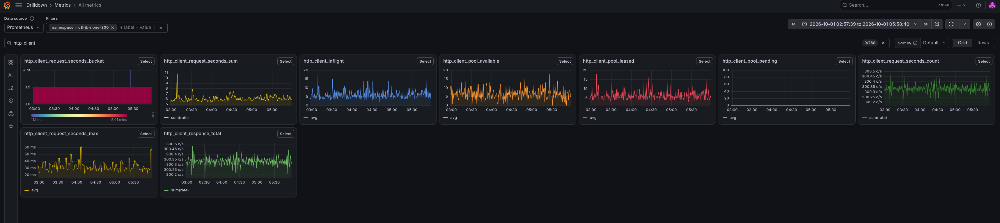

### More CPU, and what the starter does with it

Since the starter was CPU throttled, the next step was obvious: give it more CPU. We doubled it from 250 to 500 millicores, and later raised it to 2 cores. The throttling disappeared, but the starter did not become healthy. With 500 millicores it sent only about 290 to 350 requests per second, with 2 cores it sent the full 500 per second.

We profiled the starter at 2 cores.

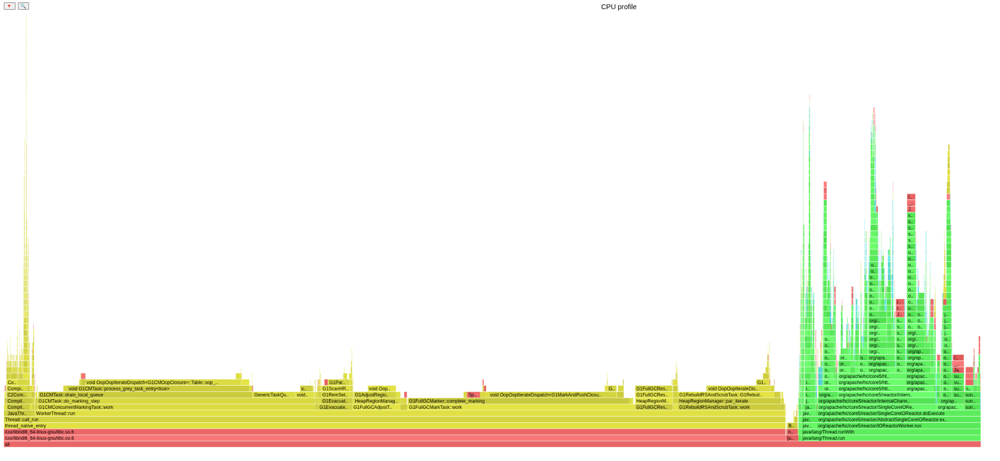

Around 80% of the samples are on native JVM threads, and almost all of those belong to the G1 garbage collector, mostly marking and compacting the heap. Only about 18% are Java code.

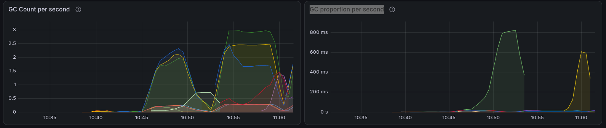

Why is the heap so full? The max connection pool allows 100 connections (default client configuration) at the same time, and the starter keeps scheduling 500 new requests per second regardless of how many have completed. This means that many requests are queued in memory, waiting for a free connection. We accumulated up to about 85,000 queued requests, which filled the heap (its maximum was 512 MiB, the JVM default of a quarter of the container memory). The garbage collector then ran back-to-back full collections and used almost the whole CPU. At 300 PI/s no queue forms, because requests complete as fast as they are scheduled.

Why did more CPU make it worse? The CPU count also changes the garbage collector: with fewer than two CPUs the JVM chooses the serial collector, which stops all application threads while it collects, including the thread that schedules new requests. From two CPUs it chooses G1, which does most of its marking concurrently and keeps the scheduler running. So with less CPU, the pauses and the throttling most likely slowed the sender down and thereby also limited how fast the backlog grew. This is a hypothesis that fits what we measured, but we did not separate the garbage collector from the throttling. Running 2 cores with `-XX:+UseSerialGC` would show it.

### The starter becomes a zombie

With 2 cores, the starter ran at the full 500 PI/s for a while, until the heap was full. As we were not blocked by GC we accumulated more requests until we got stopped by `OutOfMemory` error. After this the rate went to zero. The pod did not restart and the logs showed no error. 

The reason is in the code: the starter creates instances with `scheduleAtFixedRate`, and it only catches `Exception` inside the scheduled task. An `Error` such as `OutOfMemoryError` escapes, and the executor then silently cancels all future runs of the task. Nothing is logged, until someone calls `get()` on the returned future, which nobody does.

```
$ kubectl logs starter-... | grep Mem
NOTE: Picked up JDK_JAVA_OPTIONS: -XX:+HeapDumpOnOutOfMemoryError
java.lang.OutOfMemoryError: Java heap space
```

The JVM was started with `-XX:+HeapDumpOnOutOfMemoryError`, which writes a heap dump (here about 800 MB onto the container file system) and then keeps the process running. So the starter stayed alive without doing anything: a zombie. Kubernetes could not detect this, because nothing checks that the starter keeps sending. This is the same gap that [camunda/camunda#62661](https://github.com/camunda/camunda/issues/62661) wants to close with real liveness and readiness indicators.

The same pod also logged a `StackOverflowError` in the HTTP client threads:

```
$ kubectl logs starter-... | grep StackOverflow
Exception in thread "httpclient-dispatch-1" java.lang.StackOverflowError
Exception in thread "httpclient-dispatch-2" java.lang.StackOverflowError
```

This is a different failure with a different effect. The REST client retries failures directly in the same call stack, and after enough failures it overflows the stack and the client is unusable until restart. We already knew this as [camunda/camunda#34597](https://github.com/camunda/camunda/issues/34597); a starter that is overloaded and has many failing requests is a good way to trigger it.

What should the load tester do instead?

- **Never let a periodic task die silently.** Catch `Throwable` around the scheduled work and log it (or even exit the JVM if necessary).
- **Treat an `Error` as fatal.** For an `OutOfMemoryError`, `-XX:+ExitOnOutOfMemoryError` makes the JVM exit, so Kubernetes restarts the pod and the test shows the failure. The heap dump should then go to an [`emptyDir` volume](https://kubernetes.io/docs/concepts/storage/volumes/#emptydir) (via `-XX:HeapDumpPath`), so it survives the restart and doesn't fill the container file system.
- **Bound the work you accept.** The cause of the out of memory was the unbounded queue, which brings us to the next section.

### Open and closed models

Looking for a fix, we remembered the difference between an open and a closed workload model (see the [k6 documentation on scenarios](https://grafana.com/docs/k6/latest/using-k6/scenarios/) and [open versus closed workload models](https://grafana.com/docs/k6/latest/using-k6/scenarios/concepts/open-vs-closed/)):

- In a **closed workload model**, a fixed number of virtual users each wait for the response before sending the next request. The load adapts to the system, so a slow system gets less load. This is interesting for sizing, but it cannot overload the system.
- In an **open workload model**, new requests arrive at a fixed rate, independent of how fast the system answers. This is how real traffic behaves, and what we want to stress a system.

Our starter follows the open model, which is why a slow system makes it pile up work. The ideal is in the middle: keep the open model, but bound the number of requests in flight. A very small limit makes the starter behave like a closed model. With enough headroom, for example ten seconds worth of requests at the configured rate, it stays open until the system falls behind by more than that.

We prototyped this ([commit](https://github.com/camunda/camunda/pull/64477/commits/745c4d33079339a2f85d758b8e34620b3e2b1462), the proper fix is tracked in [camunda/camunda#64584](https://github.com/camunda/camunda/issues/64584)) with a semaphore: every scheduled tick needs a permit, and the permit is returned when the response arrives. If no permit is available, the tick is skipped, so no new request is queued. We allow `rate * 10` requests in flight, which is 5,000 for 500 PI/s.

### Results

With the limit, the load stabilizes. The gateway receives about 380 PI/s for 500 PI/s of configured load, steady and smooth (the starter skips the ticks it cannot send within the limit), which is more than the REST test with Elasticsearch reaches today (about 200 PI/s in the daily run, with 300 configured).

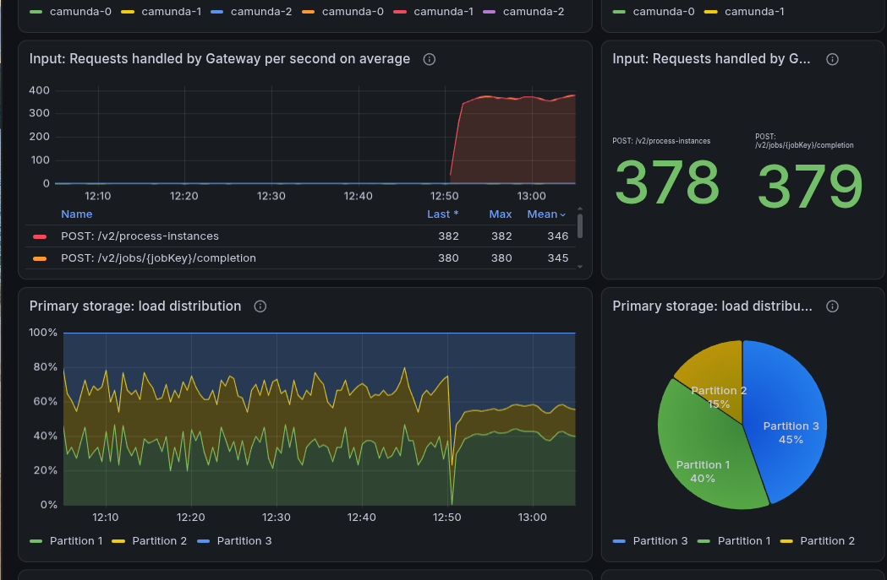

The number of in-flight requests stays within the bound we configured (about 4,800 to 5,000 pending requests, instead of 85,000), while the pool stays fully leased (100 connections).

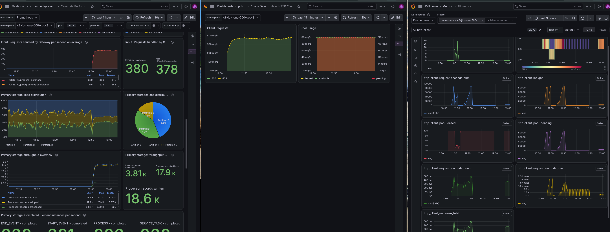

The starter is no longer throttled, and the bottleneck has moved to where it belongs: the Camunda pods run at their CPU limit of 3 cores.

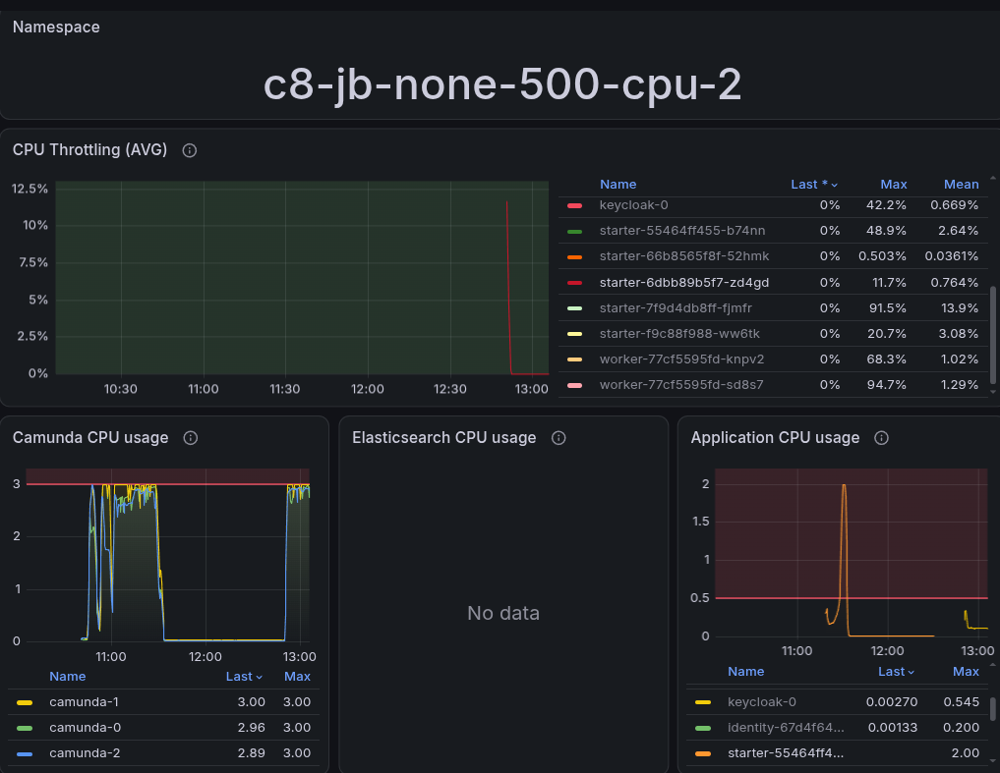

## Conclusion

The REST load test was limited by the starter, not by Camunda. The starter's connection pool of 100 connections completes only as many requests per second as the pool size divided by the request duration, and the duration grew while the starter was overloaded. Once the configured rate exceeded that, the open-model starter queued requests without any bound and filled its heap. It then spent almost all CPU on garbage collection, which slowed it down and led to the throttling we first saw. Giving it more CPU made it worse, most likely because the JVM switched to the G1 collector and the starter no longer slowed itself down. It kept queueing until it ran out of memory, and the `OutOfMemoryError` silently ended its scheduler. We expected less CPU to hurt, but more CPU hurt more.

The key takeaways:

- **Bound the work in flight.** In an open workload model, a limit on concurrent requests keeps a slow system from turning into an out of memory failure of the load generator, and the skipped ticks show up as lower throughput instead of a crash.
- **Make failures loud.** A periodic task that swallows an `Error`, and a JVM that continues after an `OutOfMemoryError`, produce a process that looks healthy and does nothing. Catch `Throwable` in scheduled tasks and exit on out of memory.
- **Observability pays off.** We could only tell the pool was the limit after we had the HTTP client metrics. The Java client should expose them out of the box.
- **Check the load generator before blaming the system.** The CPU throttling of the starter was the first clue, and it took the client metrics, a profile and a heap dump to turn it into an explanation.

## Found Bugs and Follow-ups

- [camunda/camunda#62783](https://github.com/camunda/camunda/issues/62783): the original report, None-REST completion collapses while None-gRPC stays healthy.
- [camunda/camunda#64526](https://github.com/camunda/camunda/issues/64526): the load tester should skip read queries when no secondary storage is configured. Draft fix: [camunda/camunda#64561](https://github.com/camunda/camunda/pull/64561).
- [camunda/camunda#64527](https://github.com/camunda/camunda/issues/64527): the starter metrics should distinguish sent, received, successful, failed, and in-flight requests (today it counts when sending). Draft fix: [camunda/camunda#64564](https://github.com/camunda/camunda/pull/64564).
- [camunda/camunda#64528](https://github.com/camunda/camunda/issues/64528): the Java client should expose HTTP client metrics.
- [camunda/camunda#64529](https://github.com/camunda/camunda/issues/64529): the data reader blocks its scheduler threads. Draft fix: [camunda/camunda#64562](https://github.com/camunda/camunda/pull/64562).
- [camunda/camunda#64530](https://github.com/camunda/camunda/issues/64530): the data reader updates its query context without synchronization. Draft fix: [camunda/camunda#64563](https://github.com/camunda/camunda/pull/64563).
- [camunda/camunda#64531](https://github.com/camunda/camunda/issues/64531): a higher default load for the `max` scenario without secondary storage. Draft fix: [camunda/camunda#64560](https://github.com/camunda/camunda/pull/64560).
- [camunda/camunda#34597](https://github.com/camunda/camunda/issues/34597): the Java client can fail with a `StackOverflowError` in its failure handling.
- [camunda/camunda#62661](https://github.com/camunda/camunda/issues/62661): real liveness and readiness indicators for the load tester, which would have flagged the zombie starter.
- [camunda/camunda#64584](https://github.com/camunda/camunda/issues/64584): the starter should limit its in-flight requests. The proof of concept with the semaphore is [camunda/camunda#64477](https://github.com/camunda/camunda/pull/64477), which also contains the HTTP client metrics.
- [camunda/camunda#64585](https://github.com/camunda/camunda/issues/64585): the load tester should fail loudly, by catching `Throwable` in scheduled tasks, exiting on out of memory and writing heap dumps to an `emptyDir` volume.
