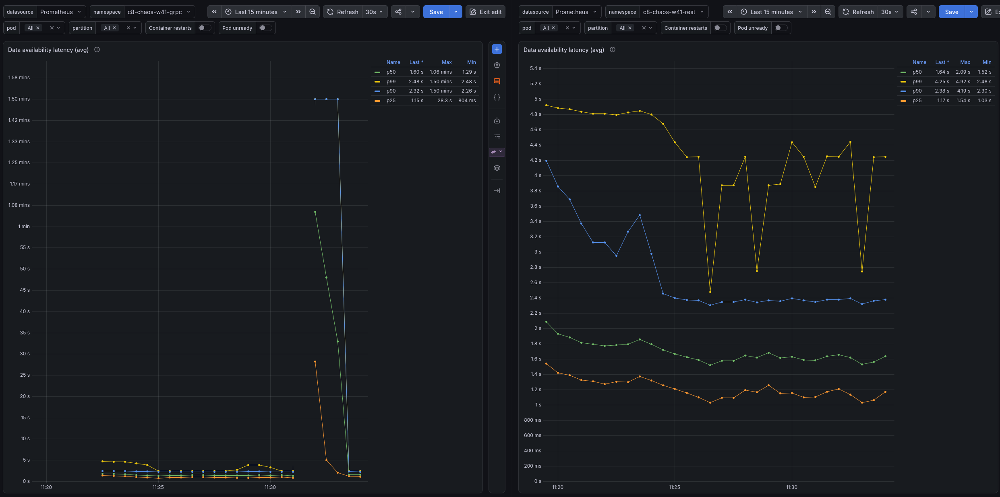
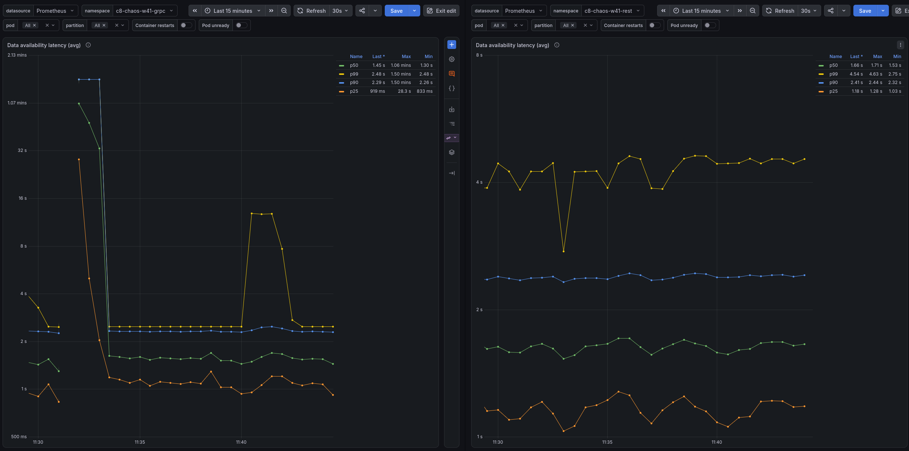
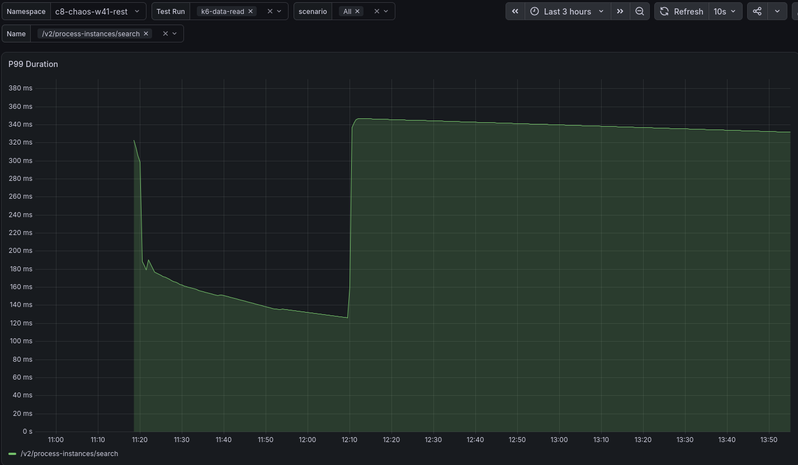
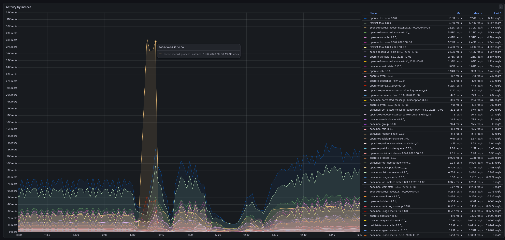

# Chaos Day Summary

Under stress, the data availability reported by our load tester ("how long after creation can a process instance be found via the search API") was at the 90 second limit of the report window for REST, but only about 30 to 45 seconds for gRPC. Today we wanted to find out whether the REST API, the gateway, or our load tester is responsible.

**TL;DR;** The 90 seconds are mostly a client-side effect, not a slow REST API.

- The REST search endpoint is not slower than with gRPC. The server answers `/v2/process-instances/search` in about 70 ms in both setups, and k6 shows similar latencies for both protocols once we fixed our k6 dashboard.
- The starter (the load tester application that creates process instances) used one Camunda client for creating instances at 300 PI/s *and* for the availability check. With REST, the connection pool of that client was fully leased (100 connections) with about 2,900 requests waiting, so the availability search waited in the same queue. The starter measured about 15 seconds for a query that took the server 70 ms.
- The availability check starts the next check only after the previous one completed, and returns at most 2,500 instances per check. With a 15 second cycle, it confirms at most about 167 instances per second. The rest is dropped after 90 seconds and recorded with the same metric as a real latency, so timeouts look like slow data availability.
- A second Camunda client only for the read requests brings the search time seen by the starter from about 15 seconds to about 0.1 seconds ([camunda/camunda#65355](https://github.com/camunda/camunda/pull/65355), merged). The mean data availability of the REST test drops from about 97 seconds to about 30 to 65 seconds, in the same range as gRPC (about 45 seconds).
- The remaining delay of about 45 seconds exists for both protocols. It is a queuing effect of the stress load: with more load, the exporter backlog grows, and data becomes searchable later.

<!--truncate-->

## Chaos Experiment

We ran load tests with REST and with gRPC side by side and compared the server metrics, the k6 search latencies (k6 runs read requests against the search API during the test), and the data availability measured by the starter.

The clusters have three Camunda pods with 3 CPUs each and Elasticsearch as secondary storage. We ran two rounds:

1. REST and gRPC on our standard 4 CPU nodes with a realistic load.
2. REST and gRPC with stress (max) load, each on 4 CPU nodes and on bigger, 8 CPU nodes. The CPU limit of the Camunda pods stayed the same.

### Expected

Either the client (again, see [Investigating load tester limits](../2026-10-01-Investigating-load-tester-limits/index.md)) or the gateway is the problem. If REST behaves worse for the k6 search requests too, the gateway is the suspect. If k6 looks the same for both protocols, the issue is in the load tester.

### Actual

#### Round 1: realistic load

At first, k6 showed about twice the search latency (p99) for REST compared to gRPC.

The throughput was the same for both protocols.

The data availability looked similar for both, apart from one spike on the gRPC side that matches a restart of the starter pod.

The CPU was a clear difference: REST used about 2.2 of its 3 CPUs and was throttled in 11 to 17% of the periods, while gRPC used about 1.3 CPUs and was barely throttled.

Throttling well below the limit looked odd. The node (4 CPUs, 3.92 allocatable) already had 99% of its CPU requested, with one Camunda pod requesting 3 CPUs next to the node daemons. Our assumption was that REST, which needs more CPU, suffers from contention on the node.

To test that, we moved the REST Camunda pods to 8 CPU nodes at 12:20, without changing their CPU limit and requests. Right before the move, k6 had shown a high latency spike on REST. Elasticsearch had restarted two of its pods around 12:10 and showed a lot of activity on the process instance index, which explains that spike.

At the same time, we found that our k6 latency panel displayed the wrong data. With a corrected panel (now a heatmap), REST and gRPC are similar, and REST improved after the move to bigger nodes.

We also realized that this round tested the wrong thing: a realistic load, instead of the stress test where the high data availability was reported.

#### Round 2: stress load

We started four new load tests: gRPC and REST, each on the standard and on the bigger nodes (the `-4` and `-8` namespaces).

- gRPC was fine and similar on both node sizes. For k6, gRPC on bigger nodes performed best.
- For REST, the data availability was at the limit of the report window, 90 seconds. For gRPC it was about 30 seconds. This held for both REST setups.
- k6 still showed REST performing better on bigger nodes, with less CPU throttling and less CPU used overall.
- The server side looked the same: the exporter backlog and the flush latency were similar, and the search request latencies were similar, or even a bit lower for REST.
- The starter was throttled in about 15% of the periods for REST, and the garbage collection took about 50 ms per second. We also saw regular halts of about 0.5 seconds, which can contribute but are not the root cause.

If the server is as fast for REST and the data is exported at the same pace, the high availability must come from how the starter measures it.

#### How the starter measures data availability

The starter keeps every created process instance in a map, and checks regularly which of them can be found through the search API. It remembers the creation time and records the time until the instance is found. Instances that are not found after 90 seconds are removed and recorded with their age.

The starter logged the number of instances it was waiting for every 15 seconds, and this number kept increasing. A 15 second cycle is surprising: the configured interval is 250 ms. The next check is scheduled only after the previous one completed, so a cycle of 15 seconds means that the query itself took about 15 seconds.

The metrics confirmed this. A snapshot during the stress runs:

| Namespace | Pending instances | Query duration seen by the starter | Mean data availability |
|---|---|---|---|
| gRPC, 4 CPU nodes | 7.8k | 0.07 s | 45 s |
| gRPC, 8 CPU nodes | 7.7k | 0.08 s | 42 s |
| REST, 4 CPU nodes | 15.9k | 14.7 s | 97 s |
| REST, 8 CPU nodes | 12.9k | 17.6 s | 99 s |

The server-side duration of the search request is about 70 ms for both REST and gRPC. In REST, the starter sees 14.7 seconds for the same request. A heap dump of the starter agrees: it held 16,059 instances waiting for their availability.

Two effects follow from this:

1. Each check can confirm at most 2,500 instances (the page size of the search) and takes about 15 seconds: about 167 instances per second. With 200 or more instances per second created, instances wait until they hit the 90 second limit.
2. The timeouts are recorded in the same metric as the real latencies. The upper bucket of the histogram is the 90 seconds, so a timeout is indistinguishable from an instance that was really found after 90 seconds.

#### Why does the query take 15 seconds?

The availability query uses the same Camunda client as the creation of process instances. With gRPC, the creation runs over gRPC and the client's HTTP connections are used by the search only. With REST, the starter sends about 300 requests per second over the same HTTP client, and the search has to wait for a free connection like any other request.

The client metrics we added in the [previous chaos day](../2026-10-01-Investigating-load-tester-limits/index.md) show it: the REST starter has all 100 connections of its pool leased and about 2,900 requests pending.

We tried several things to confirm and fix it, with these results:

1. A standalone starter that only calls the search API with 2,000+ process instance keys in the filter: about 2 seconds, compared to about 400 ms without a filter. Slower, but far from 15 seconds. k6 shows the same, so it is not specific to Java or the starter.
2. A bigger connection pool (500 instead of 100), more threads for the data availability meter (5 instead of 1), and ten times the CPU for the starter (2500m instead of 250m): no visible change.
3. A **second Camunda client only for the read requests**: the search time seen by the starter dropped from about 15 seconds to below 500 ms. The server execution time did not change, only the time until the starter code got its response.

The second client separates the "loader" from the "reader" in the starter ([camunda/camunda#65355](https://github.com/camunda/camunda/pull/65355), merged), which also makes the application easier to reason about.

#### With the separate client

After the change was deployed to the REST test on 4 CPU nodes, the starter measures about 0.12 to 0.15 seconds for the availability query (before: 14.7 seconds). The mean data availability is now about 30 to 65 seconds (before: 97 seconds), which is in the range of gRPC (42 to 45 seconds). The REST protocol is not the reason for a higher data availability.

#### The remaining 45 seconds

Under stress, process instances still take about 45 seconds until they can be found with the search API, for REST and for gRPC. The query is fast now, so this is not a measurement effect of the client. It is a queuing effect: under the higher load, the exporter backlog is bigger, and the data reaches the secondary storage later. The exporter backlog was the same for REST and gRPC in the stress tests: both clusters stayed about 320,000 to 390,000 records behind the committed log (summed over all partitions) while exporting about 8,000 to 10,000 records per second. That is a backlog of roughly 35 to 45 seconds, which matches the data availability we measure for both protocols.

## Conclusion

The REST API and its search are not the problem. The data availability we saw for REST was dominated by our own load tester: the query that measures it waited in the same HTTP queue as the creation of process instances, took 15 seconds, and could only confirm a part of the waiting instances, so most of them ended at the 90 second limit.

What we learned:

- A shared client is not a neutral choice: under high load, reads and writes of a REST client compete for the same connections, and a metric measured through it measures the queue as well.
- A latency metric needs to distinguish a timeout from a measurement. The load tester records both in the same histogram.
- Compare dashboards before comparing protocols: our k6 panel showed the wrong data, and the first round tested a realistic instead of the stress load.

## Found Bugs and Follow-ups

- Use a separate Camunda client for the availability queries in the starter: [camunda/camunda#65355](https://github.com/camunda/camunda/pull/65355).
- Count timed-out instances in their own metric (not in the latency histogram), and count checks whose result page was full.
- Searching with a filter on thousands of process instance keys is about five times slower than without a filter (about 2 s vs 400 ms). To be checked whether this is expected.
