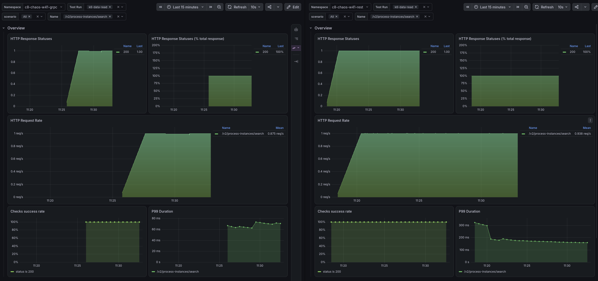
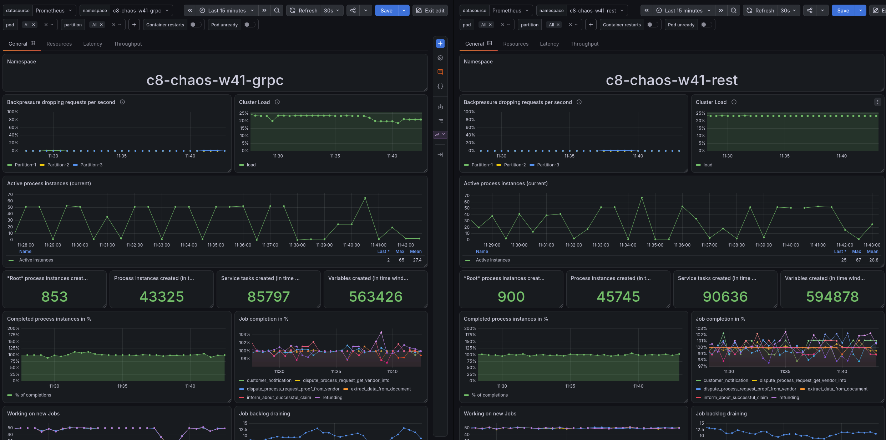
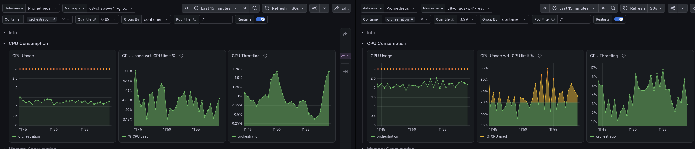
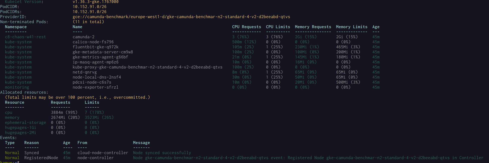
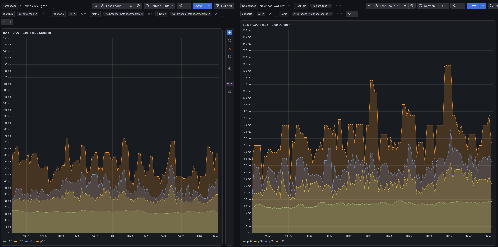
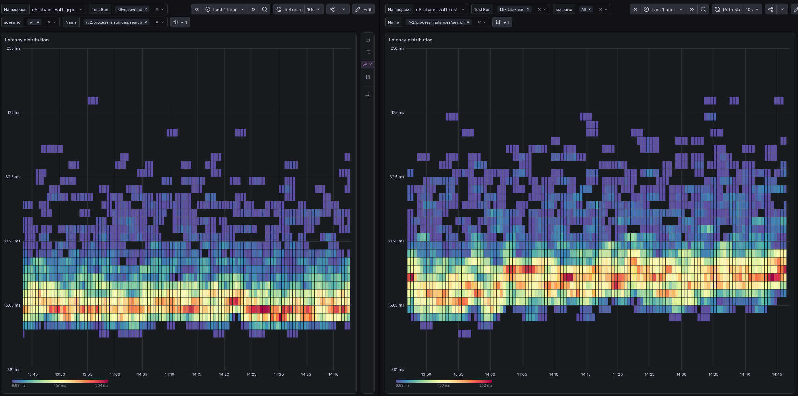
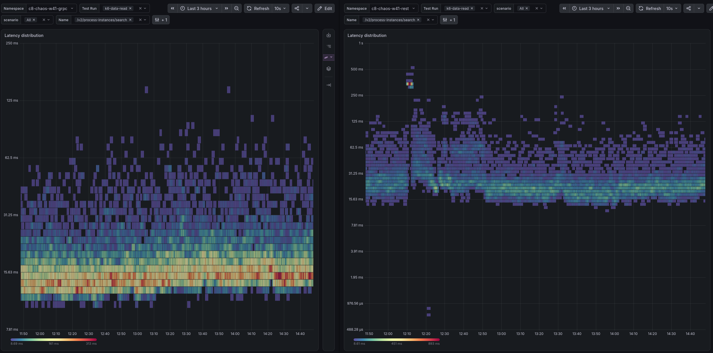

# Chaos Day Summary

We are running a chaos experiment to validate the performance of our REST API using k6. The goal is to identify any potential bottlenecks and ensure that our system can handle high traffic loads effectively.

We found that the data avail is much higher with REST protocol usage for stress test then with gRPC.

https://camunda.slack.com/archives/C0A22S6M4TF/p1791375237654519

**TL;DR;** 

<!--truncate-->

## Chaos Experiment

We ran two stress tests, one with gRPC and one with REST, to compare their performance under load and validate the REST API behavior. For validating the REST query API performance we used k6 to measure the response times.

In addition we can also valiate the query performance of the starter data read meter vs k6 to simply validate the performance of the REST API.


### Expected

We thought this might be either the client (again) or the gateway.

To validate this we ran a stress test with gRPC and RESt and enalbed k6 to validate the performance of our REST API. 

If it would not show the same behavior we would have to issues in the client, if it shows the same behavior we would have to look into the gateway.


### Actual


c8-chaos-w41-grpc
c8-chaos-w41-rest


https://dashboard.benchmark.camunda.cloud/d/dcfx4lisqqr11cd/k6-self-made?from=now-1h&to=now&timezone=browser&var-namespace=c8-chaos-w41-rest&var-testrun=k6-data-read&var-scenario=$__all&var-name=%2Fv2%2Fprocess-instances%2Fsearch

k6 for rest

perf for rest
https://dashboard.benchmark.camunda.cloud/d/camunda-performance-dashboard/camunda-performance?from=now-1h&to=now&timezone=browser&var-DS_PROMETHEUS=prometheus&var-namespace=c8-chaos-w41-rest&var-pod=$__all&var-partition=$__all&dtab=General

k6 for gRPC

https://dashboard.benchmark.camunda.cloud/d/dcfx4lisqqr11cd/k6-self-made?from=now-1h&to=now&timezone=browser&var-namespace=c8-chaos-w41-grpc&var-testrun=k6-data-read&var-scenario=$__all&var-name=%2Fv2%2Fprocess-instances%2Fsearch


perf for gRPC

https://dashboard.benchmark.camunda.cloud/d/camunda-performance-dashboard/camunda-performance?from=now-1h&to=now&timezone=browser&var-DS_PROMETHEUS=prometheus&var-namespace=c8-chaos-w41-grpc&var-pod=$__all&var-partition=$__all&dtab=General



We can see that with gRPC the k6 benchmark shows lower latency then with REST - actually ~2x lower latency. But REST is going down.


On the data availability side we had a blib on the grpc side - but in general they looks similar  right now?


```
$ k get pod -n c8-chaos-w41-grpc
NAME                                                        READY   STATUS      RESTARTS      AGE
camunda-0                                                   1/1     Running     0             16m
camunda-1                                                   1/1     Running     0             16m
camunda-2                                                   1/1     Running     0             3m30s
connectors-545df9b7d6-7jgtt                                 1/1     Running     0             16m
customer-notification-5d857d4958-zbrkb                      1/1     Running     0             16m
dispute-process-request-get-vendor-info-647bd97c95-4b5sd    1/1     Running     0             16m
dispute-process-request-proof-from-vendor-bc4c488bd-jpcgl   1/1     Running     0             16m
elasticsearch-es-masters-0                                  1/1     Running     0             16m
elasticsearch-es-masters-1                                  1/1     Running     0             16m
elasticsearch-es-masters-2                                  1/1     Running     0             16m
extract-data-from-document-f87c8dc75-4gz4v                  1/1     Running     0             16m
identity-66d85d9f9-qwcg7                                    1/1     Running     0             16m
inform-about-successful-claim-5fc78bc4c9-95gcf              1/1     Running     0             16m
k6-data-read-1-xl2lp                                        1/1     Running     0             7m24s
k6-data-read-initializer-jk6rv                              0/1     Completed   0             16m
k6-data-read-starter-r22k4                                  0/1     Completed   0             7m5s
k6-default-1-t67qs                                          1/1     Running     0             7m20s
k6-default-initializer-fdn2n                                0/1     Completed   0             16m
k6-default-starter-jgbgc                                    0/1     Completed   0             6m
keycloak-0                                                  1/1     Running     0             16m
leader-balancer-29857520-rkf6z                              0/1     Completed   4 (11m ago)   12m
leader-balancer-29857530-669kl                              0/1     Completed   0             2m40s
metrics-exporter-f9ccdd75d-l84mr                            1/1     Running     0             16m
optimize-5d5457758-fckbl                                    1/1     Running     0             16m
postgresql-keycloak-1                                       1/1     Running     0             16m
prom-els-exporter-5bfc978f94-qpcns                          1/1     Running     0             16m
refunding-5fb97889d-g5q9j                                   1/1     Running     0             16m
starter-6bcf95c658-9mq9l                                    1/1     Running     0             16m

```
pod god restared for grpc


when looking more closely into the data availability we also see around double the data availability for REST then for gRPC.


Throughput looks similar for both protocols.





Data Availability comparison between gRPC and REST, the timing for the 2nd spike seems to match more or less the restart of the starter:

```
$ k get pod -n c8-chaos-w41-grpc
NAME                                                        READY   STATUS      RESTARTS      AGE
camunda-0                                                   1/1     Running     0             29m
camunda-1                                                   1/1     Running     0             29m
camunda-2                                                   1/1     Running     0             15m
connectors-545df9b7d6-7jgtt                                 1/1     Running     0             29m
customer-notification-5d857d4958-zbrkb                      1/1     Running     0             29m
dispute-process-request-get-vendor-info-647bd97c95-4b5sd    1/1     Running     0             29m
dispute-process-request-proof-from-vendor-bc4c488bd-jpcgl   1/1     Running     0             29m
elasticsearch-es-masters-0                                  1/1     Running     0             29m
elasticsearch-es-masters-1                                  1/1     Running     0             29m
elasticsearch-es-masters-2                                  1/1     Running     0             29m
extract-data-from-document-f87c8dc75-4gz4v                  1/1     Running     0             29m
identity-66d85d9f9-qwcg7                                    1/1     Running     0             29m
inform-about-successful-claim-5fc78bc4c9-95gcf              1/1     Running     0             29m
k6-data-read-1-xl2lp                                        1/1     Running     0             19m
k6-data-read-initializer-jk6rv                              0/1     Completed   0             29m
k6-data-read-starter-r22k4                                  0/1     Completed   0             19m
k6-default-1-t67qs                                          1/1     Running     0             19m
k6-default-initializer-fdn2n                                0/1     Completed   0             29m
k6-default-starter-jgbgc                                    0/1     Completed   0             18m
keycloak-0                                                  1/1     Running     0             29m
leader-balancer-29857520-rkf6z                              0/1     Completed   4 (24m ago)   25m
leader-balancer-29857530-669kl                              0/1     Completed   0             15m
leader-balancer-29857540-fbj2b                              0/1     Completed   0             5m2s
metrics-exporter-f9ccdd75d-gfd6v                            1/1     Running     0             6m32s
optimize-5d5457758-fckbl                                    1/1     Running     0             29m
postgresql-keycloak-1                                       1/1     Running     0             28m
prom-els-exporter-5bfc978f94-2j4rq                          1/1     Running     0             3m56s
refunding-5fb97889d-g5q9j                                   1/1     Running     0             29m
starter-6bcf95c658-6n9bl                                    1/1     Running     0             7m33s
```


We still see for k6 more then double the latency for REST then for gRPC. 


CPU usage is much higher on REST and more throttling


-> CPU usage is almost twice more on REST compared to gRPC:




Why we get throttled? we using under our limit and request 

we have it set to 3 cPU but using ~2.5 CPU on REST and ~1.5 CPU on gRPC but get throttled on REST already by ~20%


```
$ k describe node gke-camunda-benchmar-n2-standard-4-v2-d2beeabd-qtvs
Name:               gke-camunda-benchmar-n2-standard-4-v2-d2beeabd-qtvs
Roles:              <none>
Labels:             addon.gke.io/node-local-dns-ds-ready=true
                    beta.kubernetes.io/arch=amd64
                    beta.kubernetes.io/instance-type=n2-standard-4
                    beta.kubernetes.io/os=linux
                    cloud.google.com/gke-boot-disk=pd-balanced
                    cloud.google.com/gke-container-runtime=containerd
                    cloud.google.com/gke-cpu-scaling-level=4
                    cloud.google.com/gke-logging-variant=DEFAULT
                    cloud.google.com/gke-max-pods-per-node=22
                    cloud.google.com/gke-memory-gb-scaling-level=16
                    cloud.google.com/gke-netd-ready=true
                    cloud.google.com/gke-nodepool=n2-standard-4-v2
                    cloud.google.com/gke-os-distribution=cos
                    cloud.google.com/gke-provisioning=spot
                    cloud.google.com/gke-spot=true
                    cloud.google.com/gke-stack-type=IPV4
                    cloud.google.com/machine-family=n2
                    cloud.google.com/private-node=false
                    cluster=camunda-benchmark
                    component=benchmark-n2-standard-4
                    disk-type.gke.io/hyperdisk-throughput=true
                    disk-type.gke.io/pd-balanced=true
                    disk-type.gke.io/pd-extreme=true
                    disk-type.gke.io/pd-ssd=true
                    disk-type.gke.io/pd-standard=true
                    env=prod
                    failure-domain.beta.kubernetes.io/region=europe-west1
                    failure-domain.beta.kubernetes.io/zone=europe-west1-d
                    iam.gke.io/gke-metadata-server-enabled=true
                    kubernetes.io/arch=amd64
                    kubernetes.io/hostname=gke-camunda-benchmar-n2-standard-4-v2-d2beeabd-qtvs
                    kubernetes.io/os=linux
                    managedby=terraform
                    node.kubernetes.io/instance-type=n2-standard-4
                    node.kubernetes.io/masq-agent-ds-ready=true
                    project=camunda-benchmark
                    projectcalico.org/ds-ready=true
                    topology.gke.io/zone=europe-west1-d
                    topology.kubernetes.io/region=europe-west1
                    topology.kubernetes.io/zone=europe-west1-d
Annotations:        container.googleapis.com/instance_id: 5499984257263264222
                    csi.volume.kubernetes.io/nodeid:
                      {"pd.csi.storage.gke.io":"projects/camunda-benchmark/zones/europe-west1-d/instances/gke-camunda-benchmar-n2-standard-4-v2-d2beeabd-qtvs","...
                    node.alpha.kubernetes.io/ttl: 15
                    node.gke.io/last-applied-node-labels:
                      addon.gke.io/node-local-dns-ds-ready=true,cloud.google.com/gke-boot-disk=pd-balanced,cloud.google.com/gke-container-runtime=containerd,clo...
                    node.gke.io/last-applied-node-taints: nodepool=n2-standard-4:NoSchedule
                    volumes.kubernetes.io/controller-managed-attach-detach: true
CreationTimestamp:  Thu, 08 Oct 2026 11:15:58 +0200
Taints:             nodepool=n2-standard-4:NoSchedule
Unschedulable:      false
Addresses:
  InternalIP:  10.5.1.168
  ExternalIP:  34.79.110.181
  Hostname:    gke-camunda-benchmar-n2-standard-4-v2-d2beeabd-qtvs
Capacity:
  cpu:                4
  ephemeral-storage:  98831908Ki
  hugepages-1Gi:      0
  hugepages-2Mi:      0
  memory:             16380004Ki
  pods:               22
Allocatable:
  cpu:                3920m
  ephemeral-storage:  47060071478
  hugepages-1Gi:      0
  hugepages-2Mi:      0
  memory:             13591652Ki
  pods:               22
System Info:
  Machine ID:                 a69775babfe247b92b56752970c4cde2
  System UUID:                a69775ba-bfe2-47b9-2b56-752970c4cde2
  Boot ID:                    3c3f1b3c-bced-4091-9a27-d61c4f98109e
  Kernel Version:             6.12.94+
  OS Image:                   Container-Optimized OS from Google
  Operating System:           linux
  Architecture:               amd64
  Container Runtime Version:  containerd://2.2.5
  Kubelet Version:            v1.36.3-gke.1767000
PodCIDR:                      10.152.91.0/26
PodCIDRs:                     10.152.91.0/26
ProviderID:                   gce://camunda-benchmark/europe-west1-d/gke-camunda-benchmar-n2-standard-4-v2-d2beeabd-qtvs
Non-terminated Pods:          (11 in total)
  Namespace                   Name                                                              CPU Requests  CPU Limits  Memory Requests  Memory Limits  Age
  ---------                   ----                                                              ------------  ----------  ---------------  -------------  ---
  c8-chaos-w41-rest           camunda-2                                                         3 (76%)       3 (76%)     2Gi (15%)        2Gi (15%)      45m
  kube-system                 calico-node-fs796                                                 500m (12%)    0 (0%)      0 (0%)           0 (0%)         45m
  kube-system                 fluentbit-gke-q972k                                               105m (2%)     1 (25%)     230Mi (1%)       465Mi (3%)     45m
  kube-system                 gke-metadata-server-cm9w8                                         100m (2%)     0 (0%)      100Mi (0%)       200Mi (1%)     45m
  kube-system                 gke-metrics-agent-g66bf                                           21m (0%)      1 (25%)     145Mi (1%)       180Mi (1%)     45m
  kube-system                 ip-masq-agent-mp6z6                                               10m (0%)      0 (0%)      16Mi (0%)        0 (0%)         45m
  kube-system                 kube-proxy-gke-camunda-benchmar-n2-standard-4-v2-d2beeabd-qtvs    100m (2%)     0 (0%)      0 (0%)           0 (0%)         45m
  kube-system                 netd-qnrvg                                                        8m (0%)       1 (25%)     65Mi (0%)        65Mi (0%)      45m
  kube-system                 node-local-dns-2nsf4                                              30m (0%)      1 (25%)     50Mi (0%)        65Mi (0%)      45m
  kube-system                 pdcsi-node-c6s7s                                                  10m (0%)      0 (0%)      20Mi (0%)        500Mi (3%)     45m
  monitoring                  node-exporter-sfrzl                                               0 (0%)        0 (0%)      0 (0%)           0 (0%)         45m
Allocated resources:
  (Total limits may be over 100 percent, i.e., overcommitted.)
  Resource           Requests      Limits
  --------           --------      ------
  cpu                3884m (99%)   7 (178%)
  memory             2674Mi (20%)  3523Mi (26%)
  ephemeral-storage  0 (0%)        0 (0%)
  hugepages-1Gi      0 (0%)        0 (0%)
  hugepages-2Mi      0 (0%)        0 (0%)
Events:
  Type    Reason          Age   From                   Message
  ----    ------          ----  ----                   -------
  Normal  Synced          45m   cloud-node-controller  Node synced successfully
  Normal  RegisteredNode  45m   node-controller        Node gke-camunda-benchmar-n2-standard-4-v2-d2beeabd-qtvs event: Registered Node gke-camunda-benchmar-n2-standard-4-v2-d2beeabd-qtvs in Controller

```





We checking metrics in grafana for the nodes


looks like we get heavily throttled on REST and not on gRPC because we use more cpu


We try to increase the node size to get not throttled and see how it performs then - keeping the same limit actually.


we changed at around 1215


We moved the REST Camunda sts on 8-CPU nodes at 12:20:41.950 UTC+2 (edited)

https://console.cloud.google.com/logs/query;cursorTimestamp=2026-10-08T11:50:39.370646Z;duration=PT3H;query=resource.type%3D%22k8s_cluster%22%0AprotoPayload.authenticationInfo.authoritySelector:%22@camunda.com%22%0AprotoPayload.authenticationInfo.authoritySelector%3D%22jonathan.ballet@camunda.com%22%0Atimestamp%3D%222026-10-08T10:20:41.950180Z%22%0AinsertId%3D%22c6db0a12-4722-442b-9c3c-55695a78f23c%22;summaryFields=protoPayload%252FauthenticationInfo%252FauthoritySelector,protoPayload%252FmethodName,protoPayload%252FresourceName:false:32:beginning?project=camunda-benchmark

k6 - seems to before heavily like three times


Lot of Elasticsearch activity on zeebe-record_process-instance_8.11.0_2026-10-08, maybe way too muchN


We saw that k6 was reporting a bit wrong (due to wrong queries)

We fixed htis

https://camunda.slack.com/archives/C0A22S6M4TF/p1791463627707339?thread_ts=1791446496.406079&cid=C0A22S6M4TF

Now we can see actually that grpc and rest are similar
We fixed the k6 latency Grafana panels: we have a heatmap now and the previous latency panel was actually displaying the wrong data




Since the creation of the clusters and the move of the REST cluster to larger nodes around 12:20 (without changing the resources allocated to Camunda), the latency changed also a lot:




We realized that we tested the wrong thing - with realistic load instead of stress that was reported here


https://camunda.slack.com/archives/C0A22S6M4TF/p1791375237654519

We ran another set of tests with base rest/grpc and larger nodes all with stress/max workload.

https://camunda.slack.com/archives/C0A22S6M4TF/p1791469132962859?thread_ts=1791446496.406079&cid=C0A22S6M4TF

* We can see that grpc all running fine  and similar
* actually for k6 metrics the grpc node8 performs better
* We can see that REST is at the limit of the report window like 90s (grpc is ~30s)
* this applies to both REST namespace
* When looking at the k6 metrics we can see that REST still performs better when using lager nodes
* we can also see in general we are less tcpu throttled AND use less CPU

* Current assumption

* when we have more capacity on the node, we get less throttled and we make use of less cpu because of less contention?

We try to check this in gcloud console and via metrics

ANOTHER NOTE

* As we see the data availabilit is soo HIGH i expect actually the client is the problem

- Exporter backlog is the same
- Flush latency the same
- Search request latencies are similar or even for REST a bit faster
- Starter resources are okish - a bit more for REST ~15% throttling
- GC was 50ms per second

## Found Bugs


